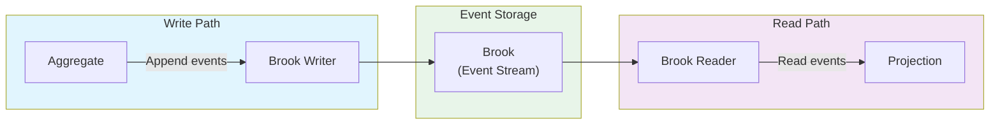
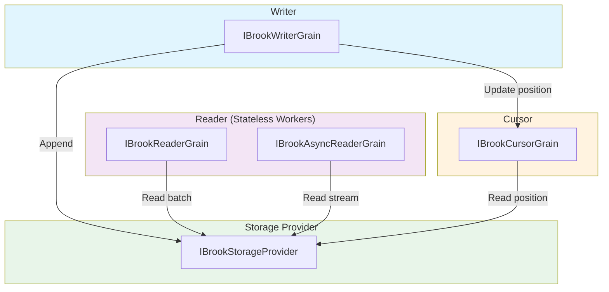
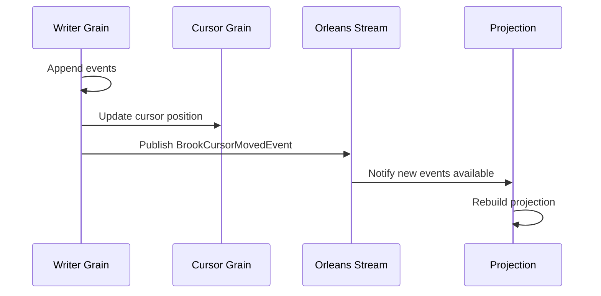

Brooks are Mississippi's append-only event streams. They provide the persistence layer for event sourcing—storing immutable events that aggregates produce and projections consume.

## Overview

A brook is an ordered sequence of events for a specific entity. Events are appended with optimistic concurrency and read in batches or as streams:



## Key Concepts

| Concept | Description |
|---------|-------------|
| **Brook** | An ordered, append-only sequence of events for an entity |
| **BrookKey** | Composite key of brook name + entity ID |
| **BrookPosition** | Monotonically increasing position within the brook |
| **BrookEvent** | Envelope containing event metadata and serialized payload |
| **Writer Grain** | Orleans grain that handles append operations |
| **Reader Grain** | Stateless worker grain that handles read operations |

## Brook Keys

Brooks are identified by a composite key:

```csharp
// BrookKey combines brook name and entity ID
var key = new BrookKey("MYAPP|BANKING|ACCOUNT", "account-123");

// Or create from a decorated type
var key = BrookKey.For<BankAccountAggregate>("account-123");
```

The `[BrookName]` attribute defines the brook name:

```csharp
[BrookName("MYAPP", "BANKING", "ACCOUNT")]
public sealed record BankAccountAggregate { ... }
```

This produces the brook name: `MYAPP|BANKING|ACCOUNT`

## Brook Events

Events are stored as `BrookEvent` envelopes:

```csharp
public sealed record BrookEvent
{
    // Semantic event type for deserialization
    public string EventType { get; init; }

    // Source brook name
    public string Source { get; init; }

    // Unique event ID
    public string Id { get; init; }

    // When the event occurred
    public DateTimeOffset? Time { get; init; }

    // MIME type of the payload
    public string DataContentType { get; init; }

    // Serialized event data
    public ImmutableArray<byte> Data { get; init; }

    // Payload size in bytes
    public long DataSizeBytes { get; init; }
}
```

## Brook Positions

Positions track location within the event stream:

```csharp
// Positions are zero-based and monotonically increasing
BrookPosition position = new(0);   // First event
BrookPosition position = new(99);  // 100th event

// Special value for "not set"
BrookPosition notSet = new();  // Value = -1
if (position.NotSet) { /* no events yet */ }

// Positions are comparable
if (newPosition > oldPosition) { /* new events available */ }
```

## Writing Events

### Via Aggregate Grains

The primary way to write events is through aggregate grains, which handle command validation and event production:

```csharp
// Commands flow through aggregates, which append events
var grain = grainFactory.GetGrain<IGenericAggregateGrain<BankAccountAggregate>>("account-123");
var result = await grain.ExecuteAsync(new DepositFunds(100));
```

### Direct Writer Access

For advanced scenarios, use the writer grain directly:

```csharp
public class MyService
{
    private IBrookGrainFactory BrookFactory { get; }

    public async Task AppendEventsAsync(
        string entityId,
        ImmutableArray<BrookEvent> events,
        BrookPosition? expectedPosition = null)
    {
        var brookKey = BrookKey.For<BankAccountAggregate>(entityId);
        var writer = BrookFactory.GetBrookWriterGrain(brookKey);

        // Append with optimistic concurrency
        var newPosition = await writer.AppendEventsAsync(
            events,
            expectedPosition);
    }
}
```

### Optimistic Concurrency

Pass an expected position to detect concurrent writes:

```csharp
// Read current position
var currentPosition = await cursorGrain.GetLatestPositionAsync();

// Attempt append with expected position
try
{
    var newPosition = await writer.AppendEventsAsync(
        events,
        expectedCursorPosition: currentPosition);
}
catch (OptimisticConcurrencyException)
{
    // Another writer appended first - reload and retry
}
```

## Reading Events

### Batch Reads

Read all events in a range as a batch:

```csharp
var brookKey = BrookKey.For<BankAccountAggregate>(entityId);
var reader = grainFactory.GetGrain<IBrookReaderGrain>(brookKey.ToString());

// Read all events
var allEvents = await reader.ReadEventsBatchAsync();

// Read from a specific position
var newEvents = await reader.ReadEventsBatchAsync(readFrom: lastKnownPosition);

// Read a specific range
var rangeEvents = await reader.ReadEventsBatchAsync(
    readFrom: new BrookPosition(10),
    readTo: new BrookPosition(20));
```

### Streaming Reads

For large event streams, use the async reader:

```csharp
var asyncReader = grainFactory.GetGrain<IBrookAsyncReaderGrain>(brookKey.ToString());

await foreach (var @event in asyncReader.ReadEventsAsync(readFrom: position))
{
    // Process each event
    ProcessEvent(@event);
}
```

## Grain Architecture

Brooks use a multi-grain architecture:



### Grain Responsibilities

| Grain | Type | Responsibility |
|-------|------|----------------|
| `IBrookWriterGrain` | Stateful | Append events with concurrency control |
| `IBrookCursorGrain` | Stateful | Track latest position, notify subscribers |
| `IBrookReaderGrain` | Stateless Worker | Parallel batch read distribution |
| `IBrookAsyncReaderGrain` | Stateful | Streaming reads with `IAsyncEnumerable` |

## Storage Providers

Brooks abstract storage through the `IBrookStorageProvider` interface:

```csharp
public interface IBrookStorageProvider
    : IBrookStorageReader,
      IBrookStorageWriter
{
    // Identifies this provider (e.g., "cosmos", "sql")
    string Format { get; }
}

public interface IBrookStorageWriter
{
    Task<BrookPosition> AppendEventsAsync(
        BrookKey brookId,
        IReadOnlyList<BrookEvent> events,
        BrookPosition? expectedVersion = null,
        CancellationToken cancellationToken = default);
}

public interface IBrookStorageReader
{
    Task<BrookPosition> ReadCursorPositionAsync(
        BrookKey brookId,
        CancellationToken cancellationToken = default);

    IAsyncEnumerable<BrookEvent> ReadEventsAsync(
        BrookRangeKey brookRange,
        CancellationToken cancellationToken = default);
}
```

### Built-in Providers

| Provider | Package | Use Case |
|----------|---------|----------|
| Cosmos DB | `Mississippi.EventSourcing.Brooks.Cosmos` | Production, global distribution |

See [Custom Event Storage](./custom-event-storage.md) to implement your own provider.

## Event Notifications

When events are appended, the writer publishes a `BrookCursorMovedEvent` on an Orleans stream. Projections and other consumers subscribe to receive notifications:



## Brook Name Attribute

The `[BrookName]` attribute defines where events are stored:

```csharp
// Three-part naming: Vendor, Area, Feature
[BrookName("MYAPP", "BANKING", "ACCOUNT")]
public sealed record BankAccountAggregate { ... }

// Produces brook name: "MYAPP|BANKING|ACCOUNT"
```

### Naming Conventions

| Part | Description | Example |
|------|-------------|---------|
| **Vendor** | Organization or product | `MYAPP`, `CONTOSO` |
| **Area** | Domain area | `BANKING`, `INVENTORY` |
| **Feature** | Specific entity | `ACCOUNT`, `ORDER` |

## Registration

Register brook components in your silo:

```csharp
siloBuilder.ConfigureServices(services =>
{
    // Register storage provider
    services.AddCosmosBrookStorage(options =>
    {
        options.ConnectionString = "...";
        options.DatabaseName = "events";
    });
});
```

## Best Practices

### Partition by Natural Boundaries

Each brook should represent one entity instance:

```csharp
// ✅ Good: One brook per account
BrookKey.For<BankAccountAggregate>("account-123")
BrookKey.For<BankAccountAggregate>("account-456")

// ❌ Bad: Single brook for all accounts (bottleneck)
new BrookKey("ALL_ACCOUNTS", "global")
```

### Keep Events Small

Events should contain only the data needed to describe what happened:

```csharp
// ✅ Good: Minimal event data
new FundsDeposited { Amount = 100 }

// ❌ Bad: Redundant or derived data
new FundsDeposited
{
    Amount = 100,
    PreviousBalance = 500,      // Derivable
    NewBalance = 600,           // Derivable
    AccountHolderName = "...",  // Redundant
    FullAccountHistory = [...]  // Way too much
}
```

### Use Optimistic Concurrency

Always pass expected positions when writes must be ordered:

```csharp
// Read current position
var currentPos = await cursorGrain.GetLatestPositionAsync();

// Append with expectation
await writer.AppendEventsAsync(events, expectedCursorPosition: currentPos);
```
