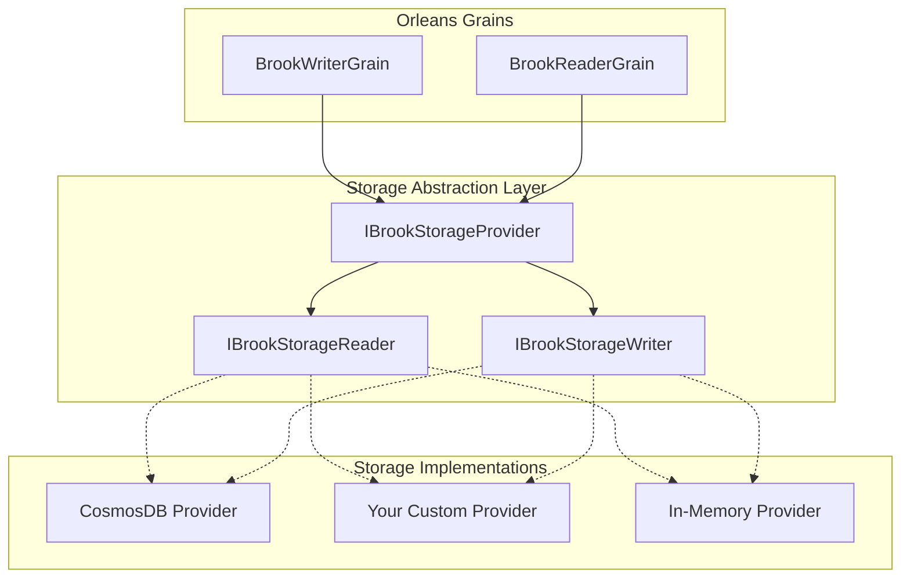
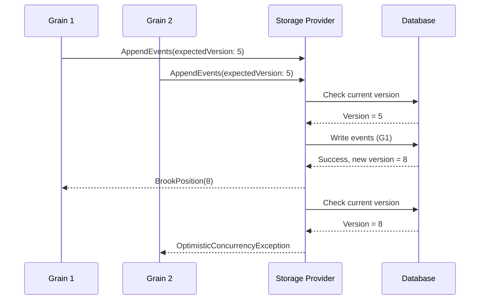

# Custom Event Storage Providers

Mississippi's Brooks event streaming layer is designed with a clean storage
abstraction. While the framework ships with a Cosmos DB implementation, you can
build custom storage providers for any backend: SQL Server, PostgreSQL, MongoDB,
or even file-based stores for testing.

## Architecture Overview



## The IBrookStorageProvider Interface

The storage provider interface combines read and write capabilities through interface
inheritance:

```csharp
public interface IBrookStorageProvider
    : IBrookStorageReader,
      IBrookStorageWriter
{
    /// <summary>
    /// Gets the canonical format identifier for this provider
    /// (e.g., "cosmos", "sql").
    /// </summary>
    string Format { get; }
}
```

### Reading Events: IBrookStorageReader

Implement read operations to retrieve events and cursor positions:

```csharp
public interface IBrookStorageReader
{
    /// <summary>
    /// Reads the current cursor position for a brook.
    /// </summary>
    Task<BrookPosition> ReadCursorPositionAsync(
        BrookKey brookId,
        CancellationToken cancellationToken = default
    );

    /// <summary>
    /// Reads events from a brook within the specified range.
    /// </summary>
    IAsyncEnumerable<BrookEvent> ReadEventsAsync(
        BrookRangeKey brookRange,
        CancellationToken cancellationToken = default
    );
}
```

### Writing Events: IBrookStorageWriter

Implement write operations with optimistic concurrency support:

```csharp
public interface IBrookStorageWriter
{
    /// <summary>
    /// Appends events to a brook with optional optimistic concurrency control.
    /// </summary>
    Task<BrookPosition> AppendEventsAsync(
        BrookKey brookId,
        IReadOnlyList<BrookEvent> events,
        BrookPosition? expectedVersion = null,
        CancellationToken cancellationToken = default
    );
}
```

## Building a Custom Provider

Follow these steps to create your own storage provider.

### Step 1: Create the Provider Class

Implement `IBrookStorageProvider` with all required operations:

```csharp
public sealed class SqlBrookStorageProvider : IBrookStorageProvider
{
    private readonly ISqlConnectionFactory _connectionFactory;
    private readonly ILogger<SqlBrookStorageProvider> _logger;

    public SqlBrookStorageProvider(
        ISqlConnectionFactory connectionFactory,
        ILogger<SqlBrookStorageProvider> logger
    )
    {
        _connectionFactory = connectionFactory;
        _logger = logger;
    }

    /// <summary>
    /// Identifies this provider for diagnostics and routing.
    /// </summary>
    public string Format => "sql-server";

    public async Task<BrookPosition> AppendEventsAsync(
        BrookKey brookId,
        IReadOnlyList<BrookEvent> events,
        BrookPosition? expectedVersion = null,
        CancellationToken cancellationToken = default
    )
    {
        if (events is null || events.Count == 0)
        {
            throw new ArgumentException(
                "Events collection cannot be null or empty",
                nameof(events));
        }

        await using var connection = await _connectionFactory.CreateAsync(cancellationToken);
        await using var transaction = await connection.BeginTransactionAsync(cancellationToken);

        try
        {
            // Validate expected version for optimistic concurrency
            if (expectedVersion.HasValue)
            {
                var currentPosition = await GetCurrentPositionAsync(
                    connection,
                    brookId,
                    cancellationToken);

                if (currentPosition != expectedVersion.Value)
                {
                    throw new OptimisticConcurrencyException(
                        $"Expected version {expectedVersion.Value} but found {currentPosition}");
                }
            }

            // Insert events and update cursor
            var newPosition = await InsertEventsAsync(
                connection,
                brookId,
                events,
                cancellationToken);

            await transaction.CommitAsync(cancellationToken);
            return newPosition;
        }
        catch
        {
            await transaction.RollbackAsync(cancellationToken);
            throw;
        }
    }

    public async Task<BrookPosition> ReadCursorPositionAsync(
        BrookKey brookId,
        CancellationToken cancellationToken = default
    )
    {
        await using var connection = await _connectionFactory.CreateAsync(cancellationToken);
        return await GetCurrentPositionAsync(connection, brookId, cancellationToken);
    }

    public async IAsyncEnumerable<BrookEvent> ReadEventsAsync(
        BrookRangeKey brookRange,
        [EnumeratorCancellation] CancellationToken cancellationToken = default
    )
    {
        await using var connection = await _connectionFactory.CreateAsync(cancellationToken);

        var query = @"
            SELECT EventId, EventType, Payload, Timestamp, Position
            FROM BrookEvents
            WHERE BrookName = @BrookName
              AND EntityId = @EntityId
              AND Position >= @StartPosition
              AND Position <= @EndPosition
            ORDER BY Position";

        await using var command = connection.CreateCommand();
        command.CommandText = query;
        // Add parameters...

        await using var reader = await command.ExecuteReaderAsync(cancellationToken);

        while (await reader.ReadAsync(cancellationToken))
        {
            yield return MapToEvent(reader);
        }
    }

    private static BrookEvent MapToEvent(DbDataReader reader)
    {
        // Map database row to BrookEvent
        return new BrookEvent(
            EventId: reader.GetGuid(0),
            EventType: reader.GetString(1),
            Payload: reader.GetString(2),
            Timestamp: reader.GetDateTime(3),
            Position: new BrookPosition(reader.GetInt64(4)));
    }

    private async Task<BrookPosition> GetCurrentPositionAsync(
        DbConnection connection,
        BrookKey brookId,
        CancellationToken cancellationToken)
    {
        // Query current cursor position from database
        // Return BrookPosition.Zero if brook doesn't exist
    }

    private async Task<BrookPosition> InsertEventsAsync(
        DbConnection connection,
        BrookKey brookId,
        IReadOnlyList<BrookEvent> events,
        CancellationToken cancellationToken)
    {
        // Insert events and return new position
    }
}
```

### Step 2: Create Configuration Options

Define options for your provider:

```csharp
public sealed class SqlBrookStorageOptions
{
    /// <summary>
    /// Connection string for SQL Server.
    /// </summary>
    public string ConnectionString { get; set; } = string.Empty;

    /// <summary>
    /// Schema name for brook tables.
    /// </summary>
    public string Schema { get; set; } = "brooks";

    /// <summary>
    /// Maximum events per batch write operation.
    /// </summary>
    public int MaxEventsPerBatch { get; set; } = 100;

    /// <summary>
    /// Command timeout in seconds.
    /// </summary>
    public int CommandTimeoutSeconds { get; set; } = 30;
}
```

### Step 3: Register the Provider

Use the built-in registration extensions:

```csharp
public static class SqlBrookStorageRegistrations
{
    public static IServiceCollection AddSqlBrookStorageProvider(
        this IServiceCollection services,
        Action<SqlBrookStorageOptions> configureOptions
    )
    {
        // Register your internal dependencies
        services.AddSingleton<ISqlConnectionFactory, SqlConnectionFactory>();

        // Use the framework extension to register as IBrookStorageProvider
        services.RegisterBrookStorageProvider<SqlBrookStorageProvider, SqlBrookStorageOptions>(
            configureOptions);

        return services;
    }

    public static IServiceCollection AddSqlBrookStorageProvider(
        this IServiceCollection services,
        IConfiguration configurationSection
    )
    {
        services.AddSingleton<ISqlConnectionFactory, SqlConnectionFactory>();

        services.RegisterBrookStorageProvider<SqlBrookStorageProvider, SqlBrookStorageOptions>(
            configurationSection);

        return services;
    }
}
```

## Registration Helper Methods

The framework provides extension methods in `BrookStorageProviderExtensions`:

```csharp
// Basic registration (no options)
services.RegisterBrookStorageProvider<MyProvider>();

// Registration with configure action
services.RegisterBrookStorageProvider<MyProvider, MyOptions>(options =>
{
    options.ConnectionString = "...";
    options.MaxBatchSize = 100;
});

// Registration with IConfiguration binding
services.RegisterBrookStorageProvider<MyProvider, MyOptions>(
    configuration.GetSection("Brooks:Storage"));
```

These helpers automatically register your provider as both `IBrookStorageReader`
and `IBrookStorageWriter`, ensuring the grains can resolve the correct
implementation.

## Key Implementation Considerations

### Optimistic Concurrency

Always validate `expectedVersion` when provided to prevent lost writes in
concurrent scenarios:



### Async Streaming

Use `IAsyncEnumerable<BrookEvent>` for efficient memory usage when reading large
event ranges:

```csharp
public async IAsyncEnumerable<BrookEvent> ReadEventsAsync(
    BrookRangeKey brookRange,
    [EnumeratorCancellation] CancellationToken cancellationToken = default
)
{
    // Stream events one at a time rather than loading all into memory
    await foreach (var row in QueryEventsAsync(brookRange, cancellationToken))
    {
        yield return MapToEvent(row);
    }
}
```

### Position Management

The `BrookPosition` represents an opaque cursor position. Your storage must:

1. **Track positions per brook** - Each `BrookKey` (name + entityId) has its
   own position sequence
2. **Return accurate positions** - `ReadCursorPositionAsync` must return the
   position after the last event
3. **Handle empty brooks** - Return `BrookPosition.Zero` for brooks with no events

### Error Handling

Throw appropriate exceptions for error conditions:

| Scenario | Exception |
| --- | --- |
| Version mismatch | `OptimisticConcurrencyException` |
| Empty events list | `ArgumentException` |
| Connection failure | Provider-specific (let it propagate) |
| Timeout | `OperationCanceledException` |

## Testing Your Provider

Create integration tests that verify the contract:

```csharp
public class SqlBrookStorageProviderTests
{
    [Fact]
    public async Task AppendEvents_WithValidEvents_ReturnsNewPosition()
    {
        // Arrange
        var provider = CreateProvider();
        var brookId = new BrookKey("orders", "order-123");
        var events = new[]
        {
            CreateTestEvent("OrderCreated"),
            CreateTestEvent("OrderShipped")
        };

        // Act
        var position = await provider.AppendEventsAsync(brookId, events);

        // Assert
        position.Value.Should().BeGreaterThan(0);
    }

    [Fact]
    public async Task AppendEvents_WithWrongExpectedVersion_ThrowsConcurrencyException()
    {
        // Arrange
        var provider = CreateProvider();
        var brookId = new BrookKey("orders", "order-123");
        var events = new[] { CreateTestEvent("OrderCreated") };

        await provider.AppendEventsAsync(brookId, events);

        // Act & Assert
        await provider.Invoking(p => p.AppendEventsAsync(
            brookId,
            events,
            expectedVersion: new BrookPosition(0)))
            .Should().ThrowAsync<OptimisticConcurrencyException>();
    }

    [Fact]
    public async Task ReadEventsAsync_AfterAppend_ReturnsAllEvents()
    {
        // Arrange
        var provider = CreateProvider();
        var brookId = new BrookKey("orders", "order-123");
        var events = new[]
        {
            CreateTestEvent("OrderCreated"),
            CreateTestEvent("ItemAdded"),
            CreateTestEvent("OrderShipped")
        };

        await provider.AppendEventsAsync(brookId, events);

        // Act
        var readEvents = await provider
            .ReadEventsAsync(new BrookRangeKey(brookId, BrookPosition.Zero, BrookPosition.Max))
            .ToListAsync();

        // Assert
        readEvents.Should().HaveCount(3);
    }
}
```

## Example: In-Memory Provider for Testing

A simple in-memory implementation for unit tests:

```csharp
public sealed class InMemoryBrookStorageProvider : IBrookStorageProvider
{
    private readonly ConcurrentDictionary<BrookKey, List<BrookEvent>> _brooks
        = new();
    private readonly ConcurrentDictionary<BrookKey, long> _cursors = new();
    private readonly object _lock = new();

    public string Format => "in-memory";

    public Task<BrookPosition> AppendEventsAsync(
        BrookKey brookId,
        IReadOnlyList<BrookEvent> events,
        BrookPosition? expectedVersion = null,
        CancellationToken cancellationToken = default
    )
    {
        lock (_lock)
        {
            var currentPosition = _cursors.GetValueOrDefault(brookId, 0);

            if (expectedVersion.HasValue &&
                expectedVersion.Value.Value != currentPosition)
            {
                throw new OptimisticConcurrencyException(
                    $"Expected {expectedVersion.Value} " +
                    $"but found {currentPosition}");
            }

            var brookEvents = _brooks.GetOrAdd(brookId, _ => new List<BrookEvent>());

            foreach (var evt in events)
            {
                currentPosition++;
                brookEvents.Add(
                    evt with { Position = new BrookPosition(currentPosition) });
            }

            _cursors[brookId] = currentPosition;
            return Task.FromResult(new BrookPosition(currentPosition));
        }
    }

    public Task<BrookPosition> ReadCursorPositionAsync(
        BrookKey brookId,
        CancellationToken cancellationToken = default
    )
    {
        var position = _cursors.GetValueOrDefault(brookId, 0);
        return Task.FromResult(new BrookPosition(position));
    }

    public async IAsyncEnumerable<BrookEvent> ReadEventsAsync(
        BrookRangeKey brookRange,
        [EnumeratorCancellation] CancellationToken cancellationToken = default
    )
    {
        if (!_brooks.TryGetValue(brookRange.BrookKey, out var events))
        {
            yield break;
        }

        foreach (var evt in events.Where(e =>
            e.Position.Value >= brookRange.Start.Value &&
            e.Position.Value <= brookRange.End.Value))
        {
            yield return evt;
        }

        await Task.CompletedTask;
    }
}
```

## Cosmos DB Provider Reference

The built-in Cosmos DB provider demonstrates production patterns:

- **Transactional batching** for atomic multi-event writes
- **Distributed locking** via Azure Blob Storage leases
- **Container initialization** through hosted services
- **Keyed service registration** for multiple Cosmos clients

Study the `EventSourcing.Brooks.Cosmos` package for advanced implementation patterns.
