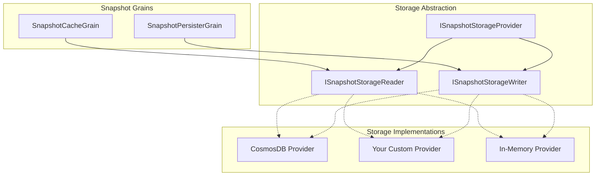
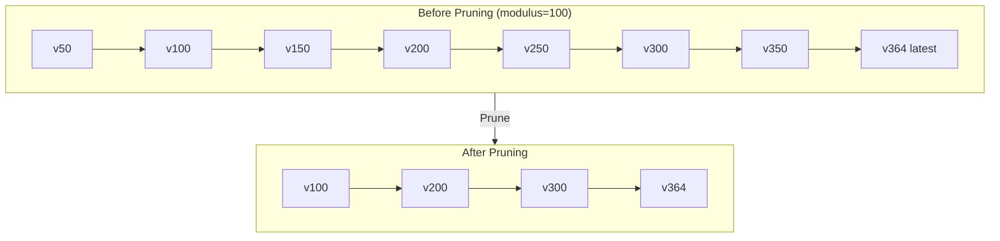

Mississippi's snapshot system uses a pluggable storage abstraction. While the framework
includes a Cosmos DB implementation, you can build custom providers for SQL databases,
Redis, blob storage, or any other backend.

## Architecture Overview



## The ISnapshotStorageProvider Interface

The storage provider combines read and write capabilities:

```csharp
public interface ISnapshotStorageProvider
    : ISnapshotStorageReader,
      ISnapshotStorageWriter
{
    /// <summary>
    /// Gets the storage format identifier (e.g., "cosmos", "sql", "redis").
    /// </summary>
    string Format { get; }
}
```

### Reading Snapshots

```csharp
public interface ISnapshotStorageReader
{
    /// <summary>
    /// Reads a specific snapshot version.
    /// </summary>
    /// <returns>The envelope, or null if not found.</returns>
    Task<SnapshotEnvelope?> ReadAsync(
        SnapshotKey snapshotKey,
        CancellationToken cancellationToken = default
    );
}
```

### Writing and Managing Snapshots

```csharp
public interface ISnapshotStorageWriter
{
    /// <summary>
    /// Writes a snapshot for the specified key.
    /// </summary>
    Task WriteAsync(
        SnapshotKey snapshotKey,
        SnapshotEnvelope snapshot,
        CancellationToken cancellationToken = default
    );

    /// <summary>
    /// Deletes a specific snapshot version.
    /// </summary>
    Task DeleteAsync(
        SnapshotKey snapshotKey,
        CancellationToken cancellationToken = default
    );

    /// <summary>
    /// Deletes all snapshots for a projection stream.
    /// </summary>
    Task DeleteAllAsync(
        SnapshotStreamKey streamKey,
        CancellationToken cancellationToken = default
    );

    /// <summary>
    /// Prunes snapshots, keeping only those at retained intervals.
    /// </summary>
    Task PruneAsync(
        SnapshotStreamKey streamKey,
        IReadOnlyCollection<int> retainModuli,
        CancellationToken cancellationToken = default
    );
}
```

## Building a Custom Provider

### Step 1: Create the Provider Class

```csharp
public sealed class SqlSnapshotStorageProvider : ISnapshotStorageProvider
{
    private readonly ISqlConnectionFactory _connectionFactory;
    private readonly ILogger<SqlSnapshotStorageProvider> _logger;

    public SqlSnapshotStorageProvider(
        ISqlConnectionFactory connectionFactory,
        ILogger<SqlSnapshotStorageProvider> logger
    )
    {
        _connectionFactory = connectionFactory;
        _logger = logger;
    }

    public string Format => "sql-server";

    public async Task<SnapshotEnvelope?> ReadAsync(
        SnapshotKey snapshotKey,
        CancellationToken cancellationToken = default
    )
    {
        await using var connection = await _connectionFactory.CreateAsync(
            cancellationToken);

        var query = @"
            SELECT Data, DataContentType, DataSizeBytes, ReducerHash
            FROM Snapshots
            WHERE BrookName = @BrookName
              AND EntityId = @EntityId
              AND SnapshotStorageName = @StorageName
              AND ReducersHash = @ReducersHash
              AND Version = @Version";

        await using var command = connection.CreateCommand();
        command.CommandText = query;
        AddKeyParameters(command, snapshotKey);

        await using var reader = await command.ExecuteReaderAsync(
            cancellationToken);

        if (!await reader.ReadAsync(cancellationToken))
        {
            return null;
        }

        return new SnapshotEnvelope
        {
            Data = ((byte[])reader["Data"]).ToImmutableArray(),
            DataContentType = reader.GetString(1),
            DataSizeBytes = reader.GetInt64(2),
            ReducerHash = reader.GetString(3)
        };
    }

    public async Task WriteAsync(
        SnapshotKey snapshotKey,
        SnapshotEnvelope snapshot,
        CancellationToken cancellationToken = default
    )
    {
        await using var connection = await _connectionFactory.CreateAsync(
            cancellationToken);

        var sql = @"
            MERGE INTO Snapshots AS target
            USING (SELECT @BrookName, @EntityId, @StorageName,
                          @ReducersHash, @Version) AS source
                  (BrookName, EntityId, SnapshotStorageName,
                   ReducersHash, Version)
            ON target.BrookName = source.BrookName
               AND target.EntityId = source.EntityId
               AND target.SnapshotStorageName = source.SnapshotStorageName
               AND target.ReducersHash = source.ReducersHash
               AND target.Version = source.Version
            WHEN MATCHED THEN
                UPDATE SET Data = @Data,
                           DataContentType = @ContentType,
                           DataSizeBytes = @Size
            WHEN NOT MATCHED THEN
                INSERT (BrookName, EntityId, SnapshotStorageName,
                        ReducersHash, Version, Data, DataContentType,
                        DataSizeBytes)
                VALUES (@BrookName, @EntityId, @StorageName,
                        @ReducersHash, @Version, @Data, @ContentType,
                        @Size);";

        await using var command = connection.CreateCommand();
        command.CommandText = sql;
        AddKeyParameters(command, snapshotKey);
        AddEnvelopeParameters(command, snapshot);

        await command.ExecuteNonQueryAsync(cancellationToken);
    }

    public async Task DeleteAsync(
        SnapshotKey snapshotKey,
        CancellationToken cancellationToken = default
    )
    {
        await using var connection = await _connectionFactory.CreateAsync(
            cancellationToken);

        var sql = @"
            DELETE FROM Snapshots
            WHERE BrookName = @BrookName
              AND EntityId = @EntityId
              AND SnapshotStorageName = @StorageName
              AND ReducersHash = @ReducersHash
              AND Version = @Version";

        await using var command = connection.CreateCommand();
        command.CommandText = sql;
        AddKeyParameters(command, snapshotKey);

        await command.ExecuteNonQueryAsync(cancellationToken);
    }

    public async Task DeleteAllAsync(
        SnapshotStreamKey streamKey,
        CancellationToken cancellationToken = default
    )
    {
        await using var connection = await _connectionFactory.CreateAsync(
            cancellationToken);

        var sql = @"
            DELETE FROM Snapshots
            WHERE BrookName = @BrookName
              AND EntityId = @EntityId
              AND SnapshotStorageName = @StorageName
              AND ReducersHash = @ReducersHash";

        await using var command = connection.CreateCommand();
        command.CommandText = sql;
        AddStreamKeyParameters(command, streamKey);

        await command.ExecuteNonQueryAsync(cancellationToken);
    }

    public async Task PruneAsync(
        SnapshotStreamKey streamKey,
        IReadOnlyCollection<int> retainModuli,
        CancellationToken cancellationToken = default
    )
    {
        // Find the highest version to always retain
        var maxVersion = await GetMaxVersionAsync(streamKey, cancellationToken);
        if (maxVersion is null) return;

        // Build condition for versions to keep
        var keepConditions = retainModuli
            .Select((m, i) => $"(Version % @Mod{i} = 0)")
            .ToList();
        keepConditions.Add("Version = @MaxVersion");

        var sql = $@"
            DELETE FROM Snapshots
            WHERE BrookName = @BrookName
              AND EntityId = @EntityId
              AND SnapshotStorageName = @StorageName
              AND ReducersHash = @ReducersHash
              AND NOT ({string.Join(" OR ", keepConditions)})";

        await using var connection = await _connectionFactory.CreateAsync(
            cancellationToken);
        await using var command = connection.CreateCommand();
        command.CommandText = sql;
        AddStreamKeyParameters(command, streamKey);
        command.Parameters.AddWithValue("@MaxVersion", maxVersion.Value);

        int i = 0;
        foreach (var modulus in retainModuli)
        {
            command.Parameters.AddWithValue($"@Mod{i++}", modulus);
        }

        await command.ExecuteNonQueryAsync(cancellationToken);
    }

    private static void AddKeyParameters(
        DbCommand command,
        SnapshotKey key)
    {
        command.Parameters.AddWithValue("@BrookName", key.Stream.BrookName);
        command.Parameters.AddWithValue("@EntityId", key.Stream.EntityId);
        command.Parameters.AddWithValue("@StorageName",
            key.Stream.SnapshotStorageName);
        command.Parameters.AddWithValue("@ReducersHash",
            key.Stream.ReducersHash);
        command.Parameters.AddWithValue("@Version", key.Version);
    }

    private static void AddStreamKeyParameters(
        DbCommand command,
        SnapshotStreamKey key)
    {
        command.Parameters.AddWithValue("@BrookName", key.BrookName);
        command.Parameters.AddWithValue("@EntityId", key.EntityId);
        command.Parameters.AddWithValue("@StorageName",
            key.SnapshotStorageName);
        command.Parameters.AddWithValue("@ReducersHash", key.ReducersHash);
    }

    private static void AddEnvelopeParameters(
        DbCommand command,
        SnapshotEnvelope envelope)
    {
        command.Parameters.AddWithValue("@Data", envelope.Data.ToArray());
        command.Parameters.AddWithValue("@ContentType",
            envelope.DataContentType);
        command.Parameters.AddWithValue("@Size", envelope.DataSizeBytes);
    }
}
```

### Step 2: Create Configuration Options

```csharp
public sealed class SqlSnapshotStorageOptions
{
    /// <summary>
    /// Connection string for the SQL database.
    /// </summary>
    public string ConnectionString { get; set; } = string.Empty;

    /// <summary>
    /// Schema containing the Snapshots table.
    /// </summary>
    public string Schema { get; set; } = "snapshots";

    /// <summary>
    /// Command timeout in seconds.
    /// </summary>
    public int CommandTimeoutSeconds { get; set; } = 30;
}
```

### Step 3: Register the Provider

Use the built-in extension methods:

```csharp
public static class SqlSnapshotStorageRegistrations
{
    public static IServiceCollection AddSqlSnapshotStorageProvider(
        this IServiceCollection services,
        Action<SqlSnapshotStorageOptions> configureOptions
    )
    {
        // Register internal dependencies
        services.AddSingleton<ISqlConnectionFactory, SqlConnectionFactory>();

        // Use the framework extension for proper interface registration
        services.RegisterSnapshotStorageProvider<
            SqlSnapshotStorageProvider,
            SqlSnapshotStorageOptions>(configureOptions);

        return services;
    }

    public static IServiceCollection AddSqlSnapshotStorageProvider(
        this IServiceCollection services,
        IConfiguration configurationSection
    )
    {
        services.AddSingleton<ISqlConnectionFactory, SqlConnectionFactory>();

        services.RegisterSnapshotStorageProvider<
            SqlSnapshotStorageProvider,
            SqlSnapshotStorageOptions>(configurationSection);

        return services;
    }
}
```

## Registration Extensions

The framework provides registration helpers:

```csharp
// Basic registration
services.RegisterSnapshotStorageProvider<MyProvider>();

// With configure action
services.RegisterSnapshotStorageProvider<MyProvider, MyOptions>(options =>
{
    options.ConnectionString = "...";
});

// With IConfiguration binding
services.RegisterSnapshotStorageProvider<MyProvider, MyOptions>(
    configuration.GetSection("Snapshots:Storage"));
```

These extensions register your provider as:

- `ISnapshotStorageProvider`
- `ISnapshotStorageReader`
- `ISnapshotStorageWriter`

## Key Implementation Considerations

### Pruning Strategy

The `PruneAsync` method must:

1. **Retain modulus-matching versions** - Keep snapshots where version is divisible
   by any provided modulus
2. **Always keep the latest** - Never delete the highest version snapshot
3. **Scope by stream key** - Only affect snapshots for the specified stream



### Handling SnapshotKey Components

The key contains multiple parts that must all match for reads/deletes:

| Component | Purpose |
| --- | --- |
| `BrookName` | Source event stream name |
| `EntityId` | Entity instance identifier |
| `SnapshotStorageName` | Type name for storage routing |
| `ReducersHash` | Hash of reducer logic for invalidation |
| `Version` | Snapshot version (event position) |

### Envelope Storage

Store the envelope fields correctly:

- `Data` - Binary blob (the serialized state)
- `DataContentType` - MIME type (e.g., "application/json")
- `DataSizeBytes` - Size for metrics/queries
- `ReducerHash` - For invalidation detection

### Error Handling

| Scenario | Behavior |
| --- | --- |
| Snapshot not found | Return `null` from `ReadAsync` |
| Write conflict | Upsert (merge) semantics preferred |
| Connection failure | Let exceptions propagate |
| Invalid key | Throw `ArgumentException` |

## Testing Your Provider

```csharp
public class SqlSnapshotStorageProviderTests
{
    [Fact]
    public async Task WriteAsync_ThenReadAsync_ReturnsEnvelope()
    {
        // Arrange
        var provider = CreateProvider();
        var key = CreateTestKey(version: 100);
        var envelope = CreateTestEnvelope();

        // Act
        await provider.WriteAsync(key, envelope);
        var result = await provider.ReadAsync(key);

        // Assert
        result.Should().NotBeNull();
        result!.Data.Should().Equal(envelope.Data);
        result.ReducerHash.Should().Be(envelope.ReducerHash);
    }

    [Fact]
    public async Task ReadAsync_WhenNotFound_ReturnsNull()
    {
        var provider = CreateProvider();
        var key = CreateTestKey(version: 999);

        var result = await provider.ReadAsync(key);

        result.Should().BeNull();
    }

    [Fact]
    public async Task PruneAsync_KeepsModulusAndLatest()
    {
        // Arrange
        var provider = CreateProvider();
        var streamKey = CreateTestStreamKey();

        // Write snapshots at various versions
        await WriteSnapshotsAt(provider, streamKey,
            50, 100, 150, 200, 250, 300, 350, 364);

        // Act - prune with modulus 100
        await provider.PruneAsync(streamKey, new[] { 100 });

        // Assert - only 100, 200, 300, and 364 (latest) remain
        (await provider.ReadAsync(KeyAt(streamKey, 50))).Should().BeNull();
        (await provider.ReadAsync(KeyAt(streamKey, 100))).Should().NotBeNull();
        (await provider.ReadAsync(KeyAt(streamKey, 150))).Should().BeNull();
        (await provider.ReadAsync(KeyAt(streamKey, 200))).Should().NotBeNull();
        (await provider.ReadAsync(KeyAt(streamKey, 364))).Should().NotBeNull();
    }

    [Fact]
    public async Task DeleteAllAsync_RemovesAllForStream()
    {
        var provider = CreateProvider();
        var streamKey = CreateTestStreamKey();

        await WriteSnapshotsAt(provider, streamKey, 100, 200, 300);

        await provider.DeleteAllAsync(streamKey);

        (await provider.ReadAsync(KeyAt(streamKey, 100))).Should().BeNull();
        (await provider.ReadAsync(KeyAt(streamKey, 200))).Should().BeNull();
        (await provider.ReadAsync(KeyAt(streamKey, 300))).Should().BeNull();
    }
}
```

## Example: In-Memory Provider for Testing

```csharp
public sealed class InMemorySnapshotStorageProvider : ISnapshotStorageProvider
{
    private readonly ConcurrentDictionary<string, SnapshotEnvelope> _snapshots
        = new();

    public string Format => "in-memory";

    public Task<SnapshotEnvelope?> ReadAsync(
        SnapshotKey snapshotKey,
        CancellationToken cancellationToken = default
    )
    {
        _snapshots.TryGetValue(KeyToString(snapshotKey), out var envelope);
        return Task.FromResult(envelope);
    }

    public Task WriteAsync(
        SnapshotKey snapshotKey,
        SnapshotEnvelope snapshot,
        CancellationToken cancellationToken = default
    )
    {
        _snapshots[KeyToString(snapshotKey)] = snapshot;
        return Task.CompletedTask;
    }

    public Task DeleteAsync(
        SnapshotKey snapshotKey,
        CancellationToken cancellationToken = default
    )
    {
        _snapshots.TryRemove(KeyToString(snapshotKey), out _);
        return Task.CompletedTask;
    }

    public Task DeleteAllAsync(
        SnapshotStreamKey streamKey,
        CancellationToken cancellationToken = default
    )
    {
        var prefix = StreamKeyPrefix(streamKey);
        var keysToRemove = _snapshots.Keys
            .Where(k => k.StartsWith(prefix, StringComparison.Ordinal))
            .ToList();

        foreach (var key in keysToRemove)
        {
            _snapshots.TryRemove(key, out _);
        }

        return Task.CompletedTask;
    }

    public Task PruneAsync(
        SnapshotStreamKey streamKey,
        IReadOnlyCollection<int> retainModuli,
        CancellationToken cancellationToken = default
    )
    {
        var prefix = StreamKeyPrefix(streamKey);
        var streamSnapshots = _snapshots.Keys
            .Where(k => k.StartsWith(prefix, StringComparison.Ordinal))
            .Select(k => (Key: k, Version: ExtractVersion(k)))
            .ToList();

        if (!streamSnapshots.Any()) return Task.CompletedTask;

        var maxVersion = streamSnapshots.Max(s => s.Version);

        foreach (var (key, version) in streamSnapshots)
        {
            bool shouldKeep = version == maxVersion ||
                retainModuli.Any(m => version % m == 0);

            if (!shouldKeep)
            {
                _snapshots.TryRemove(key, out _);
            }
        }

        return Task.CompletedTask;
    }

    private static string KeyToString(SnapshotKey key) =>
        $"{key.Stream.BrookName}|{key.Stream.EntityId}|" +
        $"{key.Stream.SnapshotStorageName}|{key.Stream.ReducersHash}|" +
        $"{key.Version}";

    private static string StreamKeyPrefix(SnapshotStreamKey key) =>
        $"{key.BrookName}|{key.EntityId}|" +
        $"{key.SnapshotStorageName}|{key.ReducersHash}|";

    private static long ExtractVersion(string key) =>
        long.Parse(key.Split('|').Last());
}
```

## Cosmos DB Reference

The built-in Cosmos DB provider demonstrates production patterns:

- **Keyed service registration** for multiple Cosmos clients
- **Container initialization** via hosted services
- **Retry policies** for transient failures
- **Metrics and logging** for observability

Study `EventSourcing.Snapshots.Cosmos` for advanced implementation patterns.
