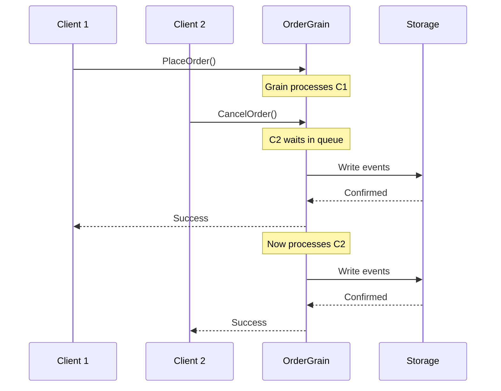
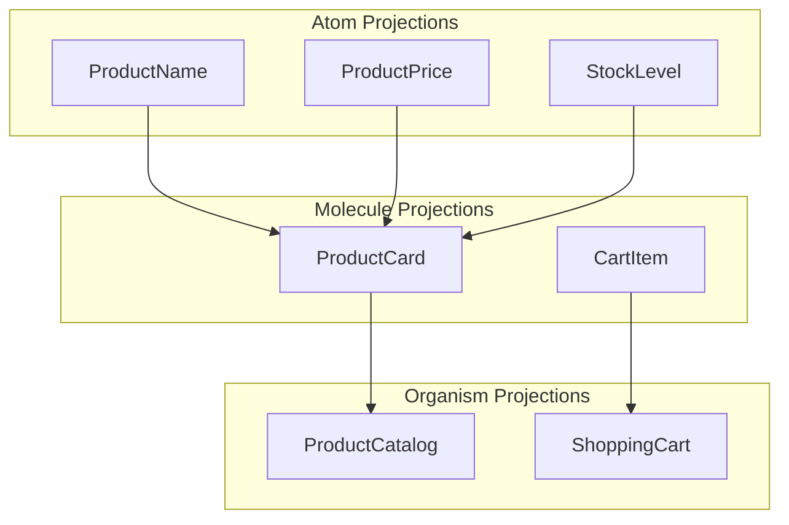
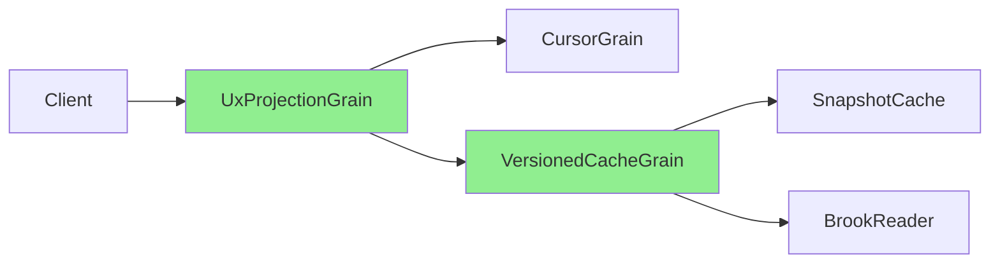
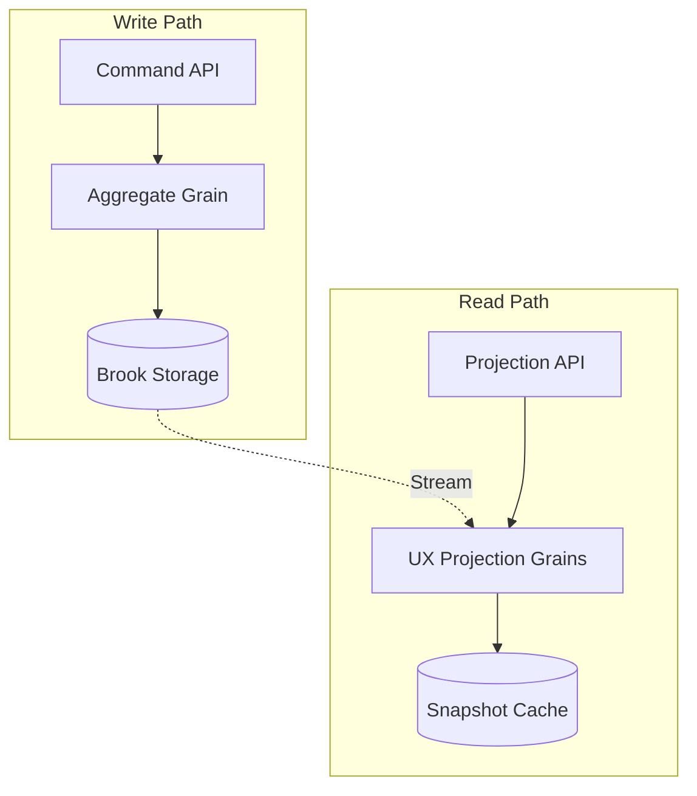

This guide covers recommended design patterns and common anti-patterns when
building event-sourced applications with Mississippi on Orleans.

## Orleans Threading Model

Orleans grains are single-threaded by default. Understanding this model is
critical for avoiding bottlenecks.

### The Single-Threaded Guarantee



Each grain activation processes one message at a time. This eliminates race
conditions but creates potential bottlenecks.

### StatelessWorker for Read-Heavy Paths

For read-only operations that don't require serialized access, use
`[StatelessWorker]`:

```csharp
[StatelessWorker]
internal sealed class UxProjectionGrain<TProjection>
    : IUxProjectionGrain<TProjection>, IGrainBase
{
    // Orleans creates multiple activations across silos
    // Requests distribute across activations automatically
}
```

Mississippi uses StatelessWorker for:

- `UxProjectionGrain<T>` - Read-only projection access
- `UxProjectionVersionedCacheGrain<T>` - Versioned cache lookups
- `BrookReaderGrain` - Batch event reads

### StatelessWorker Pitfall: IAsyncEnumerable

StatelessWorker is **incompatible** with `IAsyncEnumerable` because Orleans
stores enumerator state per-activation. With StatelessWorker, subsequent
`MoveNextAsync()` calls may route to different activations.

```csharp
// WRONG: StatelessWorker + IAsyncEnumerable
[StatelessWorker]
internal sealed class BadReaderGrain : IReaderGrain
{
    public IAsyncEnumerable<Event> ReadAsync()
    {
        // MoveNextAsync calls may route to wrong activation!
    }
}

// CORRECT: Use unique grain keys per read session
internal sealed class BrookAsyncReaderGrain : IBrookAsyncReaderGrain
{
    // Each read gets a unique grain key with random suffix
    // Grain deactivates after idle timeout
}
```

## Aggregate Design Patterns

### Keep Aggregates Small and Focused

An aggregate should protect a single consistency boundary. Don't combine
unrelated invariants.

```csharp
// GOOD: Focused on order lifecycle
[BrookName("ORDERS")]
public sealed record OrderAggregate
{
    public OrderStatus Status { get; init; }
    public ImmutableList<OrderLine> Lines { get; init; }
    public Money Total { get; init; }
}

// BAD: Mixed concerns
[BrookName("ORDERS")]
public sealed record OrderAggregate
{
    public OrderStatus Status { get; init; }
    public CustomerProfile Customer { get; init; }  // Wrong boundary
    public InventoryLevels Inventory { get; init; } // Wrong boundary
}
```

### Prefer Value Objects

Use immutable value objects for aggregate properties:

```csharp
// GOOD: Value object with validation
public readonly record struct Money(decimal Amount, string Currency)
{
    public Money Add(Money other)
    {
        if (Currency != other.Currency)
            throw new InvalidOperationException("Currency mismatch");
        return this with { Amount = Amount + other.Amount };
    }
}

// BAD: Primitive obsession
public sealed record OrderAggregate
{
    public decimal TotalAmount { get; init; }    // Which currency?
    public string TotalCurrency { get; init; }   // Easy to mismatch
}
```

### Command Handler Patterns

Keep command handlers stateless and focused:

```csharp
// GOOD: Single responsibility, pure validation
public sealed class PlaceOrderHandler
    : CommandHandlerBase<PlaceOrderCommand, OrderAggregate>
{
    protected override OperationResult<IReadOnlyList<object>> HandleCore(
        PlaceOrderCommand command,
        OrderAggregate? state)
    {
        // Validate against current state
        if (state?.Status == OrderStatus.Placed)
            return OperationResult.Fail<IReadOnlyList<object>>(
                "ORDER_ALREADY_PLACED",
                "Order has already been placed");

        // Return events (not mutations)
        return OperationResult.Ok<IReadOnlyList<object>>(
            [new OrderPlacedEvent(command.OrderId, command.Lines)]);
    }
}
```

### Avoid Side Effects in Command Handlers

Command handlers should only validate and emit events. Never:

- Call external services
- Send notifications
- Write to databases directly
- Perform I/O operations

```csharp
// BAD: Side effects in handler
public sealed class PlaceOrderHandler
    : CommandHandlerBase<PlaceOrderCommand, OrderAggregate>
{
    private IEmailService EmailService { get; }  // Wrong!

    protected override OperationResult<IReadOnlyList<object>> HandleCore(...)
    {
        // Don't do this - side effects belong in event handlers
        EmailService.SendConfirmation(command.CustomerId);

        return OperationResult.Ok<IReadOnlyList<object>>(
            [new OrderPlacedEvent(...)]);
    }
}

// GOOD: Pure validation, events trigger side effects elsewhere
public sealed class PlaceOrderHandler
    : CommandHandlerBase<PlaceOrderCommand, OrderAggregate>
{
    protected override OperationResult<IReadOnlyList<object>> HandleCore(...)
    {
        // Pure validation only
        if (!command.Lines.Any())
            return OperationResult.Fail<IReadOnlyList<object>>(
                "NO_LINES", "Order must have at least one line");

        // Event triggers notification via separate handler
        return OperationResult.Ok<IReadOnlyList<object>>(
            [new OrderPlacedEvent(...)]);
    }
}
```

## Event Reducer Patterns

### Reducers Must Be Pure Functions

Reducers transform `(state, event) -> newState` with no side effects:

```csharp
// GOOD: Pure function
public sealed class OrderPlacedReducer
    : EventReducerBase<OrderPlacedEvent, OrderAggregate>
{
    public override OrderAggregate Reduce(
        OrderAggregate state,
        OrderPlacedEvent eventData)
    {
        return state with
        {
            Status = OrderStatus.Placed,
            Lines = eventData.Lines.ToImmutableList(),
            Total = eventData.Lines.Sum(l => l.Price)
        };
    }
}

// BAD: Side effects in reducer
public sealed class OrderPlacedReducer
    : EventReducerBase<OrderPlacedEvent, OrderAggregate>
{
    private ILogger Logger { get; }  // Wrong - indicates side effect

    public override OrderAggregate Reduce(...)
    {
        Logger.LogInformation("Order placed");  // Side effect!
        // Reducers may run during rebuild - this logs multiple times
    }
}
```

### Reducers Must Be Idempotent

The same event applied to the same state must always produce the same result:

```csharp
// GOOD: Deterministic
public override OrderAggregate Reduce(
    OrderAggregate state,
    OrderPlacedEvent eventData)
{
    return state with
    {
        PlacedAt = eventData.Timestamp  // Use event timestamp, not DateTime.Now
    };
}

// BAD: Non-deterministic
public override OrderAggregate Reduce(
    OrderAggregate state,
    OrderPlacedEvent eventData)
{
    return state with
    {
        PlacedAt = DateTime.UtcNow  // Different on every replay!
    };
}
```

## UX Projection Patterns

### Atomic Design for Projections

Structure projections to match UI component needs:



Design projections for specific UI views rather than generic data access:

```csharp
// GOOD: Purpose-built for a specific view
[BrookName("ORDERS")]
public sealed record OrderSummaryProjection
{
    public string OrderId { get; init; }
    public string CustomerName { get; init; }  // Denormalized for display
    public int ItemCount { get; init; }        // Pre-computed
    public Money Total { get; init; }
    public string StatusDisplay { get; init; } // UI-ready string
}

// BAD: Generic data dump
[BrookName("ORDERS")]
public sealed record OrderProjection
{
    public OrderAggregate Order { get; init; }  // Exposes domain model
    public Customer Customer { get; init; }     // Separate aggregate leaked
}
```

### One Projection Per View Concern

Don't create god projections that serve multiple views:

```csharp
// GOOD: Separate projections for separate concerns
[BrookName("ORDERS")]
public sealed record OrderListItemProjection { ... }  // For order list

[BrookName("ORDERS")]
public sealed record OrderDetailProjection { ... }    // For order detail page

[BrookName("ORDERS")]
public sealed record OrderStatusProjection { ... }    // For status badge

// BAD: One projection for everything
[BrookName("ORDERS")]
public sealed record OrderProjection
{
    // 50 properties for every possible view
    // Every view fetches data it doesn't need
}
```

## Brook (Event Stream) Patterns

### One Brook Per Aggregate Type

Each aggregate type should have its own brook namespace:

```csharp
// GOOD: Separate brooks
[BrookName("ORDERS")]
public sealed record OrderAggregate { ... }

[BrookName("CUSTOMERS")]
public sealed record CustomerAggregate { ... }

[BrookName("PRODUCTS")]
public sealed record ProductAggregate { ... }
```

### Entity ID Consistency

Use consistent entity ID formats across your domain:

```csharp
// GOOD: Consistent ID format
public static class EntityIds
{
    public static string ForOrder(Guid orderId) => $"order-{orderId}";
    public static string ForCustomer(Guid customerId) => $"customer-{customerId}";
}

// Usage
var brookKey = new BrookKey("ORDERS", EntityIds.ForOrder(orderId));
```

## Snapshot Patterns

### Choose Snapshot Retention Wisely

The modulus strategy keeps one snapshot per N events:

```csharp
// Every 100 events - good for high-volume aggregates
services.Configure<SnapshotRetentionOptions>(o => o.DefaultRetainModulus = 100);

// Every 10 events - good for low-volume, frequently-read aggregates
services.Configure<SnapshotRetentionOptions>(o => o.DefaultRetainModulus = 10);
```

Consider:

- Event volume per aggregate
- Rebuild frequency
- Storage costs
- Read/write ratio

### Don't Store Derived Data in Snapshots

Snapshots should contain only the minimal state needed for projection rebuild:

```csharp
// GOOD: Minimal state
public sealed record OrderAggregate
{
    public OrderStatus Status { get; init; }
    public ImmutableList<OrderLine> Lines { get; init; }
}

// BAD: Derived/cached data in snapshot
public sealed record OrderAggregate
{
    public OrderStatus Status { get; init; }
    public ImmutableList<OrderLine> Lines { get; init; }
    public int LineCount { get; init; }       // Derived from Lines
    public Money CachedTotal { get; init; }   // Computed from Lines
}
```

## Anti-Patterns to Avoid

### Anti-Pattern: Service Locator

Never inject `IServiceProvider` into grains or handlers:

```csharp
// BAD: Service locator
public sealed class OrderGrain : IGrainBase
{
    private IServiceProvider ServiceProvider { get; }

    public async Task Handle(object command)
    {
        // Hidden dependency, hard to test
        var handler = ServiceProvider.GetRequiredService<IHandler>();
    }
}

// GOOD: Explicit dependencies
public sealed class OrderGrain : IGrainBase
{
    private IRootCommandHandler<OrderAggregate> RootHandler { get; }

    public async Task Handle(object command)
    {
        // Clear dependency, easy to mock
        await RootHandler.HandleAsync(command, state);
    }
}
```

### Anti-Pattern: Blocking Calls in Grains

Never use `.Result` or `.Wait()` in grains:

```csharp
// BAD: Blocks the grain's thread
public Task<Order> GetOrderAsync()
{
    var events = brookReader.ReadAsync().Result;  // Deadlock risk!
    return Task.FromResult(Reduce(events));
}

// GOOD: Async all the way
public async Task<Order> GetOrderAsync()
{
    var events = await brookReader.ReadAsync();
    return Reduce(events);
}
```

### Anti-Pattern: Large Grain State

Don't store unbounded collections in grain state:

```csharp
// BAD: Unbounded growth
public sealed record OrderHistoryAggregate
{
    public ImmutableList<Order> AllOrders { get; init; }  // Grows forever
}

// GOOD: Bounded or paginated
public sealed record OrderAggregate
{
    public Order CurrentOrder { get; init; }  // Single entity
}

// For history, use projections with pagination
[BrookName("ORDERS")]
public sealed record OrderHistoryProjection
{
    public ImmutableList<OrderSummary> RecentOrders { get; init; }  // Bounded
}
```

### Anti-Pattern: Cross-Aggregate Transactions

Don't try to make atomic changes across aggregates:

```csharp
// BAD: Distributed transaction attempt
public async Task TransferFunds(Guid from, Guid to, Money amount)
{
    // This is NOT atomic - either can fail independently
    await fromAccount.Withdraw(amount);
    await toAccount.Deposit(amount);  // What if this fails?
}

// GOOD: Use saga/process manager pattern
public async Task InitiateTransfer(Guid from, Guid to, Money amount)
{
    // Create a transfer aggregate that coordinates the process
    var transferId = Guid.NewGuid();
    await transferGrain.Start(transferId, from, to, amount);
    // Transfer aggregate handles the choreography with compensation
}
```

## Performance Patterns

### Read Path Optimization

Use the UX projection grain hierarchy for reads:



The green grains are StatelessWorker - they scale horizontally for reads.

### Write Path Isolation

Keep the write path (aggregate) separate from read path (projections):



This separation allows independent scaling of reads and writes.
