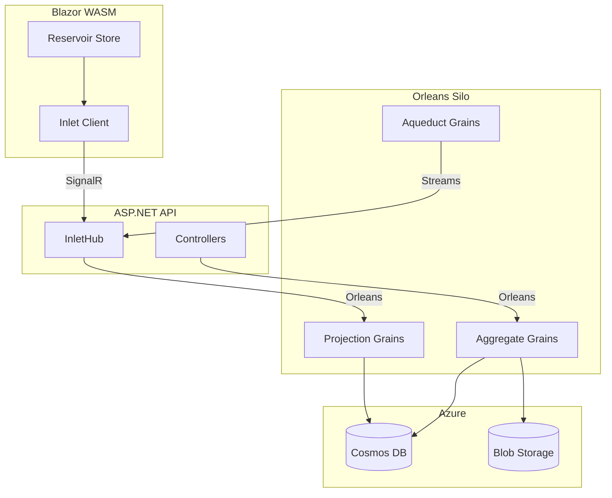

Mississippi is composed of modular building blocks that move domain changes into
live UX state for Blazor WebAssembly and ASP.NET hosts.

## Logical Order (Server → Client)

1. [Aggregates](./aggregates.md) — Command handling and event production
2. [Brooks](./brooks.md) — Append-only event streams
3. [UX Projections](./ux-projections.md) — Composable read models for UX state
4. [Snapshots](./snapshots.md) — Accelerated projection rebuilds
5. [Aqueduct](./aqueduct.md) — Orleans-backed SignalR backplane
6. [Inlet](./inlet.md) — WASM-to-server bridge for projection subscriptions
7. [Reservoir](./reservoir.md) — Redux-style client state container
8. [Refraction](./refraction.md) — Planned component library

## SDK Packages

Mississippi provides three SDK meta-packages that bundle libraries by deployment
target. See the [SDK Reference](./sdk.md) for details:

| Package | Use Case |
| --- | --- |
| `Sdk.Client` | Blazor WebAssembly clients |
| `Sdk.Server` | ASP.NET API hosts |
| `Sdk.Silo` | Orleans silo hosts |

## Source Generators

Mississippi includes source generators that reduce boilerplate:

| Attribute | Purpose |
| --- | --- |
| `[GenerateAggregateEndpoints]` | Silo registration, server controller, client state |
| `[GenerateCommand]` | DTOs, mappers, HTTP endpoints for commands |
| `[GenerateProjectionEndpoints]` | Read-only endpoints and client subscriptions |

## Architecture Diagram

## Next Steps

Use these pages as a map, then dive into the detailed sections like
[Reservoir](../reservoir/index.md) for client state management.
