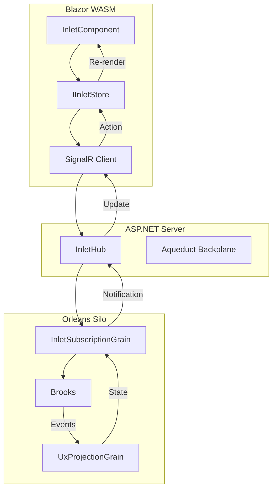
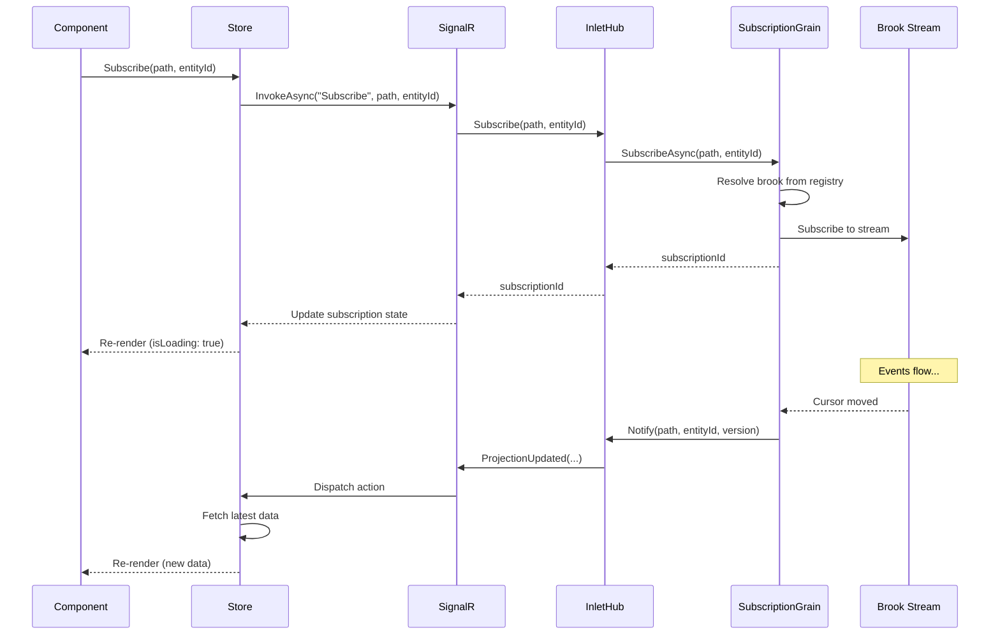
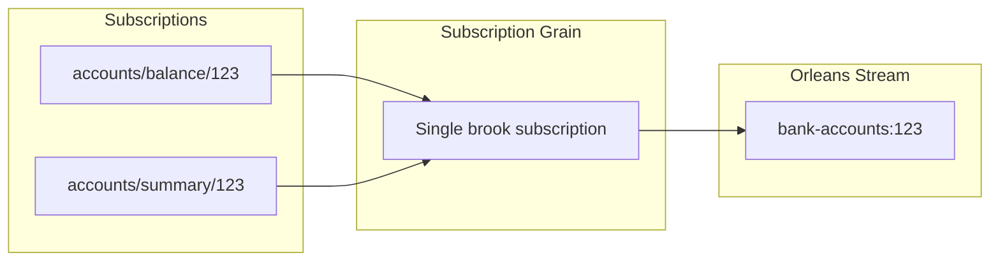

Inlet is the bridge between Blazor WebAssembly clients and server-side UX
projections. It handles subscription management, live updates via SignalR,
and client-side state coordination through Reservoir.

## The Problem

Blazor WASM clients need to:

1. Subscribe to specific projections by type and entity ID
2. Receive real-time updates when projections change
3. Manage loading/error/connected states
4. Avoid exposing internal event sourcing details (brooks, streams)

## How Inlet Solves It



## Architecture Layers

### Client Layer

- **InletComponent** - Base Blazor component with projection access
- **IInletStore** - Combines Redux store with projection cache
- **SignalR effects** - Connect subscriptions to server

### Server Layer

- **InletHub** - SignalR hub exposing subscribe/unsubscribe
- **Aqueduct** - Orleans-backed SignalR backplane

### Orleans Layer

- **IInletSubscriptionGrain** - Manages subscriptions per connection
- **IProjectionBrookRegistry** - Maps paths to brook names
- **UxProjectionGrain** - Computes projection state from events

## Source Generators

Inlet includes source generators that reduce boilerplate:

### Server Generators

| Generator | Output |
| --- | --- |
| `ProjectionEndpointsGenerator` | Controller, DTO, Mapper for projections |
| `AggregateControllerGenerator` | Command endpoint controllers |
| `CommandServerDtoGenerator` | Server-side command DTOs |

### Client Generators

| Generator | Output |
| --- | --- |
| `ProjectionClientDtoGenerator` | Client-side projection DTOs |
| `CommandClientStateGenerator` | Reservoir feature states |
| `CommandClientActionsGenerator` | Redux-style actions |
| `CommandClientReducersGenerator` | State reducers |
| `CommandClientEffectsGenerator` | Side effects for API calls |
| `CommandClientMappersGenerator` | DTO mappers |

## Getting Started

### 1. Server Setup

Register Inlet Orleans services:

```csharp
// In Orleans silo
siloBuilder.AddInletOrleans();
```

Register the SignalR hub:

```csharp
// In ASP.NET
services.AddAqueduct<InletHub>();

app.MapHub<InletHub>("/inlet");
```

### 2. Client Setup

Register Inlet in your Blazor WASM app:

```csharp
builder.Services.AddInlet();
builder.Services.AddInletBlazor()
    .WithSignalRConnection(new Uri("https://api.example.com/inlet"));
```

### 3. Mark Projections

Decorate projections with attributes:

```csharp
[ProjectionPath("accounts/balance")]
[GenerateProjectionEndpoints]
public sealed record BankAccountBalanceProjection
{
    public string AccountId { get; init; } = string.Empty;
    public decimal Balance { get; init; }
    public DateTimeOffset LastUpdated { get; init; }
}
```

### 4. Use in Components

Inherit from `InletComponent`:

```csharp
@inherits InletComponent

@code {
    [Parameter]
    public string AccountId { get; set; } = string.Empty;

    private BankAccountBalanceProjection? Balance =>
        GetProjection<BankAccountBalanceProjection>(AccountId);

    private bool IsLoading =>
        IsProjectionLoading<BankAccountBalanceProjection>(AccountId);

    private bool IsConnected =>
        IsProjectionConnected<BankAccountBalanceProjection>(AccountId);

    protected override void OnInitialized()
    {
        base.OnInitialized();
        SubscribeToProjection<BankAccountBalanceProjection>(AccountId);
    }
}
```

## Subscription Lifecycle



## InletComponent API

The base component provides these helpers:

```csharp
public abstract class InletComponent : StoreComponent
{
    // Get projection data
    protected T? GetProjection<T>(string entityId) where T : class;

    // Get full state (data, version, loading, error, connected)
    protected IProjectionState<T>? GetProjectionState<T>(string entityId)
        where T : class;

    // State checks
    protected bool IsProjectionLoading<T>(string entityId) where T : class;
    protected bool IsProjectionConnected<T>(string entityId) where T : class;
    protected Exception? GetProjectionError<T>(string entityId) where T : class;

    // Subscription management
    protected void SubscribeToProjection<T>(string entityId) where T : class;
    protected void UnsubscribeFromProjection<T>(string entityId) where T : class;
}
```

## IInletStore

The composite store interface:

```csharp
public interface IInletStore : IStore
{
    T? GetProjection<T>(string entityId) where T : class;
    IProjectionState<T>? GetProjectionState<T>(string entityId) where T : class;
    bool IsProjectionLoading<T>(string entityId) where T : class;
    bool IsProjectionConnected<T>(string entityId) where T : class;
    Exception? GetProjectionError<T>(string entityId) where T : class;
}
```

## Projection State

Each projection subscription tracks:

```csharp
public interface IProjectionState<T>
    where T : class
{
    T? Data { get; }                  // The projection data
    long Version { get; }             // Server version
    bool IsLoading { get; }           // Currently fetching
    bool IsConnected { get; }         // SignalR connected
    Exception? Error { get; }         // Last error, if any
}
```

## Path-to-Brook Mapping

The `IProjectionBrookRegistry` resolves projection paths to brook names:

```csharp
// Registration (automatic from [ProjectionPath])
services.AddProjectionPath<BankAccountBalanceProjection>(
    "accounts/balance");

// The registry maps:
// "accounts/balance" -> "bank-accounts" (brook name)
```

This abstraction means clients never see brook infrastructure.

## Subscription Deduplication

When multiple projections share the same brook and entity ID, the subscription
grain optimizes by sharing a single Orleans stream subscription:



When the brook cursor moves, the grain fans out to all related projections.

## Live Updates

When a projection changes on the server:

1. Events are appended to the brook
2. The brook stream notifies the subscription grain
3. The grain sends `ProjectionUpdated(path, entityId, version)`
4. The client receives the SignalR message
5. An action is dispatched to the store
6. The store fetches the latest data
7. Components re-render with new data

## Error Handling

Inlet tracks errors per projection:

```razor
@if (GetProjectionError<BankAccountBalanceProjection>(AccountId) is {} error)
{
    <div class="error">Failed to load: @error.Message</div>
}
else if (IsProjectionLoading<BankAccountBalanceProjection>(AccountId))
{
    <LoadingSpinner />
}
else if (Balance is {} balance)
{
    <BalanceDisplay Balance="@balance" />
}
```

## Best Practices

### Keep Projections Focused

Design projections for specific UI needs:

```csharp
// Good: Focused, minimal data
[ProjectionPath("accounts/balance")]
public sealed record AccountBalanceProjection
{
    public decimal Balance { get; init; }
}

// Good: Different view, different projection
[ProjectionPath("accounts/summary")]
public sealed record AccountSummaryProjection
{
    public string AccountId { get; init; } = string.Empty;
    public string AccountName { get; init; } = string.Empty;
    public decimal Balance { get; init; }
    public int TransactionCount { get; init; }
}
```

### Unsubscribe on Disposal

Clean up subscriptions when components unmount:

```csharp
public override void Dispose()
{
    UnsubscribeFromProjection<BankAccountBalanceProjection>(AccountId);
    base.Dispose();
}
```

### Handle Connection State

Show appropriate UI for disconnected states:

```razor
@if (!IsProjectionConnected<BankAccountBalanceProjection>(AccountId))
{
    <ConnectionWarning />
}
```

### Use Generated Code

Let source generators handle boilerplate:

```csharp
// Mark your domain types
[GenerateProjectionEndpoints]
[ProjectionPath("accounts/balance")]
public sealed record BankAccountBalanceProjection { ... }

// Generators produce:
// - BankAccountBalanceProjectionDto
// - BankAccountBalanceProjectionMapper
// - BankAccountBalanceProjectionController
// - Client-side DTOs and effects
```
