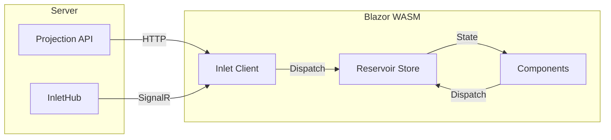

Reservoir is Mississippi's Redux-style state management library for Blazor
WebAssembly and Blazor Server applications. It provides a predictable,
unidirectional data flow for client-side state.

## Purpose

Reservoir centralizes client state in a single store with:

- **Actions** — Immutable messages describing events or user intent
- **Reducers** — Pure functions that transform state synchronously
- **Effects** — Handlers for async operations like API calls
- **Store** — Central container coordinating the data flow

## Where Reservoir Fits



Inlet uses Reservoir to manage projection state. When projections update on the
server, Inlet dispatches actions to update the Reservoir store, triggering UI
re-renders.

## Quick Example

```csharp
// Define feature state
public sealed record CounterState : IFeatureState
{
    public static string FeatureKey => "counter";
    public int Count { get; init; }
}

// Define action
public sealed record IncrementAction : IAction;

// Register reducer
builder.Services.AddReducer<IncrementAction, CounterState>(
    (state, action) => state with { Count = state.Count + 1 });

// Register Reservoir
builder.Services.AddReservoir();
```

```razor
@inherits StoreComponent

<h1>Count: @Counter.Count</h1>
<button @onclick="() => Dispatch(new IncrementAction())">+</button>

@code {
    private CounterState Counter => GetState<CounterState>();
}
```

## Detailed Documentation

For complete coverage, see the dedicated Reservoir section:

- [Getting Started](../reservoir/getting-started.md) — Build a complete example
- [Actions](../reservoir/actions.md) — Define events and intents
- [Reducers](../reservoir/reducers.md) — Transform state with pure functions
- [Effects](../reservoir/effects.md) — Handle async operations
- [Store](../reservoir/store.md) — Central state container
- [State](../reservoir/state.md) — Define feature states
