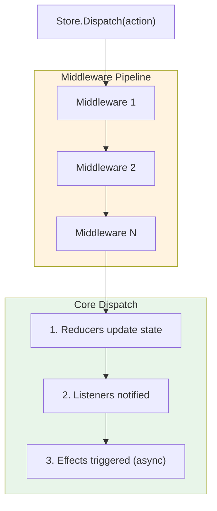

The Store is the central state container in Reservoir. It holds all feature states, coordinates action dispatch, and notifies subscribers when state changes. The Store is the single source of truth for your application's state.

## Core Responsibilities

The Store handles:

1. **State management** — Holds and provides access to feature states
2. **Action dispatch** — Routes actions through middleware, reducers, and effects
3. **Subscription management** — Notifies listeners when state changes
4. **Effect coordination** — Triggers async effects after reducer processing

## The IStore Interface

```csharp
/// <summary>
/// Central state container for the Reservoir state management system.
/// </summary>
public interface IStore : IDisposable
{
    /// <summary>
    /// Dispatches an action to the store.
    /// Actions are processed by middleware, then reducers, then effects.
    /// </summary>
    void Dispatch(IAction action);

    /// <summary>
    /// Gets the current state for a feature slice.
    /// </summary>
    /// <typeparam name="TState">The feature state type.</typeparam>
    /// <returns>The current feature state.</returns>
    TState GetState<TState>() where TState : class, IFeatureState;

    /// <summary>
    /// Subscribes to state changes.
    /// The listener is invoked after any action is processed.
    /// </summary>
    IDisposable Subscribe(Action listener);
}
```

## Configuration and Registration

### Basic Registration

Reservoir uses a convention where registering reducers automatically registers the associated feature state. This means you don't need to explicitly register feature states in most cases.

```csharp
// Program.cs
using Mississippi.Reservoir;

var builder = WebAssemblyHostBuilder.CreateDefault(args);

// Register reducers (each AddReducer also registers the feature state)
builder.Services.AddReducer<IncrementAction, CounterState>(
    (state, action) => state with { Count = state.Count + 1 });

// Register effects
builder.Services.AddEffect<LoadDataEffect>();

// Register the store (after all reducers and effects)
builder.Services.AddReservoir();

await builder.Build().RunAsync();
```

### Registration Order

Register components in this order for clarity:

```csharp
// 1. Register reducers (per feature)
builder.Services.AddReducer<AddItemAction, CartState>(CartReducers.AddItem);
builder.Services.AddReducer<RemoveItemAction, CartState>(CartReducers.RemoveItem);
builder.Services.AddReducer<ProductsLoadingAction, CartState>(CartReducers.ProductsLoading);
builder.Services.AddReducer<ProductsLoadedAction, CartState>(CartReducers.ProductsLoaded);
builder.Services.AddReducer<ProductsLoadFailedAction, CartState>(CartReducers.ProductsLoadFailed);

// 2. Register effects
builder.Services.AddEffect<LoadProductsEffect>();

// 3. Register optional middleware
builder.Services.AddMiddleware<LoggingMiddleware>();

// 4. Register the store (must be last)
builder.Services.AddReservoir();
```

### What AddReservoir Does

The `AddReservoir()` method:

1. Collects all registered `IFeatureStateRegistration` instances
2. Collects all registered `IEffect` instances  
3. Collects all registered `IMiddleware` instances
4. Creates a scoped `IStore` with these dependencies

```csharp
// The store is registered with scoped lifetime
services.TryAddScoped<IStore>(sp => new Store(
    sp.GetServices<IFeatureStateRegistration>(),
    sp.GetServices<IEffect>(),
    sp.GetServices<IMiddleware>()));
```

## Dispatch Pipeline

When you call `Store.Dispatch(action)`, the action flows through a pipeline:



### Synchronous vs Asynchronous

| Phase | Execution | Blocking |
|-------|-----------|----------|
| Middleware | Synchronous | Yes |
| Reducers | Synchronous | Yes |
| Listener notification | Synchronous | Yes |
| Effects | Asynchronous | No |

The `Dispatch` method returns immediately after reducers and listeners run. Effects execute asynchronously and may dispatch additional actions.

## Accessing State

### In Blazor Components

Inherit from `StoreComponent` for automatic store integration:

```razor
@inherits StoreComponent

<h1>Count: @Counter.Count</h1>
<button @onclick="Increment">Increment</button>

@code {
    private CounterState Counter => GetState<CounterState>();

    private void Increment() => Dispatch(new IncrementAction());
}
```

### In Services

Inject `IStore` directly:

```csharp
public class OrderService
{
    private IStore Store { get; }
    private IOrderApi OrderApi { get; }

    public OrderService(IStore store, IOrderApi orderApi)
    {
        Store = store;
        OrderApi = orderApi;
    }

    public async Task PlaceOrderAsync()
    {
        var cart = Store.GetState<CartState>();
        
        Store.Dispatch(new PlaceOrderAction());
        
        await OrderApi.SubmitAsync(cart.Items);
        
        Store.Dispatch(new OrderPlacedAction());
    }
}
```

### Manual Subscriptions

For non-component scenarios, subscribe manually:

```csharp
public class StateLogger : IDisposable
{
    private readonly IDisposable subscription;
    private readonly IStore store;
    private readonly ILogger logger;

    public StateLogger(IStore store, ILogger<StateLogger> logger)
    {
        this.store = store;
        this.logger = logger;
        
        subscription = store.Subscribe(OnStateChanged);
    }

    private void OnStateChanged()
    {
        var counter = store.GetState<CounterState>();
        logger.LogDebug("Counter is now {Count}", counter.Count);
    }

    public void Dispose() => subscription.Dispose();
}
```

## The StoreComponent Base Class

`StoreComponent` is a Blazor component base class that integrates with Reservoir:

```csharp
/// <summary>
/// Base component that integrates with the Reservoir state management system.
/// Automatically subscribes to store changes and disposes subscriptions.
/// </summary>
public abstract class StoreComponent : ComponentBase, IDisposable
{
    [Inject]
    protected IStore Store { get; set; } = default!;

    protected void Dispatch(IAction action) => Store.Dispatch(action);

    protected TState GetState<TState>() where TState : class, IFeatureState 
        => Store.GetState<TState>();

    // Automatically subscribes and triggers re-render on state changes
}
```

### Features

- **Automatic subscription** — Subscribes to store changes on initialization
- **Automatic re-render** — Calls `StateHasChanged()` when any state changes
- **Automatic disposal** — Unsubscribes when the component is disposed
- **Convenient methods** — `Dispatch()` and `GetState<T>()` for clean component code

### Usage Pattern

```razor
@inherits StoreComponent

@if (Cart.IsLoadingProducts)
{
    <LoadingSpinner />
}
else if (Cart.ProductsError is not null)
{
    <ErrorMessage Message="@Cart.ProductsError" />
}
else
{
    <ProductList Products="@Cart.AvailableProducts" OnAddToCart="AddToCart" />
}

<CartSummary Items="@Cart.Items" OnRemove="RemoveFromCart" />

@code {
    private CartState Cart => GetState<CartState>();

    protected override void OnInitialized()
    {
        base.OnInitialized();
        Dispatch(new LoadProductsAction());
    }

    private void AddToCart(string productName) 
        => Dispatch(new AddItemAction(productName));

    private void RemoveFromCart(string itemId) 
        => Dispatch(new RemoveItemAction(itemId));
}
```

### When Not to Use StoreComponent

Consider alternatives when:

- The component doesn't need store access (use `ComponentBase`)
- You need finer-grained re-render control (subscribe selectively)
- You're building a library component that shouldn't assume Reservoir

## Middleware

Middleware intercepts actions for cross-cutting concerns:

```csharp
/// <summary>
/// Intercepts actions before and after they reach reducers.
/// </summary>
public interface IMiddleware
{
    void Invoke(IAction action, Action<IAction> nextAction);
}
```

### Implementing Middleware

```csharp
public sealed class LoggingMiddleware : IMiddleware
{
    private ILogger Logger { get; }

    public LoggingMiddleware(ILogger<LoggingMiddleware> logger) 
        => Logger = logger;

    public void Invoke(IAction action, Action<IAction> nextAction)
    {
        Logger.LogDebug("Dispatching: {ActionType}", action.GetType().Name);
        
        nextAction(action); // Continue the pipeline
        
        Logger.LogDebug("Dispatched: {ActionType}", action.GetType().Name);
    }
}
```

### Middleware Use Cases

| Use Case | Description |
|----------|-------------|
| Logging | Log all dispatched actions for debugging |
| Analytics | Track user actions for metrics |
| Validation | Block invalid actions before they reach reducers |
| Transformation | Modify or enrich actions |
| Performance | Measure reducer execution time |

### Registration

```csharp
builder.Services.AddMiddleware<LoggingMiddleware>();
builder.Services.AddMiddleware<AnalyticsMiddleware>();
```

Middleware executes in registration order.

## Feature State Management

### Registering States

Feature states must be registered before use:

```csharp
builder.Services.AddReservoir(store =>
{
    store.RegisterState<CounterState>();   // Creates default CounterState
    store.RegisterState<CartState>();      // Creates default CartState
});
```

### Initial State

Feature states must have a parameterless constructor. The store creates initial state using `new TState()`:

```csharp
public sealed record CartState : IFeatureState
{
    public static string FeatureKey => "cart";
    
    // Default values provide initial state
    public ImmutableList<CartItem> Items { get; init; } = [];
    public bool IsLoadingProducts { get; init; } // defaults to false
    public string? ProductsError { get; init; }   // defaults to null
}
```

### Accessing Unregistered State

Attempting to access an unregistered feature state throws:

```csharp
// Throws InvalidOperationException if UserState is not registered
var user = store.GetState<UserState>();

// Message: "No reducer registered for feature state 'user'. 
//          Call RegisterState<UserState>() before selecting."
```

## Store Lifetime

### Scoped Lifetime

The store is registered with **scoped lifetime**:

- **Blazor WebAssembly**: Scoped acts as singleton (one store per app)
- **Blazor Server**: Each circuit gets its own store instance

This matches the Fluxor pattern and ensures state isolation in Blazor Server.

### Disposal

The store implements `IDisposable`:

```csharp
public void Dispose()
{
    // Clears all listeners
    // Disposes effects that implement IDisposable
    // Clears feature states and reducers
}
```

In Blazor, the DI container manages store disposal automatically.

## Thread Safety

The store is designed for concurrent access:

- **Feature states**: Stored in `ConcurrentDictionary`
- **Listeners**: Protected by lock during add/remove
- **Effects**: Execute concurrently and independently

However, individual state objects are immutable, ensuring safe reads.

## Rules and Limitations

### Rules

1. **Register reducers before calling AddReservoir.** Each `AddReducer` call auto-registers the feature state.

2. **Dispatch from any thread.** The store is thread-safe for dispatch operations.

3. **Don't hold references to old state.** Always call `GetState<T>()` to get current state.

4. **Dispose subscriptions.** Always dispose the `IDisposable` returned by `Subscribe()`.

### Limitations

1. **No time-travel debugging.** State history is not retained (future consideration).

2. **No action replay.** Dispatched actions are not recorded.

3. **No selective subscriptions.** `Subscribe()` fires for all state changes.

## Best Practices

### Do

- ✅ Use `StoreComponent` for Blazor components that need store access
- ✅ Register all reducers before calling `AddReservoir()`
- ✅ Keep feature states small and focused
- ✅ Dispose subscriptions when no longer needed
- ✅ Access state through `GetState<T>()` for current values

### Don't

- ❌ Create store instances manually (use DI)
- ❌ Store state references in component fields (call `GetState<T>()` each time)
- ❌ Access the store during `Dispose()` (may be disposed)
- ❌ Dispatch actions in response to every render

## Complete Example

Here's a complete example showing store configuration and usage:

```csharp
// Program.cs
using Mississippi.Reservoir;
using Mississippi.Reservoir.Blazor;

var builder = WebAssemblyHostBuilder.CreateDefault(args);
builder.RootComponents.Add<App>("#app");

// Configure HttpClient
builder.Services.AddScoped(_ => new HttpClient 
{ 
    BaseAddress = new Uri(builder.HostEnvironment.BaseAddress) 
});

// Register reducers (auto-registers CartState feature)
builder.Services.AddReducer<AddItemAction, CartState>(CartReducers.AddItem);
builder.Services.AddReducer<RemoveItemAction, CartState>(CartReducers.RemoveItem);
builder.Services.AddReducer<ProductsLoadingAction, CartState>(CartReducers.ProductsLoading);
builder.Services.AddReducer<ProductsLoadedAction, CartState>(CartReducers.ProductsLoaded);
builder.Services.AddReducer<ProductsLoadFailedAction, CartState>(CartReducers.ProductsLoadFailed);

// Register effects
builder.Services.AddEffect<LoadProductsEffect>();

// Register optional middleware
builder.Services.AddMiddleware<LoggingMiddleware>();

// Register the store (after all reducers and effects)
builder.Services.AddReservoir();

await builder.Build().RunAsync();
```

```razor
@* ShoppingCart.razor *@
@inherits StoreComponent

<h1>Shopping Cart</h1>

@if (Cart.IsLoadingProducts)
{
    <p>Loading products...</p>
}
else if (Cart.ProductsError is not null)
{
    <div class="error">@Cart.ProductsError</div>
    <button @onclick="LoadProducts">Retry</button>
}
else
{
    <h2>Available Products</h2>
    <ul>
        @foreach (var product in Cart.AvailableProducts)
        {
            <li>
                @product
                <button @onclick="@(() => AddToCart(product))">Add</button>
            </li>
        }
    </ul>
}

<h2>Your Cart (@Cart.Items.Count items)</h2>
<ul>
    @foreach (var item in Cart.Items)
    {
        <li>
            @item.Name (x@item.Quantity)
            <button @onclick="@(() => RemoveFromCart(item.Id))">Remove</button>
        </li>
    }
</ul>

@code {
    private CartState Cart => GetState<CartState>();

    protected override void OnInitialized()
    {
        base.OnInitialized();
        LoadProducts();
    }

    private void LoadProducts() => Dispatch(new LoadProductsAction());
    private void AddToCart(string name) => Dispatch(new AddItemAction(name));
    private void RemoveFromCart(string id) => Dispatch(new RemoveItemAction(id));
}
```

## Next Steps

- Review [Actions](./actions.md) for defining what the store processes
- See [Reducers](./reducers.md) for implementing state transformations
- Learn about [Effects](./effects.md) for async operations
