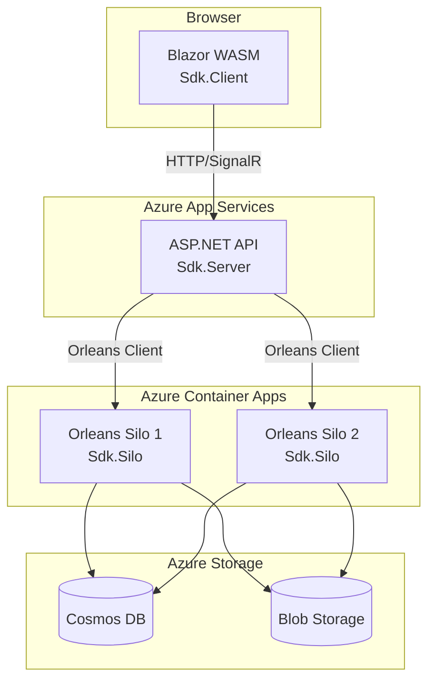
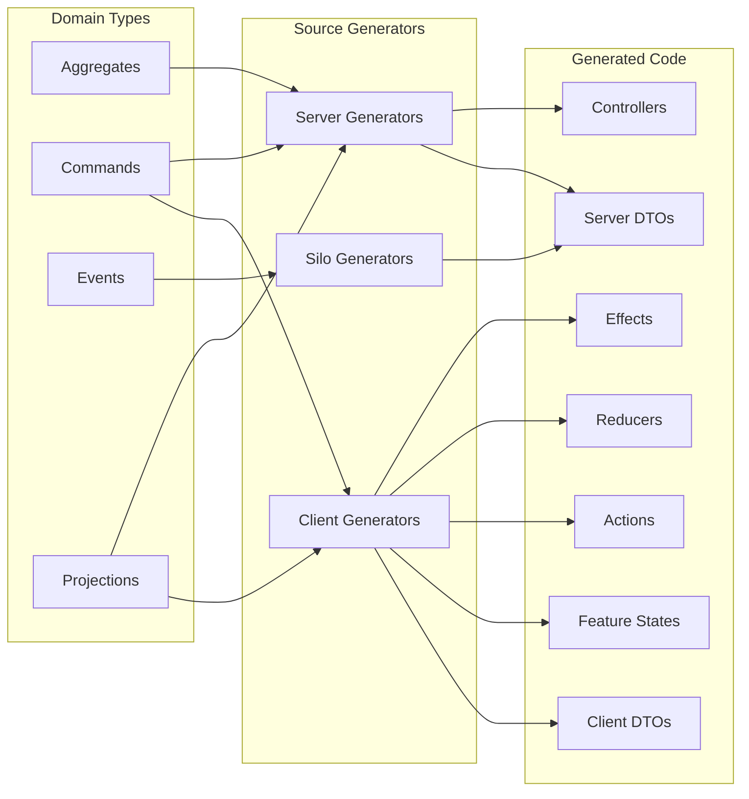

Mississippi provides three SDK meta-packages that bundle the right libraries for
each deployment target. Instead of manually selecting individual packages, install
the appropriate SDK for your project type.

## Package Overview

```mermaid
flowchart TB
    subgraph Client["Sdk.Client"]
        direction TB
        C1[Reservoir]
        C2[Reservoir.Blazor]
        C3[Inlet]
        C4[Inlet.Blazor.WebAssembly]
        C5[Client Generators]
    end

    subgraph Server["Sdk.Server"]
        direction TB
        S1[Aggregates.Api]
        S2[UxProjections.Api]
        S3[Snapshots]
        S4[Reducers]
        S5[Inlet.Orleans.SignalR]
        S6[Server Generators]
    end

    subgraph Silo["Sdk.Silo"]
        direction TB
        L1[Aggregates]
        L2[Brooks]
        L3[Brooks.Cosmos]
        L4[Snapshots.Cosmos]
        L5[UxProjections]
        L6[Inlet.Orleans]
        L7[Aqueduct.Grains]
        L8[Silo Generators]
    end
```



## Sdk.Client

**For:** Blazor WebAssembly applications consuming projections and sending
commands.

### Client Packages

| Package | Purpose |
| --- | --- |
| `Reservoir` | Redux-style state management |
| `Reservoir.Blazor` | Blazor component integration |
| `Inlet` | Projection caching and subscription logic |
| `Inlet.Blazor.WebAssembly` | SignalR connection management |
| `Inlet.Client.Generators` | Source generators for client DTOs |
| `Common.Abstractions` | Shared types and interfaces |

### Client Installation

```xml
<PackageReference Include="Mississippi.Sdk.Client" />
```

### Client Setup

```csharp
// Program.cs in Blazor WASM app
builder.Services.AddReservoir();
builder.Services.AddInlet();
builder.Services.AddInletBlazor()
    .WithSignalRConnection(new Uri("https://api.example.com/inlet"));
```

### Client Generated Code

The `Inlet.Client.Generators` automatically produce:

- Client-side projection DTOs
- Command state classes
- Action types for commands
- Reducers for command state
- Effects that call server APIs
- Mappers between domain and DTO types

## Sdk.Server

**For:** ASP.NET Core API applications hosting projection endpoints and
command handlers.

### Server Packages

| Package | Purpose |
| --- | --- |
| `EventSourcing.Aggregates.Api` | Command endpoint base classes |
| `EventSourcing.Aggregates` | Aggregate grain infrastructure |
| `EventSourcing.UxProjections.Api` | Projection controller base |
| `EventSourcing.UxProjections` | UX projection grain infrastructure |
| `EventSourcing.Reducers` | Event reducer pipeline |
| `EventSourcing.Snapshots` | Snapshot caching grains |
| `EventSourcing.Serialization.Json` | JSON serialization for events |
| `Inlet.Orleans.SignalR` | InletHub for live updates |
| `Inlet.Server.Generators` | Source generators for controllers |

### Server Installation

```xml
<PackageReference Include="Mississippi.Sdk.Server" />
```

### Server Setup

```csharp
// Program.cs in ASP.NET API
builder.UseOrleansClient(client =>
{
    client.UseAzureStorageClustering(...);
});

builder.Services.AddAqueduct<InletHub>();
builder.Services.AddAggregateApi();
builder.Services.AddUxProjectionsApi();

// Configure Inlet
var app = builder.Build();
app.MapHub<InletHub>("/inlet");
app.MapControllers();
```

### Server Generated Code

The `Inlet.Server.Generators` automatically produce:

- Projection endpoint controllers
- Projection DTO records
- Projection mappers
- Command endpoint controllers
- Command DTO records

## Sdk.Silo

**For:** Orleans silo hosts running aggregate grains, event sourcing, and
projection infrastructure.

### Silo Packages

| Package | Purpose |
| --- | --- |
| `EventSourcing.Aggregates` | Aggregate grain base classes |
| `EventSourcing.Aggregates.Api` | Command handler infrastructure |
| `EventSourcing.Brooks` | Event stream grains |
| `EventSourcing.Brooks.Cosmos` | Cosmos DB brook storage |
| `EventSourcing.Snapshots` | Snapshot caching infrastructure |
| `EventSourcing.Snapshots.Cosmos` | Cosmos DB snapshot storage |
| `EventSourcing.Reducers` | Event reducer pipeline |
| `EventSourcing.UxProjections` | UX projection grains |
| `EventSourcing.Serialization.Json` | JSON event serialization |
| `Inlet.Orleans` | Subscription management grains |
| `Aqueduct.Grains` | SignalR backplane grains |
| `Inlet.Silo.Generators` | Source generators for grain code |

### Silo Installation

```xml
<PackageReference Include="Mississippi.Sdk.Silo" />
```

### Silo Setup

```csharp
// Program.cs in Orleans Silo host
builder.Host.UseOrleans(silo =>
{
    silo.UseAzureStorageClustering(...);

    // Event sourcing infrastructure
    silo.AddCosmosBrookStorageProvider(
        cosmosConnectionString,
        blobConnectionString);

    silo.AddCosmosSnapshotStorageProvider(cosmosConnectionString);

    // Stream provider for Aqueduct
    silo.AddAzureQueueStreams("Aqueduct", ...);

    // Register grains
    silo.AddAggregates();
    silo.AddBrooks();
    silo.AddSnapshots();
    silo.AddUxProjections();
    silo.AddInletOrleans();
    silo.AddAqueductGrains();
});
```

## Choosing the Right SDK

| Project Type | SDK Package |
| --- | --- |
| Blazor WASM app | `Sdk.Client` |
| ASP.NET API (no Orleans silo) | `Sdk.Server` |
| Orleans Silo host | `Sdk.Silo` |
| Blazor Server (co-hosted silo) | `Sdk.Server` + `Sdk.Silo` |

## Typical Deployment Architecture



## Source Generator Summary

All three SDKs include source generators that reduce boilerplate:



## Versioning

All SDK packages share the same version number. When upgrading, update all
SDK references together to ensure compatibility:

```xml
<!-- All at the same version -->
<PackageReference Include="Mississippi.Sdk.Client" Version="1.0.0" />
<PackageReference Include="Mississippi.Sdk.Server" Version="1.0.0" />
<PackageReference Include="Mississippi.Sdk.Silo" Version="1.0.0" />
```

## Custom Configurations

If you need finer control, reference individual packages instead of the SDK
meta-packages. The SDKs are convenience bundles—all individual packages remain
available for selective inclusion.
