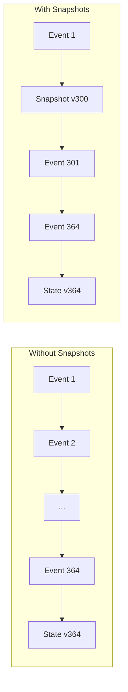
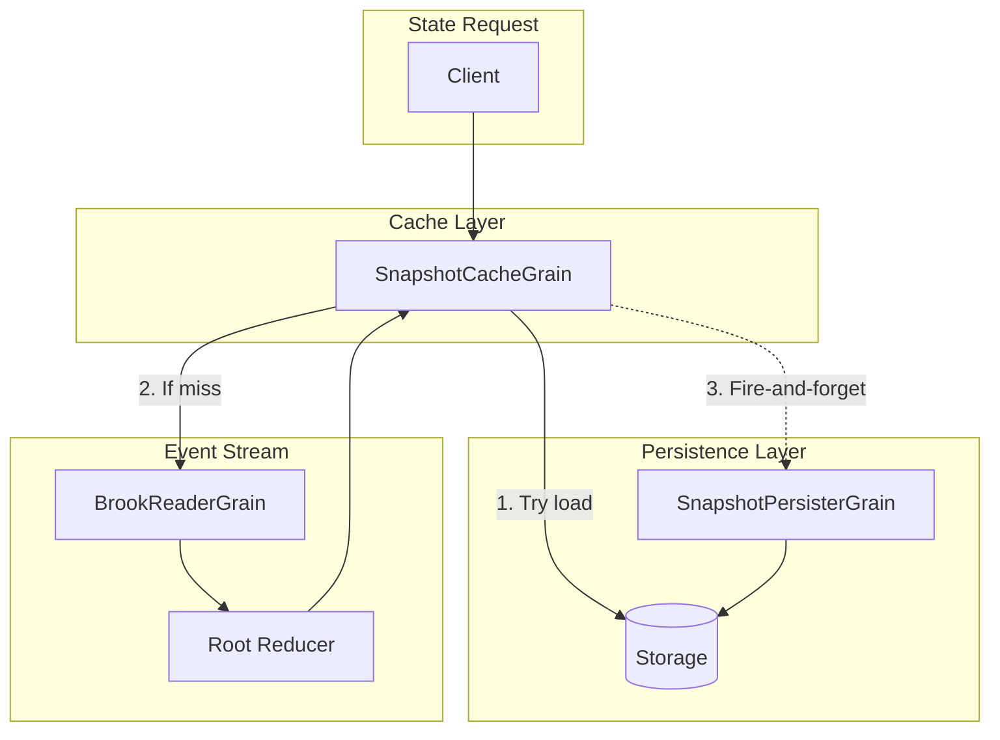
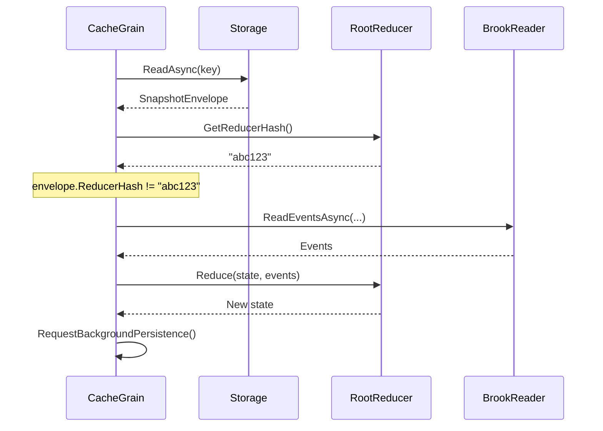

Snapshots provide point-in-time state captures that accelerate projection
rebuilds. Instead of replaying entire event streams, the system loads the
nearest snapshot and replays only the delta events.

## Why Snapshots Matter

Event sourcing stores every state change as an immutable event. While this
provides a complete audit trail, replaying thousands of events to compute
current state becomes expensive. Snapshots solve this by periodically saving
computed state.



**Key benefits:**

- **Faster reads** - Load snapshot + replay 64 events instead of 364
- **Reduced I/O** - Fewer event reads from storage
- **Predictable latency** - Bounded replay cost regardless of stream length
- **Memory efficiency** - Smaller working set during replay

## Core Concepts

### Snapshot Keys

Every snapshot is identified by a `SnapshotKey` combining:

```csharp
public readonly record struct SnapshotKey
{
    public SnapshotStreamKey Stream { get; }  // Brook + projection + reducer hash
    public long Version { get; }              // Snapshot version
}

public readonly record struct SnapshotStreamKey
{
    public string BrookName { get; }         // Source event stream name
    public string EntityId { get; }          // Entity identifier
    public string SnapshotStorageName { get; } // Type name for storage
    public string ReducersHash { get; }      // Hash of reducer logic
}
```

The `ReducersHash` enables automatic invalidation when reducer logic changes—stale
snapshots are rebuilt from events rather than serving incorrect cached state.

### Snapshot Envelope

Snapshots are stored as serialization-agnostic envelopes:

```csharp
public sealed record SnapshotEnvelope
{
    public ImmutableArray<byte> Data { get; init; }
    public string DataContentType { get; init; }  // e.g., "application/json"
    public long DataSizeBytes { get; init; }
    public string ReducerHash { get; init; }
}
```

This design allows different serialization formats (JSON, MessagePack,
Protobuf) while keeping the storage layer consistent.

## Grain Architecture

The snapshot system uses a two-grain architecture for separation of concerns:



### ISnapshotCacheGrain

The cache grain provides fast, immutable access to snapshot state:

```csharp
public interface ISnapshotCacheGrain<TSnapshot> : IGrainWithStringKey
{
    [ReadOnly]
    ValueTask<TSnapshot> GetStateAsync(
        CancellationToken cancellationToken = default
    );
}
```

On activation, it:

1. Attempts to load the exact snapshot from storage
2. If not found, calculates the nearest retained base snapshot
3. Gets state from the base snapshot grain (recursive)
4. Replays delta events using the root reducer
5. Requests background persistence via fire-and-forget

### ISnapshotPersisterGrain

The persister grain handles asynchronous storage writes:

```csharp
public interface ISnapshotPersisterGrain : IGrainWithStringKey
{
    [OneWay]
    Task PersistAsync(
        SnapshotEnvelope envelope,
        CancellationToken cancellationToken = default
    );
}
```

The `[OneWay]` attribute means callers don't wait—persistence happens in the background
without blocking state access.

### ISnapshotGrainFactory

Use the factory to resolve snapshot grains:

```csharp
public interface ISnapshotGrainFactory
{
    ISnapshotCacheGrain<TSnapshot> GetSnapshotCacheGrain<TSnapshot>(
        SnapshotKey snapshotKey
    );

    ISnapshotPersisterGrain GetSnapshotPersisterGrain(
        SnapshotKey snapshotKey
    );
}
```

## Retention Strategy

Not every version needs a snapshot. The retention system keeps snapshots at regular
intervals, limiting replay cost to a bounded number of events.

### Retention Modulus

Configure how often snapshots are retained:

```csharp
services.Configure<SnapshotRetentionOptions>(options =>
{
    // Keep snapshots at versions 0, 100, 200, 300, ...
    options.DefaultRetainModulus = 100;

    // Override for specific types
    options.StateTypeOverrides["MYAPP.COMPLEXSTATE.V1"] = 50;  // More frequent
    options.StateTypeOverrides["MYAPP.SIMPLESTATE.V1"] = 200;  // Less frequent
});
```

### Base Snapshot Calculation

When building state for version 364 with modulus 100:

| Target Version | Base Snapshot | Events to Replay |
| --- | --- | --- |
| 364 | 300 | 64 |
| 199 | 100 | 99 |
| 100 | 0 | 100 |
| 50 | 0 | 50 |

The system finds the largest retained version strictly less than the target.

### Automatic Pruning

Snapshots that don't match retention intervals are pruned automatically:

```csharp
await snapshotWriter.PruneAsync(
    streamKey,
    retainModuli: new[] { 100, 1000 },  // Keep at 100s and 1000s
    cancellationToken);
```

This keeps storage costs bounded while maintaining fast access to recent state.

## State Invalidation

When reducer logic changes, existing snapshots become stale. The system
detects this through reducer hash comparison:



Stale snapshots are automatically rebuilt and persisted with the new reducer hash.

## Accessing Snapshots

### From Projections

UX projections typically access snapshots through the factory:

```csharp
public class OrderSummaryProjection : IUxProjectionGrain<OrderSummary>
{
    private ISnapshotGrainFactory SnapshotFactory { get; }
    private BrookKey BrookKey { get; }

    public async ValueTask<OrderSummary> GetStateAsync(
        CancellationToken cancellationToken)
    {
        // Get current brook position
        var reader = BrookGrainFactory.GetBrookReaderGrain(BrookKey);
        var position = await reader.GetCursorPositionAsync(cancellationToken);

        // Build snapshot key
        var streamKey = new SnapshotStreamKey(
            BrookKey.Name,
            BrookKey.EntityId,
            "MYAPP.ORDERSUMMARY.V1",
            rootReducer.GetReducerHash());

        var snapshotKey = new SnapshotKey(streamKey, position.Value);

        // Get state from cache grain
        var cacheGrain = SnapshotFactory.GetSnapshotCacheGrain<OrderSummary>(
            snapshotKey);

        return await cacheGrain.GetStateAsync(cancellationToken);
    }
}
```

### Direct Access

For direct snapshot access in services:

```csharp
public class SnapshotService
{
    private ISnapshotGrainFactory SnapshotFactory { get; }

    public async Task<TState> GetStateAtVersionAsync<TState>(
        string brookName,
        string entityId,
        long version,
        string reducerHash)
        where TState : new()
    {
        var streamKey = new SnapshotStreamKey(
            brookName,
            entityId,
            typeof(TState).GetSnapshotStorageName(),
            reducerHash);

        var snapshotKey = new SnapshotKey(streamKey, version);
        var grain = SnapshotFactory.GetSnapshotCacheGrain<TState>(snapshotKey);

        return await grain.GetStateAsync();
    }
}
```

## Storage Provider

Snapshots use a pluggable storage interface:

```csharp
public interface ISnapshotStorageProvider
    : ISnapshotStorageReader,
      ISnapshotStorageWriter
{
    string Format { get; }
}

public interface ISnapshotStorageReader
{
    Task<SnapshotEnvelope?> ReadAsync(
        SnapshotKey snapshotKey,
        CancellationToken cancellationToken = default);
}

public interface ISnapshotStorageWriter
{
    Task WriteAsync(
        SnapshotKey snapshotKey,
        SnapshotEnvelope snapshot,
        CancellationToken cancellationToken = default);

    Task DeleteAsync(
        SnapshotKey snapshotKey,
        CancellationToken cancellationToken = default);

    Task DeleteAllAsync(
        SnapshotStreamKey streamKey,
        CancellationToken cancellationToken = default);

    Task PruneAsync(
        SnapshotStreamKey streamKey,
        IReadOnlyCollection<int> retainModuli,
        CancellationToken cancellationToken = default);
}
```

See [Custom Snapshot Storage](./custom-snapshot-storage.md) for implementation guidance.

## Best Practices

### Choosing Retention Intervals

| Stream Characteristics | Recommended Modulus |
| --- | --- |
| High-frequency events (100+/day) | 50-100 |
| Medium-frequency events | 100-200 |
| Low-frequency events (fewer than 10/day) | 200-500 |
| Complex state computation | Lower modulus |
| Simple state (few fields) | Higher modulus |

### State Type Design

Keep snapshot state types serialization-friendly:

```csharp
// Good: Simple, serializable state
[SnapshotStorageName("MYAPP.ORDERSTATE.V1")]
public sealed record OrderState
{
    public string OrderId { get; init; } = string.Empty;
    public decimal Total { get; init; }
    public ImmutableList<LineItem> Items { get; init; }
        = ImmutableList<LineItem>.Empty;
}

// Avoid: Complex objects, delegates, or non-serializable types
```

### Versioning State Types

Use explicit storage names for safe evolution:

```csharp
[SnapshotStorageName("MYAPP.ORDERSTATE.V2")]  // Bumped for breaking change
public sealed record OrderStateV2
{
    // New structure
}
```

This ensures old snapshots aren't incorrectly deserialized into new types.

### Monitoring

Track snapshot health through metrics:

- **Cache hit rate** - High hits indicate effective snapshot coverage
- **Rebuild duration** - Long rebuilds suggest modulus too high
- **State size** - Large snapshots may need compression
- **Reducer hash mismatches** - Indicates deployments with reducer changes
