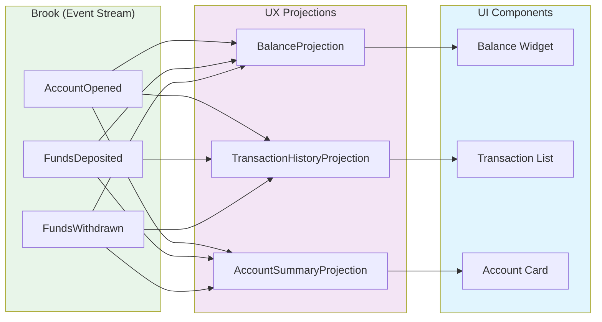
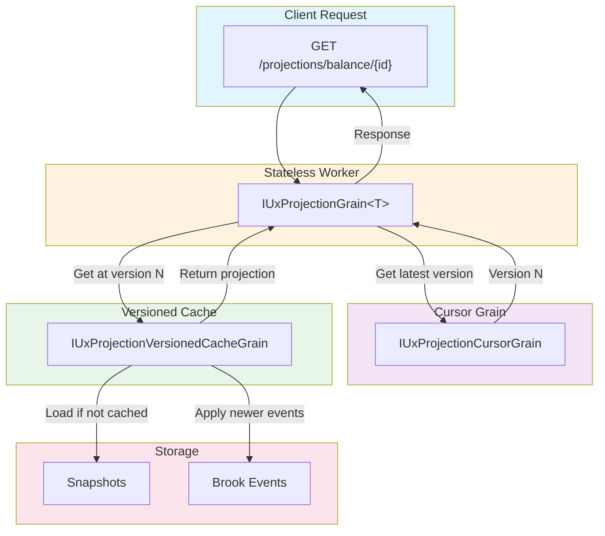
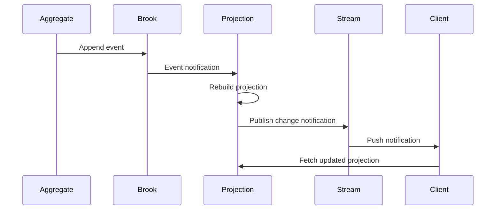

# UX Projections

UX projections are small, composable, read-optimized views of event streams designed specifically for client UI state. They follow the "atomic design" principle applied to data models—many small projections that compose together rather than one large monolithic view.

## Overview

Projections transform event streams into read models optimized for specific UI needs:



## Key Concepts

| Concept | Description |
|---------|-------------|
| **Projection** | A read-optimized view derived from events |
| **Event Reducer** | Transforms events into projection state |
| **Versioned Cache** | Caches projection state at specific versions |
| **Cursor** | Tracks the latest processed event position |

## Why Small Projections?

Mississippi encourages **atomic design for data models**:

| Approach | Description | Trade-off |
|----------|-------------|-----------|
| **Atoms** | Tiny projections (balance only) | Maximum reuse, minimal payload |
| **Molecules** | Composed projections (balance + holder) | Balanced |
| **Organisms** | Page-level compositions | Convenience, larger payloads |

### Benefits of Small Projections

1. **Independent updates** — Only affected projections rebuild when events change
2. **Efficient caching** — Small payloads cache better
3. **Composable UI** — Components fetch exactly what they need
4. **Parallel loading** — Multiple small requests can parallelize

### Anti-Pattern: Monolithic Projections

```csharp
// ❌ Bad: One projection for everything
public sealed record AccountEverythingProjection
{
    public decimal Balance { get; init; }
    public string HolderName { get; init; }
    public List<Transaction> AllTransactions { get; init; }
    public List<Statement> AllStatements { get; init; }
    public AccountSettings Settings { get; init; }
    public List<LinkedAccount> LinkedAccounts { get; init; }
    // ... every field the UI might ever need
}

// ✅ Good: Focused projections for specific UI needs
public sealed record BalanceProjection { ... }
public sealed record TransactionListProjection { ... }
public sealed record AccountSettingsProjection { ... }
```

## Defining a Projection

A projection is a record decorated with the required attributes:

```csharp
using Mississippi.EventSourcing.Brooks.Abstractions.Attributes;
using Mississippi.Inlet.Generators.Abstractions;
using Mississippi.Inlet.Projection.Abstractions;
using Orleans;

[ProjectionPath("bank-account-balance")]
[BrookName("MYAPP", "BANKING", "ACCOUNT")]
[SnapshotStorageName("MYAPP", "BANKING", "ACCOUNTBALANCE")]
[GenerateProjectionEndpoints]
[GenerateSerializer]
[Alias("MyApp.Domain.Projections.BankAccountBalanceProjection")]
public sealed record BankAccountBalanceProjection
{
    [Id(0)]
    public decimal Balance { get; init; }

    [Id(1)]
    public string HolderName { get; init; } = string.Empty;

    [Id(2)]
    public bool IsOpen { get; init; }
}
```

### Required Attributes

| Attribute | Purpose |
|-----------|---------|
| `[ProjectionPath]` | URL path for the generated API endpoint |
| `[BrookName]` | Source event stream to project from |
| `[SnapshotStorageName]` | Where projection snapshots are stored |
| `[GenerateProjectionEndpoints]` | Enables source generation for API endpoints |
| `[GenerateSerializer]` | Orleans serialization support |
| `[Alias]` | Stable type name for serialization |

## Implementing Projection Reducers

Projection reducers transform events into projection state. They are identical to aggregate reducers but target the projection type:

```csharp
using Mississippi.EventSourcing.Reducers.Abstractions;

internal sealed class AccountOpenedBalanceReducer
    : EventReducerBase<AccountOpened, BankAccountBalanceProjection>
{
    protected override BankAccountBalanceProjection ReduceCore(
        BankAccountBalanceProjection state,
        AccountOpened @event)
    {
        return state with
        {
            HolderName = @event.HolderName,
            Balance = @event.InitialDeposit,
            IsOpen = true,
        };
    }
}

internal sealed class FundsDepositedBalanceReducer
    : EventReducerBase<FundsDeposited, BankAccountBalanceProjection>
{
    protected override BankAccountBalanceProjection ReduceCore(
        BankAccountBalanceProjection state,
        FundsDeposited @event)
    {
        return state with
        {
            Balance = state.Balance + @event.Amount,
        };
    }
}

internal sealed class FundsWithdrawnBalanceReducer
    : EventReducerBase<FundsWithdrawn, BankAccountBalanceProjection>
{
    protected override BankAccountBalanceProjection ReduceCore(
        BankAccountBalanceProjection state,
        FundsWithdrawn @event)
    {
        return state with
        {
            Balance = state.Balance - @event.Amount,
        };
    }
}
```

## Projection Grain Architecture

UX projections use a multi-grain architecture for scalability:



### Grain Responsibilities

| Grain | Responsibility |
|-------|----------------|
| `IUxProjectionGrain<T>` | Stateless worker entry point, coordinates reads |
| `IUxProjectionCursorGrain` | Tracks latest event position for the projection |
| `IUxProjectionVersionedCacheGrain` | Caches projection at specific versions |

## Reading Projections

### Via Generated API Endpoints

With `[GenerateProjectionEndpoints]`, an API endpoint is generated:

```http
GET /projections/bank-account-balance/{entityId}
```

### Via Orleans Grain Factory

```csharp
public class MyService
{
    private IUxProjectionGrainFactory ProjectionFactory { get; }

    public MyService(IUxProjectionGrainFactory projectionFactory)
    {
        ProjectionFactory = projectionFactory;
    }

    public async Task<BankAccountBalanceProjection?> GetBalanceAsync(
        string accountId,
        CancellationToken cancellationToken)
    {
        var grain = ProjectionFactory.GetGrain<BankAccountBalanceProjection>(accountId);
        return await grain.GetAsync(cancellationToken);
    }

    public async Task<BankAccountBalanceProjection?> GetBalanceAtVersionAsync(
        string accountId,
        BrookPosition version,
        CancellationToken cancellationToken)
    {
        var grain = ProjectionFactory.GetGrain<BankAccountBalanceProjection>(accountId);
        return await grain.GetAtVersionAsync(version, cancellationToken);
    }
}
```

## Versioned Reads

Projections support versioned reads for consistency:

```csharp
// Get latest version number
var version = await grain.GetLatestVersionAsync(cancellationToken);

// Get projection at specific version
var projection = await grain.GetAtVersionAsync(version, cancellationToken);
```

This enables:

- **Consistent reads** — Multiple components see the same version
- **Optimistic concurrency** — Detect if data changed between reads
- **Cache-friendly** — Same version always returns same data

## Live Updates

Projections publish change notifications via Orleans streams. See [Inlet](./inlet.md) for how clients subscribe to live updates.



## Folder Structure

Organize projections by read model:

```text
Domain/
└── Projections/
    └── BankAccountBalance/
        ├── BankAccountBalanceProjection.cs
        └── Reducers/
            ├── AccountOpenedBalanceReducer.cs
            ├── FundsDepositedBalanceReducer.cs
            └── FundsWithdrawnBalanceReducer.cs
```

## Registration

Register projection components in your silo:

```csharp
// In Silo configuration
siloBuilder.ConfigureServices(services =>
{
    // Register UX projection infrastructure
    services.AddUxProjections();

    // Register event reducers for projections
    services.AddEventReducer<AccountOpenedBalanceReducer, BankAccountBalanceProjection>();
    services.AddEventReducer<FundsDepositedBalanceReducer, BankAccountBalanceProjection>();
    services.AddEventReducer<FundsWithdrawnBalanceReducer, BankAccountBalanceProjection>();
});
```

## Best Practices

### Design for Specific UI Needs

Each projection should serve a specific UI purpose:

```csharp
// ✅ Good: Focused projections
[ProjectionPath("account-balance")]
public sealed record BalanceProjection
{
    public decimal Balance { get; init; }
}

[ProjectionPath("account-header")]
public sealed record AccountHeaderProjection
{
    public string HolderName { get; init; }
    public bool IsOpen { get; init; }
}

// UI composes what it needs
var balance = await balanceGrain.GetAsync();
var header = await headerGrain.GetAsync();
```

### Share Event Reducers When Appropriate

If multiple projections need the same event handling, consider shared reducers:

```csharp
// Shared reducer logic in a base class or helper
internal static class BalanceReducerHelpers
{
    public static decimal ApplyDeposit(decimal current, FundsDeposited @event)
        => current + @event.Amount;

    public static decimal ApplyWithdrawal(decimal current, FundsWithdrawn @event)
        => current - @event.Amount;
}
```

### Keep Projections Immutable

Always use `with` expressions to create new projection instances:

```csharp
// ✅ Correct
return state with { Balance = state.Balance + @event.Amount };

// ❌ Wrong - never mutate
state.Balance += @event.Amount;
return state;
```
