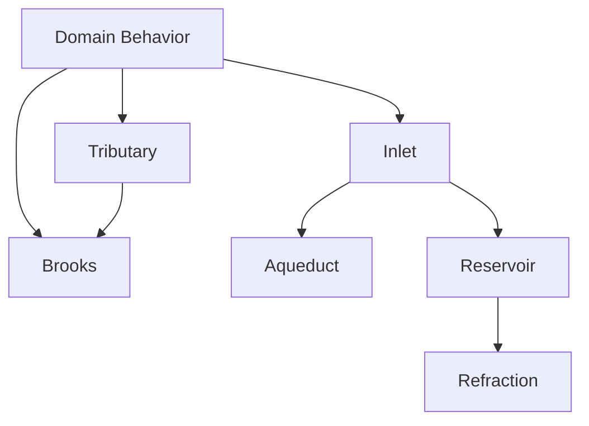

# Package And Subsystem Map

## Overview

Mississippi is one application model assembled from package families with
explicit responsibilities. Use this reference when you need to identify the
package that owns a concern or evaluate one area independently.

The names describe positions in the flow of state. They are not separate
frameworks, and applications do not need to adopt every subsystem independently.

## Responsibilities And Packages

| Subsystem | Responsibility | Representative Packages |
| --- | --- | --- |
| Domain Modeling | Aggregates, command handling, effects, sagas, and UX projections | `Mississippi.DomainModeling.Abstractions`, `Mississippi.DomainModeling.Runtime`, `Mississippi.DomainModeling.Gateway`, `Mississippi.DomainModeling.TestHarness` |
| Tributary | Reducer execution, state reconstruction, snapshots, and storage seams | `Mississippi.Tributary.Abstractions`, `Mississippi.Tributary.Runtime`, `Mississippi.Tributary.Runtime.Storage.Abstractions`, `Mississippi.Tributary.Runtime.Storage.Cosmos` |
| Brooks | Ordered event streams, cursors, persistence contracts, and serialization | `Mississippi.Brooks.Abstractions`, `Mississippi.Brooks.Runtime`, `Mississippi.Brooks.Serialization.Abstractions`, `Mississippi.Brooks.Serialization.Json` |
| Inlet | Generated gateway, runtime, client, subscription, and MCP surfaces | `Mississippi.Inlet.Abstractions`, `Mississippi.Inlet.Client`, `Mississippi.Inlet.Gateway`, `Mississippi.Inlet.Runtime` |
| Aqueduct | Orleans-backed SignalR connection, group, user, and server routing | `Mississippi.Aqueduct.Abstractions`, `Mississippi.Aqueduct.Gateway`, `Mississippi.Aqueduct.Runtime` |
| Reservoir | Actions, reducers, effects, selectors, middleware, and client-state testing | `Mississippi.Reservoir.Abstractions`, `Mississippi.Reservoir.Core`, `Mississippi.Reservoir.Client`, `Mississippi.Reservoir.TestHarness` |
| Refraction | Blazor components, design tokens, and state-connected scenes | `Mississippi.Refraction.Abstractions`, `Mississippi.Refraction.Client`, `Mississippi.Refraction.Client.StateManagement` |

## Dependency Direction

The domain-facing layers build on the event and reduction layers. Delivery and
client subsystems carry projections from the runtime into user interfaces.

The diagram shows dependency direction, not a required deployment topology.

## Choose A Reader Path

- Start with [Concepts](../concepts/index.md) when you need to understand how the
  package families compose into one runtime model.
- Use [Mississippi Client Setup](../getting-started/mississippi-client.md) when
  you need the complete client registration path built on Inlet and Reservoir.
- Use [Reservoir-Only Client Setup](../getting-started/reservoir-only-client.md)
  when you need client state without the full Mississippi client stack.
- Use [Inlet Client Registration](inlet-client-registration.md) or
  [Reservoir Registration](reservoir-registration.md) for exact public builder
  surfaces.
- Use [Spring Tutorials](../tutorials/spring/index.md) when you want to see the
  package families working together in a composed application.

## Summary

Use subsystem names to identify implementation ownership, not as a prerequisite
for finding documentation. This map consolidates package selection so separate
pages are published only when they contain a real outcome, task, mental model,
or reference contract.

## Next Steps

- [Documentation Overview](../index.md)
- [Architectural Model](../concepts/architectural-model.md)
- [Spring Tutorials](../tutorials/spring/index.md)
- [Glossary](glossary.md)
