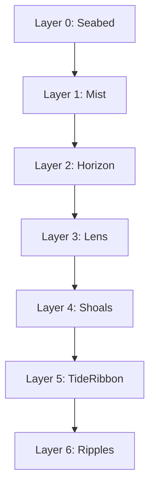
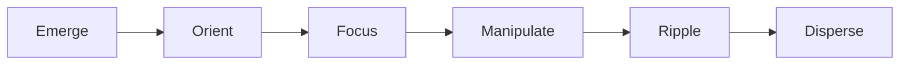

# Refraction Design Language

## Overview

A **light-based interface ecosystem** built from **semi-transparent planes + volumetric overlays**, designed to keep the **physical world visible** while presenting **high-density, high-confidence information**. It implies a future where interfaces are **assembled on demand** from a reconfigurable substrate, so UI feels less like *screens* and more like *conjured instruments*.

## Experience Goals

### Primary Feelings

- **Calm authority**: You feel in control of a complex system without UI noise.
- **Weightlessness**: UI appears, floats, and dissolves with minimal friction—no heavy window chrome.
- **Situational awareness**: The environment remains readable through the UI; overlays avoid blocking the scene.

### Functional Goals

- **Fast orientation**: See the "shape" of the system quickly, then drill into detail.
- **Progressive disclosure**: Most data is ambient until you focus it.
- **Direct manipulation**: Operate on objects/fields rather than navigating menus.

## Non-Negotiable Attributes

These are the traits that, if missing, stop it feeling like the reference.

1. **Transparency-first composition** — Default state is translucent; opacity increases only at the focal plane.
2. **Spatial hierarchy, not window hierarchy** — Importance is expressed via *depth + scale + luminance*, not by stacking opaque panels.
3. **Assembled / reconfigurable UI** — Interface elements appear as if formed from a controllable material and can reconfigure to task.
4. **Hologram-native visuals** — Dense scenes are "filled out" with holographic overlays and set-augmenting graphics.
5. **Cinematic legibility** — Thin luminous edges, restrained palette, and disciplined motion to read at a glance.

## Mental Model

### Core Metaphor

**Information as illuminated geometry in 3D space.**

UI is a **field** (ambient), plus **planes** (work surfaces), plus **volumes** (objects/data).

### Interaction Promise

"Summon what you need, where you need it; dismiss it when done."

This represents technology that has evolved to be intuitive and non-intrusive—interfaces that serve the user without demanding attention.

## Naming Conventions

Refraction uses a **hybrid lexicon** that aligns with the Mississippi water theme while preserving the light-holographic identity:

- **Optics / light** terms for *static UI structures* (surfaces, layers, containers): Lens, Prism, Halo, Spectrum, Caustic
- **Water / flow** terms for *motion, feedback, and state movement*: Current, Ripple, Wake, Drift, Eddy, Surge
- **Nautical / instrumentation** terms for *navigation, markers, measurement*: Buoy, Beacon, Mooring, Bearing, Sounding

This keeps the UI identity "light-holographic" while feeling native alongside **Brooks / Inlet / Reservoir**.

### Semantic Rules

- **Nouns** for components: `Lens`, `Halo`, `Buoy`
- **Verbs** for interactions/actions: `Emerge`, `Coalesce`, `Ripple`
- **Adjectives only as modifiers**, never as primary names: `LensFocused`, `RibbonPinned`

### Collision Avoidance

- Reserve **river-network nouns** (stream, brook, delta) for data/event infrastructure.
- Reserve **container nouns** (reservoir, basin) for storage/state.
- Refraction leans **optics + motion-water**.

### Framework Alignment

Semantic mapping across Mississippi:

| Concept | Refraction Term | Infrastructure Term |
| --- | --- | --- |
| User intent | **Ripples** (UI events) | Enter via **Inlet** |
| State changes | **Wakes** (visible changes) | Stored in **Reservoir** |
| Domain events | — | Flow through **Brooks** |
| Metrics/readouts | **Soundings** | — |

## Spatial Hierarchy

Use depth as your primary hierarchy mechanism. Treat these as z-layers with distinct rules.

| Layer | Canonical Name | Role | Typical Opacity | Typical Motion |
| --- | --- | --- | --- | --- |
| 0 | **Seabed** | Reality / app background; always visible | N/A | N/A |
| 1 | **Mist** | Ambient coordinate haze; low contrast | Very low | Slow drift (Current) |
| 2 | **Horizon** | Persistent system status; rings/arcs/readouts | Low | Subtle pulses |
| 3 | **Lens** | Primary working surface; one at a time | Medium | Stable, anchored |
| 4 | **Shoals** | 3D/volumetric objects; anchored with parallax | Low–medium | Parallax + Gyre |
| 5 | **TideRibbon** | Progressive disclosure panels; never dominate | Low–medium | Slide/fade in |
| 6 | **Ripples** | Transient micro-UI: tooltips, confirms, warnings | Variable | Quick, crisp |

## Visual Grammar

### Color Philosophy

- **Primary hue family**: Cool blue/cyan with white highlights (the "light UI" identity).
- **Accents**:
  - **Warning**: Warm amber/orange for attention (use sparingly).
  - **Critical**: Red reserved for hazards / hard stops.
- **Lighting rule**: Edges emit; fills whisper. Avoid heavy filled rectangles.

### Transparency and Contrast

- Use **local contrast plates** behind text (soft darkening or brightening patches) rather than global opaque panels.
- Text never sits directly on the world without a readability strategy (contrast plate, blur-behind, or halo).

**Contrast requirements:**

- Normal text: **≥ 4.5:1** (AA)
- Non-text UI boundaries/meaningful graphics: **≥ 3:1** (AA)

### Geometry Grammar

- **Stroke-first**: Thin lines, ticks, arcs, rings, and wireframes dominate.
- **Corners**: Slightly rounded or chamfered; consistent radii.
- **Frames**: Content is often "held" by partial frames (not full boxes) to keep it airy.
- **Measurement language**: Dimension lines, anchors, and tethers imply precision.

| Property | Value |
| --- | --- |
| Hairline stroke | 1px |
| Standard stroke | 1.5px |
| Emphasis stroke | 2px |
| Micro element radius | 6–10px |
| Plane/panel radius | 14–20px |

### Typography Philosophy

- **Short labels** (2–4 words), **command verbs**, and **unit-first numbers** (e.g., `12.4 km`, `0.83 s`).
- Prefer **tabular numerals** and consistent alignment for instrument-like readability.
- Uppercase/small caps can work, but prioritize legibility over "techy" styling.

## Motion Philosophy

This style is sold more by *motion discipline* than by ornament.

### Motion Vocabulary

Use Refraction-native verbs in docs and code so motion becomes a shared language:

| Generic Motion | Refraction Verb | Usage |
| --- | --- | --- |
| Materialize | **Emerge** | Panels appear from locus |
| Assemble | **Coalesce** | Lines → nodes → labels |
| Orbit | **Gyre** | Slow contextual rotation |
| Scan | **Sweep** or **Sonar** | Analysis/refresh pass |
| Tether | **Moor** | Callout line grows from anchor |
| Confirm pulse | **Ripple** | Commit feedback |
| Dissolve | **Disperse** | Fade + decompose |
| Background drift | **Current** | Ambient motion baseline |

### Motion Rules

- **Current** (ambient motion) is slow; interactive motion is quick and crisp.
- Reduce background motion when a Lens is focused.
- No constant "busy" animation.

### Timing Tiers

| Tier | Duration | Usage |
| --- | --- | --- |
| Micro | 80–120ms | Micro-interactions, hovers |
| Panel | 160–240ms | Panel transitions |
| Scene | 280–420ms | Major view changes |
| Current | 2–8s cycles | Ambient background motion |

## Interaction Grammar

### The Canonical Loop

Emerge → Orient → Focus → Manipulate → Ripple → Disperse

### Emerge (Summon)

UI originates from a **locus** (hand/desk/console region) rather than appearing center-screen.

### Orient

Show a **high-level structure view** first (Horizon + Mist establish context).

### Focus

Selecting an object increases **opacity + luminance**, reduces background motion, and a single Lens becomes dominant.

### Manipulate

Objects are anchored (Buoy, MooringLine) and adjusted in place:

- Drag to reposition planes
- Pinch/expand to scale
- Rotate to re-orient volumes
- Scrub along a TideRibbon/timeline to inspect states

### Ripple (Commit)

A Ripple confirms; state changes without modal interruption.

### Disperse (Release)

Panels Disperse back to Mist, returning attention to the world.

### Visual State Model

| State | Characteristics |
| --- | --- |
| Idle | Low opacity, slow Current |
| Hover/Pre-focus | Slight halo, increased local contrast |
| Focused | Higher opacity, crisp edges, background de-emphasized |
| Active editing | Persistent anchors + snapping guides |
| Disabled | Dim + reduced motion (never remove structure) |
| Alert | Beacon/pulse, not flashing chaos |

## Anti-Patterns

Avoid:

- Large opaque rectangles that occlude context
- Overfilled panels; too many saturated colors
- Heavy borders/shadows that break the "light geometry" feel
- Constant animation that creates fatigue
- Text without a readability strategy (plate/halo/blur-behind)

## Validation Checklist

### Visual

- [ ] World remains readable behind UI (no giant opaque slabs)
- [ ] Thin strokes dominate; fills are minimal
- [ ] Accents (amber/red) are rare and meaningful
- [ ] Text always has a readability strategy

### Motion

- [ ] Emerge/Disperse patterns repeat consistently
- [ ] Ambient motion (Current) is slow; interactive motion is quick and crisp
- [ ] No constant "busy" animation

### UX

- [ ] One clear Lens at a time
- [ ] Progressive disclosure via TideRibbons, not popups
- [ ] Ripple confirms quietly; errors are clear but not noisy

### Accessibility

- [ ] Normal text meets ≥4.5:1 contrast
- [ ] UI boundaries/meaningful graphics meet ≥3:1 contrast
- [ ] Translucent/blurred composites tested for contrast failures

## Summary

The Refraction design language defines a light-based interface ecosystem built from semi-transparent planes and volumetric overlays. It uses a hybrid lexicon of optics/light terms for static structures, water/flow terms for motion, and nautical/instrumentation terms for navigation. Key principles include transparency-first composition, spatial hierarchy via depth layers (Seabed → Mist → Horizon → Lens → Shoals → TideRibbon → Ripples), assembled/reconfigurable UI, and cinematic legibility.

## Next Steps

- See the [Implementation Guide](./implementation.md) for tokens, CSS variables, and code patterns.
- See the [Component Roadmap](./component-roadmap.md) for the planned component list and catalog.

