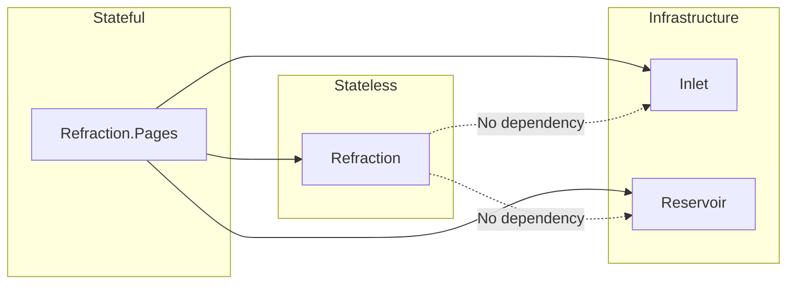
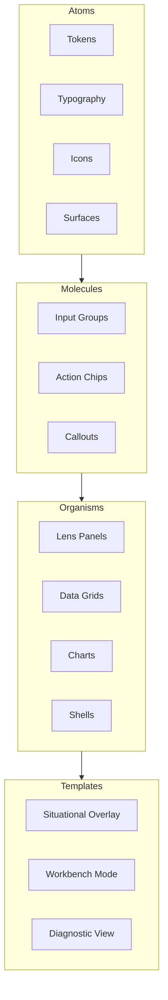

# Refraction Implementation Guide

## Overview

This guide covers the technical implementation of the Refraction design language in Blazor. It defines tokens, CSS variables, atomic design structure, and platform constraints. For the holistic design philosophy and visual grammar, see the [Design Language](./design-language.md) page.

## Project Structure

Refraction is split into two projects with distinct responsibilities:

### Refraction (Stateless Components)

The `Refraction` project contains **presentation-only components** with no infrastructure dependencies.

| Characteristic | Description |
| --- | --- |
| **State** | Stateless; all data passed via parameters |
| **Dependencies** | None on Inlet, Reservoir, or other Mississippi infrastructure |
| **Responsibility** | Render UI; emit events via `EventCallback` |
| **Testing** | Pure bUnit tests; no mocking of infrastructure |

Components in this project are "dumb" — they display what they're given and notify parents of interactions.

```csharp
// Example: Stateless Lens component in Refraction project
public partial class Lens : ComponentBase
{
    [Parameter] public RenderFragment? ChildContent { get; set; }
    [Parameter] public LensState State { get; set; }
    [Parameter] public EventCallback<LensState> StateChanged { get; set; }
}
```

### Refraction.Pages (Stateful Page Components)

The `Refraction.Pages` project contains **top-level page components** that integrate with Mississippi infrastructure.

| Characteristic | Description |
| --- | --- |
| **State** | Stateful; connects to Reservoir for state/store |
| **Dependencies** | Inlet (command submission), Reservoir (state subscription) |
| **Responsibility** | Orchestrate state; dispatch commands; compose stateless components |
| **Testing** | Integration tests with mocked Inlet/Reservoir |

Components in this project are "smart" — they manage state, submit commands, and pass data down to stateless components.

```csharp
// Example: Stateful page component in Refraction.Pages project
public partial class OrderDashboardPage : ComponentBase
{
    [Inject] private IReservoirStore<OrderState> Store { get; set; } = default!;
    [Inject] private IInletDispatcher Dispatcher { get; set; } = default!;

    private OrderState State => Store.State;

    private async Task HandleOrderAction(OrderAction action)
    {
        await Dispatcher.DispatchAsync(new ProcessOrderCommand(action));
    }
}
```

### Project Dependency Flow



### Choosing the Right Project

| Scenario | Project | Reason |
| --- | --- | --- |
| Button, input, card, panel | **Refraction** | Pure presentation; no state |
| Data grid (display only) | **Refraction** | Receives data via parameter |
| Dashboard page with live data | **Refraction.Pages** | Subscribes to Reservoir state |
| Form that submits commands | **Refraction.Pages** | Dispatches via Inlet |
| Reusable chart component | **Refraction** | Data passed in; events out |
| Order management page | **Refraction.Pages** | Orchestrates state and commands |

## Platform Constraints

Refraction is built with enterprise Blazor applications in mind.

### Blazor-Native by Default

- All components are **Razor + .NET**; no consumer-facing JavaScript.
- Any JS dependencies (e.g., charting libraries) are fully encapsulated behind Blazor-first components.
- Consumers must not write JS and must not depend on JS types.

### Mobile-First

- Every component must be **touch-friendly** and **small-screen viable**.
- Dense desktop components must have a purpose-built mobile mode (not scaled down).
- Responsive breakpoints use standard mobile/tablet/desktop tiers.

### Enterprise Quality

| Requirement | Description |
| --- | --- |
| **Accessibility** | WCAG 2.2 AA compliance; keyboard navigation; screen reader support |
| **Performance** | Virtualization for large lists; lazy loading; minimal re-renders |
| **Internationalization** | i18n-ready; RTL support; locale-aware formatting |
| **Testability** | Components expose testable APIs; integration with bUnit |
| **Theming** | CSS custom properties; dark/light theme support |
| **Documentation** | Complete API docs; usage examples; design rationale |

## Atomic Design Structure

Refraction uses an atomic design methodology to organize components from primitives to compositions. This approach builds complexity progressively: atoms combine into molecules, molecules into organisms, and organisms into templates.



### Atoms (Primitives)

The foundational building blocks that cannot be broken down further.

| Category | Examples |
| --- | --- |
| **Tokens** | Color, spacing, elevation, timing values |
| **Typography** | Font families, sizes, weights, scales |
| **Icons** | System iconography (line-based, luminous) |
| **Surfaces** | Basic translucent planes, contrast plates |

### Molecules (Composed Inputs)

Small composites that combine atoms into functional units.

| Category | Examples |
| --- | --- |
| **Input Groups** | Labeled text fields, search boxes |
| **Action Chips** | Command capsules with verb labels |
| **Callouts** | MooringLine + label combinations |
| **Soundings** | Numeric displays with units |

### Organisms (Complex Controls)

Feature-complete components that deliver significant functionality.

| Category | Examples |
| --- | --- |
| **Lens Panels** | Primary working surfaces with state management |
| **Data Grids** | Virtualized tables with sorting/filtering |
| **Charts** | Data visualization components |
| **Shells** | Application frames with navigation |
| **TideRibbons** | Progressive disclosure panels |

### Templates and Pages

Reference compositions that demonstrate how organisms combine.

| Template | Purpose |
| --- | --- |
| **Situational Overlay** | Awareness mode with minimal intervention |
| **Workbench Mode** | Precise configuration and planning |
| **Diagnostic View** | Root-cause analysis and investigation |

## Token Architecture

### Namespace Convention

All Refraction tokens use the `rf.*` namespace in code and `--rf-*` prefix in CSS.

```text
rf.spectrum.cyan.500    → --rf-spectrum-cyan-500
rf.veil.focus           → --rf-veil-focus
rf.flow.panel           → --rf-flow-panel
```

### Token Families

| Family | Namespace | Purpose |
| --- | --- | --- |
| **Spectrum** | `rf.spectrum.*` | Color palette (background, surface, text, accents) |
| **Radiance** | `rf.radiance.*` | Glow and emission intensity |
| **Veil** | `rf.veil.*` | Opacity, blur, and frosting values |
| **Depth** | `rf.depth.*` | Z-index, elevation, parallax |
| **Flow** | `rf.flow.*` | Timing, easing, motion curves |
| **Signal** | `rf.signal.*` | Semantic states (ok, attention, critical) |

### Token Key Examples

```text
rf.spectrum.cyan.050 … 950
rf.spectrum.bg / surface1 / surface2 / border / text / textMuted / ghost

rf.radiance.edge.soft / edge.strong / bloom.subtle

rf.veil.ambient / veil.readable / veil.focus / veil.solid

rf.depth.mist / depth.horizon / depth.lens / depth.foreground

rf.flow.micro / flow.panel / flow.scene / flow.current

rf.signal.ok / signal.attn / signal.critical
```

## Color System

### Shared Accent Palette (Spectrum)

Used in both dark and light themes.

| Token | Hex | Usage |
| --- | --- | --- |
| `spectrum.cyan.500` | `#00C8FF` | Glow, focus outlines, highlights |
| `spectrum.cyan.300` | `#5EEBFF` | Hover glow, secondary highlights |
| `spectrum.cyan.700` | `#0077A8` | Accent text/icons on light theme |
| `spectrum.white` | `#EAF6FF` | Bright edges/text on dark theme |
| `signal.ok` | `#2BE4A7` | Success confirmations (minimal) |
| `signal.attn` | `#FFB020` | Warnings (rare, meaningful) |
| `signal.critical` | `#FF3B3B` | Critical stops (very rare) |

### Dark Theme (Default)

| Token | Hex | Notes |
| --- | --- | --- |
| `spectrum.bg` | `#05070B` | Near-black, cool bias |
| `spectrum.surface1` | `#0B1220` | Primary plane base |
| `spectrum.surface2` | `#0F1A2B` | Secondary panels/ribbons |
| `spectrum.border` | `#163349` | Low-contrast line support |
| `spectrum.text` | `#E9F2FF` | Primary text |
| `spectrum.textMuted` | `#B6C6DA` | Secondary text |
| `spectrum.ghost` | `#7AA6C3` | Ambient labels/ticks |

**Veil tiers (dark):**

| Token | Value |
| --- | --- |
| `veil.ambient` | 0.06 |
| `veil.readable` | 0.14 |
| `veil.focus` | 0.28 |
| `veil.solid` | 0.62 |

### Light Theme

| Token | Hex | Notes |
| --- | --- | --- |
| `spectrum.bg` | `#F6FAFF` | Cool off-white |
| `spectrum.surface1` | `#FFFFFF` | Primary plane base |
| `spectrum.surface2` | `#EDF6FF` | Secondary panels/ribbons |
| `spectrum.border` | `#B7D4E8` | Thin linework |
| `spectrum.text` | `#0B1020` | Primary text |
| `spectrum.textMuted` | `#2A3A52` | Secondary text |
| `spectrum.ghost` | `#4B6E8A` | Ambient labels/ticks |

**Veil tiers (light):**

| Token | Value |
| --- | --- |
| `veil.ambient` | 0.04 |
| `veil.readable` | 0.10 |
| `veil.focus` | 0.18 |
| `veil.solid` | 0.78 |

### Usage Rules

- On **light theme**, do not use `spectrum.cyan.500` for small text; reserve it for glow/outlines. Use `spectrum.cyan.700` or `spectrum.text` for accent text/icons to maintain [contrast targets](https://www.w3.org/WAI/WCAG22/Understanding/contrast-minimum.html).
- Treat all token values as starting points; validate contrast after applying veil, blur-behind, and real backgrounds.

### CSS Token Definitions

```css
:root[data-theme="dark"] {
  /* Spectrum */
  --rf-spectrum-bg: #05070B;
  --rf-spectrum-surface1: #0B1220;
  --rf-spectrum-surface2: #0F1A2B;
  --rf-spectrum-border: #163349;
  --rf-spectrum-text: #E9F2FF;
  --rf-spectrum-text-muted: #B6C6DA;
  --rf-spectrum-ghost: #7AA6C3;

  --rf-spectrum-cyan-500: #00C8FF;
  --rf-spectrum-cyan-300: #5EEBFF;
  --rf-spectrum-cyan-700: #0077A8;
  --rf-spectrum-white: #EAF6FF;

  /* Signal */
  --rf-signal-ok: #2BE4A7;
  --rf-signal-attn: #FFB020;
  --rf-signal-critical: #FF3B3B;

  /* Veil */
  --rf-veil-ambient: 0.06;
  --rf-veil-readable: 0.14;
  --rf-veil-focus: 0.28;
  --rf-veil-solid: 0.62;

  /* Flow */
  --rf-flow-micro: 100ms;
  --rf-flow-panel: 200ms;
  --rf-flow-scene: 350ms;
  --rf-flow-current: 4s;

  /* Radiance */
  --rf-radiance-edge-soft: 0 0 4px var(--rf-spectrum-cyan-500);
  --rf-radiance-edge-strong: 0 0 8px var(--rf-spectrum-cyan-500);
  --rf-radiance-bloom: 0 0 16px var(--rf-spectrum-cyan-300);
}

:root[data-theme="light"] {
  /* Spectrum */
  --rf-spectrum-bg: #F6FAFF;
  --rf-spectrum-surface1: #FFFFFF;
  --rf-spectrum-surface2: #EDF6FF;
  --rf-spectrum-border: #B7D4E8;
  --rf-spectrum-text: #0B1020;
  --rf-spectrum-text-muted: #2A3A52;
  --rf-spectrum-ghost: #4B6E8A;

  --rf-spectrum-cyan-500: #00C8FF;
  --rf-spectrum-cyan-300: #5EEBFF;
  --rf-spectrum-cyan-700: #0077A8;
  --rf-spectrum-white: #EAF6FF;

  /* Signal */
  --rf-signal-ok: #2BE4A7;
  --rf-signal-attn: #FFB020;
  --rf-signal-critical: #FF3B3B;

  /* Veil */
  --rf-veil-ambient: 0.04;
  --rf-veil-readable: 0.10;
  --rf-veil-focus: 0.18;
  --rf-veil-solid: 0.78;

  /* Flow */
  --rf-flow-micro: 100ms;
  --rf-flow-panel: 200ms;
  --rf-flow-scene: 350ms;
  --rf-flow-current: 4s;

  /* Radiance */
  --rf-radiance-edge-soft: 0 0 4px var(--rf-spectrum-cyan-700);
  --rf-radiance-edge-strong: 0 0 8px var(--rf-spectrum-cyan-700);
  --rf-radiance-bloom: 0 0 12px var(--rf-spectrum-cyan-500);
}
```

## Typography Tokens

All fonts are from Google Fonts.

### Font Families

| Role | Font | Weight | Link |
| --- | --- | --- | --- |
| Headings / display | Space Grotesk | 600–700 | [Google Fonts](https://fonts.google.com/specimen/Space+Grotesk) |
| Body / UI | Inter | 400–700 | [Google Fonts](https://fonts.google.com/specimen/Inter) |
| Code / numerics | JetBrains Mono | 400–600 | [Google Fonts](https://fonts.google.com/specimen/JetBrains+Mono) |

### Typographic Scale

| Role | Font | Size / Line | Weight | Tracking |
| --- | --- | --- | --- | --- |
| Display | Space Grotesk | 32 / 40 | 700 | -0.01em |
| H1 | Space Grotesk | 24 / 32 | 700 | -0.01em |
| H2 | Space Grotesk | 20 / 28 | 600 | -0.005em |
| Body | Inter | 16 / 24 | 400 | 0 |
| Small | Inter | 13 / 18 | 400 | 0 |
| Micro | Inter | 11 / 16 | 600 | 0.02em |
| Instrument label | Inter | 11 / 16 | 600 | 0.10em (uppercase) |
| Code/Numeric | JetBrains Mono | 13 / 18 | 400–500 | 0 |

### Numeric Formatting Rules

- Prefer tabular numerals where available.
- Right-align numeric columns; keep units consistent (`12.4 km`, `0.83 s`).

## Motion Tokens

### Flow Tokens (Timing)

| Token | Duration | Usage |
| --- | --- | --- |
| `flow.micro` | 80–120ms | Micro-interactions, hovers |
| `flow.panel` | 160–240ms | Panel transitions |
| `flow.scene` | 280–420ms | Major view changes |
| `flow.current` | 2–8s cycles | Ambient background motion |

### Easing Curves

```css
:root {
  --rf-ease-out: cubic-bezier(0.0, 0.0, 0.2, 1);
  --rf-ease-in-out: cubic-bezier(0.4, 0.0, 0.2, 1);
  --rf-ease-spring: cubic-bezier(0.34, 1.56, 0.64, 1);
}
```

### Motion Rules

- **Current** (ambient motion) is slow; interactive motion is quick and crisp.
- Reduce background motion when a Lens is focused.
- No constant "busy" animation.

## Accessibility Requirements

Refraction targets WCAG 2.2 AA compliance:

| Requirement | Target | Notes |
| --- | --- | --- |
| Text contrast | ≥4.5:1 | Normal text against backgrounds |
| Non-text contrast | ≥3:1 | UI boundaries, icons, controls |
| Touch targets | ≥44px | Minimum interactive area |
| Focus indicators | Visible | Keyboard navigation support |
| Motion | Reducible | Respect `prefers-reduced-motion` |

Translucent/blurred glass effects can undermine contrast. Always validate contrast in real composites, not just against solid backgrounds.

## Practical Implementation Notes

### Building a Real UI (Web/App)

- Put text in a **crisp layer** (DOM/native text) and render glow/lines in **GPU-friendly** tech (Canvas/WebGL/SVG) to keep type sharp.
- Use **contrast plates** aggressively; transparency otherwise destroys readability in real scenes.
- Test composites with real backgrounds; token values are starting points.

### Blazor Component Patterns

```csharp
// Component follows DI property pattern
public partial class Lens : ComponentBase
{
    [Parameter]
    public RenderFragment? ChildContent { get; set; }

    [Parameter]
    public LensState State { get; set; } = LensState.Available;

    [Parameter]
    public EventCallback<LensState> StateChanged { get; set; }

    private string CssClass => State switch
    {
        LensState.Focused => "rf-lens rf-lens--focused",
        LensState.Editing => "rf-lens rf-lens--editing",
        _ => "rf-lens"
    };
}
```

### CSS Class Naming

Use BEM-style naming with the `rf-` prefix:

```css
.rf-lens { }
.rf-lens--focused { }
.rf-lens__header { }
.rf-lens__content { }
```

## Summary

This guide provides the technical foundation for implementing Refraction components in Blazor. The token architecture uses `rf.*` namespaces and `--rf-*` CSS variables. Components follow atomic design (Atoms → Molecules → Organisms → Templates) with enterprise quality requirements for accessibility, performance, and testability.

## Next Steps

- Review the [Component Roadmap](./component-roadmap.md) for implementation order and component catalog.
- See the [Design Language](./design-language.md) for holistic concepts and visual grammar.

