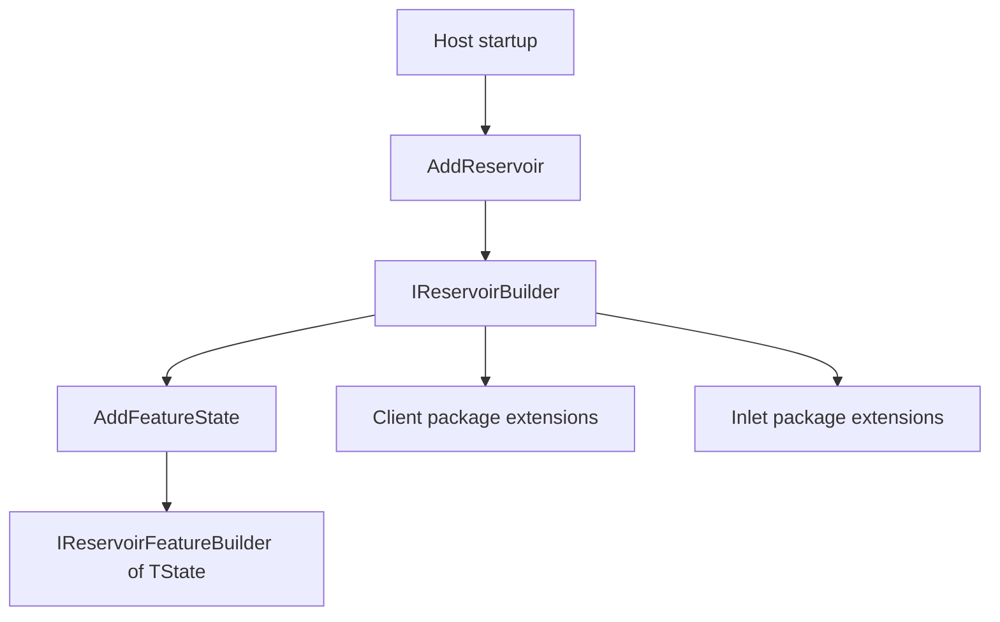

# Reservoir Concepts

## Overview

Reservoir keeps client-side state transitions explicit, predictable, and testable instead of scattering state changes through UI callbacks and transport glue.

Reservoir's main public registration idea is no longer a flat list of unrelated `IServiceCollection` helpers. Reservoir now exposes builders that make startup composition explicit at two levels:

- a top-level builder for host and package composition
- a feature-scoped builder for reducers and action effects

## Builder Model

This diagram shows the current public registration flow.

`IReservoirBuilder` is the top-level public builder. It exists so host code and client packages can compose Reservoir registrations without each package exposing another flat `IServiceCollection` API.

`IReservoirFeatureBuilder<TState>` is the feature-scoped public builder. It exists so a single feature can register reducers and action effects together inside `AddFeatureState<TState>(...)`.

Source code:

- [IReservoirBuilder.cs](https://github.com/Gibbs-Morris/mississippi/blob/main/src/Reservoir.Abstractions/IReservoirBuilder.cs)
- [IReservoirFeatureBuilder.cs](https://github.com/Gibbs-Morris/mississippi/blob/main/src/Reservoir.Abstractions/IReservoirFeatureBuilder.cs)

## Top-Level Builder

The top-level builder is created by `AddReservoir()`.

- `IServiceCollection.AddReservoir()` is the core DI entry point.
- `WebAssemblyHostBuilder.AddReservoir()` is the Blazor WebAssembly entry point and delegates to the core DI entry point.

The top-level builder supports three verified categories of work:

- registering feature state through `AddFeatureState<TState>()`
- registering feature state with reducers and effects through `AddFeatureState<TState>(configure)`
- registering middleware through `AddMiddleware<TMiddleware>()`

## Feature Builder

The feature builder exists only inside the `AddFeatureState<TState>(configure)` callback.

It supports:

- `AddReducer<TAction>(Func<TState, TAction, TState> reduce)`
- `AddReducer<TAction, TReducer>()`
- `AddActionEffect<TEffect>()`

That keeps reducer and effect composition local to the feature state instead of scattering it across startup.

## How It Fits The Stack

Reservoir can still stand alone as a client-state library.

Within Mississippi applications, other client packages now compose on top of the Reservoir builder instead of bypassing it. Inlet is the clearest example: `AddInletClient()`, `AddProjectionPath<T>()`, `AddInletBlazorSignalR(...)`, and `AddSignalRConnectionFeature()` all extend `IReservoirBuilder`.

## What This Area Owns

- Store and dispatch pipeline abstractions
- Feature state, actions, reducers, selectors, effects, and middleware
- Client integration for that state-management model
- The public builder contracts used to compose those registrations

## What This Area Does Not Own

- The Blazor UX component contract itself
- Domain behavior or event-stream persistence

## What This Page Guarantees

- It defines Reservoir as the client-state subsystem responsible for stores, reducers, selectors, effects, middleware, and related integration.
- It identifies the line between Reservoir and neighboring UI or cross-layer composition concerns.
- It documents the builder model that packages now use for registration.

## What This Page Does Not Claim

- Full API-level behavioral reference for the store pipeline
- Performance characteristics or operational guarantees
- Replacement of the preserved deep detail that still lives in the archived docs set

## Trade-Off To Keep In Mind

Reservoir gives you a disciplined state model, and the builder pattern keeps startup composition clearer, but both require applications to adopt the Reservoir vocabulary consistently.

## Summary

Think of Reservoir as the client-state subsystem with a builder-based public registration model: `IReservoirBuilder` composes host-level concerns, and `IReservoirFeatureBuilder<TState>` composes feature-level reducers and effects.

## Next Steps

- [Reservoir Getting Started](../getting-started/getting-started.md)
- [Reservoir Reference](../reference/reference.md)
- [Inlet How To](../../inlet/how-to/how-to.md) for composing Inlet on top of Reservoir builders
