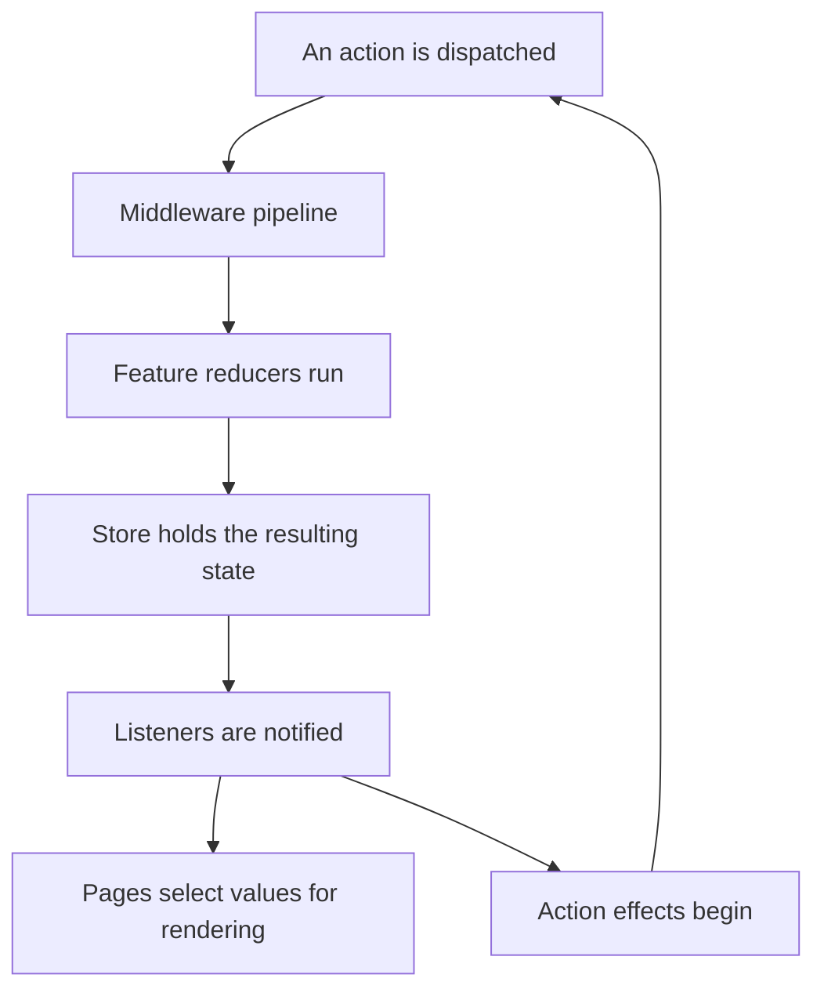

# Reservoir State Flow

## Overview

Reservoir makes local state changes explicit: dispatch an action, apply its reducers, then read the resulting state through selectors. Effects handle asynchronous work by producing further actions.

## The Problem This Solves

A selection or workflow flag often appears on several screens. A named feature state gives those screens a shared source for that local value, while actions record the intent that changed it. Developers and AI assistants can reason about one transition at a time instead of tracing unrelated UI assignments.

## Core Idea

A pure reducer computes the next feature state from the previous state and an action. With the same inputs and implementation, it produces the same result. Keep the state immutable and place external work in effects so each transition remains explainable and testable.

## How It Works

This diagram shows an ordinary action that middleware passes through to the store:

Within a feature, Reservoir applies every matching reducer. Reducers for the exact runtime action type run in registration order, followed by untyped fallback reducers in their own registration order. The final result becomes that feature's state when it is a different, non-null reference.

The store emits `ActionDispatchingEvent` before reduction. It then emits `ActionDispatchedEvent` with the resulting state snapshot after reduction, notifies listeners, and starts effects. `Dispatch` returns `void`; observe asynchronous progress through the actions and state your effects produce. Put request identifiers and required input values in the originating action so the work remains explicit.

## Guarantees

- `AddReservoir()` registers `IStore` with scoped lifetime. Features in the same scope share that store.
- A registered feature is retrieved through its `IFeatureState.FeatureKey`.
- The normal dispatch path runs reduction before listener notification and effect triggering.
- Local reducers can return the current reference for an intentional no-op.
- A normal dispatch notifies subscribers even when no feature reference changes.
- `StoreComponent` subscribes to store notifications and releases that subscription when disposed.

These behaviors are implemented in [Store](https://github.com/Gibbs-Morris/mississippi/blob/main/src/Reservoir.Core/Store.cs), [RootReducer](https://github.com/Gibbs-Morris/mississippi/blob/main/src/Reservoir.Core/RootReducer.cs), [ReservoirRegistrations](https://github.com/Gibbs-Morris/mississippi/blob/main/src/Reservoir.Core/ReservoirRegistrations.cs), and [StoreComponent](https://github.com/Gibbs-Morris/mississippi/blob/main/src/Reservoir.Client/StoreComponent.cs).

## Limits

Keep local state and server-derived state distinct. Use [Inlet](../../inlet/index.md) when the client needs projection subscriptions and refreshes from the server. A Reservoir store's scope is the boundary for its local state.

Deterministic reduction depends on pure functions and immutable inputs. Give overlapping asynchronous operations explicit request identities and result actions; their completion order is a separate concern from the reducer's calculation. Read the relevant current state when deciding how a result should affect the feature.

The store invokes started effects with `CancellationToken.None`. Give cancelable work its own lifetime controls in the effect or service; component disposal releases its store subscription, while effect lifetime is managed separately. Expose expected failures through explicit failure actions: the store boundary catches effect exceptions instead of turning them into feature error state.

System restore/reset actions use the store's dedicated restoration path. Their behavior belongs with development tooling and state restoration rather than the ordinary action pipeline shown above.

## Trade-offs

A feature introduces a few named artifacts—state, actions, reducers, and selectors. That structure gives a reviewable test boundary and reusable display logic. Simple selectors remain inexpensive to read; memoization can reuse a derived result while its input references stay the same.

## Related Tasks and Reference

- [Add a Reservoir feature](../how-to/create-feature.md).
- [Selector reference](../reference/selectors.md).
- [Read models and client sync](../../concepts/read-models-and-client-sync.md).

## Summary

Reservoir organizes local state around explicit inputs and pure transitions. Effects and server synchronization add further inputs to that model, while selectors give screens a consistent way to read it.

## Next Steps

Follow [Add a Reservoir feature](../how-to/create-feature.md) to apply the model in a client.
