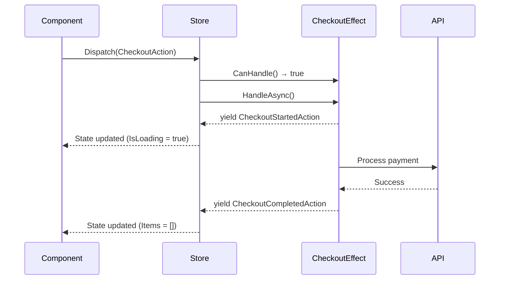
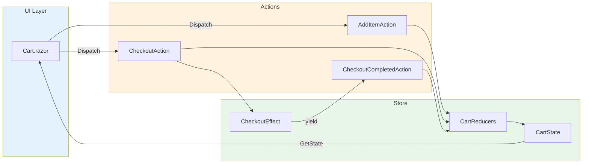

# Getting Started

This guide walks you through building a complete Blazor application with Reservoir state management. You'll create a simple shopping cart that demonstrates all core concepts: actions, reducers, effects, and the store.

## Prerequisites

- .NET 8.0 SDK or later
- A code editor (Visual Studio, VS Code, or Rider)
- Basic familiarity with Blazor

## Create a New Blazor Project

```bash
dotnet new blazorwasm -o ReservoirDemo
cd ReservoirDemo
```

## Install Reservoir Packages

```bash
dotnet add package Mississippi.Reservoir
dotnet add package Mississippi.Reservoir.Blazor
```

## Project Structure

By the end of this guide, your project will have this structure:

```text
ReservoirDemo/
├── Program.cs           # DI registration
├── Features/
│   └── Cart/
│       ├── CartState.cs      # Feature state
│       ├── CartActions.cs    # Actions
│       ├── CartReducers.cs   # Reducers
│       └── CartEffects.cs    # Effects
└── Pages/
    └── Cart.razor            # UI component
```

## Step 1: Define the Feature State

Feature states represent slices of your application state. They must implement `IFeatureState` and provide a unique `FeatureKey`.

Create `Features/Cart/CartState.cs`:

```csharp
using System.Collections.Immutable;
using Mississippi.Reservoir.Abstractions.State;

namespace ReservoirDemo.Features.Cart;

/// <summary>
/// Represents a single item in the shopping cart.
/// </summary>
public sealed record CartItem(string Id, string Name, decimal Price, int Quantity);

/// <summary>
/// The shopping cart feature state.
/// </summary>
public sealed record CartState : IFeatureState
{
    /// <summary>
    /// Gets the unique key identifying this feature in the store.
    /// </summary>
    public static string FeatureKey => "cart";

    /// <summary>
    /// Gets the items currently in the cart.
    /// </summary>
    public ImmutableList<CartItem> Items { get; init; } = [];

    /// <summary>
    /// Gets a value indicating whether the cart is loading data.
    /// </summary>
    public bool IsLoading { get; init; }

    /// <summary>
    /// Gets the error message if the last operation failed.
    /// </summary>
    public string? Error { get; init; }

    /// <summary>
    /// Gets the total price of all items in the cart.
    /// </summary>
    public decimal Total => Items.Sum(item => item.Price * item.Quantity);
}
```

:::tip State Design Best Practices

- Use **immutable records** for automatic value equality
- Use **`init`-only properties** to enable `with` expressions
- Use **immutable collections** like `ImmutableList<T>`
- Provide **sensible defaults** to prevent null reference issues

:::

## Step 2: Define Actions

Actions describe events that occur in your application. They're dispatched to the store and processed by reducers and effects.

Create `Features/Cart/CartActions.cs`:

```csharp
using System.Collections.Immutable;
using Mississippi.Reservoir.Abstractions.Actions;

namespace ReservoirDemo.Features.Cart;

// Command actions (user intents)

/// <summary>
/// Dispatched when the user wants to add an item to the cart.
/// </summary>
/// <param name="Name">The product name.</param>
/// <param name="Price">The product price.</param>
public sealed record AddItemAction(string Name, decimal Price) : IAction;

/// <summary>
/// Dispatched when the user removes an item from the cart.
/// </summary>
/// <param name="ItemId">The ID of the item to remove.</param>
public sealed record RemoveItemAction(string ItemId) : IAction;

/// <summary>
/// Dispatched when the user updates the quantity of an item.
/// </summary>
/// <param name="ItemId">The ID of the item to update.</param>
/// <param name="Quantity">The new quantity.</param>
public sealed record UpdateQuantityAction(string ItemId, int Quantity) : IAction;

/// <summary>
/// Dispatched to clear all items from the cart.
/// </summary>
public sealed record ClearCartAction : IAction;

/// <summary>
/// Dispatched when the user initiates checkout.
/// </summary>
public sealed record CheckoutAction : IAction;

// Event actions (results from effects)

/// <summary>
/// Dispatched when checkout processing begins.
/// </summary>
public sealed record CheckoutStartedAction : IAction;

/// <summary>
/// Dispatched when checkout completes successfully.
/// </summary>
/// <param name="OrderId">The generated order ID.</param>
public sealed record CheckoutCompletedAction(string OrderId) : IAction;

/// <summary>
/// Dispatched when checkout fails.
/// </summary>
/// <param name="Error">The error message.</param>
public sealed record CheckoutFailedAction(string Error) : IAction;
```

:::info Action Naming Conventions

| Pattern | Use Case | Examples |
|---------|----------|----------|
| `{Verb}{Noun}Action` | User commands | `AddItemAction`, `ClearCartAction` |
| `{Noun}{Event}Action` | Effect results | `CheckoutCompletedAction`, `CheckoutFailedAction` |

:::

## Step 3: Implement Reducers

Reducers are pure functions that specify how state changes in response to actions. They must be synchronous and produce no side effects.

Create `Features/Cart/CartReducers.cs`:

```csharp
using System.Collections.Immutable;

namespace ReservoirDemo.Features.Cart;

/// <summary>
/// Contains reducer functions for the shopping cart feature.
/// </summary>
internal static class CartReducers
{
    /// <summary>
    /// Adds a new item to the cart.
    /// </summary>
    public static CartState AddItem(CartState state, AddItemAction action)
    {
        var newItem = new CartItem(
            Id: Guid.NewGuid().ToString("N"),
            Name: action.Name,
            Price: action.Price,
            Quantity: 1);

        return state with { Items = state.Items.Add(newItem) };
    }

    /// <summary>
    /// Removes an item from the cart.
    /// </summary>
    public static CartState RemoveItem(CartState state, RemoveItemAction action)
        => state with
        {
            Items = state.Items.RemoveAll(item => item.Id == action.ItemId)
        };

    /// <summary>
    /// Updates the quantity of an item in the cart.
    /// </summary>
    public static CartState UpdateQuantity(CartState state, UpdateQuantityAction action)
    {
        var updatedItems = state.Items
            .Select(item => item.Id == action.ItemId
                ? item with { Quantity = Math.Max(1, action.Quantity) }
                : item)
            .ToImmutableList();

        return state with { Items = updatedItems };
    }

    /// <summary>
    /// Clears all items from the cart.
    /// </summary>
    public static CartState ClearCart(CartState state, ClearCartAction action)
        => state with { Items = [] };

    /// <summary>
    /// Sets loading state when checkout starts.
    /// </summary>
    public static CartState CheckoutStarted(CartState state, CheckoutStartedAction action)
        => state with { IsLoading = true, Error = null };

    /// <summary>
    /// Clears cart and loading state on successful checkout.
    /// </summary>
    public static CartState CheckoutCompleted(CartState state, CheckoutCompletedAction action)
        => state with { Items = [], IsLoading = false, Error = null };

    /// <summary>
    /// Sets error state when checkout fails.
    /// </summary>
    public static CartState CheckoutFailed(CartState state, CheckoutFailedAction action)
        => state with { IsLoading = false, Error = action.Error };
}
```

:::warning Reducer Rules

1. **Pure functions** — Same input always produces same output
2. **No side effects** — No API calls, logging, or external interactions
3. **Immutable updates** — Always return a new state instance
4. **Synchronous** — No `async`/`await`

:::

## Step 4: Implement Effects

Effects handle asynchronous operations like API calls. They can yield multiple actions over time.

Create `Features/Cart/CartEffects.cs`:

```csharp
using System.Runtime.CompilerServices;
using Mississippi.Reservoir.Abstractions;
using Mississippi.Reservoir.Abstractions.Actions;

namespace ReservoirDemo.Features.Cart;

/// <summary>
/// Handles asynchronous operations for the shopping cart.
/// </summary>
public sealed class CheckoutEffect : IEffect
{
    /// <inheritdoc />
    public bool CanHandle(IAction action) => action is CheckoutAction;

    /// <inheritdoc />
    public async IAsyncEnumerable<IAction> HandleAsync(
        IAction action,
        [EnumeratorCancellation] CancellationToken cancellationToken)
    {
        // Signal that checkout has started
        yield return new CheckoutStartedAction();

        try
        {
            // Simulate API call
            await Task.Delay(1500, cancellationToken);

            // Simulate occasional failures
            if (Random.Shared.NextDouble() < 0.2)
            {
                yield return new CheckoutFailedAction("Payment processing failed. Please try again.");
                yield break;
            }

            // Generate order ID and signal success
            var orderId = $"ORD-{DateTime.UtcNow:yyyyMMdd}-{Random.Shared.Next(1000, 9999)}";
            yield return new CheckoutCompletedAction(orderId);
        }
        catch (OperationCanceledException)
        {
            // Request was cancelled, don't emit any action
            yield break;
        }
        catch (Exception ex)
        {
            yield return new CheckoutFailedAction($"Unexpected error: {ex.Message}");
        }
    }
}
```

The effect lifecycle flows like this:



## Step 5: Register Services

Wire everything together in `Program.cs`:

```csharp
using Microsoft.AspNetCore.Components.Web;
using Microsoft.AspNetCore.Components.WebAssembly.Hosting;
using Mississippi.Reservoir;
using ReservoirDemo;
using ReservoirDemo.Features.Cart;

var builder = WebAssemblyHostBuilder.CreateDefault(args);
builder.RootComponents.Add<App>("#app");
builder.RootComponents.Add<HeadOutlet>("head::after");

builder.Services.AddScoped(_ => new HttpClient
{
    BaseAddress = new Uri(builder.HostEnvironment.BaseAddress)
});

// Register reducers (this also registers the feature state automatically)
builder.Services.AddReducer<AddItemAction, CartState>(CartReducers.AddItem);
builder.Services.AddReducer<RemoveItemAction, CartState>(CartReducers.RemoveItem);
builder.Services.AddReducer<UpdateQuantityAction, CartState>(CartReducers.UpdateQuantity);
builder.Services.AddReducer<ClearCartAction, CartState>(CartReducers.ClearCart);
builder.Services.AddReducer<CheckoutStartedAction, CartState>(CartReducers.CheckoutStarted);
builder.Services.AddReducer<CheckoutCompletedAction, CartState>(CartReducers.CheckoutCompleted);
builder.Services.AddReducer<CheckoutFailedAction, CartState>(CartReducers.CheckoutFailed);

// Register effects
builder.Services.AddEffect<CheckoutEffect>();

// Register the store (after all reducers and effects)
builder.Services.AddReservoir();

await builder.Build().RunAsync();
```

:::note Registration Order

1. Register **reducers** first — each `AddReducer` call automatically registers the feature state
2. Register **effects** — handlers for async operations
3. Register **middleware** (optional) — for logging, analytics, etc.
4. Call **`AddReservoir()`** last — creates the store with all registered components

:::

## Step 6: Create the UI Component

Create `Pages/Cart.razor`:

```razor
@page "/cart"
@inherits StoreComponent

<h1>Shopping Cart</h1>

@if (Cart.IsLoading)
{
    <div class="alert alert-info">
        <span>Processing your order...</span>
    </div>
}

@if (!string.IsNullOrEmpty(Cart.Error))
{
    <div class="alert alert-danger">
        @Cart.Error
    </div>
}

<h2>Add Products</h2>
<div class="mb-3">
    <button class="btn btn-primary me-2" @onclick="@(() => AddProduct("Widget", 9.99m))">
        Add Widget ($9.99)
    </button>
    <button class="btn btn-primary me-2" @onclick="@(() => AddProduct("Gadget", 24.99m))">
        Add Gadget ($24.99)
    </button>
    <button class="btn btn-primary" @onclick="@(() => AddProduct("Gizmo", 14.99m))">
        Add Gizmo ($14.99)
    </button>
</div>

<h2>Cart Items (@Cart.Items.Count)</h2>

@if (Cart.Items.Count == 0)
{
    <p class="text-muted">Your cart is empty.</p>
}
else
{
    <table class="table">
        <thead>
            <tr>
                <th>Product</th>
                <th>Price</th>
                <th>Quantity</th>
                <th>Subtotal</th>
                <th></th>
            </tr>
        </thead>
        <tbody>
            @foreach (var item in Cart.Items)
            {
                <tr>
                    <td>@item.Name</td>
                    <td>@item.Price.ToString("C")</td>
                    <td>
                        <button class="btn btn-sm btn-outline-secondary"
                                @onclick="@(() => UpdateQuantity(item.Id, item.Quantity - 1))"
                                disabled="@(item.Quantity <= 1)">-</button>
                        <span class="mx-2">@item.Quantity</span>
                        <button class="btn btn-sm btn-outline-secondary"
                                @onclick="@(() => UpdateQuantity(item.Id, item.Quantity + 1))">+</button>
                    </td>
                    <td>@((item.Price * item.Quantity).ToString("C"))</td>
                    <td>
                        <button class="btn btn-sm btn-danger"
                                @onclick="@(() => RemoveItem(item.Id))">Remove</button>
                    </td>
                </tr>
            }
        </tbody>
        <tfoot>
            <tr>
                <td colspan="3" class="text-end"><strong>Total:</strong></td>
                <td><strong>@Cart.Total.ToString("C")</strong></td>
                <td></td>
            </tr>
        </tfoot>
    </table>

    <div class="d-flex gap-2">
        <button class="btn btn-outline-danger" @onclick="ClearCart" disabled="@Cart.IsLoading">
            Clear Cart
        </button>
        <button class="btn btn-success" @onclick="Checkout" disabled="@Cart.IsLoading">
            Checkout
        </button>
    </div>
}

@code {
    private CartState Cart => GetState<CartState>();

    private void AddProduct(string name, decimal price)
        => Dispatch(new AddItemAction(name, price));

    private void RemoveItem(string itemId)
        => Dispatch(new RemoveItemAction(itemId));

    private void UpdateQuantity(string itemId, int quantity)
        => Dispatch(new UpdateQuantityAction(itemId, quantity));

    private void ClearCart()
        => Dispatch(new ClearCartAction());

    private void Checkout()
        => Dispatch(new CheckoutAction());
}
```

## Complete Data Flow

Here's how everything connects:



## Run the Application

```bash
dotnet run
```

Navigate to `/cart` to see your shopping cart in action!

## Next Steps

Now that you have a working Reservoir application:

- Learn more about [Actions](./actions.md) and best practices
- Explore [Reducers](./reducers.md) in depth
- Understand [Effects](./effects.md) for async operations
- Dive into the [Store](./store.md) API

## Troubleshooting

### State not updating?

- Ensure your component inherits from `StoreComponent`
- Verify reducers are registered before calling `AddReservoir()`
- Check that your reducer returns a **new** state instance (use `with` expressions)

### Effect not running?

- Verify `CanHandle()` returns `true` for your action type
- Ensure the effect is registered with `AddEffect<T>()`
- Check for exceptions being swallowed — effects should emit error actions

### Feature state not found?

- Make sure at least one reducer is registered for the feature state
- `AddReducer<TAction, TState>()` automatically calls `AddFeatureState<TState>()`
