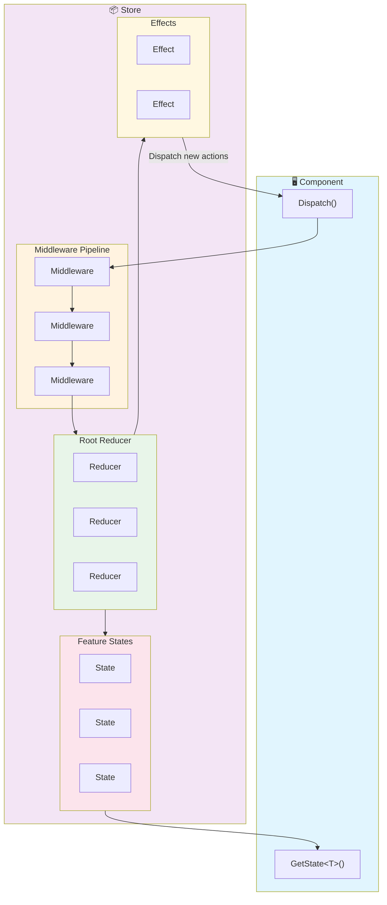

# Reservoir

Reservoir is a Redux-inspired state management library for .NET applications, designed specifically for Blazor WebAssembly and Blazor Server scenarios. It provides a predictable, unidirectional data flow that makes your application state easy to understand, test, and debug.

## Key Concepts

Reservoir follows the Redux pattern with four core concepts:

| Concept | Description |
|---------|-------------|
| **Actions** | Immutable messages that describe what happened or what the user intends |
| **Reducers** | Pure functions that transform state in response to actions |
| **Effects** | Handlers for asynchronous operations like API calls |
| **Store** | The central container that holds application state and coordinates the data flow |

## Data Flow

The following diagram illustrates how data flows through a Reservoir application:



1. **Components dispatch actions** to signal user intent or events.
2. **Middleware** intercepts actions for cross-cutting concerns (logging, analytics).
3. **Reducers** synchronously transform the current state into a new state.
4. **State updates** are stored and subscribers are notified.
5. **Effects** handle asynchronous operations and may dispatch additional actions.
6. **Components re-render** when the state they depend on changes.

## Quick Start

### 1. Install the NuGet packages

```bash
dotnet add package Mississippi.Reservoir
dotnet add package Mississippi.Reservoir.Blazor
```

### 2. Define your feature state

```csharp
using Mississippi.Reservoir.Abstractions.State;

public sealed record CounterState : IFeatureState
{
    public static string FeatureKey => "counter";
    
    public int Count { get; init; }
}
```

### 3. Define actions

```csharp
using Mississippi.Reservoir.Abstractions.Actions;

public sealed record IncrementAction : IAction;
public sealed record DecrementAction : IAction;
public sealed record SetCountAction(int Value) : IAction;
```

### 4. Implement reducers and register them

Reducers are registered with the DI container. When you register a reducer, the feature state is automatically registered too:

```csharp
// Program.cs
using Mississippi.Reservoir;

// Using delegate reducers (concise)
builder.Services.AddReducer<IncrementAction, CounterState>(
    (state, action) => state with { Count = state.Count + 1 });

builder.Services.AddReducer<DecrementAction, CounterState>(
    (state, action) => state with { Count = state.Count - 1 });

// Or using class-based reducers (more testable)
builder.Services.AddReducer<SetCountAction, CounterState, SetCountReducer>();
```

For class-based reducers, inherit from `ActionReducerBase`:

```csharp
using Mississippi.Reservoir.Abstractions;

public sealed class SetCountReducer : ActionReducerBase<SetCountAction, CounterState>
{
    public override CounterState Reduce(CounterState state, SetCountAction action)
        => state with { Count = action.Value };
}
```

### 5. Register Reservoir

After registering all your reducers and effects, add the store:

```csharp
// Program.cs
builder.Services.AddReservoir();
```

### 6. Use in Blazor components

```razor
@inherits StoreComponent

<h1>Count: @Counter.Count</h1>
<button @onclick="Increment">+</button>
<button @onclick="Decrement">-</button>

@code {
    private CounterState Counter => GetState<CounterState>();

    private void Increment() => Dispatch(new IncrementAction());
    private void Decrement() => Dispatch(new DecrementAction());
}
```

## When to Use Reservoir

Reservoir is ideal for:

- **Blazor applications** with complex UI state that spans multiple components
- **Applications requiring predictable state management** with clear data flow
- **Scenarios where state changes need to be tracked** for debugging or undo/redo
- **Teams familiar with Redux** patterns from JavaScript/TypeScript ecosystems

For simpler applications with minimal shared state, standard Blazor component state or cascading parameters may be sufficient.

## Next Steps

Explore each concept in depth:

- [Getting Started](./getting-started.md) - Complete walkthrough with a working example
- [Actions](./actions.md) - Define what happens in your application
- [Reducers](./reducers.md) - Specify how state changes in response to actions
- [Effects](./effects.md) - Handle asynchronous operations
- [Store](./store.md) - Manage and access your application state
