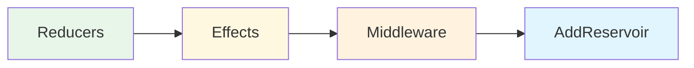
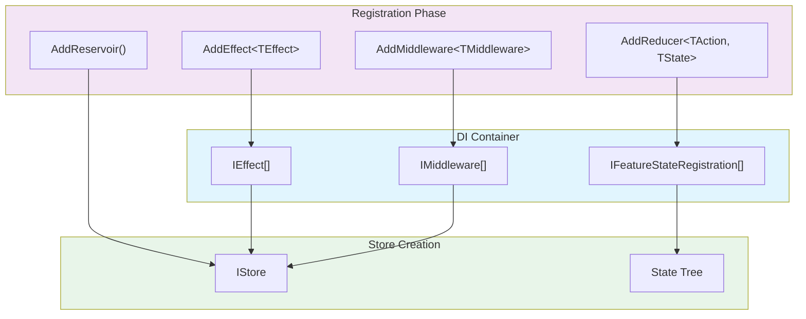

Feature states are the building blocks of your Reservoir application state tree. Each feature state represents an isolated slice of state—such as a shopping cart, user session, or UI settings—that can be managed independently.

## The IFeatureState Interface

All feature states must implement the `IFeatureState` interface:

```csharp
public interface IFeatureState
{
    /// <summary>
    /// Gets the unique key identifying this feature state in the store.
    /// </summary>
    static abstract string FeatureKey { get; }
}
```

The `FeatureKey` is a static abstract property that uniquely identifies the feature state within the store. This key is used internally to organize and access state slices.

## Defining Feature States

Feature states should be defined as immutable records. Records provide value equality semantics, which enables efficient change detection in the store.

### Basic Feature State

```csharp
using Mississippi.Reservoir.Abstractions.State;

public sealed record CounterState : IFeatureState
{
    public static string FeatureKey => "counter";

    public int Count { get; init; }
}
```

### Feature State with Complex Data

```csharp
using System.Collections.Immutable;
using Mississippi.Reservoir.Abstractions.State;

public sealed record CartState : IFeatureState
{
    public static string FeatureKey => "cart";

    public ImmutableList<CartItem> Items { get; init; } = [];
    public decimal Total { get; init; }
    public bool IsLoading { get; init; }
    public string? ErrorMessage { get; init; }
}

public sealed record CartItem(string ProductId, string Name, decimal Price, int Quantity);
```

### Feature State with Nested Records

```csharp
using Mississippi.Reservoir.Abstractions.State;

public sealed record UserSessionState : IFeatureState
{
    public static string FeatureKey => "userSession";

    public UserInfo? CurrentUser { get; init; }
    public bool IsAuthenticated { get; init; }
    public DateTimeOffset? LastActivity { get; init; }
}

public sealed record UserInfo(string Id, string DisplayName, string Email);
```

## State Immutability

Feature states must be immutable. Never mutate state directly—always create new instances using the `with` expression:

```csharp
// ✅ Correct: Create a new state instance
var newState = currentState with { Count = currentState.Count + 1 };

// ❌ Wrong: Never mutate state directly
// currentState.Count++;  // This won't compile with init-only properties
```

For collections, use immutable collection types from `System.Collections.Immutable`:

```csharp
// ✅ Correct: Use immutable collections
public ImmutableList<CartItem> Items { get; init; } = [];

// Adding an item creates a new list
var newState = state with { Items = state.Items.Add(newItem) };

// Removing an item
var newState = state with { Items = state.Items.Remove(item) };

// Updating an item
var newState = state with {
    Items = state.Items.Replace(oldItem, newItem)
};
```

## Feature State Registration

Feature states are automatically registered when you add reducers for them. The `AddReducer` extension method handles both reducer and state registration:

```csharp
// Program.cs
builder.Services.AddReducer<IncrementAction, CounterState>(
    (state, action) => state with { Count = state.Count + 1 });

// This automatically:
// 1. Registers the reducer
// 2. Registers the feature state
// 3. Sets up the root reducer for the state
```

### Explicit State Registration

For feature states that have no reducers (read-only or externally managed state), register them explicitly:

```csharp
builder.Services.AddFeatureState<ConfigurationState>();
```

### Complete Registration Example

```csharp
// Program.cs
using Mississippi.Reservoir;

var builder = WebAssemblyHostBuilder.CreateDefault(args);

// Register feature states via reducers
builder.Services.AddReducer<IncrementAction, CounterState>(
    (state, action) => state with { Count = state.Count + 1 });

builder.Services.AddReducer<DecrementAction, CounterState>(
    (state, action) => state with { Count = state.Count - 1 });

builder.Services.AddReducer<AddItemAction, CartState>(CartReducers.AddItem);
builder.Services.AddReducer<RemoveItemAction, CartState>(CartReducers.RemoveItem);

// Register effects
builder.Services.AddEffect<LoadProductsEffect>();

// Register middleware (optional)
builder.Services.AddMiddleware<LoggingMiddleware>();

// Register the store (must be last)
builder.Services.AddReservoir();

await builder.Build().RunAsync();
```

## Registration Order

Register components in this order for clarity:



1. **Reducers** — Register all reducers for each feature state
2. **Effects** — Register effect handlers for async operations
3. **Middleware** — Register optional middleware components
4. **AddReservoir** — Must be called last to wire everything together

## How Registration Works

When you call `AddReservoir()`, Reservoir:

1. Collects all `IFeatureStateRegistration` instances from DI
2. Creates the initial state tree from registered feature states
3. Wires up all reducers, effects, and middleware
4. Creates the store as a scoped service



## Accessing State in Components

Use the `IStore.GetState<TState>()` method to access feature state:

```csharp
@inject IStore Store

<p>Count: @CounterState.Count</p>

@code {
    private CounterState CounterState => Store.GetState<CounterState>();
}
```

### Subscribing to State Changes

Subscribe to store changes to re-render when state updates:

```csharp
@inject IStore Store
@implements IDisposable

<p>Count: @CounterState.Count</p>

@code {
    private IDisposable? subscription;
    private CounterState CounterState => Store.GetState<CounterState>();

    protected override void OnInitialized()
    {
        subscription = Store.Subscribe(() => InvokeAsync(StateHasChanged));
    }

    public void Dispose()
    {
        subscription?.Dispose();
    }
}
```

## Best Practices

### Keep States Focused

Each feature state should represent a single, cohesive slice of functionality:

```csharp
// ✅ Good: Focused, single-purpose states
public sealed record CartState : IFeatureState { /* cart items only */ }
public sealed record CheckoutState : IFeatureState { /* checkout flow only */ }
public sealed record UserState : IFeatureState { /* user info only */ }

// ❌ Bad: Monolithic state with unrelated concerns
public sealed record AppState : IFeatureState
{
    public CartState Cart { get; init; }
    public CheckoutState Checkout { get; init; }
    public UserState User { get; init; }
    // ... everything in one place
}
```

### Use Descriptive Feature Keys

Feature keys should be lowercase, kebab-case identifiers:

```csharp
// ✅ Good: Clear, consistent naming
public static string FeatureKey => "shopping-cart";
public static string FeatureKey => "user-session";
public static string FeatureKey => "product-catalog";

// ❌ Bad: Inconsistent or unclear naming
public static string FeatureKey => "Cart";
public static string FeatureKey => "USER_SESSION";
public static string FeatureKey => "x";
```

### Initialize Collections Properly

Always initialize collection properties to avoid null reference issues:

```csharp
// ✅ Good: Initialize with empty collection
public ImmutableList<CartItem> Items { get; init; } = [];

// ❌ Bad: Nullable collections require null checks everywhere
public ImmutableList<CartItem>? Items { get; init; }
```
