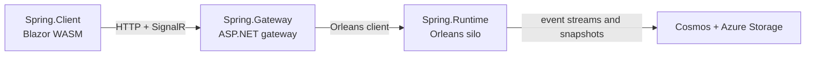

# Spring Host Architecture

Spring keeps business logic in `Spring.Domain` and treats `Spring.Runtime`, `Spring.Gateway`, and `Spring.Client` as builder-first infrastructure shells. In the current rollout, all three hosts now start from a role-specific Mississippi builder, but runtime has the strongest framework-owned trust and ownership enforcement while gateway still leaves more responsibility in application `Program.cs` code.

## The problem this solves

Before the builder rollout, the three Spring hosts did not teach one consistent startup model. That made the public story harder to learn and easier to bypass with lower-level registration paths.

The current shape fixes the main onboarding problem:

- runtime starts from `builder.AddMississippiRuntime(...)`
- gateway starts from `builder.AddMississippiGateway(...)`
- client starts from `builder.AddMississippiClient(...)`

That puts generated domain composition on the role builder instead of scattering it across manual service-registration calls.

## Core idea

Spring has three runtime hosts plus one local-development orchestrator.

| Host | Entry point | Builder-owned composition | App-owned composition |
| --- | --- | --- | --- |
| `Spring.Runtime` | `builder.AddMississippiRuntime(...)` | Generated domain runtime registration, bounded Orleans callback queue, runtime service composition | Aspire resource clients, health endpoint, any advanced service additions through `runtime.Services` |
| `Spring.Gateway` | `builder.AddMississippiGateway(...)` | JSON serialization, Aqueduct, Inlet gateway services, projection scanning, generated domain gateway registration | Authentication, authorization policies, Orleans client attachment, OpenAPI, static files, middleware, MCP |
| `Spring.Client` | `builder.AddMississippiClient(...)` | Generated domain client registration, Reservoir composition boundary | Root components, `HttpClient`, UI features, dev tools |
| `Spring.AppHost` | Aspire app host | Resource orchestration and startup order | Local-development orchestration only |

This diagram shows the supported Spring topology in the rollout.



## How it works

### Spring.Runtime

`Spring.Runtime` is the Orleans silo host. It wires infrastructure, then hands domain registration and supported silo customization to `MississippiRuntimeBuilder`.

```csharp
WebApplicationBuilder builder = WebApplication.CreateBuilder(args);

builder.AddKeyedAzureTableServiceClient("clustering");
builder.AddKeyedAzureBlobServiceClient("grainstate");
builder.AddAzureCosmosClient("cosmos", options =>
{
    options.ConnectionMode = ConnectionMode.Gateway;
    options.LimitToEndpoint = true;
});

builder.AddMississippiRuntime(runtime =>
{
    runtime.AddMississippiSamplesSpringDomain();

    runtime.Services.AddHttpClient();
    runtime.Services.AddSingleton<INotificationService, StubNotificationService>();
    runtime.Services.AddOpenTelemetry()
        .WithTracing(/* ... */)
        .WithMetrics(/* ... */)
        .WithLogging()
        .UseOtlpExporter();
    runtime.Services.AddInletSilo();
    runtime.Services.ScanProjectionAssemblies(typeof(BankAccountBalanceProjection).Assembly);
    runtime.Services.AddJsonSerialization();
    runtime.Services.AddSnapshotCaching();
    runtime.Services.AddCosmosBrookStorageProvider(/* ... */);
    runtime.Services.AddCosmosSnapshotStorageProvider(/* ... */);

    runtime.Orleans(siloBuilder =>
    {
        siloBuilder.AddActivityPropagation();
        siloBuilder.UseAqueduct(options => options.StreamProviderName = "StreamProvider");
        siloBuilder.AddEventSourcing(options => options.OrleansStreamProviderName = "StreamProvider");
    });
});
```

`runtime.AddMississippiSamplesSpringDomain()` is the source-generated domain entry point for the Spring runtime. It is the supported path for attaching the Spring domain to the silo host.

The runtime builder also owns the only supported top-level Orleans attachment path. Advanced silo changes stay inside `runtime.Orleans(...)`, not in separate host-level `UseOrleans(...)` calls.

### Spring.Gateway

`Spring.Gateway` is now builder-first as well. The canonical path is `builder.AddMississippiGateway(...)`, not manual `builder.Services.AddControllers()`, `AddInletServer(...)`, and per-mapper registration as the primary story.

```csharp
WebApplicationBuilder builder = WebApplication.CreateBuilder(args);

SpringAuthOptions springAuthOptions =
    builder.Configuration.GetSection("SpringAuth").Get<SpringAuthOptions>() ?? new();
builder.Services.Configure<SpringAuthOptions>(builder.Configuration.GetSection("SpringAuth"));
builder.Services.AddAuthentication(/* ... */)
    .AddScheme<AuthenticationSchemeOptions, SpringLocalDevAuthenticationHandler>(
        springAuthOptions.Scheme,
        _ => { });
builder.Services.AddAuthorizationBuilder()
    .AddPolicy("spring.generated-api", policy => policy.RequireAuthenticatedUser())
    .AddPolicy("spring.write", policy => policy.RequireRole("banking-operator"))
    .AddPolicy("spring.transfer", policy => policy.RequireRole("transfer-operator", "banking-operator"))
    .AddPolicy("spring.auth-proof.claim", policy => policy.RequireClaim("spring.permission", "auth-proof"));

builder.Services.AddOpenTelemetry()
    .WithTracing(/* ... */)
    .WithMetrics(/* ... */)
    .WithLogging()
    .UseOtlpExporter();
builder.AddKeyedAzureTableServiceClient("clustering");
builder.UseOrleansClient(clientBuilder => clientBuilder.AddActivityPropagation());
builder.Services.AddOpenApi(/* ... */);

builder.AddMississippiGateway(gateway =>
{
    gateway.AddJsonSerialization();
    gateway.AddAqueduct<InletHub>(options =>
        options.StreamProviderName = "StreamProvider");

    if (springAuthOptions.Enabled)
    {
        gateway.AddInletGateway(options =>
        {
            options.GeneratedApiAuthorization.Mode =
                GeneratedApiAuthorizationMode.RequireAuthorizationForAllGeneratedEndpoints;
            options.GeneratedApiAuthorization.DefaultPolicy = "spring.generated-api";
            options.GeneratedApiAuthorization.AllowAnonymousOptOut = true;
        });
    }
    else
    {
        gateway.AddInletGateway();
    }

    gateway.ScanProjectionAssemblies(typeof(BankAccountBalanceProjection).Assembly);
    gateway.AddMississippiSamplesSpringDomainGateway();
});
```

`gateway.AddMississippiSamplesSpringDomainGateway()` is the source-generated domain gateway entry point. Spring no longer needs to present the explicit per-mapper registration path as the canonical gateway onboarding model.

What remains in application code is still important: Spring defines authentication and authorization policies, attaches the Orleans client, configures OpenAPI and MCP, and maps middleware endpoints directly in `Program.cs`.

### Spring.Client

`Spring.Client` uses the same builder-first shape. The host starts with `builder.AddMississippiClient(...)`, then composes generated domain features and hand-written UI features through the client builder.

```csharp
WebAssemblyHostBuilder builder = WebAssemblyHostBuilder.CreateDefault(args);
builder.RootComponents.Add<App>("#app");
builder.RootComponents.Add<HeadOutlet>("head::after");

builder.Services.AddScoped<AuthSimulationHeadersHandler>();
builder.Services.AddScoped(sp =>
{
    AuthSimulationHeadersHandler handler = sp.GetRequiredService<AuthSimulationHeadersHandler>();
    handler.InnerHandler = new HttpClientHandler();
    return new HttpClient(handler)
    {
        BaseAddress = new(builder.HostEnvironment.BaseAddress),
    };
});

builder.AddMississippiClient(client =>
{
    client.AddMississippiSamplesSpringDomainClient()
        .Reservoir(reservoir =>
        {
            reservoir.AddDualEntitySelectionFeature();
            reservoir.AddDemoAccountsFeature();
            reservoir.AddAuthSimulationFeature();
            reservoir.AddReservoirBlazorBuiltIns();
            reservoir.AddReservoirDevTools(options =>
            {
                options.Enablement = ReservoirDevToolsEnablement.Always;
                options.Name = "Spring Sample";
                options.IsStrictStateRehydrationEnabled = true;
            });
            reservoir.AddInletBlazorSignalR(signalR => signalR
                .WithHubPath("/hubs/inlet")
                .ScanProjectionDtos(typeof(BankAccountBalanceProjectionDto).Assembly));
        });
});
```

The client-side generated domain method targets `MississippiClientBuilder`, and `AddInletBlazorSignalR(...)` composes the core Inlet client services before it builds the SignalR feature. That is why the current Spring sample no longer needs a separate `reservoir.AddInletClient()` call on the happy path.

### Spring.AppHost

`Spring.AppHost` stays outside the builder family. It provisions Azurite, Cosmos emulator resources, service discovery, and process startup order for local development. In this rollout it also reinforces the supported topology: separate runtime and gateway processes under one Aspire orchestrator.

## Guarantees

The current rollout guarantees these behaviors.

- Runtime host composition starts at `AddMississippiRuntime(...)` and can attach only once per host.
- Runtime owns the top-level Orleans silo attachment. Preexisting host-level `UseOrleans(...)` composition is rejected, and later callback replay cannot take over frozen provider, storage, clustering, or endpoint ownership.
- Runtime rechecks trust boundaries before startup and again when queued Orleans callbacks replay. Outside Development, private or internal infrastructure endpoints must be explicitly allowed, and allowlisted endpoints must still use an approved transport scheme.
- Gateway host composition starts at `AddMississippiGateway(...)` and can attach only once per host.
- Gateway rejects same-host runtime composition in this rollout.
- Within `MississippiGatewayBuilder`, duplicate `AddAqueduct<THub>(...)`, duplicate `AddInletGateway(...)`, and duplicate generated domain attachment on the same builder path fail fast.
- `AddInletGateway(...)` applies safe generated-endpoint authorization defaults before caller overrides run.
- Client host composition starts at `AddMississippiClient(...)`, reuses one Reservoir composition boundary, and rejects duplicate generated domain attachment on the same client builder.

## Non-guarantees

The builder family is not fully symmetric yet.

- Runtime has stronger framework-owned trust and ownership enforcement than gateway today.
- Gateway does not currently own the Orleans client attachment. Spring still calls `builder.UseOrleansClient(...)` directly in `Program.cs`.
- Gateway does not currently provide a runtime-style trust guard that classifies external infrastructure endpoints before startup.
- Gateway authentication policies, generated API policy names, OpenAPI setup, MCP composition, and middleware mapping are still application-owned concerns in Spring.
- Same-process runtime and gateway composition is not supported in this rollout. Use separate processes coordinated by `Spring.AppHost`.
- `Services` escape hatches remain available on the role builders for advanced composition, but those escape hatches are not the primary onboarding path.

## Trade-offs

This shape deliberately favors a clearer public composition story over complete cross-role convergence.

- The builder-first path removes the legacy manual gateway walkthrough and makes generated domain registration easier to teach.
- Runtime centralizes more safety policy in framework code, which gives it a stronger trust and ownership story.
- Gateway remains more flexible because key host concerns still live in app code, but that also means the gateway safety model is less framework-owned than runtime today.
- Keeping runtime and gateway in separate processes reduces rollout scope and avoids accidental mixed host modes, at the cost of not supporting a combined host API yet.

## Related tasks and reference

- [Overview](../index.md)
- [Key Concepts](./key-concepts.md)
- [Spring Auth-Proof Mode](../how-to/auth-proof-mode.md)
- [ADR-0004: Reject Same-Host Runtime and Gateway Composition in This Rollout](../../../adr/0004-reject-same-host-runtime-and-gateway-composition-in-this-rollout.md)
- [Domain Registration Generators](../../../archived/reference/domain-registration-generators.md)
