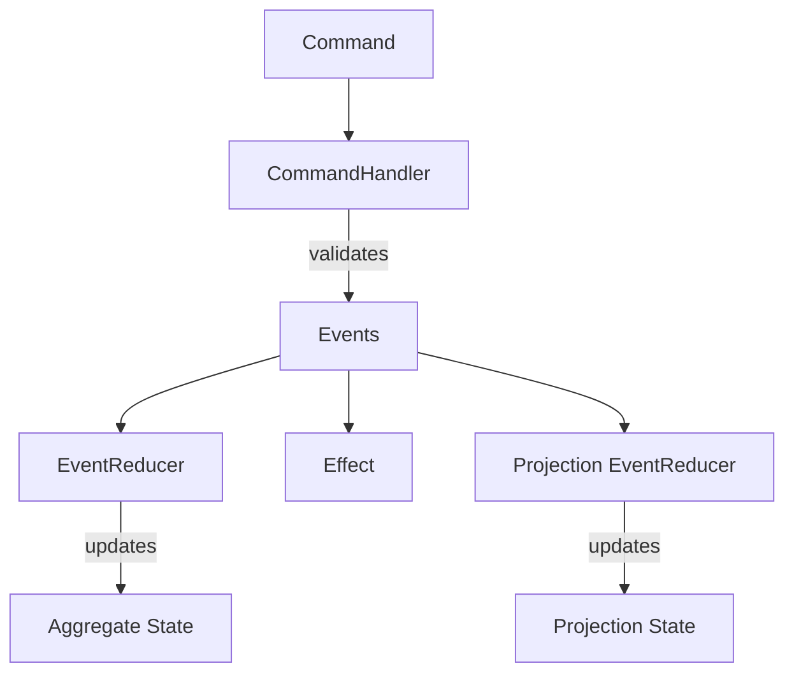

# Key Concepts

## Overview

This page defines every concept used in the Spring sample. Each concept maps to a specific base class or interface in the Mississippi framework. Read this page first if you are new to event sourcing or to Mississippi, especially if you are comparing older saga examples with the current recovery-aware contracts.

## Domain Terms → Framework Types

Use this table as a translation guide from plain-language architecture terms to concrete Mississippi types and attributes.

| Plain-Language Term | Spring Domain Artifact | Mississippi Type / Attribute | Meaning in the Framework |
|---|---|---|---|
| Command | `DepositFunds`, `WithdrawFunds`, `OpenAccount` | `[GenerateCommand]` | A request DTO that expresses intent and is used to generate API/client dispatch surfaces. |
| Command handler | `DepositFundsHandler` | `CommandHandlerBase<TCommand, TSnapshot>` | Validates business rules against current aggregate state and returns events via `OperationResult`. |
| Event | `FundsDeposited`, `FundsWithdrawn` | `[EventStorageName]` | Immutable fact persisted to the brook stream and replayed to rebuild state. |
| Event reducer | `FundsDepositedReducer` | `EventReducerBase<TEvent, TProjection>` / `IEventReducer<...>` | Pure state transition function that applies an event to current state. |
| Aggregate | `BankAccountAggregate` | `[GenerateAggregateEndpoints]`, `[BrookName]`, `[SnapshotStorageName]` | Domain state root that command handlers validate against and event reducers update. |
| Effect (synchronous) | `HighValueTransactionEffect` | `SimpleEventEffectBase<TEvent, TAggregate>` | Side-effect that runs after event persistence and can block command completion. |
| Effect (fire-and-forget) | `WithdrawalNotificationEffect` | `FireAndForgetEventEffectBase<TEvent, TAggregate>` | Side-effect executed asynchronously in worker infrastructure after event persistence. |
| Saga | `MoneyTransferSagaState` | `ISagaState`, `[GenerateSagaEndpoints]`, optional `[SagaRecovery]` | Long-running orchestration state for multi-step workflows across aggregates. Generated surfaces keep raw status separate from recovery metadata. |
| Saga step | `WithdrawFromSourceStep` | `ISagaStep<TSaga>`, `[SagaStep<TSaga>(index, forwardRecoveryPolicy)]`, `SagaStepExecutionContext` | One executable workflow step with ordered execution, explicit recovery policy, and runtime attempt metadata. |
| Saga compensation | `WithdrawFromSourceStep.CompensateAsync` | `ICompensatable<TSaga>`, `CompensationRecoveryPolicy`, `SagaStepExecutionContext` | Optional rollback behavior invoked when a later step fails, with its own recovery policy and attempt metadata. |
| Saga runtime status | `MoneyTransferStatusProjection` and generated saga surfaces | `SagaRuntimeStatus`, `SagaResumeResponse`, `[GenerateSagaStatusReducers]` | Metadata-only operator view of blocked/resumable state without exposing raw saga state. |
| Projection (domain model) | `BankAccountBalanceProjection` | `[GenerateProjectionEndpoints]`, `[ProjectionPath]`, `[BrookName]` | Read-optimized domain projection record built from events. |
| UX projection runtime | Generated projection query/subscription runtime | `IUxProjectionGrain<TProjection>` / `UxProjectionGrain<TProjection>` | Orleans runtime abstraction that serves projection queries and versioned projection reads. |
| Brook | `SPRING/BANKING/ACCOUNT` | `[BrookName]`, `BrookKey` | Canonical event stream identity (name + entity key). |

Notes:

- There is no single type literally named `UXProjection`; the runtime projection abstraction is the `IUxProjectionGrain<TProjection>` contract.
- For Spring domain-first learning, focus first on the `Spring.Domain` rows (`Command`, `CommandHandler`, event, `EventReducer`, aggregate, effect, saga, projection). Runtime and host wiring details come after.

Key framework references:

- [`CommandHandlerBase<TCommand, TSnapshot>`](https://github.com/Gibbs-Morris/mississippi/blob/main/src/DomainModeling.Abstractions/CommandHandlerBase.cs)
- [`EventReducerBase<TEvent, TProjection>`](https://github.com/Gibbs-Morris/mississippi/blob/main/src/Tributary.Abstractions/EventReducerBase.cs)
- [`IEventReducer`](https://github.com/Gibbs-Morris/mississippi/blob/main/src/Tributary.Abstractions/IEventReducer.cs)
- [`ISagaState`](https://github.com/Gibbs-Morris/mississippi/blob/main/src/DomainModeling.Abstractions/ISagaState.cs)
- [`ISagaStep<TSaga>` and `ICompensatable<TSaga>`](https://github.com/Gibbs-Morris/mississippi/blob/main/src/DomainModeling.Abstractions/ISagaStep.cs)
- [`SimpleEventEffectBase<TEvent, TAggregate>`](https://github.com/Gibbs-Morris/mississippi/blob/main/src/DomainModeling.Abstractions/SimpleEventEffectBase.cs)
- [`FireAndForgetEventEffectBase<TEvent, TAggregate>`](https://github.com/Gibbs-Morris/mississippi/blob/main/src/DomainModeling.Abstractions/FireAndForgetEventEffectBase.cs)
- [`GenerateCommandAttribute`](https://github.com/Gibbs-Morris/mississippi/blob/main/src/Inlet.Generators.Abstractions/GenerateCommandAttribute.cs)
- [`GenerateAggregateEndpointsAttribute`](https://github.com/Gibbs-Morris/mississippi/blob/main/src/Inlet.Generators.Abstractions/GenerateAggregateEndpointsAttribute.cs)
- [`GenerateProjectionEndpointsAttribute`](https://github.com/Gibbs-Morris/mississippi/blob/main/src/Inlet.Generators.Abstractions/GenerateProjectionEndpointsAttribute.cs)
- [`GenerateSagaEndpointsAttribute`](https://github.com/Gibbs-Morris/mississippi/blob/main/src/Inlet.Generators.Abstractions/GenerateSagaEndpointsAttribute.cs)
- [`ProjectionPathAttribute`](https://github.com/Gibbs-Morris/mississippi/blob/main/src/Inlet.Abstractions/ProjectionPathAttribute.cs)
- [`IUxProjectionGrain<TProjection>`](https://github.com/Gibbs-Morris/mississippi/blob/main/src/DomainModeling.Abstractions/IUxProjectionGrain.cs)
- [`UxProjectionGrain<TProjection>`](https://github.com/Gibbs-Morris/mississippi/blob/main/src/DomainModeling.Runtime/UxProjectionGrain.cs)

## Command

A command is an instruction to do something. It is a simple data record that carries the intent and parameters of an action. Commands do not contain logic - they describe *what* the caller wants to happen.

In Spring, commands are `sealed record` types decorated with `[GenerateCommand]` to auto-generate API endpoints and client-side dispatchers.

```csharp
[GenerateCommand(Route = "deposit")]
[GenerateSerializer]
public sealed record DepositFunds
{
    [Id(0)]
    public decimal Amount { get; init; }
}
```

A command says "deposit £500." It does not decide whether the deposit is allowed.

([DepositFunds.cs](https://github.com/Gibbs-Morris/mississippi/blob/main/samples/Spring/Spring.Domain/Aggregates/BankAccount/Commands/DepositFunds.cs))

## Command Handler

A command handler receives a command and the current aggregate state, validates business rules, and returns either a list of events (success) or an error (failure). Command handlers extend [`CommandHandlerBase<TCommand, TSnapshot>`](https://github.com/Gibbs-Morris/mississippi/blob/main/src/DomainModeling.Abstractions/CommandHandlerBase.cs).

`CommandHandler`s are **pure decision-makers**. They inspect the command and state, apply business rules, and produce events. They do not mutate state, call databases, or perform side effects.

```csharp
internal sealed class DepositFundsHandler : CommandHandlerBase<DepositFunds, BankAccountAggregate>
{
    protected override OperationResult<IReadOnlyList<object>> HandleCore(
        DepositFunds command,
        BankAccountAggregate? state)
    {
        if (state?.IsOpen != true)
            return OperationResult.Fail<IReadOnlyList<object>>(
                AggregateErrorCodes.InvalidState,
                "Account must be open before depositing funds.");

        if (command.Amount <= 0)
            return OperationResult.Fail<IReadOnlyList<object>>(
                AggregateErrorCodes.InvalidCommand,
                "Deposit amount must be positive.");

        return OperationResult.Ok<IReadOnlyList<object>>(
            new object[] { new FundsDeposited { Amount = command.Amount } });
    }
}
```

The `CommandHandler` decides: "Is the account open? Is the amount positive?" If yes, it emits a `FundsDeposited` event. If no, it returns an error. It never changes state directly.

([DepositFundsHandler.cs](https://github.com/Gibbs-Morris/mississippi/blob/main/samples/Spring/Spring.Domain/Aggregates/BankAccount/Handlers/DepositFundsHandler.cs))

## Event

An event is an immutable fact that something happened. Events are the source of truth in an event-sourced system. They are stored permanently and replayed to reconstruct state.

Events are `internal sealed record` types decorated with `[EventStorageName]` to define their storage identity. Events are internal because external consumers read projections, not raw events.

```csharp
[EventStorageName("SPRING", "BANKING", "FUNDSDEPOSITED")]
[GenerateSerializer]
internal sealed record FundsDeposited
{
    [Id(0)]
    public decimal Amount { get; init; }
}
```

An event says "£500 was deposited." It is a statement of fact - past tense, immutable, permanent.

([FundsDeposited.cs](https://github.com/Gibbs-Morris/mississippi/blob/main/samples/Spring/Spring.Domain/Aggregates/BankAccount/Events/FundsDeposited.cs))

## EventReducer

An `EventReducer` is a pure function that takes the current state and an event, and returns the new state. `EventReducer`s extend [`EventReducerBase<TEvent, TProjection>`](https://github.com/Gibbs-Morris/mississippi/blob/main/src/Tributary.Abstractions/EventReducerBase.cs) and implement `IEventReducer` contracts.

`EventReducer`s have no side effects, no dependencies, no I/O. They receive state + event and return new state. This makes them trivially testable and deterministic.

```csharp
internal sealed class FundsDepositedReducer : EventReducerBase<FundsDeposited, BankAccountAggregate>
{
    protected override BankAccountAggregate ReduceCore(
        BankAccountAggregate state,
        FundsDeposited @event)
    {
        return (state ?? new()) with
        {
            Balance = (state?.Balance ?? 0) + @event.Amount,
            DepositCount = (state?.DepositCount ?? 0) + 1,
        };
    }
}
```

The event reducer applies the fact: "A deposit happened, so increase the balance and increment the counter."

([FundsDepositedReducer.cs](https://github.com/Gibbs-Morris/mississippi/blob/main/samples/Spring/Spring.Domain/Aggregates/BankAccount/Reducers/FundsDepositedReducer.cs))

## Aggregate

An aggregate is the state record that `EventReducer`s build by replaying events. It is the internal, authoritative representation of an entity. Aggregates are decorated with `[BrookName]` to define their event stream identity and `[GenerateAggregateEndpoints]` to auto-generate API and grain infrastructure.

```csharp
[BrookName("SPRING", "BANKING", "ACCOUNT")]
[GenerateAggregateEndpoints]
[GenerateSerializer]
public sealed record BankAccountAggregate
{
    [Id(0)] public decimal Balance { get; init; }
    [Id(1)] public bool IsOpen { get; init; }
    [Id(2)] public string HolderName { get; init; } = string.Empty;
    [Id(3)] public int DepositCount { get; init; }
    [Id(4)] public int WithdrawalCount { get; init; }
}
```

Aggregates are never exposed to external consumers. Read-optimized projections serve that purpose.

For this Spring domain-first walkthrough, focus on `EventReducer` types in `Spring.Domain`. Client-side `ActionReducer` types are part of UI state management in the client host, not domain business logic. See [Host Applications](./host-applications.md) for where client state wiring lives.

([BankAccountAggregate.cs](https://github.com/Gibbs-Morris/mississippi/blob/main/samples/Spring/Spring.Domain/Aggregates/BankAccount/BankAccountAggregate.cs))

## Effect

An effect is a side-effect that runs in reaction to an event after the event has been persisted. Effects handle things that are not part of the core state transition: sending notifications, dispatching commands to other aggregates, and calling external APIs. Effects can run in either blocking (`SimpleEventEffectBase`) or fire-and-forget (`FireAndForgetEventEffectBase`) mode.

Mississippi provides two effect types:

| Type | Base Class | Behavior |
|------|-----------|----------|
| **Simple effect** | [`SimpleEventEffectBase<TEvent, TAggregate>`](https://github.com/Gibbs-Morris/mississippi/blob/main/src/DomainModeling.Abstractions/SimpleEventEffectBase.cs) | Runs on the aggregate event-effect pipeline after the event is persisted. Use it for side operations that stay coupled to the aggregate flow without yielding additional events. |
| **Fire-and-forget effect** | [`FireAndForgetEventEffectBase<TEvent, TAggregate>`](https://github.com/Gibbs-Morris/mississippi/blob/main/src/DomainModeling.Abstractions/FireAndForgetEventEffectBase.cs) | Runs in a separate worker grain. Use it for side effects that should be decoupled from the aggregate pipeline. |

Spring uses both:

- `HighValueTransactionEffect` (simple) - flags deposits over £10,000 by dispatching a command to the `TransactionInvestigationQueueAggregate`.
- `WithdrawalNotificationEffect` (fire-and-forget) - sends a notification after withdrawals without blocking the response.

([HighValueTransactionEffect.cs](https://github.com/Gibbs-Morris/mississippi/blob/main/samples/Spring/Spring.Domain/Aggregates/BankAccount/Effects/HighValueTransactionEffect.cs) |
[WithdrawalNotificationEffect.cs](https://github.com/Gibbs-Morris/mississippi/blob/main/samples/Spring/Spring.Domain/Aggregates/BankAccount/Effects/WithdrawalNotificationEffect.cs))

## Saga

A saga orchestrates a long-running workflow that spans multiple aggregates. Each saga has a state record that implements `ISagaState` and is decorated with `[GenerateSagaEndpoints]`.

```csharp
[BrookName("SPRING", "BANKING", "TRANSFER")]
[GenerateSagaEndpoints(
    InputType = typeof(StartMoneyTransferCommand),
    RoutePrefix = "money-transfer",
    FeatureKey = "moneyTransfer")]
[GenerateMcpSagaTools(
    Title = "Transfer Funds",
    Description = "Transfers funds between two Spring Bank accounts using the saga orchestrator.",
    ToolPrefix = "transfer_funds")]
[GenerateSerializer]
public sealed record MoneyTransferSagaState : ISagaState
{
    [Id(3)] public string? CorrelationId { get; init; }
    [Id(6)] public StartMoneyTransferCommand? Input { get; init; }
    [Id(2)] public int LastCompletedStepIndex { get; init; } = -1;
    [Id(1)] public SagaPhase Phase { get; init; }
    [Id(0)] public Guid SagaId { get; init; }
    [Id(4)] public DateTimeOffset? StartedAt { get; init; }
    [Id(5)] public string? StepHash { get; init; }
}
```

The saga itself does not contain step logic. Steps are separate classes.

`[GenerateSagaEndpoints]` now keeps raw saga state on `GET status` and adds metadata-only `GET runtime-status` plus typed `POST resume`. Because Spring does not decorate the state with `[SagaRecovery]`, its saga-level recovery mode stays on the generated default of `SagaRecoveryMode.Automatic` until a saga explicitly overrides it.

([MoneyTransferSagaState.cs](https://github.com/Gibbs-Morris/mississippi/blob/main/samples/Spring/Spring.Domain/Aggregates/MoneyTransferSaga/MoneyTransferSagaState.cs))

## Saga Step

A saga step implements [`ISagaStep<TSaga>`](https://github.com/Gibbs-Morris/mississippi/blob/main/src/DomainModeling.Abstractions/ISagaStep.cs) and executes one unit of work in the saga. Steps are ordered by the `[SagaStep<TSaga>(index, forwardRecoveryPolicy)]` attribute, and the current contract always passes a `SagaStepExecutionContext`.

```csharp
[SagaStep<MoneyTransferSagaState>(
    1,
    SagaStepRecoveryPolicy.ManualOnly)]
internal sealed class DepositToDestinationStep : ISagaStep<MoneyTransferSagaState>
{
    public async Task<StepResult> ExecuteAsync(
        MoneyTransferSagaState state,
        SagaStepExecutionContext context,
        CancellationToken cancellationToken)
    {
        // Withdraw from source account
    }
}
```

Steps return `StepResult.Succeeded()` or `StepResult.Failed(...)`. If a step fails, the saga triggers compensation on previously completed steps.

Spring intentionally marks both money-movement steps as `ManualOnly` because the underlying `WithdrawFunds` and `DepositFunds` commands declare `Idempotent = false`.

([WithdrawFromSourceStep.cs](https://github.com/Gibbs-Morris/mississippi/blob/main/samples/Spring/Spring.Domain/Aggregates/MoneyTransferSaga/Steps/WithdrawFromSourceStep.cs))

## Saga Compensation

A saga step that implements [`ICompensatable<TSaga>`](https://github.com/Gibbs-Morris/mississippi/blob/main/src/DomainModeling.Abstractions/ISagaStep.cs) provides a `CompensateAsync` method. If a later step fails, the framework calls `CompensateAsync` on previously completed compensatable steps in reverse order to undo their work.

```csharp
[SagaStep<MoneyTransferSagaState>(
    0,
    SagaStepRecoveryPolicy.ManualOnly,
    CompensationRecoveryPolicy = SagaStepRecoveryPolicy.ManualOnly)]
internal sealed class WithdrawFromSourceStep
    : ISagaStep<MoneyTransferSagaState>,
      ICompensatable<MoneyTransferSagaState>
{
    public async Task<CompensationResult> CompensateAsync(
        MoneyTransferSagaState state,
        SagaStepExecutionContext context,
        CancellationToken cancellationToken)
    {
        // Deposit the amount back to source account to undo the withdrawal
    }
}
```

Not every step needs compensation. The `DepositToDestinationStep` in Spring does not implement `ICompensatable` because it is the final step - there is nothing after it that could fail. Compensation receives the same attempt metadata contract as forward execution, so it can use `OperationKey`, `Direction`, and `Source` for safe undo logic.

([WithdrawFromSourceStep.cs](https://github.com/Gibbs-Morris/mississippi/blob/main/samples/Spring/Spring.Domain/Aggregates/MoneyTransferSaga/Steps/WithdrawFromSourceStep.cs) |
[DepositToDestinationStep.cs](https://github.com/Gibbs-Morris/mississippi/blob/main/samples/Spring/Spring.Domain/Aggregates/MoneyTransferSaga/Steps/DepositToDestinationStep.cs))

## Saga Command

A saga command is the input that starts a saga. It is a regular command record that carries the data the saga needs. The saga state captures this input so that all steps can access it.

```csharp
[GenerateCommand(Route = "transfer")]
[GenerateSerializer]
public sealed record StartMoneyTransferCommand
{
    [Id(0)] public string SourceAccountId { get; init; } = string.Empty;
    [Id(1)] public string DestinationAccountId { get; init; } = string.Empty;
    [Id(2)] public decimal Amount { get; init; }
}
```

([StartMoneyTransferCommand.cs](https://github.com/Gibbs-Morris/mississippi/blob/main/samples/Spring/Spring.Domain/Aggregates/MoneyTransferSaga/Commands/StartMoneyTransferCommand.cs))

## Projection

A projection is a read-optimized view built from an event stream. Projections subscribe to the same events as aggregates but maintain their own state records tailored for specific read patterns. They are decorated with `[ProjectionPath]`, `[BrookName]`, and `[GenerateProjectionEndpoints]`.

```csharp
[ProjectionPath("bank-account-balance")]
[BrookName("SPRING", "BANKING", "ACCOUNT")]
[GenerateProjectionEndpoints]
[GenerateSerializer]
public sealed record BankAccountBalanceProjection
{
    [Id(0)] public decimal Balance { get; init; }
    [Id(1)] public string HolderName { get; init; } = string.Empty;
    [Id(2)] public bool IsOpen { get; init; }
}
```

Projections have their own `EventReducer`s. A single event stream can feed multiple projections - the `BankAccount` event stream feeds both `BankAccountBalanceProjection` and `BankAccountLedgerProjection`.

Spring's `MoneyTransferStatusProjection` uses `[GenerateSagaStatusReducers]` to mirror `RecoveryMode`, `ResumeDisposition`, `PendingStepName`, `BlockedReason`, and other operator-facing recovery fields without exposing raw saga state.

([BankAccountBalanceProjection.cs](https://github.com/Gibbs-Morris/mississippi/blob/main/samples/Spring/Spring.Domain/Projections/BankAccountBalance/BankAccountBalanceProjection.cs))

## Brook

A brook is a named event stream. The `[BrookName("SPRING", "BANKING", "ACCOUNT")]` attribute defines a three-part hierarchical name. Multiple aggregates and projections can share the same brook name when they consume the same event stream. The `BrookKey` type combines the brook name with a specific entity ID at runtime.

## How Concepts Connect



1. A **command** is sent to a **command handler**.
2. The command handler validates rules against the current state and emits **events** on success.
3. **EventReducers** apply events to the **aggregate state**.
4. **Effects** react to events asynchronously (notifications, cross-aggregate commands).
5. **Projection EventReducers** build read-optimized **projection state** from the same events.

## Summary

Every concept in Mississippi has a single, well-defined responsibility. Commands carry intent. Handlers validate rules. Events record facts. EventReducers compute event-sourced state. Effects trigger side actions. Sagas coordinate multi-step workflows. Projections build read views. This separation keeps each piece small, testable, and replaceable.

## Next Steps

- [Building an Aggregate](../tutorials/building-an-aggregate.md) - See these concepts in action with the BankAccount example
- [Building a Saga](../tutorials/building-a-saga.md) - Orchestrate a multi-aggregate workflow
- [Building Projections](../tutorials/building-projections.md) - Create read-optimized views
- [Upgrade saga code from < 0.0.1 to 0.0.1](../../../domain-modeling/migration/upgrade-saga-code-from-before-0-0-1-to-0-0-1.md) - Migrate older step signatures and recovery policies to the current saga contracts
