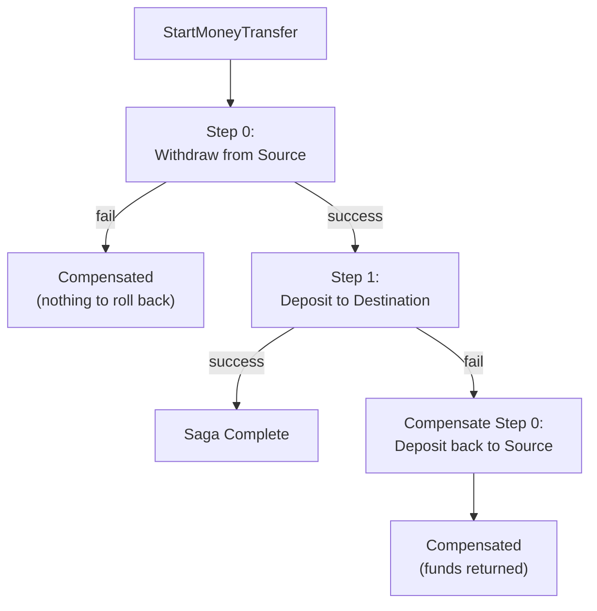
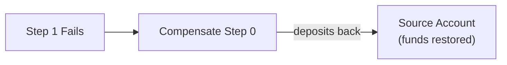

# Building a Saga: Money Transfer

## Overview

A saga coordinates a workflow that spans multiple aggregates or services. The `MoneyTransferSaga` in Spring transfers money between two bank accounts in two steps:

1. **Withdraw** from the source account
2. **Deposit** to the destination account

If step 0 fails, no forward work was completed, so the saga immediately ends as `Compensated` (nothing to roll back). If step 1 fails (destination account is closed, for example), the saga compensates by re-depositing the withdrawn amount back to the source account. This is the saga pattern in action - forward steps with compensation, plus explicit recovery policies when a step cannot safely replay automatically.



## Before You Begin

Before following this tutorial, read these pages:

- [Spring Sample App](../index.md)
- [Building an Aggregate](./building-an-aggregate.md)
- [Sagas and Orchestration](../../../concepts/sagas-and-orchestration.md)

## Step 1: Define the Saga State

The saga state record tracks the lifecycle of the workflow. It implements `ISagaState` from Mississippi and stores the input data, phase, and step progress.

```csharp
[BrookName("SPRING", "BANKING", "TRANSFER")]
[SnapshotStorageName("SPRING", "BANKING", "TRANSFERSTATE")]
[GenerateSagaEndpoints(
    InputType = typeof(StartMoneyTransferCommand),
    RoutePrefix = "money-transfer",
    FeatureKey = "moneyTransfer")]
[GenerateMcpSagaTools(
    Title = "Transfer Funds",
    Description = "Transfers funds between two Spring Bank accounts using the saga orchestrator.",
    ToolPrefix = "transfer_funds")]
[GenerateSerializer]
[Alias("MississippiSamples.Spring.Domain.Aggregates.MoneyTransferSaga.MoneyTransferSagaState")]
public sealed record MoneyTransferSagaState : ISagaState
{
    [Id(3)] public string? CorrelationId { get; init; }
    [Id(6)] public StartMoneyTransferCommand? Input { get; init; }
    [Id(2)] public int LastCompletedStepIndex { get; init; } = -1;
    [Id(1)] public SagaPhase Phase { get; init; }
    [Id(0)] public Guid SagaId { get; init; }
    [Id(4)] public DateTimeOffset? StartedAt { get; init; }
    [Id(5)] public string? StepHash { get; init; }
}
```

Key attributes:

| Attribute | Purpose |
|-----------|---------|
| `[GenerateSagaEndpoints]` | Source-generates the saga HTTP surface, including the start route plus `GET status`, `GET runtime-status`, and `POST resume` |
| `[GenerateMcpSagaTools]` | Mirrors the same start, runtime-status, and resume operations as MCP tools for operator workflows |
| `InputType` | The command type that starts the saga |
| `RoutePrefix` | The REST path prefix for saga endpoints |
| `FeatureKey` | The key used to identify this saga in source-generated API and client surfaces |

The `ISagaState` interface requires `SagaId`, `Phase`, `LastCompletedStepIndex`, `CorrelationId`, `StartedAt`, and `StepHash`. Mississippi uses these fields to track saga lifecycle and step ordering.

Spring does not decorate the state with `[SagaRecovery]`, so generated registration uses the default `SagaRecoveryMode.Automatic`. The step-level recovery policies still decide whether a specific failed step can replay automatically or must wait for an explicit resume.

([MoneyTransferSagaState.cs](https://github.com/Gibbs-Morris/mississippi/blob/main/samples/Spring/Spring.Domain/Aggregates/MoneyTransferSaga/MoneyTransferSagaState.cs))

## Step 2: Define the Input Command

The input command carries the data needed to execute the saga.

```csharp
[GenerateCommand(Route = "transfer")]
[GenerateSerializer]
[Alias("MississippiSamples.Spring.Domain.Aggregates.MoneyTransferSaga.Commands.StartMoneyTransferCommand")]
public sealed record StartMoneyTransferCommand
{
    [Id(2)] public decimal Amount { get; init; }
    [Id(1)] public string DestinationAccountId { get; init; } = string.Empty;
    [Id(0)] public string SourceAccountId { get; init; } = string.Empty;
}
```

The saga state captures this input in its `Input` property so that all steps can access it without being passed the command directly.

([StartMoneyTransferCommand.cs](https://github.com/Gibbs-Morris/mississippi/blob/main/samples/Spring/Spring.Domain/Aggregates/MoneyTransferSaga/Commands/StartMoneyTransferCommand.cs))

## Step 3: Implement Saga Steps

Each step is a class that implements `ISagaStep<TSaga>`. Steps are ordered by the `[SagaStep<TSaga>(index, forwardRecoveryPolicy)]` attribute. A compensatable step can also declare `CompensationRecoveryPolicy = ...`. Mississippi executes steps in index order, compensates in reverse order on failure, and passes a `SagaStepExecutionContext` into every forward or compensating attempt.

### Step 0: WithdrawFromSourceStep

This step withdraws funds from the source account by dispatching a `WithdrawFunds` command to the `BankAccountAggregate`. It also implements `ICompensatable<TSaga>` so it can reverse the withdrawal if a later step fails.

```csharp
[SagaStep<MoneyTransferSagaState>(
    0,
    SagaStepRecoveryPolicy.ManualOnly,
    CompensationRecoveryPolicy = SagaStepRecoveryPolicy.ManualOnly)]
internal sealed class WithdrawFromSourceStep
    : ISagaStep<MoneyTransferSagaState>,
      ICompensatable<MoneyTransferSagaState>
{
    public WithdrawFromSourceStep(IAggregateGrainFactory aggregateGrainFactory)
    {
        ArgumentNullException.ThrowIfNull(aggregateGrainFactory);
        AggregateGrainFactory = aggregateGrainFactory;
    }

    private IAggregateGrainFactory AggregateGrainFactory { get; }

    public async Task<StepResult> ExecuteAsync(
        MoneyTransferSagaState state,
        SagaStepExecutionContext context,
        CancellationToken cancellationToken)
    {
        ArgumentNullException.ThrowIfNull(context);
        StartMoneyTransferCommand? input = state.Input;
        if (input is null)
            return StepResult.Failed(AggregateErrorCodes.InvalidState, "Transfer input not provided.");

        if (string.IsNullOrWhiteSpace(input.SourceAccountId) || string.IsNullOrWhiteSpace(input.DestinationAccountId))
            return StepResult.Failed(AggregateErrorCodes.InvalidCommand, "Account identifiers are required.");

        if (string.Equals(input.SourceAccountId, input.DestinationAccountId, StringComparison.Ordinal))
            return StepResult.Failed(AggregateErrorCodes.InvalidCommand, "Source and destination accounts must differ.");

        if (input.Amount <= 0)
            return StepResult.Failed(AggregateErrorCodes.InvalidCommand, "Transfer amount must be positive.");

        WithdrawFunds command = new() { Amount = input.Amount };
        IGenericAggregateGrain<BankAccountAggregate> grain =
            AggregateGrainFactory.GetGenericAggregate<BankAccountAggregate>(input.SourceAccountId);

        OperationResult result = await grain.ExecuteAsync(command, cancellationToken);
        return result.Success
            ? StepResult.Succeeded()
            : StepResult.Failed(result.ErrorCode ?? AggregateErrorCodes.InvalidCommand, result.ErrorMessage);
    }

    public async Task<CompensationResult> CompensateAsync(
        MoneyTransferSagaState state,
        SagaStepExecutionContext context,
        CancellationToken cancellationToken)
    {
        ArgumentNullException.ThrowIfNull(context);
        StartMoneyTransferCommand? input = state.Input;
        if (input is null)
            return CompensationResult.SkippedResult("Transfer input not provided.");

        DepositFunds command = new() { Amount = input.Amount };
        IGenericAggregateGrain<BankAccountAggregate> grain =
            AggregateGrainFactory.GetGenericAggregate<BankAccountAggregate>(input.SourceAccountId);

        OperationResult result = await grain.ExecuteAsync(command, cancellationToken);
        return result.Success
            ? CompensationResult.Succeeded()
            : CompensationResult.Failed(result.ErrorCode ?? "COMPENSATION_FAILED", result.ErrorMessage);
    }
}
```

The step validates the input, dispatches a `WithdrawFunds` command, and returns a `StepResult`. The `CompensateAsync` method reverses the withdrawal by dispatching a `DepositFunds` command back to the same account.

([WithdrawFromSourceStep.cs](https://github.com/Gibbs-Morris/mississippi/blob/main/samples/Spring/Spring.Domain/Aggregates/MoneyTransferSaga/Steps/WithdrawFromSourceStep.cs))

### Step 1: DepositToDestinationStep

This step deposits funds to the destination account. It is the final step and does not implement `ICompensatable` - there is no subsequent step that could fail.

```csharp
[SagaStep<MoneyTransferSagaState>(1, SagaStepRecoveryPolicy.ManualOnly)]
internal sealed class DepositToDestinationStep : ISagaStep<MoneyTransferSagaState>
{
    public DepositToDestinationStep(IAggregateGrainFactory aggregateGrainFactory)
    {
        ArgumentNullException.ThrowIfNull(aggregateGrainFactory);
        AggregateGrainFactory = aggregateGrainFactory;
    }

    private IAggregateGrainFactory AggregateGrainFactory { get; }

    public async Task<StepResult> ExecuteAsync(
        MoneyTransferSagaState state,
        SagaStepExecutionContext context,
        CancellationToken cancellationToken)
    {
        ArgumentNullException.ThrowIfNull(context);
        StartMoneyTransferCommand? input = state.Input;
        if (input is null)
            return StepResult.Failed(AggregateErrorCodes.InvalidState, "Transfer input not provided.");

        if (string.IsNullOrWhiteSpace(input.DestinationAccountId))
            return StepResult.Failed(AggregateErrorCodes.InvalidCommand, "Destination account is required.");

        if (input.Amount <= 0)
            return StepResult.Failed(AggregateErrorCodes.InvalidCommand, "Transfer amount must be positive.");

        DepositFunds command = new() { Amount = input.Amount };
        IGenericAggregateGrain<BankAccountAggregate> grain =
            AggregateGrainFactory.GetGenericAggregate<BankAccountAggregate>(input.DestinationAccountId);

        OperationResult result = await grain.ExecuteAsync(command, cancellationToken);
        return result.Success
            ? StepResult.Succeeded()
            : StepResult.Failed(result.ErrorCode ?? AggregateErrorCodes.InvalidCommand, result.ErrorMessage);
    }
}
```

([DepositToDestinationStep.cs](https://github.com/Gibbs-Morris/mississippi/blob/main/samples/Spring/Spring.Domain/Aggregates/MoneyTransferSaga/Steps/DepositToDestinationStep.cs))

### Why both steps are `ManualOnly`

Spring marks both forward steps as `SagaStepRecoveryPolicy.ManualOnly`, and the compensation path on `WithdrawFromSourceStep` as `ManualOnly` too. The reason is simple: both `WithdrawFunds` and `DepositFunds` declare `Idempotent = false` in their generated MCP metadata, so the sample prefers an explicit operator decision over replaying non-idempotent money movement commands automatically.

### What the execution context gives you

`SagaStepExecutionContext` is the contract that makes recovery-aware steps deterministic and inspectable.

| Property | Why it matters |
|----------|----------------|
| `AttemptId` and `AttemptStartedAt` | Correlate one concrete execution or compensation attempt |
| `OperationKey` | Gives downstream systems a stable identifier for retries or manual resumes |
| `Direction`, `StepIndex`, and `StepName` | Tell the step what kind of work the runtime is asking it to do |
| `Source` and `IsReplay` | Distinguish a fresh run from reminder-driven or manual recovery |

## Checkpoint 1

At this point, your saga should include:

- a state record implementing `ISagaState`
- an input command for starting the saga
- ordered step classes for withdrawal and deposit
- explicit recovery policies on each step
- compensation on the withdrawal step only, with the same `SagaStepExecutionContext` contract as forward execution

## How Saga Compensation Works

When the deposit step fails, Mississippi automatically runs compensation in reverse order:



1. Step 1 (`DepositToDestinationStep`) returns `StepResult.Failed(...)`.
2. Mississippi detects the failure and enters the `Compensating` phase.
3. Step 0 (`WithdrawFromSourceStep`) implements `ICompensatable`, so Mississippi calls `CompensateAsync` with a new `SagaStepExecutionContext`.
4. The compensation deposits the amount back to the source account.
5. If compensation succeeds, the saga moves to the `Compensated` phase. The source account has its funds restored.

Steps that do not implement `ICompensatable` are skipped during compensation. This is intentional - not every step has a meaningful reversal.

## The Complete Saga File Structure

```text
Aggregates/MoneyTransferSaga/
├── MoneyTransferSagaState.cs           # Saga state record (ISagaState)
├── Commands/
│   └── StartMoneyTransferCommand.cs    # Input command
└── Steps/
    ├── WithdrawFromSourceStep.cs       # Step 0 (with compensation)
    └── DepositToDestinationStep.cs     # Step 1 (no compensation)
```

Sagas do not need their own events, `CommandHandler`s, or `EventReducer` types. The saga framework emits lifecycle events (`SagaStarted`, `SagaStepCompleted`, `SagaCompleted`, `SagaFailed`, etc.) automatically. Steps dispatch commands to existing aggregates, reusing the BankAccount's existing command/handler/event/EventReducer pipeline.

## Key Design Decisions

| Decision | Rationale |
|----------|-----------|
| Steps dispatch commands, not emit events directly | Reuses existing aggregate validation and event pipelines |
| Only Step 0 implements `ICompensatable` | Step 1 is the final step - if it fails, compensation runs backwards from step 0, not step 1 itself, so step 1 has nothing to reverse |
| `ManualOnly` recovery for both forward steps and the Step 0 compensation path | `WithdrawFunds` and `DepositFunds` are non-idempotent, so Spring exposes resume decisions to operators instead of replaying them blindly |
| Input validation happens in the first step | Catches invalid requests before any state changes |
| `GenerateMcpSagaTools` lives on the saga state | The sample gets matching start, runtime-status, and manual-resume MCP tools without hand-written operator endpoints |
| `IAggregateGrainFactory` is injected via DI | Steps use the same dependency injection as all other domain types |

## Checkpoint 2

Before continuing to projections, verify these outcomes in the Spring sample source:

- the step order matches the saga diagram on this page
- the withdrawal step implements compensation and the deposit step does not
- the step attributes declare explicit `SagaStepRecoveryPolicy` values
- the execution and compensation signatures accept `SagaStepExecutionContext`
- saga steps dispatch commands to existing aggregates instead of emitting events directly
- the generated saga surface includes `GET status`, `GET runtime-status`, and `POST resume`

## Summary

A Mississippi saga is a state record plus a set of ordered, recovery-aware steps. Steps execute in order, compensate in reverse, and receive a `SagaStepExecutionContext` that makes retries and operator-driven resume explicit. Source generators create the saga HTTP and MCP surfaces from annotations while keeping raw saga state separate from runtime recovery status.

## Next Steps

- [Building Projections](./building-projections.md) - Create read-optimized views that track saga and aggregate state
- [Upgrade saga code from < 0.0.1 to 0.0.1](../../../domain-modeling/migration/upgrade-saga-code-from-before-0-0-1-to-0-0-1.md) - Migrate older saga steps to the recovery-aware contracts shown here
- [Host Architecture](../concepts/host-applications.md) - See how sagas are wired into the host with a single registration call
