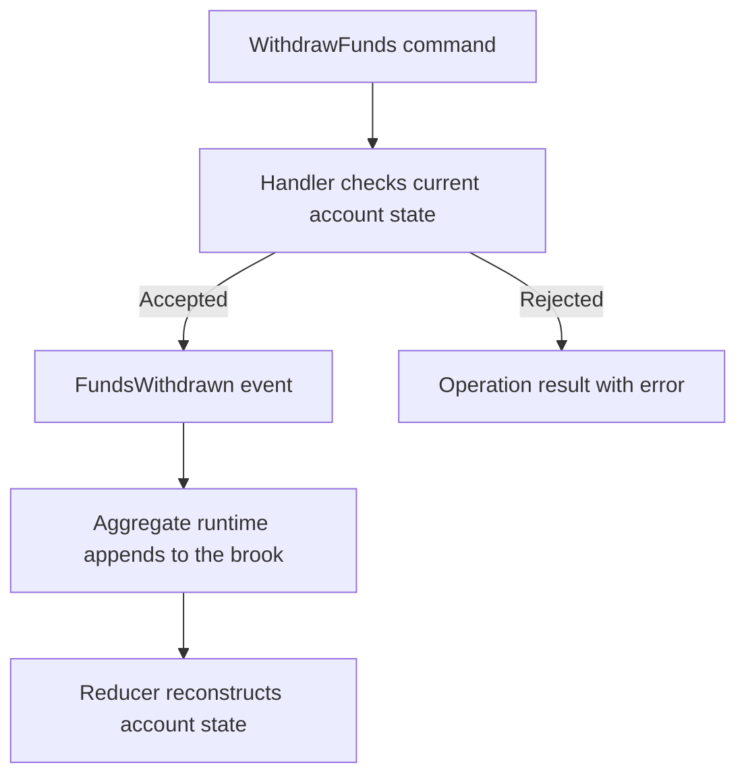

# Building an Aggregate: BankAccount

## Overview

Follow the Spring bank account to implement and verify one business rule: an open account can withdraw a positive amount up to its current balance. You will connect the command, handler, accepted event, and reducer, then verify the generated application builds.

This gives a team a reviewable business operation. The handler explains why a withdrawal is accepted; the event records what was accepted; the reducer explains the resulting balance. An AI assistant can work on those small, named artifacts against the same acceptance tests.

## Before You Begin

- Work in a checkout of the [Mississippi repository](https://github.com/Gibbs-Morris/mississippi) with PowerShell 7 and the .NET SDK selected by its `global.json`.
- Use the existing `samples/Spring` application as the working project. It supplies the domain, host, generator, and test setup for this tutorial.
- Read [Spring host applications](../concepts/host-applications.md) for the project boundaries and [the capability map](../../../reference/capability-map.md) for package ownership and consuming-project analyzer references.

The following code blocks reproduce the selected source files with XML documentation comments omitted. Keep their namespaces and `using` directives when working in Spring. The linked files are the complete, build-verified implementations; the rest of the existing sample remains part of the working project.

## Step 1: Define the State Needed by the Rule

Open `samples/Spring/Spring.Domain/Aggregates/BankAccount/BankAccountAggregate.cs`. Its `IsOpen` and `Balance` properties are the state the withdrawal handler needs to make its decision.

```csharp
using Mississippi.Brooks.Abstractions.Attributes;
using Mississippi.Inlet.Generators.Abstractions;

using Orleans;

namespace MississippiSamples.Spring.Domain.Aggregates.BankAccount;

[BrookName("SPRING", "BANKING", "ACCOUNT")]
[SnapshotStorageName("SPRING", "BANKING", "ACCOUNTSTATE")]
[GenerateAggregateEndpoints]
[GenerateMcpTools]
[GenerateSerializer]
[Alias("MississippiSamples.Spring.Domain.Aggregates.BankAccount.BankAccountAggregate")]
public sealed record BankAccountAggregate
{
    [Id(0)]
    public decimal Balance { get; init; }

    [Id(3)]
    public int DepositCount { get; init; }

    [Id(2)]
    public string HolderName { get; init; } = string.Empty;

    [Id(1)]
    public bool IsOpen { get; init; }

    [Id(4)]
    public int WithdrawalCount { get; init; }
}
```

Complete file: [BankAccountAggregate.cs](https://github.com/Gibbs-Morris/mississippi/blob/main/samples/Spring/Spring.Domain/Aggregates/BankAccount/BankAccountAggregate.cs).

The aggregate's `[BrookName]` identifies the event-stream family `SPRING.BANKING.ACCOUNT`; the entity ID distinguishes individual accounts. `[SnapshotStorageName]` identifies the serialized snapshot type. The Cosmos database and container are separate host configuration.

`[GenerateSerializer]`, `[Alias]`, and `[Id]` describe Orleans serialization. `[GenerateAggregateEndpoints]` opts into generated integration around the reusable aggregate runtime. `[GenerateMcpTools]` opts the commands into generated tool classes. Spring maps the HTTP `/mcp` endpoint only in Development; use the [local MCP how-to](../how-to/mcp-server-vscode-testing.md) to explore those tools.

## Step 2: Express the Request as a Command

Open `samples/Spring/Spring.Domain/Aggregates/BankAccount/Commands/WithdrawFunds.cs`. The command carries the requested amount; the aggregate identity is supplied by the caller's route or grain selection.

```csharp
using Mississippi.Inlet.Generators.Abstractions;

using Orleans;

namespace MississippiSamples.Spring.Domain.Aggregates.BankAccount.Commands;

[GenerateCommand(Route = "withdraw")]
[GenerateMcpToolMetadata(
    Description =
        "Withdraws funds from a bank account. Decreases the account balance by the specified amount. Fails if insufficient funds.",
    Title = "Withdraw Funds",
    Destructive = true,
    Idempotent = false,
    ReadOnly = false,
    OpenWorld = false)]
[GenerateSerializer]
[Alias("MississippiSamples.Spring.Domain.Aggregates.BankAccount.Commands.WithdrawFunds")]
public sealed record WithdrawFunds
{
    [Id(0)]
    [GenerateMcpParameterDescription(
        "The amount to withdraw in the account currency. Must be greater than zero and not exceed the current balance.")]
    public decimal Amount { get; init; }
}
```

Complete file: [WithdrawFunds.cs](https://github.com/Gibbs-Morris/mississippi/blob/main/samples/Spring/Spring.Domain/Aggregates/BankAccount/Commands/WithdrawFunds.cs).

`[GenerateCommand(Route = "withdraw")]` supplies the command's generated route segment. The MCP metadata describes the same operation to tool clients. The business checks belong in the handler, so the operation has one decision path whichever generated interface calls it.

A useful command names business intent. For a withdrawal, prefer `WithdrawFunds` over a generic request to replace account state: the former gives the handler an amount to validate against the current balance. The state-replacement design is an illustrative alternative, not a Mississippi API.

## Step 3: Record the Accepted Fact as an Event

Open `samples/Spring/Spring.Domain/Aggregates/BankAccount/Events/FundsWithdrawn.cs`. This event records the accepted amount, using a past-tense name to distinguish the fact from the request.

```csharp
using Mississippi.Brooks.Abstractions.Attributes;

using Orleans;

namespace MississippiSamples.Spring.Domain.Aggregates.BankAccount.Events;

[EventStorageName("SPRING", "BANKING", "FUNDSWITHDRAWN")]
[GenerateSerializer]
[Alias("MississippiSamples.Spring.Domain.Aggregates.BankAccount.Events.FundsWithdrawn")]
internal sealed record FundsWithdrawn
{
    [Id(0)]
    public decimal Amount { get; init; }
}
```

Complete file: [FundsWithdrawn.cs](https://github.com/Gibbs-Morris/mississippi/blob/main/samples/Spring/Spring.Domain/Aggregates/BankAccount/Events/FundsWithdrawn.cs).

The event's `[EventStorageName]` supplies its persisted type identity. Preserve that identity for stored data when refactoring C# names, and keep the corresponding type registered for reads. The handler will return this event only after its rules accept the command.

## Step 4: Validate the Business Rule in a Handler

Open `samples/Spring/Spring.Domain/Aggregates/BankAccount/Handlers/WithdrawFundsHandler.cs`. The handler receives the command and current aggregate state and returns either accepted events or a failed operation result.

```csharp
using System.Collections.Generic;

using Mississippi.DomainModeling.Abstractions;

using MississippiSamples.Spring.Domain.Aggregates.BankAccount.Commands;
using MississippiSamples.Spring.Domain.Aggregates.BankAccount.Events;

namespace MississippiSamples.Spring.Domain.Aggregates.BankAccount.Handlers;

internal sealed class WithdrawFundsHandler : CommandHandlerBase<WithdrawFunds, BankAccountAggregate>
{
    protected override OperationResult<IReadOnlyList<object>> HandleCore(
        WithdrawFunds command,
        BankAccountAggregate? state
    )
    {
        // Account must be open to withdraw funds
        if (state?.IsOpen != true)
        {
            return OperationResult.Fail<IReadOnlyList<object>>(
                AggregateErrorCodes.InvalidState,
                "Account must be open before withdrawing funds.");
        }

        // Validate withdrawal amount is positive
        if (command.Amount <= 0)
        {
            return OperationResult.Fail<IReadOnlyList<object>>(
                AggregateErrorCodes.InvalidCommand,
                "Withdrawal amount must be positive.");
        }

        // Validate sufficient funds
        if (state.Balance < command.Amount)
        {
            return OperationResult.Fail<IReadOnlyList<object>>(
                AggregateErrorCodes.InvalidCommand,
                "Insufficient funds for withdrawal.");
        }

        return OperationResult.Ok<IReadOnlyList<object>>(
            new object[]
            {
                new FundsWithdrawn
                {
                    Amount = command.Amount,
                },
            });
    }
}
```

Complete file: [WithdrawFundsHandler.cs](https://github.com/Gibbs-Morris/mississippi/blob/main/samples/Spring/Spring.Domain/Aggregates/BankAccount/Handlers/WithdrawFundsHandler.cs).

This excerpt records the current Spring implementation, including its state check before amount checks. New aggregate state can be `null`. When writing a new handler, follow the repository convention: validate command properties first and return `InvalidCommand`, then check aggregate state and return `InvalidState` for state conflicts. Test inputs that violate both conditions to make that classification explicit.

The handler returns `OperationResult<IReadOnlyList<object>>`. A rejected command returns an error code and message; an accepted withdrawal returns one `FundsWithdrawn` event. The aggregate runtime appends accepted events to its brook. Keep state updates in the reducer so both normal execution and reconstruction use the same transition.

### Checkpoint: Predict the Outcome

For an open account with balance 100, a withdrawal of 25 emits an event for 25. Withdrawing the entire 100 is also valid. Withdrawing 101, zero, or a negative amount returns `InvalidCommand`. A positive withdrawal from a closed or new account returns `InvalidState`.

Use these cases to understand the existing operation. For a new implementation brief, also specify the input-first validation convention and include a case with both invalid input and invalid state. The framework's named contracts organize the work; the acceptance cases verify the business decision.

## Step 5: Apply the Event with a Pure Reducer

Open `samples/Spring/Spring.Domain/Aggregates/BankAccount/Reducers/FundsWithdrawnReducer.cs`. It subtracts the recorded amount and increments the withdrawal count by returning a new state value.

```csharp
using System;

using Mississippi.Tributary.Abstractions;

using MississippiSamples.Spring.Domain.Aggregates.BankAccount.Events;

namespace MississippiSamples.Spring.Domain.Aggregates.BankAccount.Reducers;

internal sealed class FundsWithdrawnReducer : EventReducerBase<FundsWithdrawn, BankAccountAggregate>
{
    protected override BankAccountAggregate ReduceCore(
        BankAccountAggregate state,
        FundsWithdrawn @event
    )
    {
        ArgumentNullException.ThrowIfNull(@event);
        return (state ?? new()) with
        {
            Balance = (state?.Balance ?? 0) - @event.Amount,
            WithdrawalCount = (state?.WithdrawalCount ?? 0) + 1,
        };
    }
}
```

Complete file: [FundsWithdrawnReducer.cs](https://github.com/Gibbs-Morris/mississippi/blob/main/samples/Spring/Spring.Domain/Aggregates/BankAccount/Reducers/FundsWithdrawnReducer.cs).

For the accepted withdrawal of 25 from balance 100, the new balance is 75 and the withdrawal count increases by one. The prior state remains available unchanged for assertions and comparison.

`EventReducerBase<TEvent, TProjection>` checks that a reference-type reducer returns a new instance when given a non-null prior state. Use immutable values throughout the state you return. The `with` expression copies the record; collection members in your own aggregates need immutable updates too.

Replay is predictable when reducers are pure: the same initial state, ordered events, and reducer implementation produce the same state. Supply external facts through events instead of reading the clock or calling an API during reduction. This gives both developers and AI assistants explicit inputs to reason about and test.

The reducer applies an accepted fact. Keep acceptance checks in the command handler rather than reconsidering a historical withdrawal while rebuilding state.

## Step 6: Connect the Aggregate to the Application

Spring's generated registrations connect the domain files to the existing hosts:

- [Spring.Runtime/Program.cs](https://github.com/Gibbs-Morris/mississippi/blob/main/samples/Spring/Spring.Runtime/Program.cs) calls `AddBankAccountAggregate()` and configures event storage, snapshot caching, serialization, and Orleans.
- [Spring.Gateway/Program.cs](https://github.com/Gibbs-Morris/mississippi/blob/main/samples/Spring/Spring.Gateway/Program.cs) composes the generated gateway services and mappers.
- [Spring.Client/Program.cs](https://github.com/Gibbs-Morris/mississippi/blob/main/samples/Spring/Spring.Client/Program.cs) calls the generated `AddMississippiSamplesSpringDomainClient()` and adds Inlet/Reservoir client support.

The [runtime registration generator](https://github.com/Gibbs-Morris/mississippi/blob/main/src/Inlet.Runtime.Generators/AggregateSiloRegistrationGenerator.cs) discovers the aggregate's commands, handlers, events, reducers, and effects. The reusable aggregate grain executes the command; generation supplies the registrations and supported gateway/client artifacts around it.

Spring also includes [OpenAccount](https://github.com/Gibbs-Morris/mississippi/blob/main/samples/Spring/Spring.Domain/Aggregates/BankAccount/Commands/OpenAccount.cs) and [DepositFunds](https://github.com/Gibbs-Morris/mississippi/blob/main/samples/Spring/Spring.Domain/Aggregates/BankAccount/Commands/DepositFunds.cs). Their handlers and reducers follow the same pattern, allowing the sample to open an account and establish the balance used by withdrawal scenarios.

## Step 7: Verify the Decision and the Transition

From the repository root, run Spring's domain test project with the canonical quality script:

```powershell
pwsh ./eng/src/agent-scripts/test-project-quality.ps1 -TestProject samples/Spring/Spring.Domain.L0Tests/Spring.Domain.L0Tests.csproj -SourceProject samples/Spring/Spring.Domain/Spring.Domain.csproj -SkipMutation
```

Require exit code 0, `RESULT: PASS`, a nonzero `TEST_TOTAL`, and matching `TEST_PASSED` and `TEST_TOTAL`. The output supplies a TRX path with individual test results. The handler and reducer tests execute without starting the Orleans application or its storage emulators.

Read [WithdrawFundsHandlerTests](https://github.com/Gibbs-Morris/mississippi/blob/main/samples/Spring/Spring.Domain.L0Tests/Aggregates/BankAccount/Handlers/WithdrawFundsHandlerTests.cs) for accepted, closed-account, empty-state, and invalid-amount cases. Read [FundsWithdrawnAggregateReducerTests](https://github.com/Gibbs-Morris/mississippi/blob/main/samples/Spring/Spring.Domain.L0Tests/Aggregates/BankAccount/Reducers/FundsWithdrawnAggregateReducerTests.cs) for state-transition assertions.

Build the consuming projects to check generated integration:

```powershell
pwsh ./build.ps1 -SkipMississippi -Configuration Release
```

Require exit code 0, `ALL REQUESTED BUILDS COMPLETED SUCCESSFULLY`, and zero build warnings and errors. This builds `samples.slnx`, including Spring's runtime, gateway, and client. The domain tests prove the business rule; the build verifies that the configured projects and generated code fit together.

### Checkpoint: Follow the Accepted Command

This diagram separates the business decision from persistence and state reconstruction.



After a successful command, read models and subscribed clients observe changes through the [projection delivery path](../../../concepts/read-models-and-client-sync.md). Verify that path separately when adding a screen; command success and a client update are separate observations.

## Continue with Reactions to Events

Spring demonstrates two post-persistence reactions alongside these rules. [HighValueTransactionEffect](https://github.com/Gibbs-Morris/mississippi/blob/main/samples/Spring/Spring.Domain/Aggregates/BankAccount/Effects/HighValueTransactionEffect.cs) applies the sample's investigation rule to large deposits and dispatches a command to an investigation queue. [WithdrawalNotificationEffect](https://github.com/Gibbs-Morris/mississippi/blob/main/samples/Spring/Spring.Domain/Aggregates/BankAccount/Effects/WithdrawalNotificationEffect.cs) delegates notification work to an injected service in a separate worker grain.

Those are explicit effect boundaries. Keep external work there while handlers decide and reducers reconstruct state. Use the [write-model explanation](../../../concepts/write-model.md) to choose the appropriate effect behavior for your own operation.

## Summary

A business operation has a named command, a handler that decides, an event that records the accepted fact, and a pure reducer that applies it. Spring's tests make the decision and resulting state reviewable; generated integration connects those domain types to the application.

## Next Steps

- [Build projections](./building-projections.md) to present read models of the same events.
- [Build a saga](./building-a-saga.md) to coordinate a transfer across accounts.
- [Build with an AI assistant](../../../how-to/build-with-ai.md) to turn another business rule into a bounded implementation and verification task.
