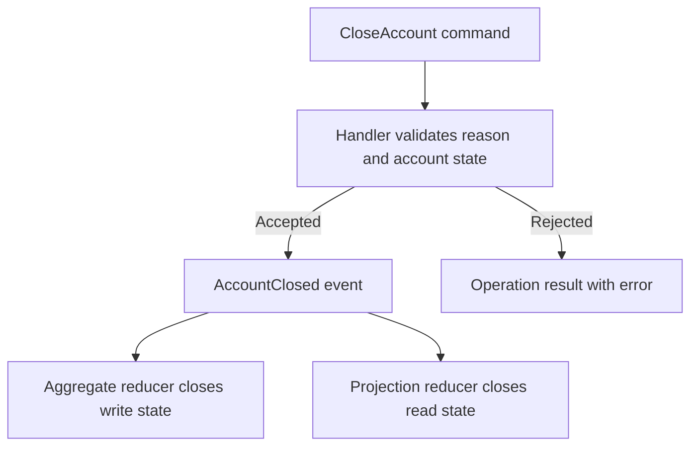

# Add a Command to the BankAccount Aggregate

## Overview

Add an account-closure operation to Spring and verify it with executable tests. You will create six files: a command, an event, a handler, two reducers, and a test class. The existing generators then connect the new operation to Spring's runtime, gateway, and client projects.

The closure policy is application logic for this exercise: require a reason, require an open account, and require a zero balance. Its value is explicit review: a developer or AI assistant can trace each condition to a test, each accepted closure to an event, and that event to both write and read state.

## Before you begin

- Use a disposable checkout of the Mississippi repository with the existing `samples/Spring` application. Keep this exercise on its own branch or worktree.
- Install PowerShell 7 and the .NET SDK selected by the checkout's `global.json`.
- Start with the six file paths below available for creation. Run every command from the repository root.
- Read the existing [BankAccountAggregate](https://github.com/Gibbs-Morris/mississippi/blob/main/samples/Spring/Spring.Domain/Aggregates/BankAccount/BankAccountAggregate.cs) and [BankAccountBalanceProjection](https://github.com/Gibbs-Morris/mississippi/blob/main/samples/Spring/Spring.Domain/Projections/BankAccountBalance/BankAccountBalanceProjection.cs). Both already expose `IsOpen` and `Balance`.

The following are complete files to create in that working project. This exercise adds your own business behavior using the current framework contracts; keep the existing Spring project and generator configuration described in the [capability map](../../../reference/capability-map.md#build-time-generator-references).

## Step 1: Create the Command

Create `samples/Spring/Spring.Domain/Aggregates/BankAccount/Commands/CloseAccount.cs` with this content:

```csharp
using Mississippi.Inlet.Generators.Abstractions;

using Orleans;


namespace MississippiSamples.Spring.Domain.Aggregates.BankAccount.Commands;

/// <summary>
///     Requests account closure through generated gateway and client code.
/// </summary>
[GenerateCommand(Route = "close")]
[GenerateSerializer]
[Alias("MississippiSamples.Spring.Domain.Aggregates.BankAccount.Commands.CloseAccount")]
public sealed record CloseAccount
{
    /// <summary>
    ///     Gets the business reason for closing the account.
    /// </summary>
    [Id(0)]
    public required string Reason { get; init; }
}
```

The command names intent and carries the reason. `[GenerateCommand]` gives it the `close` route segment. The public command type is available to generated host code; Orleans serialization uses the explicit alias and member ID.

## Step 2: Create the Accepted Event

Create `samples/Spring/Spring.Domain/Aggregates/BankAccount/Events/AccountClosed.cs`:

```csharp
using Mississippi.Brooks.Abstractions.Attributes;

using Orleans;


namespace MississippiSamples.Spring.Domain.Aggregates.BankAccount.Events;

/// <summary>
///     Records an accepted account closure.
/// </summary>
[EventStorageName("SPRING", "BANKING", "ACCOUNTCLOSED", 1)]
[GenerateSerializer]
[Alias("MississippiSamples.Spring.Domain.Aggregates.BankAccount.Events.AccountClosed")]
internal sealed record AccountClosed
{
    /// <summary>
    ///     Gets the recorded closure reason.
    /// </summary>
    [Id(0)]
    public required string Reason { get; init; }
}
```

`AccountClosed` records an accepted fact. Its versioned storage name identifies the event payload in persisted history. The handler below decides when that fact may be recorded.

## Step 3: Create the Business-Rule Handler

Create `samples/Spring/Spring.Domain/Aggregates/BankAccount/Handlers/CloseAccountHandler.cs`:

```csharp
using System.Collections.Generic;

using Mississippi.DomainModeling.Abstractions;

using MississippiSamples.Spring.Domain.Aggregates.BankAccount.Commands;
using MississippiSamples.Spring.Domain.Aggregates.BankAccount.Events;


namespace MississippiSamples.Spring.Domain.Aggregates.BankAccount.Handlers;

/// <summary>
///     Validates account closure before emitting an accepted event.
/// </summary>
internal sealed class CloseAccountHandler : CommandHandlerBase<CloseAccount, BankAccountAggregate>
{
    /// <inheritdoc />
    protected override OperationResult<IReadOnlyList<object>> HandleCore(
        CloseAccount command,
        BankAccountAggregate? state
    )
    {
        if (string.IsNullOrWhiteSpace(command.Reason))
        {
            return OperationResult.Fail<IReadOnlyList<object>>(
                AggregateErrorCodes.InvalidCommand,
                "A closure reason is required.");
        }

        if (state?.IsOpen != true)
        {
            return OperationResult.Fail<IReadOnlyList<object>>(
                AggregateErrorCodes.InvalidState,
                "Account must be open before closing.");
        }

        if (state.Balance != 0m)
        {
            return OperationResult.Fail<IReadOnlyList<object>>(
                AggregateErrorCodes.InvalidState,
                "The balance must be zero before closing.");
        }

        return OperationResult.Ok<IReadOnlyList<object>>(
            new object[]
            {
                new AccountClosed
                {
                    Reason = command.Reason,
                },
            });
    }
}
```

Validate command data first, then aggregate state. A missing reason is `InvalidCommand` even when the account is new. A valid request against an unopened, closed, or funded account is `InvalidState`. A successful result contains one event; the aggregate runtime owns persistence.

### Checkpoint: Predict the Decision

| Reason | Account state | Outcome |
| --- | --- | --- |
| Missing, empty, or whitespace | Any state, including new | `InvalidCommand` |
| Customer request | New or already closed | `InvalidState` |
| Customer request | Open with nonzero balance | `InvalidState` |
| Customer request | Open with zero balance | One `AccountClosed` event carrying the reason |

Give an AI assistant this table as an acceptance contract. A generic request to set `IsOpen` to false would hide these rules; the named command keeps the decision in one handler.

## Step 4: Update Aggregate State with a Reducer

Create `samples/Spring/Spring.Domain/Aggregates/BankAccount/Reducers/AccountClosedReducer.cs`:

```csharp
using System;

using Mississippi.Tributary.Abstractions;

using MississippiSamples.Spring.Domain.Aggregates.BankAccount.Events;


namespace MississippiSamples.Spring.Domain.Aggregates.BankAccount.Reducers;

/// <summary>
///     Applies an accepted closure to aggregate state.
/// </summary>
internal sealed class AccountClosedReducer : EventReducerBase<AccountClosed, BankAccountAggregate>
{
    /// <inheritdoc />
    protected override BankAccountAggregate ReduceCore(
        BankAccountAggregate state,
        AccountClosed eventData
    )
    {
        ArgumentNullException.ThrowIfNull(eventData);
        return (state ?? new()) with
        {
            IsOpen = false,
        };
    }
}
```

The reducer applies the accepted event by returning a new record with `IsOpen` set to false. It uses a default state when no initial state is supplied and preserves the other fields when state exists. Keep acceptance checks in the handler so reconstruction applies recorded facts consistently.

Pure reducers make replay predictable: the same initial state, ordered events, and reducer implementation produce the same state. Keep external calls and time-dependent decisions outside this transition.

## Step 5: Update the Read Model

Create `samples/Spring/Spring.Domain/Projections/BankAccountBalance/Reducers/AccountClosedProjectionReducer.cs`:

```csharp
using System;

using Mississippi.Tributary.Abstractions;

using MississippiSamples.Spring.Domain.Aggregates.BankAccount.Events;


namespace MississippiSamples.Spring.Domain.Projections.BankAccountBalance.Reducers;

/// <summary>
///     Applies an accepted closure to the balance read model.
/// </summary>
internal sealed class AccountClosedProjectionReducer : EventReducerBase<AccountClosed, BankAccountBalanceProjection>
{
    /// <inheritdoc />
    protected override BankAccountBalanceProjection ReduceCore(
        BankAccountBalanceProjection state,
        AccountClosed eventData
    )
    {
        ArgumentNullException.ThrowIfNull(eventData);
        return (state ?? new()) with
        {
            IsOpen = false,
        };
    }
}
```

The balance projection exposes account status to clients. Applying the same closure event keeps its `IsOpen` value aligned with aggregate state. You define the read-model transition; the existing projection path, generated DTOs, and delivery code continue to carry that state.

Aggregate and projection types share the `SPRING.BANKING.ACCOUNT` brook family. Their snapshot storage names identify their separate state shapes. Database and container names remain host configuration.

## Step 6: Create the Acceptance Tests

Create `samples/Spring/Spring.Domain.L0Tests/Aggregates/BankAccount/AccountClosureTests.cs`. The existing test project's [global imports](https://github.com/Gibbs-Morris/mississippi/blob/main/samples/Spring/Spring.Domain.L0Tests/GlobalUsings.cs) supply xUnit.

```csharp
using System.Collections.Generic;

using Mississippi.DomainModeling.Abstractions;

using MississippiSamples.Spring.Domain.Aggregates.BankAccount;
using MississippiSamples.Spring.Domain.Aggregates.BankAccount.Events;
using MississippiSamples.Spring.Domain.Aggregates.BankAccount.Handlers;
using MississippiSamples.Spring.Domain.Aggregates.BankAccount.Reducers;
using MississippiSamples.Spring.Domain.Projections.BankAccountBalance;
using MississippiSamples.Spring.Domain.Projections.BankAccountBalance.Reducers;


namespace MississippiSamples.Spring.Domain.L0Tests.Aggregates.BankAccount;

/// <summary>
///     Verifies closure decisions and the write/read state transitions.
/// </summary>
public sealed class AccountClosureTests
{
    /// <summary>
    ///     A closed account rejects another closure.
    /// </summary>
    [Fact]
    public void ClosedAccountIsRejected()
    {
        OperationResult<IReadOnlyList<object>> result = new CloseAccountHandler().Handle(
            new()
            {
                Reason = "Customer request",
            },
            new());
        Assert.False(result.Success);
        Assert.Equal(AggregateErrorCodes.InvalidState, result.ErrorCode);
    }

    /// <summary>
    ///     An accepted closure updates both models without mutating their inputs.
    /// </summary>
    [Fact]
    public void ClosureEmitsAnEventAndUpdatesBothModels()
    {
        BankAccountAggregate aggregate = new()
        {
            IsOpen = true,
            HolderName = "Tutorial holder",
        };
        OperationResult<IReadOnlyList<object>> result = new CloseAccountHandler().Handle(
            new()
            {
                Reason = "Customer request",
            },
            aggregate);
        Assert.True(result.Success);
        IReadOnlyList<object>? events = result.Value;
        Assert.NotNull(events);
        AccountClosed closed = Assert.IsType<AccountClosed>(Assert.Single(events));
        Assert.Equal("Customer request", closed.Reason);
        BankAccountAggregate nextAggregate = new AccountClosedReducer().Reduce(aggregate, closed);
        Assert.False(nextAggregate.IsOpen);
        Assert.True(aggregate.IsOpen);
        Assert.Equal(aggregate.Balance, nextAggregate.Balance);
        Assert.Equal(aggregate.HolderName, nextAggregate.HolderName);
        BankAccountBalanceProjection projection = new()
        {
            IsOpen = true,
            HolderName = aggregate.HolderName,
        };
        BankAccountBalanceProjection nextProjection = new AccountClosedProjectionReducer().Reduce(projection, closed);
        Assert.False(nextProjection.IsOpen);
        Assert.True(projection.IsOpen);
        Assert.Equal(projection.Balance, nextProjection.Balance);
        Assert.Equal(projection.HolderName, nextProjection.HolderName);
    }

    /// <summary>
    ///     Invalid command data takes precedence over a missing aggregate.
    /// </summary>
    /// <param name="reason">The invalid closure reason.</param>
    [Theory]
    [InlineData(null)]
    [InlineData("")]
    [InlineData(" ")]
    public void InvalidReasonIsCheckedBeforeState(
        string? reason
    )
    {
        OperationResult<IReadOnlyList<object>> result = new CloseAccountHandler().Handle(
            new()
            {
                Reason = reason!,
            },
            null);
        Assert.False(result.Success);
        Assert.Equal(AggregateErrorCodes.InvalidCommand, result.ErrorCode);
    }

    /// <summary>
    ///     An account must have zero balance before it can close.
    /// </summary>
    /// <param name="balance">The nonzero account balance.</param>
    [Theory]
    [InlineData(-1)]
    [InlineData(1)]
    public void NonzeroBalanceIsRejected(
        int balance
    )
    {
        OperationResult<IReadOnlyList<object>> result = new CloseAccountHandler().Handle(
            new()
            {
                Reason = "Customer request",
            },
            new()
            {
                IsOpen = true,
                Balance = balance,
            });
        Assert.False(result.Success);
        Assert.Equal(AggregateErrorCodes.InvalidState, result.ErrorCode);
    }

    /// <summary>
    ///     Both reducers can apply a recorded closure to default initial state.
    /// </summary>
    [Fact]
    public void ReducersAcceptDefaultInitialState()
    {
        AccountClosed closed = new()
        {
            Reason = "Customer request",
        };
        BankAccountAggregate aggregate = new AccountClosedReducer().Reduce(null!, closed);
        BankAccountBalanceProjection projection = new AccountClosedProjectionReducer().Reduce(null!, closed);
        Assert.False(aggregate.IsOpen);
        Assert.False(projection.IsOpen);
        Assert.Equal(0m, aggregate.Balance);
        Assert.Equal(0m, projection.Balance);
    }

    /// <summary>
    ///     A valid reason still requires an existing open account.
    /// </summary>
    [Fact]
    public void UnopenedAccountIsRejected()
    {
        OperationResult<IReadOnlyList<object>> result = new CloseAccountHandler().Handle(
            new()
            {
                Reason = "Customer request",
            },
            null);
        Assert.False(result.Success);
        Assert.Equal(AggregateErrorCodes.InvalidState, result.ErrorCode);
    }
}
```

These tests check rejection boundaries, command-first validation, the exact accepted event, immutable updates to both models, and reduction from default initial state. They execute the business code without starting Orleans or storage emulators.

## Step 7: Run the Tests and Build Generated Integration

Run the domain quality command after creating all six files:

```powershell
pwsh ./eng/src/agent-scripts/test-project-quality.ps1 -TestProject samples/Spring/Spring.Domain.L0Tests/Spring.Domain.L0Tests.csproj -SourceProject samples/Spring/Spring.Domain/Spring.Domain.csproj -SkipMutation
```

Require exit code 0, `RESULT: PASS`, a nonzero `TEST_TOTAL`, and matching `TEST_PASSED` and `TEST_TOTAL`. Inspect the emitted TRX report and confirm that all nine `AccountClosureTests` cases executed successfully.

Build the consuming sample projects:

```powershell
pwsh ./build.ps1 -SkipMississippi -Configuration Release
```

Require exit code 0, `ALL REQUESTED BUILDS COMPLETED SUCCESSFULLY`, and zero warnings and errors. This compiles the runtime, gateway, and client with the new domain types. Spring's existing `AddBankAccountAggregate()` and projection registration calls use the updated generated registrations after the build.

The [aggregate registration generator](https://github.com/Gibbs-Morris/mississippi/blob/main/src/Inlet.Runtime.Generators/AggregateSiloRegistrationGenerator.cs) discovers the command, handler, event, and aggregate reducer. The [projection registration generator](https://github.com/Gibbs-Morris/mississippi/blob/main/src/Inlet.Runtime.Generators/ProjectionSiloRegistrationGenerator.cs) discovers the projection reducer. The reusable aggregate grain executes the operation; source generation supplies integration around it.

### Checkpoint: Trace the Result

This diagram connects the rule you wrote to the two state transitions you tested.



When adding a UI interaction, use the generated command action and observe the projection through the [client synchronization path](../../../concepts/read-models-and-client-sync.md). Command completion and the client-visible projection update are separate observations.

For local AI tool exploration, Spring maps the HTTP `/mcp` endpoint only in Development. Follow the [local MCP how-to](../how-to/mcp-server-vscode-testing.md) for that environment and setup.

## Clean Up the Exercise

Keep the six files when continuing development. To restore the tutorial checkout, remove only the files you created, then rebuild the sample:

```powershell
Remove-Item -LiteralPath @(
    'samples/Spring/Spring.Domain/Aggregates/BankAccount/Commands/CloseAccount.cs',
    'samples/Spring/Spring.Domain/Aggregates/BankAccount/Events/AccountClosed.cs',
    'samples/Spring/Spring.Domain/Aggregates/BankAccount/Handlers/CloseAccountHandler.cs',
    'samples/Spring/Spring.Domain/Aggregates/BankAccount/Reducers/AccountClosedReducer.cs',
    'samples/Spring/Spring.Domain/Projections/BankAccountBalance/Reducers/AccountClosedProjectionReducer.cs',
    'samples/Spring/Spring.Domain.L0Tests/Aggregates/BankAccount/AccountClosureTests.cs'
)
pwsh ./build.ps1 -SkipMississippi -Configuration Release
```

## Summary

You added a business operation with explicit validation, an accepted event, write and read reducers, and executable acceptance tests. These are small artifacts an AI assistant can implement against a defined policy while generators connect the supported application surfaces.

## Next Steps

- [Build projections](./building-projections.md) for more views of the same events.
- [Build a saga](./building-a-saga.md) to coordinate work across accounts.
- [Build with an AI assistant](../../../how-to/build-with-ai.md) to specify another operation and its verification.

## Framework Contracts

- [CommandHandlerBase](https://github.com/Gibbs-Morris/mississippi/blob/main/src/DomainModeling.Abstractions/CommandHandlerBase.cs) accepts a command and current state and returns events or a failure result.
- [OperationResult](https://github.com/Gibbs-Morris/mississippi/blob/main/src/DomainModeling.Abstractions/OperationResult.cs) carries success values or error codes and messages.
- [EventReducerBase](https://github.com/Gibbs-Morris/mississippi/blob/main/src/Tributary.Abstractions/EventReducerBase.cs) applies an event and checks that reference state is replaced.
