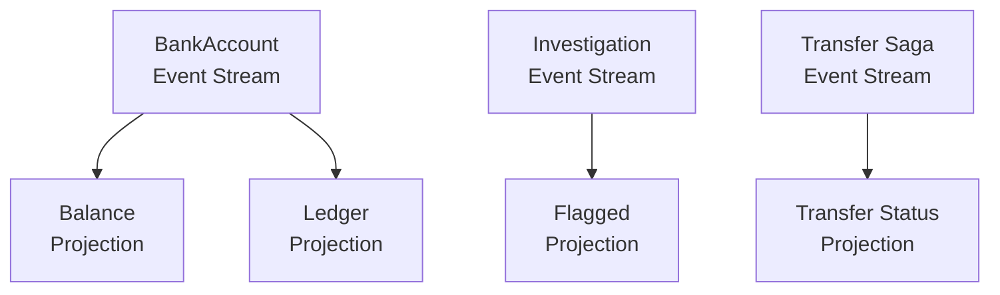

# Building Projections: Read-Optimized Views

## Overview

Aggregates store internal state for command validation. Projections build **read-optimized views** from the same event streams. A single event stream can feed multiple projections, each tailored for a different read pattern.

The money-transfer status projection is also Spring's operator-facing recovery view. It mirrors saga phase plus blocked/manual-resume metadata without inflating the raw saga state itself.

Spring defines four projections from three event streams:

| Projection | Subscribes To | Purpose |
|------------|--------------|---------|
| `BankAccountBalanceProjection` | BankAccount events | Current balance and account status |
| `BankAccountLedgerProjection` | BankAccount events | Last 20 transactions |
| `FlaggedTransactionsProjection` | TransactionInvestigationQueue events | Last 30 flagged high-value deposits |
| `MoneyTransferStatusProjection` | MoneyTransferSaga events | Saga phase, pending step, blocked/manual resume metadata |



## Before You Begin

Before following this tutorial, read these pages:

- [Spring Sample App](../index.md)
- [Building an Aggregate](./building-an-aggregate.md)
- [Building a Saga](./building-a-saga.md)

## Step 1: Define the Projection State

A projection state record is similar to an aggregate state record. It uses `[BrookName]` to subscribe to the correct event stream and `[GenerateProjectionEndpoints]` to generate API and SignalR infrastructure.

### BankAccountBalanceProjection

```csharp
[ProjectionPath("bank-account-balance")]
[BrookName("SPRING", "BANKING", "ACCOUNT")]
[SnapshotStorageName("SPRING", "BANKING", "ACCOUNTBALANCE")]
[GenerateProjectionEndpoints]
[GenerateSerializer]
[Alias("Spring.Domain.Projections.BankAccountBalance.BankAccountBalanceProjection")]
public sealed record BankAccountBalanceProjection
{
    [Id(0)] public decimal Balance { get; init; }
    [Id(1)] public string HolderName { get; init; } = string.Empty;
    [Id(2)] public bool IsOpen { get; init; }
}
```

Key attributes:

| Attribute | Purpose |
|-----------|---------|
| `[ProjectionPath]` | Defines the API and SignalR path for this projection |
| `[BrookName]` | Subscribes to the same event stream as the BankAccount aggregate |
| `[SnapshotStorageName]` | Separate snapshot storage from the aggregate |
| `[GenerateProjectionEndpoints]` | Source-generates API endpoints and real-time SignalR subscriptions |

The projection uses a different `[SnapshotStorageName]` from the aggregate even though it subscribes to the same brook. This ensures the aggregate and projection snapshots are stored independently.

([BankAccountBalanceProjection.cs](https://github.com/Gibbs-Morris/mississippi/blob/main/samples/Spring/Spring.Domain/Projections/BankAccountBalance/BankAccountBalanceProjection.cs))

## Step 2: Write Projection EventReducers

Projection `EventReducer`s work the same way as aggregate `EventReducer`s. They extend `EventReducerBase<TEvent, TProjection>` and return new state from events.

### AccountOpenedBalanceReducer

```csharp
internal sealed class AccountOpenedBalanceReducer
    : EventReducerBase<AccountOpened, BankAccountBalanceProjection>
{
    protected override BankAccountBalanceProjection ReduceCore(
        BankAccountBalanceProjection state,
        AccountOpened eventData)
    {
        ArgumentNullException.ThrowIfNull(eventData);
        return state with
        {
            HolderName = eventData.HolderName,
            Balance = eventData.InitialDeposit,
            IsOpen = true,
        };
    }
}
```

### FundsDepositedBalanceReducer

```csharp
internal sealed class FundsDepositedBalanceReducer
    : EventReducerBase<FundsDeposited, BankAccountBalanceProjection>
{
    protected override BankAccountBalanceProjection ReduceCore(
        BankAccountBalanceProjection state,
        FundsDeposited eventData)
    {
        ArgumentNullException.ThrowIfNull(eventData);
        return state with { Balance = state.Balance + eventData.Amount };
    }
}
```

### FundsWithdrawnBalanceReducer

```csharp
internal sealed class FundsWithdrawnBalanceReducer
    : EventReducerBase<FundsWithdrawn, BankAccountBalanceProjection>
{
    protected override BankAccountBalanceProjection ReduceCore(
        BankAccountBalanceProjection state,
        FundsWithdrawn eventData)
    {
        ArgumentNullException.ThrowIfNull(eventData);
        return state with { Balance = state.Balance - eventData.Amount };
    }
}
```

These `EventReducer`s subscribe to the same events as the aggregate's `EventReducer`s but apply them to a different state type. The balance projection extracts only the fields needed for displaying a balance - it does not track `DepositCount` or `WithdrawalCount`.

([AccountOpenedBalanceReducer.cs](https://github.com/Gibbs-Morris/mississippi/blob/main/samples/Spring/Spring.Domain/Projections/BankAccountBalance/Reducers/AccountOpenedBalanceReducer.cs) |
[FundsDepositedBalanceReducer.cs](https://github.com/Gibbs-Morris/mississippi/blob/main/samples/Spring/Spring.Domain/Projections/BankAccountBalance/Reducers/FundsDepositedBalanceReducer.cs) |
[FundsWithdrawnBalanceReducer.cs](https://github.com/Gibbs-Morris/mississippi/blob/main/samples/Spring/Spring.Domain/Projections/BankAccountBalance/Reducers/FundsWithdrawnBalanceReducer.cs))

## Checkpoint 1

At this point, your projection implementation should include:

- one projection state record with `ProjectionPath`, `BrookName`, and snapshot metadata
- reducer types that apply the relevant events to projection state
- a clear separation between aggregate state and read-model state

## A Richer Projection: BankAccountLedger

The ledger projection demonstrates a more complex read model. It maintains a sliding window of the last 20 transactions with entry types and sequence numbers.

### Projection State

```csharp
[ProjectionPath("bank-account-ledger")]
[BrookName("SPRING", "BANKING", "ACCOUNT")]
[SnapshotStorageName("SPRING", "BANKING", "ACCOUNTLEDGER")]
[GenerateProjectionEndpoints]
[GenerateSerializer]
public sealed record BankAccountLedgerProjection
{
    public const int MaxEntries = 20;

    [Id(0)] public ImmutableArray<LedgerEntry> Entries { get; init; } = [];
    [Id(1)] public long CurrentSequence { get; init; }
}
```

### Supporting Types

```csharp
[GenerateSerializer]
public sealed record LedgerEntry
{
    [Id(0)] public LedgerEntryType EntryType { get; init; }
    [Id(1)] public decimal Amount { get; init; }
    [Id(2)] public long Sequence { get; init; }
}

[GenerateSerializer]
public enum LedgerEntryType
{
    Deposit,
    Withdrawal,
}
```

### Ledger EventReducers

The ledger `EventReducer`s prepend new entries and enforce the sliding window limit:

```csharp
internal sealed class FundsDepositedLedgerReducer
    : EventReducerBase<FundsDeposited, BankAccountLedgerProjection>
{
    protected override BankAccountLedgerProjection ReduceCore(
        BankAccountLedgerProjection state,
        FundsDeposited eventData)
    {
        ArgumentNullException.ThrowIfNull(eventData);
        long newSequence = state.CurrentSequence + 1;
        LedgerEntry entry = new()
        {
            EntryType = LedgerEntryType.Deposit,
            Amount = eventData.Amount,
            Sequence = newSequence,
        };
        ImmutableArray<LedgerEntry> entries = state.Entries
            .Prepend(entry)
            .Take(BankAccountLedgerProjection.MaxEntries)
            .ToImmutableArray();
        return state with
        {
            Entries = entries,
            CurrentSequence = newSequence,
        };
    }
}
```

This `EventReducer` creates a new entry, prepends it to the list, and trims to the max of 20 entries. The same pattern applies to the `FundsWithdrawnLedgerReducer`.

([BankAccountLedgerProjection.cs](https://github.com/Gibbs-Morris/mississippi/blob/main/samples/Spring/Spring.Domain/Projections/BankAccountLedger/BankAccountLedgerProjection.cs) |
[LedgerEntry.cs](https://github.com/Gibbs-Morris/mississippi/blob/main/samples/Spring/Spring.Domain/Projections/BankAccountLedger/LedgerEntry.cs) |
[FundsDepositedLedgerReducer.cs](https://github.com/Gibbs-Morris/mississippi/blob/main/samples/Spring/Spring.Domain/Projections/BankAccountLedger/Reducers/FundsDepositedLedgerReducer.cs))

## Cross-Aggregate Projection: FlaggedTransactions

The `FlaggedTransactionsProjection` subscribes to events from the `TransactionInvestigationQueueAggregate` - a different aggregate than BankAccount. This demonstrates that projections subscribe to event streams, not to aggregates.

```csharp
[ProjectionPath("flagged-transactions")]
[BrookName("SPRING", "COMPLIANCE", "INVESTIGATION")]
[SnapshotStorageName("SPRING", "COMPLIANCE", "FLAGGEDTXPROJECTION")]
[GenerateProjectionEndpoints]
[GenerateSerializer]
public sealed record FlaggedTransactionsProjection
{
    public const int MaxEntries = 30;

    [Id(0)] public ImmutableArray<FlaggedTransaction> Entries { get; init; } = [];
    [Id(1)] public long CurrentSequence { get; init; }
}
```

The `[BrookName("SPRING", "COMPLIANCE", "INVESTIGATION")]` matches the `TransactionInvestigationQueueAggregate` brook name. The projection `EventReducer` listens for `TransactionFlagged` events and builds a sliding window of flagged transactions.

([FlaggedTransactionsProjection.cs](https://github.com/Gibbs-Morris/mississippi/blob/main/samples/Spring/Spring.Domain/Projections/FlaggedTransactions/FlaggedTransactionsProjection.cs) |
[TransactionFlaggedProjectionReducer.cs](https://github.com/Gibbs-Morris/mississippi/blob/main/samples/Spring/Spring.Domain/Projections/FlaggedTransactions/Reducers/TransactionFlaggedProjectionReducer.cs))

## Saga Status Projection: MoneyTransferStatus

The `MoneyTransferStatusProjection` demonstrates a projection over a saga's event stream. The `[GenerateSagaStatusReducers]` attribute tells Mississippi to source-generate event reducers that automatically track saga phase, pending work, blocked/manual resume state, and terminal timestamps - you do not write event reducers for saga status projections.

```csharp
[ProjectionPath("money-transfer-status")]
[BrookName("SPRING", "BANKING", "TRANSFER")]
[SnapshotStorageName("SPRING", "BANKING", "TRANSFERSTATUS")]
[GenerateProjectionEndpoints]
[GenerateMcpReadTool(
    Title = "Get Money Transfer Status",
    Description = "Retrieves the current status and phase of a money transfer saga.")]
[GenerateSerializer]
[GenerateSagaStatusReducers]
[Alias("MississippiSamples.Spring.Domain.Projections.MoneyTransferStatus.MoneyTransferStatusProjection")]
public sealed record MoneyTransferStatusProjection
{
    [Id(14)] public int AutomaticAttemptCount { get; init; }
    [Id(11)] public string? BlockedReason { get; init; }
    [Id(5)] public DateTimeOffset? CompletedAt { get; init; }
    [Id(2)] public string? ErrorCode { get; init; }
    [Id(3)] public string? ErrorMessage { get; init; }
    [Id(13)] public DateTimeOffset? LastResumeAttemptedAt { get; init; }
    [Id(12)] public SagaResumeSource? LastResumeSource { get; init; }
    [Id(1)] public int LastCompletedStepIndex { get; init; } = -1;
    [Id(7)] public SagaExecutionDirection? PendingDirection { get; init; }
    [Id(8)] public int? PendingStepIndex { get; init; }
    [Id(9)] public string? PendingStepName { get; init; }
    [Id(0)] public SagaPhase Phase { get; init; } = SagaPhase.NotStarted;
    [Id(6)] public SagaRecoveryMode RecoveryMode { get; init; } = SagaRecoveryMode.Automatic;
    [Id(10)] public SagaResumeDisposition ResumeDisposition { get; init; } = SagaResumeDisposition.Idle;
    [Id(4)] public DateTimeOffset? StartedAt { get; init; }
}
```

The `[GenerateSagaStatusReducers]` attribute does all the work. No manual event reducers needed.

`MoneyTransferStatusProjection` mirrors the same operator-facing concepts that `SagaRuntimeStatus` exposes:

| Field group | Meaning |
|-------------|---------|
| `Phase`, `LastCompletedStepIndex`, `StartedAt`, `CompletedAt` | Core workflow progress |
| `RecoveryMode`, `ResumeDisposition` | Whether the saga is automatic, manual-only, idle, blocked, or terminal |
| `PendingDirection`, `PendingStepIndex`, `PendingStepName` | The next resumable work item |
| `BlockedReason`, `LastResumeSource`, `LastResumeAttemptedAt`, `AutomaticAttemptCount` | Operator diagnostics for retries and manual intervention |

Two of the fields are nullable enums: `PendingDirection` and `LastResumeSource`. Generated gateway and client DTOs handle those nullable enum surfaces automatically, so the Spring UI can bind them directly without custom adapter code.

([MoneyTransferStatusProjection.cs](https://github.com/Gibbs-Morris/mississippi/blob/main/samples/Spring/Spring.Domain/Projections/MoneyTransferStatus/MoneyTransferStatusProjection.cs))

## Checkpoint 2

Before moving on, verify these tutorial outcomes in the Spring sample source:

- the balance and ledger projections subscribe to the bank-account brook
- the flagged-transactions projection subscribes to the compliance brook
- the saga-status projection includes recovery metadata fields such as `RecoveryMode`, `ResumeDisposition`, and `PendingStepName`
- the saga-status projection uses generated saga status reducers instead of manual reducers

## The Complete Projections File Structure

```text
Projections/
├── BankAccountBalance/
│   ├── BankAccountBalanceProjection.cs
│   └── Reducers/
│       ├── AccountOpenedBalanceReducer.cs
│       ├── FundsDepositedBalanceReducer.cs
│       └── FundsWithdrawnBalanceReducer.cs
├── BankAccountLedger/
│   ├── BankAccountLedgerProjection.cs
│   ├── LedgerEntry.cs
│   ├── LedgerEntryType.cs
│   └── Reducers/
│       ├── FundsDepositedLedgerReducer.cs
│       └── FundsWithdrawnLedgerReducer.cs
├── FlaggedTransactions/
│   ├── FlaggedTransactionsProjection.cs
│   ├── FlaggedTransaction.cs
│   └── Reducers/
│       └── TransactionFlaggedProjectionReducer.cs
└── MoneyTransferStatus/
    └── MoneyTransferStatusProjection.cs   ← no reducers folder (source-generated)
```

## Key Design Decisions

| Decision | Rationale |
|----------|-----------|
| One projection per read concern | Balance view, ledger view, and flagged view serve different UI components |
| Separate snapshot storage names | Aggregate and projection snapshots are independent - rebuilding one does not affect the other |
| Sliding window via `ImmutableArray` | Pure functional state - prepend, take, return new array |
| `[GenerateSagaStatusReducers]` for saga projections | Saga lifecycle and recovery metadata follow a standard pattern that can be fully generated |
| Keep raw saga state separate from the status projection | Operator tooling gets recovery metadata without exposing command-validation state |
| Projections are `public` | Unlike domain events (which are `internal` to `Spring.Domain`), projections are the public read API |

## Summary

Projections in Mississippi are read-optimized state records with their own `EventReducer`s. They subscribe to event streams via `[BrookName]`, maintain independent snapshots, and are served through source-generated API endpoints and real-time SignalR subscriptions. A single event stream can feed multiple projections, each shaped for a specific read pattern, including operator-facing recovery views like `MoneyTransferStatusProjection`.

## Next Steps

- [Host Architecture](../concepts/host-applications.md) - See how projections are wired into the host with one registration call
- [Key Concepts](../concepts/key-concepts.md) - Revisit the concept reference
