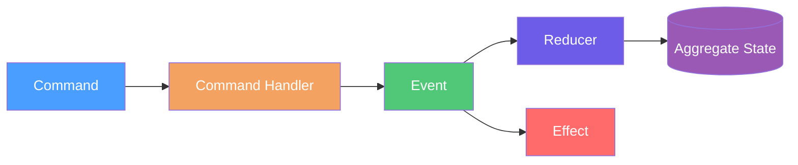

# Aggregates

## Overview

Aggregates coordinate command handling, event creation, reduction, and effects for a single brook. Command handlers use
`CommandHandlerBase<TCommand, TSnapshot>` and return `OperationResult<IReadOnlyList<object>>` with events to persist
([CommandHandlerBase](https://github.com/Gibbs-Morris/mississippi/blob/main/src/EventSourcing.Aggregates.Abstractions/CommandHandlerBase.cs#L7-L65),
[OperationResult](https://github.com/Gibbs-Morris/mississippi/blob/main/src/EventSourcing.Aggregates.Abstractions/OperationResult.cs#L9-L195)).
Reducers use `EventReducerBase<TEvent, TProjection>` and enforce immutable updates
([EventReducerBase](https://github.com/Gibbs-Morris/mississippi/blob/main/src/EventSourcing.Reducers.Abstractions/EventReducerBase.cs#L6-L57)).
Effects implement `IEventEffect<TAggregate>` and run after events are persisted
([IEventEffect](https://github.com/Gibbs-Morris/mississippi/blob/main/src/EventSourcing.Aggregates.Abstractions/IEventEffect.cs#L7-L57)).

## Key Contracts

| Contract | Purpose |
| --- | --- |
| [`CommandHandlerBase<TCommand, TSnapshot>`](https://github.com/Gibbs-Morris/mississippi/blob/main/src/EventSourcing.Aggregates.Abstractions/CommandHandlerBase.cs#L7-L65) | Base class for command handlers and their `HandleCore` implementations. |
| [`EventReducerBase<TEvent, TProjection>`](https://github.com/Gibbs-Morris/mississippi/blob/main/src/EventSourcing.Reducers.Abstractions/EventReducerBase.cs#L6-L57) | Base class for reducers with `Reduce`, `TryReduce`, and immutability checks. |
| [`IEventEffect<TAggregate>`](https://github.com/Gibbs-Morris/mississippi/blob/main/src/EventSourcing.Aggregates.Abstractions/IEventEffect.cs#L7-L57) | Effect contract for post-persist processing. |
| [`EventEffectBase<TEvent, TAggregate>`](https://github.com/Gibbs-Morris/mississippi/blob/main/src/EventSourcing.Aggregates.Abstractions/EventEffectBase.cs#L9-L71) | Strongly typed base for event effects. |
| [`BrookNameAttribute`](https://github.com/Gibbs-Morris/mississippi/blob/main/src/EventSourcing.Brooks.Abstractions/Attributes/BrookNameAttribute.cs#L7-L73) | Brook naming with validation. |
| [`SnapshotStorageNameAttribute`](https://github.com/Gibbs-Morris/mississippi/blob/main/src/EventSourcing.Brooks.Abstractions/Attributes/SnapshotStorageNameAttribute.cs#L7-L105) | Snapshot storage naming with validation. |

## Aggregate flow



## Example

Example from the Spring sample: [BankAccountAggregate](https://github.com/Gibbs-Morris/mississippi/blob/main/samples/Spring/Spring.Domain/Aggregates/BankAccount/BankAccountAggregate.cs#L18-L48).

```csharp
using Orleans;

public sealed record BankAccountAggregate
{
    [Id(0)]
    public decimal Balance { get; init; }

    [Id(3)]
    public int DepositCount { get; init; }

    [Id(2)]
    public string HolderName { get; init; } = string.Empty;

    [Id(1)]
    public bool IsOpen { get; init; }

    [Id(4)]
    public int WithdrawalCount { get; init; }
}
```

## Summary

- Aggregates coordinate command handling, event creation, reduction, and effects for a brook via
    [`CommandHandlerBase<TCommand, TSnapshot>`](https://github.com/Gibbs-Morris/mississippi/blob/main/src/EventSourcing.Aggregates.Abstractions/CommandHandlerBase.cs#L7-L65),
    [`EventReducerBase<TEvent, TProjection>`](https://github.com/Gibbs-Morris/mississippi/blob/main/src/EventSourcing.Reducers.Abstractions/EventReducerBase.cs#L6-L57), and
    [`IEventEffect<TAggregate>`](https://github.com/Gibbs-Morris/mississippi/blob/main/src/EventSourcing.Aggregates.Abstractions/IEventEffect.cs#L7-L57).
- Reducers must return new reference-type instances per
    [`EventReducerBase<TEvent, TProjection>`](https://github.com/Gibbs-Morris/mississippi/blob/main/src/EventSourcing.Reducers.Abstractions/EventReducerBase.cs#L6-L57).

## Next Steps

- [Domain Modeling](./domain-modeling.md)
- [Commands](./commands.md)
- [Aggregate Reducers](./aggregate-reducers.md)

