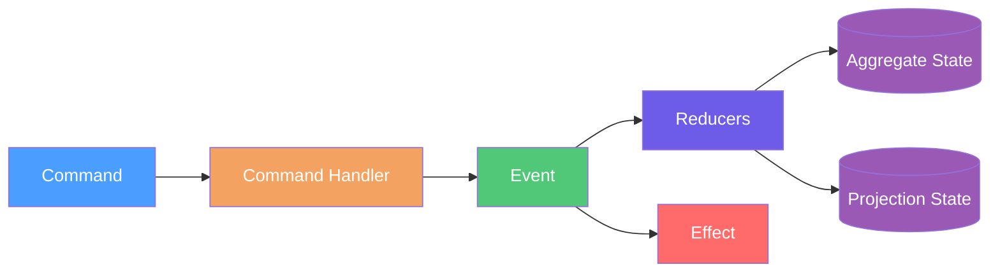

# Domain Modeling

## Overview
This section documents Mississippi EventSourcing concepts used to model server state. Command handling flows through
`CommandHandlerBase<TCommand, TSnapshot>` and returns `OperationResult<IReadOnlyList<object>>` containing events to persist
([CommandHandlerBase](https://github.com/Gibbs-Morris/mississippi/blob/main/src/EventSourcing.Aggregates.Abstractions/CommandHandlerBase.cs#L7-L65),
[OperationResult](https://github.com/Gibbs-Morris/mississippi/blob/main/src/EventSourcing.Aggregates.Abstractions/OperationResult.cs#L9-L195)).
Events use `EventStorageNameAttribute` for stable storage names
([EventStorageNameAttribute](https://github.com/Gibbs-Morris/mississippi/blob/main/src/EventSourcing.Brooks.Abstractions/Attributes/EventStorageNameAttribute.cs#L7-L105)).
Reducers apply events through `EventReducerBase<TEvent, TProjection>`
([EventReducerBase](https://github.com/Gibbs-Morris/mississippi/blob/main/src/EventSourcing.Reducers.Abstractions/EventReducerBase.cs#L6-L57)).
Effects implement `IEventEffect<TAggregate>` and run after events are persisted
([IEventEffect](https://github.com/Gibbs-Morris/mississippi/blob/main/src/EventSourcing.Aggregates.Abstractions/IEventEffect.cs#L7-L57)).
Projection records in the Spring sample are read-optimized views updated by reducers
([BankAccountBalanceProjection](https://github.com/Gibbs-Morris/mississippi/blob/main/samples/Spring/Spring.Domain/Projections/BankAccountBalance/BankAccountBalanceProjection.cs#L10-L43)).

## Key Contracts

| Contract | Purpose |
| --- | --- |
| [`CommandHandlerBase<TCommand, TSnapshot>`](https://github.com/Gibbs-Morris/mississippi/blob/main/src/EventSourcing.Aggregates.Abstractions/CommandHandlerBase.cs#L7-L65) | Base class for command handlers and their `HandleCore` implementations. |
| [`OperationResult<T>`](https://github.com/Gibbs-Morris/mississippi/blob/main/src/EventSourcing.Aggregates.Abstractions/OperationResult.cs#L9-L195) | Result container for success values or error details. |
| [`EventStorageNameAttribute`](https://github.com/Gibbs-Morris/mississippi/blob/main/src/EventSourcing.Brooks.Abstractions/Attributes/EventStorageNameAttribute.cs#L7-L105) | Provides stable storage names with format validation. |
| [`EventReducerBase<TEvent, TProjection>`](https://github.com/Gibbs-Morris/mississippi/blob/main/src/EventSourcing.Reducers.Abstractions/EventReducerBase.cs#L6-L57) | Base class for reducers with immutability checks. |
| [`IEventEffect<TAggregate>`](https://github.com/Gibbs-Morris/mississippi/blob/main/src/EventSourcing.Aggregates.Abstractions/IEventEffect.cs#L7-L57) | Effect interface for post-persist processing. |
| [`BrookNameAttribute`](https://github.com/Gibbs-Morris/mississippi/blob/main/src/EventSourcing.Brooks.Abstractions/Attributes/BrookNameAttribute.cs#L7-L73) | Defines brook names in the `{App}.{Module}.{Name}` format with validation. |
| [`SnapshotStorageNameAttribute`](https://github.com/Gibbs-Morris/mississippi/blob/main/src/EventSourcing.Brooks.Abstractions/Attributes/SnapshotStorageNameAttribute.cs#L7-L105) | Defines snapshot storage names in the `{App}.{Module}.{Name}.V{Version}` format with validation. |

## Summary

- Server state modeling flows from commands to events, reducers, effects, and state as implemented by
    [`CommandHandlerBase<TCommand, TSnapshot>`](https://github.com/Gibbs-Morris/mississippi/blob/main/src/EventSourcing.Aggregates.Abstractions/CommandHandlerBase.cs#L7-L65) and
    [`EventReducerBase<TEvent, TProjection>`](https://github.com/Gibbs-Morris/mississippi/blob/main/src/EventSourcing.Reducers.Abstractions/EventReducerBase.cs#L6-L57).
- EventSourcing contracts define naming and effect handling via
    [`EventStorageNameAttribute`](https://github.com/Gibbs-Morris/mississippi/blob/main/src/EventSourcing.Brooks.Abstractions/Attributes/EventStorageNameAttribute.cs#L7-L105) and
    [`IEventEffect<TAggregate>`](https://github.com/Gibbs-Morris/mississippi/blob/main/src/EventSourcing.Aggregates.Abstractions/IEventEffect.cs#L7-L57).

## Next Steps

- Start with [Aggregates](./aggregates.md)
- Continue to [Commands](./commands.md)
