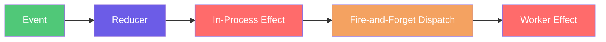

# Effects

## Overview

Effects handle side operations after events are persisted via `IEventEffect<TAggregate>`
([IEventEffect](https://github.com/Gibbs-Morris/mississippi/blob/main/src/EventSourcing.Aggregates.Abstractions/IEventEffect.cs#L7-L57)).

## Execution Model

[`IEventEffect<TAggregate>`](https://github.com/Gibbs-Morris/mississippi/blob/main/src/EventSourcing.Aggregates.Abstractions/IEventEffect.cs#L7-L57)
runs in the aggregate grain after events are persisted and blocks the grain until it completes. Effects can yield
additional events, and the contract documents a warning when execution exceeds 1 second. Use
[`SimpleEventEffectBase<TEvent, TAggregate>`](https://github.com/Gibbs-Morris/mississippi/blob/main/src/EventSourcing.Aggregates.Abstractions/SimpleEventEffectBase.cs#L10-L66)
for no-yield effects and
[`FireAndForgetEventEffectBase<TEvent, TAggregate>`](https://github.com/Gibbs-Morris/mississippi/blob/main/src/EventSourcing.Aggregates.Abstractions/FireAndForgetEventEffectBase.cs#L7-L45)
for worker-grain effects that cannot yield events.



## Key Contracts

| Contract | Purpose |
| --- | --- |
| [`IEventEffect<TAggregate>`](https://github.com/Gibbs-Morris/mississippi/blob/main/src/EventSourcing.Aggregates.Abstractions/IEventEffect.cs#L7-L57) | Effect contract and execution semantics. |
| [`EventEffectBase<TEvent, TAggregate>`](https://github.com/Gibbs-Morris/mississippi/blob/main/src/EventSourcing.Aggregates.Abstractions/EventEffectBase.cs#L9-L71) | Strongly typed base class with event type checks. |
| [`SimpleEventEffectBase<TEvent, TAggregate>`](https://github.com/Gibbs-Morris/mississippi/blob/main/src/EventSourcing.Aggregates.Abstractions/SimpleEventEffectBase.cs#L10-L66) | Convenience base for effects that do not yield events. |
| [`FireAndForgetEventEffectBase<TEvent, TAggregate>`](https://github.com/Gibbs-Morris/mississippi/blob/main/src/EventSourcing.Aggregates.Abstractions/FireAndForgetEventEffectBase.cs#L7-L45) | Base for worker-grain effects that do not yield events. |
| [`BrookKey`](https://github.com/Gibbs-Morris/mississippi/blob/main/src/EventSourcing.Brooks.Abstractions/BrookKey.cs#L8-L137) | Parses brook keys to extract entity identifiers. |

## Example

Example from the Spring sample: [HighValueTransactionEffect](https://github.com/Gibbs-Morris/mississippi/blob/main/samples/Spring/Spring.Domain/Aggregates/BankAccount/Effects/HighValueTransactionEffect.cs#L1-L112).

```csharp
using System;
using System.Threading;
using System.Threading.Tasks;

using Microsoft.Extensions.Logging;

using Mississippi.EventSourcing.Aggregates.Abstractions;
using Mississippi.EventSourcing.Brooks.Abstractions;

using Spring.Domain.Aggregates.BankAccount.Events;
using Spring.Domain.Aggregates.TransactionInvestigationQueue;
using Spring.Domain.Aggregates.TransactionInvestigationQueue.Commands;

internal sealed class HighValueTransactionEffect : SimpleEventEffectBase<FundsDeposited, BankAccountAggregate>
{
    internal const decimal AmlThreshold = 10_000m;

    private const string InvestigationQueueEntityId = "global";

    public HighValueTransactionEffect(
        IAggregateGrainFactory aggregateGrainFactory,
        ILogger<HighValueTransactionEffect> logger,
        TimeProvider? timeProvider = null
    )
    {
        AggregateGrainFactory = aggregateGrainFactory;
        Logger = logger;
        TimeProvider = timeProvider ?? TimeProvider.System;
    }

    private IAggregateGrainFactory AggregateGrainFactory { get; }

    private ILogger<HighValueTransactionEffect> Logger { get; }

    private TimeProvider TimeProvider { get; }

    protected override async Task HandleSimpleAsync(
        FundsDeposited eventData,
        BankAccountAggregate currentState,
        string brookKey,
        long eventPosition,
        CancellationToken cancellationToken
    )
    {
        ArgumentNullException.ThrowIfNull(eventData);
        if (eventData.Amount <= AmlThreshold)
        {
            return;
        }

        string accountId = BrookKey.FromString(brookKey).EntityId;
        Logger.LogHighValueTransactionDetected(accountId, eventData.Amount, AmlThreshold);
        FlagTransaction command = new()
        {
            AccountId = accountId,
            Amount = eventData.Amount,
            Timestamp = TimeProvider.GetUtcNow(),
        };
        IGenericAggregateGrain<TransactionInvestigationQueueAggregate> grain =
            AggregateGrainFactory.GetGenericAggregate<TransactionInvestigationQueueAggregate>(
                InvestigationQueueEntityId);
        OperationResult result = await grain.ExecuteAsync(command, cancellationToken);
        if (!result.Success)
        {
            Logger.LogFlagTransactionFailed(
                accountId,
                eventData.Amount,
                result.ErrorCode,
                result.ErrorMessage ?? "Unknown error");
        }
        else
        {
            Logger.LogTransactionFlagged(accountId, eventData.Amount);
        }
    }
}
```

Example from the Spring sample: [WithdrawalNotificationEffect](https://github.com/Gibbs-Morris/mississippi/blob/main/samples/Spring/Spring.Domain/Aggregates/BankAccount/Effects/WithdrawalNotificationEffect.cs#L1-L88).

```csharp
using System;
using System.Threading;
using System.Threading.Tasks;

using Microsoft.Extensions.Logging;

using Mississippi.EventSourcing.Aggregates.Abstractions;
using Mississippi.EventSourcing.Brooks.Abstractions;

using Spring.Domain.Aggregates.BankAccount.Events;
using Spring.Domain.Services;

internal sealed class WithdrawalNotificationEffect : FireAndForgetEventEffectBase<FundsWithdrawn, BankAccountAggregate>
{
    public WithdrawalNotificationEffect(
        INotificationService notificationService,
        ILogger<WithdrawalNotificationEffect> logger
    )
    {
        NotificationService = notificationService;
        Logger = logger;
    }

    private ILogger<WithdrawalNotificationEffect> Logger { get; }

    private INotificationService NotificationService { get; }

    public override async Task HandleAsync(
        FundsWithdrawn eventData,
        BankAccountAggregate aggregateState,
        string brookKey,
        long eventPosition,
        CancellationToken cancellationToken
    )
    {
        ArgumentNullException.ThrowIfNull(eventData);
        ArgumentNullException.ThrowIfNull(aggregateState);

        string accountId = BrookKey.FromString(brookKey).EntityId;
        Logger.LogSendingWithdrawalNotification(accountId, eventData.Amount, aggregateState.Balance);
        try
        {
            await NotificationService.SendWithdrawalAlertAsync(
                accountId,
                eventData.Amount,
                aggregateState.Balance,
                cancellationToken);
            Logger.LogWithdrawalNotificationSent(accountId, eventData.Amount);
        }
        catch (Exception ex) when (ex is not OperationCanceledException)
        {
            Logger.LogWithdrawalNotificationFailed(accountId, eventData.Amount, ex.Message);
        }
    }
}
```

## Summary

- Effects run after event persistence and can yield additional events via
    [`IEventEffect<TAggregate>`](https://github.com/Gibbs-Morris/mississippi/blob/main/src/EventSourcing.Aggregates.Abstractions/IEventEffect.cs#L7-L57).
- Fire-and-forget effects run in worker grains and do not yield events per
    [`FireAndForgetEventEffectBase<TEvent, TAggregate>`](https://github.com/Gibbs-Morris/mississippi/blob/main/src/EventSourcing.Aggregates.Abstractions/FireAndForgetEventEffectBase.cs#L7-L45).

## Next Steps

- [Aggregate Reducers](./aggregate-reducers.md)
- [Projections](./projections.md)
- [Snapshots](./snapshots.md)
