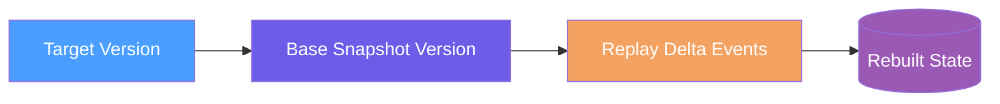

# Snapshots

## Overview

Snapshots capture periodic state checkpoints to reduce replay work using
[`SnapshotRetentionOptions`](https://github.com/Gibbs-Morris/mississippi/blob/main/src/EventSourcing.Snapshots.Abstractions/SnapshotRetentionOptions.cs#L1-L159).



## Key Contracts

| Contract | Purpose |
| --- | --- |
| [`SnapshotRetentionOptions`](https://github.com/Gibbs-Morris/mississippi/blob/main/src/EventSourcing.Snapshots.Abstractions/SnapshotRetentionOptions.cs#L1-L159) | Retention modulus settings and base snapshot calculations. |
| [`SnapshotStorageNameAttribute`](https://github.com/Gibbs-Morris/mississippi/blob/main/src/EventSourcing.Brooks.Abstractions/Attributes/SnapshotStorageNameAttribute.cs#L7-L105) | Stable storage naming with format validation. |
| [`SnapshotStreamKey`](https://github.com/Gibbs-Morris/mississippi/blob/main/src/EventSourcing.Snapshots.Abstractions/SnapshotStreamKey.cs#L8-L161) | Stream identifier for snapshot series. |
| [`SnapshotKey`](https://github.com/Gibbs-Morris/mississippi/blob/main/src/EventSourcing.Snapshots.Abstractions/SnapshotKey.cs#L9-L129) | Stream identifier plus snapshot version. |
| [`SnapshotEnvelope`](https://github.com/Gibbs-Morris/mississippi/blob/main/src/EventSourcing.Snapshots.Abstractions/SnapshotEnvelope.cs#L8-L46) | Serialized payload and metadata. |
| [`ISnapshotCacheGrain<TSnapshot>`](https://github.com/Gibbs-Morris/mississippi/blob/main/src/EventSourcing.Snapshots.Abstractions/ISnapshotCacheGrain.cs#L10-L46) | Cache grain for immutable snapshot state. |
| [`ISnapshotPersisterGrain`](https://github.com/Gibbs-Morris/mississippi/blob/main/src/EventSourcing.Snapshots.Abstractions/ISnapshotPersisterGrain.cs#L10-L42) | Background persistence grain. |

## Retention behavior

`SnapshotRetentionOptions` retains snapshots at positions divisible by `DefaultRetainModulus` and computes a base
snapshot version that is strictly less than the target version. The default modulus is 100.
See [SnapshotRetentionOptions](https://github.com/Gibbs-Morris/mississippi/blob/main/src/EventSourcing.Snapshots.Abstractions/SnapshotRetentionOptions.cs#L1-L159).

Examples for a modulus of 100:

| Target Version | Base Snapshot | Events Replayed |
| --- | --- | --- |
| 364 | 300 | 64 |
| 199 | 100 | 99 |
| 50 | 0 | 50 |

`DefaultRetainModulus` limits replay to at most `modulus - 1` events. The base snapshot version is computed using
`targetVersion - 1` to ensure it is strictly less than the target version.

## Snapshot storage naming

`SnapshotStorageNameAttribute` builds storage names in the `{AppName}.{ModuleName}.{Name}.V{Version}` format and
validates uppercase alphanumeric components. Examples from the Spring sample:

| Type | Snapshot Storage Name |
| --- | --- |
| [`BankAccountAggregate`](https://github.com/Gibbs-Morris/mississippi/blob/main/samples/Spring/Spring.Domain/Aggregates/BankAccount/BankAccountAggregate.cs) | `SPRING.BANKING.ACCOUNTSTATE.V1` |
| [`TransactionInvestigationQueueAggregate`](https://github.com/Gibbs-Morris/mississippi/blob/main/samples/Spring/Spring.Domain/Aggregates/TransactionInvestigationQueue/TransactionInvestigationQueueAggregate.cs) | `SPRING.COMPLIANCE.INVESTIGATIONSTATE.V1` |
| [`BankAccountBalanceProjection`](https://github.com/Gibbs-Morris/mississippi/blob/main/samples/Spring/Spring.Domain/Projections/BankAccountBalance/BankAccountBalanceProjection.cs) | `SPRING.BANKING.ACCOUNTBALANCE.V1` |
| [`BankAccountLedgerProjection`](https://github.com/Gibbs-Morris/mississippi/blob/main/samples/Spring/Spring.Domain/Projections/BankAccountLedger/BankAccountLedgerProjection.cs) | `SPRING.BANKING.ACCOUNTLEDGER.V1` |
| [`FlaggedTransactionsProjection`](https://github.com/Gibbs-Morris/mississippi/blob/main/samples/Spring/Spring.Domain/Projections/FlaggedTransactions/FlaggedTransactionsProjection.cs) | `SPRING.COMPLIANCE.FLAGGEDTXPROJECTION.V1` |

## Snapshot keys

`SnapshotStreamKey` uses the composite format `brookName|snapshotStorageName|entityId|reducersHash`.
`SnapshotKey` adds the snapshot version and uses `brookName|entityId|version|snapshotStorageName|reducersHash`.
See [SnapshotStreamKey](https://github.com/Gibbs-Morris/mississippi/blob/main/src/EventSourcing.Snapshots.Abstractions/SnapshotStreamKey.cs#L8-L161)
and [SnapshotKey](https://github.com/Gibbs-Morris/mississippi/blob/main/src/EventSourcing.Snapshots.Abstractions/SnapshotKey.cs#L9-L129).

## Example

Example from the EventSourcing snapshots package: [SnapshotEnvelope](https://github.com/Gibbs-Morris/mississippi/blob/main/src/EventSourcing.Snapshots.Abstractions/SnapshotEnvelope.cs#L8-L46).

```csharp
using System.Collections.Immutable;

using Orleans;

public sealed record SnapshotEnvelope
{
    [Id(0)]
    public ImmutableArray<byte> Data { get; init; } = ImmutableArray<byte>.Empty;

    [Id(1)]
    public string DataContentType { get; init; } = string.Empty;

    [Id(3)]
    public long DataSizeBytes { get; init; }

    [Id(2)]
    public string ReducerHash { get; init; } = string.Empty;
}
```

## Snapshot grains

`ISnapshotCacheGrain<TSnapshot>` loads snapshots from storage and rebuilds state when a snapshot is missing or has a
stale reducer hash. After rebuilding, it calls `ISnapshotPersisterGrain` using a one-way call to persist asynchronously.
See [ISnapshotCacheGrain](https://github.com/Gibbs-Morris/mississippi/blob/main/src/EventSourcing.Snapshots.Abstractions/ISnapshotCacheGrain.cs#L10-L46)
and [ISnapshotPersisterGrain](https://github.com/Gibbs-Morris/mississippi/blob/main/src/EventSourcing.Snapshots.Abstractions/ISnapshotPersisterGrain.cs#L10-L42).

## Summary

- Snapshots reduce replay cost by retaining periodic checkpoint versions defined by
    [`SnapshotRetentionOptions`](https://github.com/Gibbs-Morris/mississippi/blob/main/src/EventSourcing.Snapshots.Abstractions/SnapshotRetentionOptions.cs#L1-L159).
- Snapshot keys and storage names provide stable identifiers via
    [`SnapshotStreamKey`](https://github.com/Gibbs-Morris/mississippi/blob/main/src/EventSourcing.Snapshots.Abstractions/SnapshotStreamKey.cs#L8-L161),
    [`SnapshotKey`](https://github.com/Gibbs-Morris/mississippi/blob/main/src/EventSourcing.Snapshots.Abstractions/SnapshotKey.cs#L9-L129), and
    [`SnapshotStorageNameAttribute`](https://github.com/Gibbs-Morris/mississippi/blob/main/src/EventSourcing.Brooks.Abstractions/Attributes/SnapshotStorageNameAttribute.cs#L7-L105).
- Cache grains rebuild and persist snapshots asynchronously via
    [`ISnapshotCacheGrain<TSnapshot>`](https://github.com/Gibbs-Morris/mississippi/blob/main/src/EventSourcing.Snapshots.Abstractions/ISnapshotCacheGrain.cs#L10-L46) and
    [`ISnapshotPersisterGrain`](https://github.com/Gibbs-Morris/mississippi/blob/main/src/EventSourcing.Snapshots.Abstractions/ISnapshotPersisterGrain.cs#L10-L42).

## Next Steps

- [Projection Reducers](./projection-reducers.md)
- [Domain Modeling](./domain-modeling.md)
- [Aggregates](./aggregates.md)
