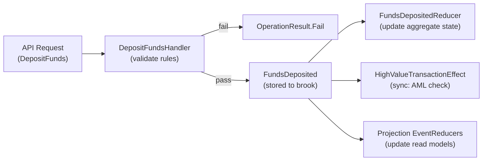

# Building an Aggregate: BankAccount

## Overview

This page walks through building the `BankAccount` aggregate in the Spring sample from scratch. By the end, you will understand the exact files needed to define a fully working event-sourced aggregate with Mississippi.

The BankAccount aggregate supports three operations: opening an account, depositing funds, and withdrawing funds. It also demonstrates two kinds of effects: a synchronous compliance check and a fire-and-forget notification.

## Step 1: Define the Aggregate State

The aggregate state is a `sealed record` that represents the current snapshot of the entity. It does not contain behavior — just data. `EventReducer`s are responsible for producing new state from events.

```csharp
[BrookName("SPRING", "BANKING", "ACCOUNT")]
[SnapshotStorageName("SPRING", "BANKING", "ACCOUNTSTATE")]
[GenerateAggregateEndpoints]
[GenerateSerializer]
[Alias("Spring.Domain.BankAccount.BankAccountAggregate")]
public sealed record BankAccountAggregate
{
    [Id(0)] public decimal Balance { get; init; }
    [Id(1)] public bool IsOpen { get; init; }
    [Id(2)] public string HolderName { get; init; } = string.Empty;
    [Id(3)] public int DepositCount { get; init; }
    [Id(4)] public int WithdrawalCount { get; init; }
}
```

Key attributes:

| Attribute | Purpose |
|-----------|---------|
| `[BrookName]` | Names the event stream — all events for this aggregate are stored under `SPRING/BANKING/ACCOUNT` |
| `[SnapshotStorageName]` | Names the snapshot storage container for efficient state recovery |
| `[GenerateAggregateEndpoints]` | Source-generates API controllers, Orleans grains, and client-side dispatchers |
| `[GenerateSerializer]` | Orleans serialization support |
| `[Alias]` | Stable serialization identity for Orleans version tolerance |

The `[Id(n)]` attributes on properties define the Orleans serialization field order. They are required for all serialized types.

([BankAccountAggregate.cs](https://github.com/Gibbs-Morris/mississippi/blob/main/samples/Spring/Spring.Domain/Aggregates/BankAccount/BankAccountAggregate.cs))

## Step 2: Define Commands

Commands are simple records that describe what the caller wants to happen. Each command gets its own file and maps to one handler.

### OpenAccount

```csharp
[GenerateCommand(Route = "open")]
[GenerateSerializer]
[Alias("Spring.Domain.BankAccount.Commands.OpenAccount")]
public sealed record OpenAccount(
    [property: Id(0)] string HolderName,
    [property: Id(1)] decimal InitialDeposit = 0);
```

### DepositFunds

```csharp
[GenerateCommand(Route = "deposit")]
[GenerateSerializer]
[Alias("Spring.Domain.BankAccount.Commands.DepositFunds")]
public sealed record DepositFunds
{
    [Id(0)] public decimal Amount { get; init; }
}
```

### WithdrawFunds

```csharp
[GenerateCommand(Route = "withdraw")]
[GenerateSerializer]
[Alias("Spring.Domain.BankAccount.Commands.WithdrawFunds")]
public sealed record WithdrawFunds
{
    [Id(0)] public decimal Amount { get; init; }
}
```

The `[GenerateCommand(Route = "...")]` attribute tells the source generator to create an API endpoint for this command. The `Route` value becomes part of the REST path.

([OpenAccount.cs](https://github.com/Gibbs-Morris/mississippi/blob/main/samples/Spring/Spring.Domain/Aggregates/BankAccount/Commands/OpenAccount.cs) |
[DepositFunds.cs](https://github.com/Gibbs-Morris/mississippi/blob/main/samples/Spring/Spring.Domain/Aggregates/BankAccount/Commands/DepositFunds.cs) |
[WithdrawFunds.cs](https://github.com/Gibbs-Morris/mississippi/blob/main/samples/Spring/Spring.Domain/Aggregates/BankAccount/Commands/WithdrawFunds.cs))

## Step 3: Define Events

Events are immutable facts that record what happened. They are `internal` because external consumers read projections, not raw events.

### AccountOpened

```csharp
[EventStorageName("SPRING", "BANKING", "ACCOUNTOPENED")]
[GenerateSerializer]
[Alias("Spring.Domain.BankAccount.Events.AccountOpened")]
internal sealed record AccountOpened
{
    [Id(0)] public string HolderName { get; init; } = string.Empty;
    [Id(1)] public decimal InitialDeposit { get; init; }
}
```

### FundsDeposited

```csharp
[EventStorageName("SPRING", "BANKING", "FUNDSDEPOSITED")]
[GenerateSerializer]
[Alias("Spring.Domain.BankAccount.Events.FundsDeposited")]
internal sealed record FundsDeposited
{
    [Id(0)] public decimal Amount { get; init; }
}
```

### FundsWithdrawn

```csharp
[EventStorageName("SPRING", "BANKING", "FUNDSWITHDRAWN")]
[GenerateSerializer]
[Alias("Spring.Domain.BankAccount.Events.FundsWithdrawn")]
internal sealed record FundsWithdrawn
{
    [Id(0)] public decimal Amount { get; init; }
}
```

The `[EventStorageName]` attribute defines how the event is identified in storage. This identity is permanent — renaming the C# type does not break stored events.

([AccountOpened.cs](https://github.com/Gibbs-Morris/mississippi/blob/main/samples/Spring/Spring.Domain/Aggregates/BankAccount/Events/AccountOpened.cs) |
[FundsDeposited.cs](https://github.com/Gibbs-Morris/mississippi/blob/main/samples/Spring/Spring.Domain/Aggregates/BankAccount/Events/FundsDeposited.cs) |
[FundsWithdrawn.cs](https://github.com/Gibbs-Morris/mississippi/blob/main/samples/Spring/Spring.Domain/Aggregates/BankAccount/Events/FundsWithdrawn.cs))

## Step 4: Define CommandHandlers

`CommandHandler`s validate business rules and decide which events to emit. Each `CommandHandler` extends `CommandHandlerBase<TCommand, TSnapshot>` and implements `HandleCore`.

### OpenAccountHandler

```csharp
internal sealed class OpenAccountHandler : CommandHandlerBase<OpenAccount, BankAccountAggregate>
{
    protected override OperationResult<IReadOnlyList<object>> HandleCore(
        OpenAccount command,
        BankAccountAggregate? state)
    {
        if (state?.IsOpen == true)
            return OperationResult.Fail<IReadOnlyList<object>>(
                AggregateErrorCodes.AlreadyExists,
                "Account is already open.");

        if (string.IsNullOrWhiteSpace(command.HolderName))
            return OperationResult.Fail<IReadOnlyList<object>>(
                AggregateErrorCodes.InvalidCommand,
                "Account holder name is required.");

        if (command.InitialDeposit < 0)
            return OperationResult.Fail<IReadOnlyList<object>>(
                AggregateErrorCodes.InvalidCommand,
                "Initial deposit cannot be negative.");

        return OperationResult.Ok<IReadOnlyList<object>>(
            new object[]
            {
                new AccountOpened
                {
                    HolderName = command.HolderName,
                    InitialDeposit = command.InitialDeposit,
                },
            });
    }
}
```

### WithdrawFundsHandler

The withdrawal handler demonstrates richer business rules — the account must be open, the amount must be positive, and there must be sufficient funds:

```csharp
internal sealed class WithdrawFundsHandler : CommandHandlerBase<WithdrawFunds, BankAccountAggregate>
{
    protected override OperationResult<IReadOnlyList<object>> HandleCore(
        WithdrawFunds command,
        BankAccountAggregate? state)
    {
        if (state?.IsOpen != true)
            return OperationResult.Fail<IReadOnlyList<object>>(
                AggregateErrorCodes.InvalidState,
                "Account must be open before withdrawing funds.");

        if (command.Amount <= 0)
            return OperationResult.Fail<IReadOnlyList<object>>(
                AggregateErrorCodes.InvalidCommand,
                "Withdrawal amount must be positive.");

        if (state.Balance < command.Amount)
            return OperationResult.Fail<IReadOnlyList<object>>(
                AggregateErrorCodes.InvalidCommand,
                "Insufficient funds for withdrawal.");

        return OperationResult.Ok<IReadOnlyList<object>>(
            new object[] { new FundsWithdrawn { Amount = command.Amount } });
    }
}
```

Key pattern: `CommandHandler`s return `OperationResult.Fail(...)` or `OperationResult.Ok(...)`. They never throw exceptions for business rule violations. They never modify state directly.

([OpenAccountHandler.cs](https://github.com/Gibbs-Morris/mississippi/blob/main/samples/Spring/Spring.Domain/Aggregates/BankAccount/Handlers/OpenAccountHandler.cs) |
[DepositFundsHandler.cs](https://github.com/Gibbs-Morris/mississippi/blob/main/samples/Spring/Spring.Domain/Aggregates/BankAccount/Handlers/DepositFundsHandler.cs) |
[WithdrawFundsHandler.cs](https://github.com/Gibbs-Morris/mississippi/blob/main/samples/Spring/Spring.Domain/Aggregates/BankAccount/Handlers/WithdrawFundsHandler.cs))

## Step 5: Define EventReducers

`EventReducer`s are pure functions that compute new state from an event. Each event type gets its own `EventReducer`. `EventReducer`s extend `EventReducerBase<TEvent, TProjection>`.

### AccountOpenedReducer

```csharp
internal sealed class AccountOpenedReducer : EventReducerBase<AccountOpened, BankAccountAggregate>
{
    protected override BankAccountAggregate ReduceCore(
        BankAccountAggregate state,
        AccountOpened @event)
    {
        ArgumentNullException.ThrowIfNull(@event);
        return (state ?? new()) with
        {
            IsOpen = true,
            HolderName = @event.HolderName,
            Balance = @event.InitialDeposit,
        };
    }
}
```

### FundsDepositedReducer

```csharp
internal sealed class FundsDepositedReducer : EventReducerBase<FundsDeposited, BankAccountAggregate>
{
    protected override BankAccountAggregate ReduceCore(
        BankAccountAggregate state,
        FundsDeposited @event)
    {
        ArgumentNullException.ThrowIfNull(@event);
        return (state ?? new()) with
        {
            Balance = (state?.Balance ?? 0) + @event.Amount,
            DepositCount = (state?.DepositCount ?? 0) + 1,
        };
    }
}
```

### FundsWithdrawnReducer

```csharp
internal sealed class FundsWithdrawnReducer : EventReducerBase<FundsWithdrawn, BankAccountAggregate>
{
    protected override BankAccountAggregate ReduceCore(
        BankAccountAggregate state,
        FundsWithdrawn @event)
    {
        ArgumentNullException.ThrowIfNull(@event);
        return (state ?? new()) with
        {
            Balance = (state?.Balance ?? 0) - @event.Amount,
            WithdrawalCount = (state?.WithdrawalCount ?? 0) + 1,
        };
    }
}
```

Event reducers use C# `with` expressions to create new immutable state. The original state is never mutated. This guarantees deterministic replay — replaying the same events always produces the same state.

([AccountOpenedReducer.cs](https://github.com/Gibbs-Morris/mississippi/blob/main/samples/Spring/Spring.Domain/Aggregates/BankAccount/Reducers/AccountOpenedReducer.cs) |
[FundsDepositedReducer.cs](https://github.com/Gibbs-Morris/mississippi/blob/main/samples/Spring/Spring.Domain/Aggregates/BankAccount/Reducers/FundsDepositedReducer.cs) |
[FundsWithdrawnReducer.cs](https://github.com/Gibbs-Morris/mississippi/blob/main/samples/Spring/Spring.Domain/Aggregates/BankAccount/Reducers/FundsWithdrawnReducer.cs))

## Step 6: Add Effects

Effects react to events after persistence, and Spring demonstrates both execution modes: blocking (simple) and fire-and-forget.

### Simple Effect: HighValueTransactionEffect

This effect monitors deposits and flags amounts over £10,000 for AML investigation. It runs synchronously within the aggregate grain — the command response waits until the effect completes.

```csharp
internal sealed class HighValueTransactionEffect
    : SimpleEventEffectBase<FundsDeposited, BankAccountAggregate>
{
    internal const decimal AmlThreshold = 10_000m;

    public HighValueTransactionEffect(
        IAggregateGrainFactory aggregateGrainFactory,
        ILogger<HighValueTransactionEffect> logger,
        TimeProvider? timeProvider = null)
    {
        AggregateGrainFactory = aggregateGrainFactory;
        Logger = logger;
        TimeProvider = timeProvider ?? TimeProvider.System;
    }

    // ...

    protected override async Task HandleSimpleAsync(
        FundsDeposited eventData,
        BankAccountAggregate currentState,
        string brookKey,
        long eventPosition,
        CancellationToken cancellationToken)
    {
        if (eventData.Amount <= AmlThreshold)
            return;

        // Dispatch FlagTransaction command to another aggregate
        string accountId = BrookKey.FromString(brookKey).EntityId;
        FlagTransaction command = new()
        {
            AccountId = accountId,
            Amount = eventData.Amount,
            Timestamp = TimeProvider.GetUtcNow(),
        };

        IGenericAggregateGrain<TransactionInvestigationQueueAggregate> grain =
            AggregateGrainFactory
                .GetGenericAggregate<TransactionInvestigationQueueAggregate>("global");

        await grain.ExecuteAsync(command, cancellationToken);
    }
}
```

This effect demonstrates **cross-aggregate command dispatch** — one aggregate's event triggers a command to a different aggregate. The `TransactionInvestigationQueueAggregate` is a separate aggregate that maintains a compliance queue.

### Fire-and-Forget Effect: WithdrawalNotificationEffect

This effect sends a notification after every withdrawal. It runs in a separate worker grain — the withdrawal command returns immediately without waiting for the notification.

```csharp
internal sealed class WithdrawalNotificationEffect
    : FireAndForgetEventEffectBase<FundsWithdrawn, BankAccountAggregate>
{
    public WithdrawalNotificationEffect(
        INotificationService notificationService,
        ILogger<WithdrawalNotificationEffect> logger)
    {
        NotificationService = notificationService;
        Logger = logger;
    }

    // ...

    public override async Task HandleAsync(
        FundsWithdrawn eventData,
        BankAccountAggregate aggregateState,
        string brookKey,
        long eventPosition,
        CancellationToken cancellationToken)
    {
        string accountId = BrookKey.FromString(brookKey).EntityId;
        await NotificationService.SendWithdrawalAlertAsync(
            accountId,
            eventData.Amount,
            aggregateState.Balance,
            cancellationToken);
    }
}
```

The `INotificationService` is an interface defined in `Spring.Domain`. The implementation (`StubNotificationService` that logs instead of sending) lives in `Spring.Silo`. This demonstrates how domain logic depends only on abstractions.

([HighValueTransactionEffect.cs](https://github.com/Gibbs-Morris/mississippi/blob/main/samples/Spring/Spring.Domain/Aggregates/BankAccount/Effects/HighValueTransactionEffect.cs) |
[WithdrawalNotificationEffect.cs](https://github.com/Gibbs-Morris/mississippi/blob/main/samples/Spring/Spring.Domain/Aggregates/BankAccount/Effects/WithdrawalNotificationEffect.cs) |
[INotificationService.cs](https://github.com/Gibbs-Morris/mississippi/blob/main/samples/Spring/Spring.Domain/Services/INotificationService.cs))

## The Complete Aggregate File Structure

```
Aggregates/BankAccount/
├── BankAccountAggregate.cs          # State record
├── Commands/
│   ├── OpenAccount.cs               # Command record
│   ├── DepositFunds.cs              # Command record
│   └── WithdrawFunds.cs             # Command record
├── Events/
│   ├── AccountOpened.cs             # Event record
│   ├── FundsDeposited.cs            # Event record
│   └── FundsWithdrawn.cs            # Event record
├── Handlers/
│   ├── OpenAccountHandler.cs        # Business rule validation
│   ├── DepositFundsHandler.cs       # Business rule validation
│   └── WithdrawFundsHandler.cs      # Business rule validation
├── Reducers/
│   ├── AccountOpenedReducer.cs      # State transition
│   ├── FundsDepositedReducer.cs     # State transition
│   └── FundsWithdrawnReducer.cs     # State transition
└── Effects/
    ├── HighValueTransactionEffect.cs            # Sync side effect
    ├── HighValueTransactionEffectLoggerExtensions.cs
    ├── WithdrawalNotificationEffect.cs          # Async side effect
    └── WithdrawalNotificationEffectLoggerExtensions.cs
```

Every file has a single responsibility. Adding a new operation (such as "close account") means adding one command, one event, one handler, and one `EventReducer` — the existing code does not change.

## The Command Flow



## Summary

An aggregate in Mississippi is a set of small, focused files with strict responsibilities. Commands describe intent. Handlers validate rules and produce events. `EventReducer`s apply events to state. Effects run side actions. Source generators create all the infrastructure (API endpoints, Orleans grains, client dispatchers) from annotations on these types.

## Next Steps

- [Building a Saga](./building-a-saga.md) — Coordinate a money transfer across two BankAccount aggregates
- [Building Projections](./building-projections.md) — Create read-optimized views of the BankAccount event stream
