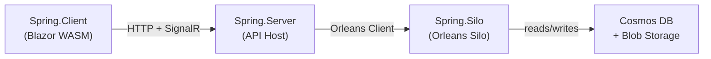

# Host Applications: Minimal Infrastructure Wiring

## Overview

Focus: Public API / Developer Experience.

Spring has three host applications. Each is a thin shell that wires infrastructure — none contains business logic. The domain project defines *what* the system does. The hosts define *how* it runs.

| Host | Role | References |
|------|------|-----------|
| `Spring.Silo` | Orleans silo — runs grains, event sourcing, sagas | `Spring.Domain` + Mississippi Silo SDK |
| `Spring.Server` | ASP.NET API + Blazor host — serves endpoints and static files | `Spring.Domain` + Mississippi Server SDK |
| `Spring.Client` | Blazor WebAssembly — UI shell with state management | `Spring.Domain` (compile-only) + Mississippi Client SDK |



## Spring.Silo: The Orleans Host

The silo runs Orleans grains that execute commands, apply events, run effects, and manage saga orchestration. Its `Program.cs` is infrastructure wiring only.

```csharp
WebApplicationBuilder builder = WebApplication.CreateBuilder(args);

// One call registers all domain aggregates, sagas, effects, and `EventReducer`s
builder.Services.AddSpringDomainSilo();

// Infrastructure: notification service stub
builder.Services.AddSingleton<INotificationService, StubNotificationService>();

// Infrastructure: telemetry, storage clients, event sourcing providers
builder.Services.AddHttpClient();
builder.Services.AddOpenTelemetry()
    .WithTracing(/* ... */)
    .WithMetrics(/* ... */);

builder.AddKeyedAzureTableServiceClient("clustering");
builder.AddKeyedAzureBlobServiceClient("grainstate");
builder.AddAzureCosmosClient("cosmos", /* ... */);

// Mississippi infrastructure
builder.Services.AddInletSilo();
builder.Services.ScanProjectionAssemblies(typeof(BankAccountBalanceProjection).Assembly);
builder.Services.AddJsonSerialization();
builder.Services.AddEventSourcingByService();
builder.Services.AddSnapshotCaching();
builder.Services.AddCosmosBrookStorageProvider(/* ... */);
builder.Services.AddCosmosSnapshotStorageProvider(/* ... */);

// Orleans configuration
builder.UseOrleans(siloBuilder =>
{
    siloBuilder.AddActivityPropagation();
    siloBuilder.UseAqueduct(options =>
        options.StreamProviderName = "StreamProvider");
    siloBuilder.AddEventSourcing(options =>
        options.OrleansStreamProviderName = "StreamProvider");
});

WebApplication app = builder.Build();
app.MapGet("/health", /* ... */);
await app.RunAsync();
```

The single line `builder.Services.AddSpringDomainSilo()` registers every aggregate, saga, `CommandHandler`, `EventReducer`, effect, and projection defined in `Spring.Domain`. This method is **source-generated** by Mississippi — you do not write it manually.

([Spring.Silo/Program.cs](https://github.com/Gibbs-Morris/mississippi/blob/main/samples/Spring/Spring.Silo/Program.cs))

### What the Silo Owns

Beyond `Program.cs`, the silo contains a small set of non-generated support files:

- `Grains/GreeterGrain.cs` — A simple demo grain (not event-sourced) that demonstrates basic Orleans communication.
- `Grains/GreeterGrainLoggerExtensions.cs` — Logging extension declarations used by the greeter grain.
- `Services/StubNotificationService.cs` — A stub implementation of `INotificationService` that logs instead of sending real notifications.
- `Services/StubNotificationServiceLoggerExtensions.cs` — Logging extension declarations used by the stub notification service.

These files are infrastructure/support concerns rather than domain business logic.

([GreeterGrain.cs](https://github.com/Gibbs-Morris/mississippi/blob/main/samples/Spring/Spring.Silo/Grains/GreeterGrain.cs) |
[StubNotificationService.cs](https://github.com/Gibbs-Morris/mississippi/blob/main/samples/Spring/Spring.Silo/Services/StubNotificationService.cs))

## Spring.Server: The API Host

The server hosts ASP.NET controllers, serves the Blazor WebAssembly client, and connects to the Orleans silo as a client.

```csharp
WebApplicationBuilder builder = WebApplication.CreateBuilder(args);

// One call registers all generated API controllers and mappers
builder.Services.AddSpringDomainServer();

// Infrastructure: telemetry, Orleans client
builder.Services.AddOpenTelemetry()
    .WithTracing(/* ... */)
    .WithMetrics(/* ... */);
builder.AddKeyedAzureTableServiceClient("clustering");
builder.UseOrleansClient(clientBuilder =>
    clientBuilder.AddActivityPropagation());

// ASP.NET and Mississippi infrastructure
builder.Services.AddControllers();
builder.Services.AddOpenApi(/* ... */);
builder.Services.AddJsonSerialization();
builder.Services.AddAggregateSupport();
builder.Services.AddUxProjections();
builder.Services.AddSignalR();
builder.Services.AddAqueduct<InletHub>(options =>
    options.StreamProviderName = "StreamProvider");
builder.Services.AddInletServer();
builder.Services.ScanProjectionAssemblies(
    typeof(BankAccountBalanceProjection).Assembly);

WebApplication app = builder.Build();
app.UseBlazorFrameworkFiles();
app.UseStaticFiles();
app.UseRouting();
app.MapOpenApi();
app.MapScalarApiReference(/* ... */);
app.MapControllers();
app.MapInletHub();
app.MapGet("/health", /* ... */);
app.MapFallbackToFile("index.html");
await app.RunAsync();
```

The `AddSpringDomainServer()` call registers all source-generated API controller mappers and feature registrations for the server host. The server does not contain `CommandHandler` code, `EventReducer` code, or domain-specific types — it maps HTTP requests to Orleans grain calls.

([Spring.Server/Program.cs](https://github.com/Gibbs-Morris/mississippi/blob/main/samples/Spring/Spring.Server/Program.cs))

## Development Auth-Proof Mode

Focus: Public API / Developer Experience.

Spring includes an opt-in development mode that proves generated endpoint authorization behavior.

The complete setup, endpoint matrix (`200`/`401`/`403`), and troubleshooting guidance are documented on [Spring Auth-Proof Mode](./auth-proof-mode.md).

### What the Server Owns

The server has no domain-specific code files. Its `Program.cs` configures middleware and infrastructure. The API controllers that accept commands and return projections are **entirely source-generated** from the domain annotations.

## Spring.Client: The Blazor UI

The client is a Blazor WebAssembly application that dispatches commands and subscribes to projections.

```csharp
WebAssemblyHostBuilder builder = WebAssemblyHostBuilder.CreateDefault(args);
builder.RootComponents.Add<App>("#app");
builder.RootComponents.Add<HeadOutlet>("head::after");

builder.Services.AddScoped(_ => new HttpClient
{
    BaseAddress = new(builder.HostEnvironment.BaseAddress),
});

// One call registers all client-side generated features (dispatchers and state wiring)
builder.Services.AddSpringDomainClient();

// UI features
builder.Services.AddDualEntitySelectionFeature();
builder.Services.AddDemoAccountsFeature();
builder.Services.AddReservoirBlazorBuiltIns();
builder.Services.AddReservoirDevTools(options =>
{
    options.Enablement = ReservoirDevToolsEnablement.Always;
    options.Name = "Spring Sample";
});

// Real-time projection updates via SignalR
builder.Services.AddInletClient();
builder.Services.AddInletBlazorSignalR(signalR => signalR
    .WithHubPath("/hubs/inlet")
    .ScanProjectionDtos(typeof(BankAccountBalanceProjectionDto).Assembly));

await builder.Build().RunAsync();
```

The `AddSpringDomainClient()` call registers source-generated command dispatchers and projection state wiring for the Blazor client. The client never directly calls Orleans grains or knows about event-sourcing internals.

([Spring.Client/Program.cs](https://github.com/Gibbs-Morris/mississippi/blob/main/samples/Spring/Spring.Client/Program.cs))

### How the Client References the Domain

The client's `.csproj` file uses a compile-only reference to `Spring.Domain`:

```xml
<ProjectReference Include="..\Spring.Domain\Spring.Domain.csproj"
                  ExcludeAssets="runtime" />
```

The `ExcludeAssets="runtime"` flag means the source generators can see domain types at compile time (to generate client-side DTOs and dispatchers), but the domain assembly is **not deployed** to the browser. The client only ships the generated code.

([Spring.Client.csproj](https://github.com/Gibbs-Morris/mississippi/blob/main/samples/Spring/Spring.Client/Spring.Client.csproj))

## Source-Generated Registration Methods

Mississippi's Inlet generators produce three domain-level registration methods from the annotations in `Spring.Domain`:

| Method | Host | What It Registers |
|--------|------|-------------------|
| `AddSpringDomainSilo()` | Silo | Aggregate grains, saga grains, `CommandHandler`s, `EventReducer`s, effects, projection grains |
| `AddSpringDomainServer()` | Server | API controller mappers, command route mappings |
| `AddSpringDomainClient()` | Client | Command dispatchers, projection DTOs, and client feature state wiring |

Each method name follows the pattern `Add{DomainProject}Domain{HostType}()`. The generator derives the name from the assembly name (`Spring.Domain`) and the host target.

For more details on domain registration generators, see [Domain Registration Generators](../domain-registration-generators.md).

## The Key Insight

Compare the domain project to the host projects:

| Metric | Spring.Domain | Spring.Silo | Spring.Server | Spring.Client |
|--------|:------------:|:-----------:|:-------------:|:-------------:|
| Domain business logic ownership | All domain business logic | No domain business logic | No domain business logic | No domain business logic |
| Business rules | All | None | None | None |
| Infrastructure wiring | None | Compact host setup in `Program.cs` | Compact host setup in `Program.cs` | Compact host setup in `Program.cs` |
| External dependencies | Primarily Mississippi abstractions, plus minimal framework/build dependencies (`Microsoft.Orleans.Sdk`, `Microsoft.Extensions.Http`) | Azure Storage, Cosmos, Orleans, OpenTelemetry | Orleans Client, ASP.NET, Blazor hosting | Blazor WASM, SignalR |

The hosts are replaceable shells. The domain is the permanent asset. You could swap Cosmos for PostgreSQL by changing only the silo's storage configuration. You could replace Blazor with React by writing a new client that calls the same generated API. The business logic in `Spring.Domain` would not change.

## Summary

Mississippi's source generators transform domain annotations into complete infrastructure wiring. Each host application calls a single generated registration method (`AddSpringDomainSilo()`, `AddSpringDomainServer()`, `AddSpringDomainClient()`) to bring the entire domain online. The result is host applications that contain only infrastructure configuration, not business logic.

## Next Steps

- [Overview](./index.md) — Return to the Spring Sample App overview
- [Key Concepts](./key-concepts.md) — Revisit the concept reference for all patterns used
- [Domain Registration Generators](../domain-registration-generators.md) — Deep dive into how generation works
