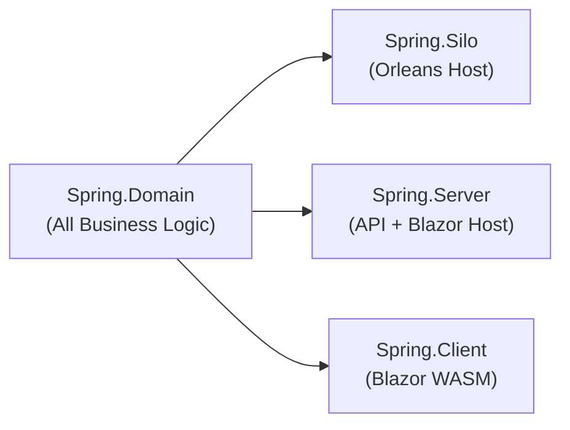

# Spring Sample App

## Overview

Focus: Public API / Developer Experience.

Spring is a full-stack event-sourced banking application built with the Mississippi framework. It demonstrates a core architectural principle: **all business logic lives in one domain project** (`Spring.Domain`), while the host applications (`Spring.Silo`, `Spring.Server`, `Spring.Client`) contain only infrastructure wiring.

The sample models a banking domain with accounts, deposits, withdrawals, money transfers, and compliance flagging. Every feature is built using Mississippi's event-sourcing patterns — `Command`s, `CommandHandler`s, events, `EventReducer`s, effects, sagas, and projections — all defined inside `Spring.Domain`.

## What Spring Teaches

| Lesson | Where to Look |
|--------|---------------|
| **Define an aggregate** with `Command`s, `CommandHandler`s, events, and `EventReducer`s | [Building an Aggregate](./building-an-aggregate.md) |
| **Add side effects** that react to events (sync and fire-and-forget) | [Building an Aggregate — Effects](./building-an-aggregate.md#step-6-add-effects) |
| **Orchestrate multi-step workflows** with sagas and compensation | [Building a Saga](./building-a-saga.md) |
| **Create read-optimized views** from event streams | [Building Projections](./building-projections.md) |
| **Keep hosts minimal** with source-generated registration | [Host Applications](./host-applications.md) |

## Project Structure

Spring lives under [`samples/Spring/`](https://github.com/Gibbs-Morris/mississippi/blob/main/samples/Spring/) and contains these projects:

| Project | Purpose | Host Surface |
|---------|---------|--------------|
| `Spring.Domain` | `Command`s, `CommandHandler`s, events, `EventReducer`s, effects, sagas, projections | Domain logic lives here |
| `Spring.Silo` | Orleans silo host — infrastructure wiring only | Compact `Program.cs` wiring |
| `Spring.Server` | ASP.NET API host + Blazor static files | Compact `Program.cs` wiring |
| `Spring.Client` | Blazor WebAssembly — UI shell and feature registration | Compact `Program.cs` wiring |
| `Spring.AppHost` | .NET Aspire orchestration for local development | Configuration only |
| `Spring.Domain.L0Tests` | Unit tests for domain logic | Test code |
| `Spring.L2Tests` | Integration tests with real infrastructure | Test code |

The critical insight: `Spring.Domain` is a plain class library. It primarily references Mississippi abstractions, plus minimal framework/build dependencies (for example, `Microsoft.Orleans.Sdk` and `Microsoft.Extensions.Http`) — no web hosting stack or direct database client wiring.

## The Domain-First Pattern

Mississippi enforces a strict separation:

| Concern | Where It Lives | Why |
|---------|---------------|-----|
| What business rules exist | `Spring.Domain` | Domain logic is the core asset |
| How commands are validated | `Spring.Domain` (`CommandHandler`s) | Business rules do not depend on infrastructure |
| What facts happened | `Spring.Domain` (events) | Events are the source of truth |
| How state changes | `Spring.Domain` (`EventReducer`s) | Pure functions that apply events to state |
| What side effects run | `Spring.Domain` (effects) | Reactions to events, still domain-owned |
| How workflows coordinate | `Spring.Domain` (sagas) | Multi-step orchestration with compensation |
| What read models exist | `Spring.Domain` (projections) | Read-optimized views of event streams |
| How the system hosts | `Spring.Silo`, `Spring.Server`, `Spring.Client` | Infrastructure wiring only |

This pattern means you can change hosting (swap Cosmos for PostgreSQL, replace SignalR with gRPC) without touching business logic. You can test all domain behavior in isolation with no infrastructure dependencies.

When learning Spring, start with the domain pages first (`Aggregate` → `Saga` → `Projection`). Host and client pages are implementation wiring details.

## Learn More

- [Key Concepts](./key-concepts.md) — Quick reference for every pattern used in Spring
- [Building an Aggregate](./building-an-aggregate.md) — Step-by-step walkthrough of the BankAccount aggregate
- [Building a Saga](./building-a-saga.md) — Multi-step money transfer with compensation
- [Building Projections](./building-projections.md) — Read-optimized views from event streams
- [Host Applications](./host-applications.md) — How Silo, Server, and Client stay minimal
- [MCP in VS Code](./mcp-server-vscode-testing.md) — Configure VS Code to call Spring MCP tools for local testing
