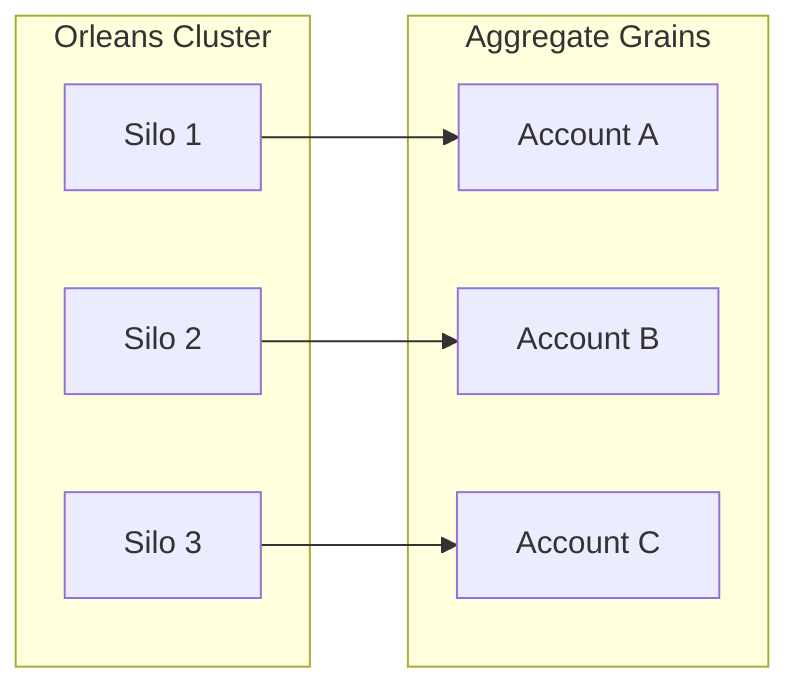

# Mississippi for Enterprise

Standardise on proven patterns. Scale teams with consistent architecture. Observe everything.

:::caution Early Alpha
Mississippi is in early alpha. APIs may change without notice. Enterprise adoption requires careful evaluation.
:::

## Overview

Large organisations need repeatable patterns and observability. Mississippi enforces consistent architecture through attributes and generators, uses Orleans grains for aggregates and projections ([GenericAggregateGrain](https://github.com/Gibbs-Morris/mississippi/blob/main/src/EventSourcing.Aggregates/GenericAggregateGrain.cs), [UxProjectionGrain](https://github.com/Gibbs-Morris/mississippi/blob/main/src/EventSourcing.UxProjections/UxProjectionGrain.cs)), and exposes OpenTelemetry-compatible metrics.

## Enterprise Capabilities

### Consistent Architecture Across Teams

Attributes and generators enforce uniform patterns:

- [`[GenerateCommand]`](https://github.com/Gibbs-Morris/mississippi/blob/main/src/Inlet.Generators.Abstractions/GenerateCommandAttribute.cs) produces server and client artifacts for command records
- [`[GenerateAggregateEndpoints]`](https://github.com/Gibbs-Morris/mississippi/blob/main/src/Inlet.Generators.Abstractions/GenerateAggregateEndpointsAttribute.cs) generates HTTP controllers for aggregates
- [`[GenerateProjectionEndpoints]`](https://github.com/Gibbs-Morris/mississippi/blob/main/src/Inlet.Generators.Abstractions/GenerateProjectionEndpointsAttribute.cs) generates HTTP read endpoints for projections (client subscription code is optional)

Teams follow the same patterns. Onboarding is faster. Cross-team collaboration is easier.

### Orleans Actor Model

Orleans grains host aggregates across silos:

[`GenericAggregateGrain`](https://github.com/Gibbs-Morris/mississippi/blob/main/src/EventSourcing.Aggregates/GenericAggregateGrain.cs) handles concurrency control, event persistence, and state rebuilding. No custom grain code per aggregate.

### Distributed Storage and Locking

The sample Spring application demonstrates cloud-native deployment:

- Cosmos DB containers for events and snapshots
- Azure Blob Storage for distributed locking
- Azure Table Storage for Orleans clustering

See the [Spring.Silo Program.cs](https://github.com/Gibbs-Morris/mississippi/blob/main/samples/Spring/Spring.Silo/Program.cs) for configuration patterns.

### Observability

Mississippi emits OpenTelemetry-compatible metrics via meters in the event-sourcing and Inlet components:

- Aggregates: [`AggregateMetrics`](https://github.com/Gibbs-Morris/mississippi/blob/main/src/EventSourcing.Aggregates/Diagnostics/AggregateMetrics.cs)
- Brooks: [`BrookMetrics`](https://github.com/Gibbs-Morris/mississippi/blob/main/src/EventSourcing.Brooks/Diagnostics/BrookMetrics.cs)
- Inlet: [`InletMetrics`](https://github.com/Gibbs-Morris/mississippi/blob/main/src/Inlet.Silo/Diagnostics/InletMetrics.cs)

The Spring sample wires OpenTelemetry and health endpoints in [Spring.Silo Program.cs](https://github.com/Gibbs-Morris/mississippi/blob/main/samples/Spring/Spring.Silo/Program.cs) and [Spring.Server Program.cs](https://github.com/Gibbs-Morris/mississippi/blob/main/samples/Spring/Spring.Server/Program.cs).

### Rapid Onboarding

Source-generated controllers and mappers mean new domain modules follow the same structure:

1. Define aggregate with `[BrookName]` and `[GenerateAggregateEndpoints]`
2. Add commands with `[GenerateCommand]`
3. Implement handlers and reducers
4. Run build to generate controllers, actions, and effects

New developers learn the pattern once and apply it everywhere.

## Enterprise Benefits

| Benefit | How Mississippi Delivers |
|---------|--------------------------|
| **Consistency** | Generators enforce uniform patterns across teams |
| **Scale** | Aggregates and projections run as Orleans grains ([GenericAggregateGrain](https://github.com/Gibbs-Morris/mississippi/blob/main/src/EventSourcing.Aggregates/GenericAggregateGrain.cs), [UxProjectionGrain](https://github.com/Gibbs-Morris/mississippi/blob/main/src/EventSourcing.UxProjections/UxProjectionGrain.cs)) |
| **Observability** | OpenTelemetry-compatible metrics and sample wiring ([AggregateMetrics](https://github.com/Gibbs-Morris/mississippi/blob/main/src/EventSourcing.Aggregates/Diagnostics/AggregateMetrics.cs)) |
| **Storage flexibility** | Pluggable storage providers for different backends ([RegisterBrookStorageProvider](https://github.com/Gibbs-Morris/mississippi/blob/main/src/EventSourcing.Brooks.Abstractions/Storage/BrookStorageProviderExtensions.cs)) |
| **Onboarding** | Standardised patterns reduce learning curve |

## Pluggable Storage

Mississippi is not tied to a specific database. Storage is abstracted behind interfaces:

| Interface | Purpose |
|-----------|---------|
| [`IBrookStorageProvider`](https://github.com/Gibbs-Morris/mississippi/blob/main/src/EventSourcing.Brooks.Abstractions/Storage/IBrookStorageProvider.cs) | Event stream storage (Format identifiers like `"cosmos-db"`) |
| [`ISnapshotStorageProvider`](https://github.com/Gibbs-Morris/mississippi/blob/main/src/EventSourcing.Snapshots.Abstractions/ISnapshotStorageProvider.cs) | Snapshot storage (Format identifiers like `"cosmos-db"`) |

Register custom implementations via extension methods:

- [`RegisterBrookStorageProvider`](https://github.com/Gibbs-Morris/mississippi/blob/main/src/EventSourcing.Brooks.Abstractions/Storage/BrookStorageProviderExtensions.cs)
- [`RegisterSnapshotStorageProvider`](https://github.com/Gibbs-Morris/mississippi/blob/main/src/EventSourcing.Snapshots.Abstractions/SnapshotStorageProviderExtensions.cs)

This enables on-premise deployments and cloud migrations with custom providers.

## Summary

Mississippi provides enterprise-grade patterns: consistent architecture via generators, Orleans grains for aggregates and projections, OpenTelemetry-compatible metrics, and pluggable storage for deployment flexibility.

## Next Steps

- [For Financial Services](./for-financial-services.md) - Regulatory compliance patterns
- [How It Works](./how-it-works.md) - Technical architecture
- [Overview](./index.md) - Return to the main landing page
