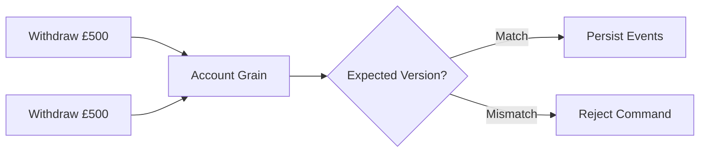

# Mississippi for Financial Services

Audit trails. Built-in compliance patterns. Strong consistency.

:::caution Early Alpha
Mississippi is in early alpha. APIs may change without notice. Compliance-critical systems require thorough evaluation.
:::

## Overview

Financial services demand audit trails, regulatory compliance, and transactional integrity. Mississippi appends events to brooks with stable naming ([EventStorageNameAttribute](https://github.com/Gibbs-Morris/mississippi/blob/main/src/EventSourcing.Brooks.Abstractions/Attributes/EventStorageNameAttribute.cs)) via [`GenericAggregateGrain`](https://github.com/Gibbs-Morris/mississippi/blob/main/src/EventSourcing.Aggregates/GenericAggregateGrain.cs) and enforces optimistic concurrency to prevent double-spend scenarios.

## Financial Services Capabilities

### Audit Log with Stable Naming

Every command produces events persisted to the event store. Events carry stable names via [`[EventStorageName]`](https://github.com/Gibbs-Morris/mississippi/blob/main/src/EventSourcing.Brooks.Abstractions/Attributes/EventStorageNameAttribute.cs):

```csharp
[EventStorageName("SPRING", "BANKING", "FUNDSDEPOSITED")]
internal sealed record FundsDeposited
{
    [Id(0)] public decimal Amount { get; init; }
}
```

The naming convention `{AppName}.{ModuleName}.{Name}.V{Version}` survives refactoring and namespace changes, ensuring stable persistence across code evolution.

Snapshots provide cached state for faster reads of aggregate and projection state ([ISnapshotStorageProvider](https://github.com/Gibbs-Morris/mississippi/blob/main/src/EventSourcing.Snapshots.Abstractions/ISnapshotStorageProvider.cs)).

### Strong Consistency and Concurrency Control

[`GenericAggregateGrain`](https://github.com/Gibbs-Morris/mississippi/blob/main/src/EventSourcing.Aggregates/GenericAggregateGrain.cs) enforces optimistic concurrency:



Concurrent commands against the same aggregate are serialised through the grain. Version checks prevent double-spend and ensure transactional integrity.

### AML Compliance Out of the Box

The Spring sample demonstrates anti-money laundering (AML) patterns with [`HighValueTransactionEffect`](https://github.com/Gibbs-Morris/mississippi/blob/main/samples/Spring/Spring.Domain/Aggregates/BankAccount/Effects/HighValueTransactionEffect.cs):

- Deposits exceeding £10,000 trigger a compliance check
- A `FlagTransaction` command is dispatched to a separate investigation queue aggregate
- Flagged transactions are collected in the [`FlaggedTransactionsProjection`](https://github.com/Gibbs-Morris/mississippi/blob/main/samples/Spring/Spring.Domain/Projections/FlaggedTransactions/FlaggedTransactionsProjection.cs)

```csharp
internal const decimal AmlThreshold = 10_000m;

protected override async Task HandleSimpleAsync(
    FundsDeposited eventData,
    BankAccountAggregate currentState,
    string brookKey,
    long eventPosition,
    CancellationToken cancellationToken)
{
    if (eventData.Amount <= AmlThreshold)
    {
        return;
    }

    // Dispatch to investigation queue
    IGenericAggregateGrain<TransactionInvestigationQueueAggregate> grain =
        AggregateGrainFactory.GetGenericAggregate<TransactionInvestigationQueueAggregate>("global");
    await grain.ExecuteAsync(new FlagTransaction { ... }, cancellationToken);
}
```

This pattern can be adapted for fraud detection, transaction monitoring, or other compliance requirements.

### OpenTelemetry Integration

Mississippi emits OpenTelemetry-compatible metrics via meters in the event-sourcing and Inlet components:

- Aggregates: [`AggregateMetrics`](https://github.com/Gibbs-Morris/mississippi/blob/main/src/EventSourcing.Aggregates/Diagnostics/AggregateMetrics.cs)
- Brooks: [`BrookMetrics`](https://github.com/Gibbs-Morris/mississippi/blob/main/src/EventSourcing.Brooks/Diagnostics/BrookMetrics.cs)
- Inlet: [`InletMetrics`](https://github.com/Gibbs-Morris/mississippi/blob/main/src/Inlet.Silo/Diagnostics/InletMetrics.cs)

The Spring sample wires OpenTelemetry and health endpoints in [Spring.Silo Program.cs](https://github.com/Gibbs-Morris/mississippi/blob/main/samples/Spring/Spring.Silo/Program.cs) and [Spring.Server Program.cs](https://github.com/Gibbs-Morris/mississippi/blob/main/samples/Spring/Spring.Server/Program.cs).

## Financial Services Benefits

| Requirement | How Mississippi Delivers |
|-------------|--------------------------|
| **Audit Trail** | Events are appended to brooks with stable naming ([EventStorageNameAttribute](https://github.com/Gibbs-Morris/mississippi/blob/main/src/EventSourcing.Brooks.Abstractions/Attributes/EventStorageNameAttribute.cs)) |
| **Consistency** | Optimistic concurrency prevents double-spend |
| **AML/Compliance** | Event effects pattern for cross-aggregate flagging |
| **Versioning** | `[EventStorageName]` survives refactoring |
| **Observability** | OpenTelemetry-compatible metrics and sample wiring ([AggregateMetrics](https://github.com/Gibbs-Morris/mississippi/blob/main/src/EventSourcing.Aggregates/Diagnostics/AggregateMetrics.cs)) |

## Pluggable Storage for Compliance

Storage providers implement the [`Format`](https://github.com/Gibbs-Morris/mississippi/blob/main/src/EventSourcing.Brooks.Abstractions/Storage/IBrookStorageProvider.cs#L21) identifier (for example, `"cosmos-db"`). Financial institutions can:

- Use compliant cloud storage (Azure Cosmos DB)
- Deploy on-premise with custom storage providers
- Implement region-specific data residency requirements

## Insurance Industry Fit

Mississippi's patterns also suit insurance:

| Domain Concept | Mississippi Pattern |
|----------------|---------------------|
| **Policies** | Aggregates with commands (issue, endorse, renew) |
| **Claims** | Event streams capture state transitions (brooks + [`RootReducer`](https://github.com/Gibbs-Morris/mississippi/blob/main/src/EventSourcing.Reducers/RootReducer.cs)) |
| **Underwriting** | Effects for external service integration |
| **Compliance** | Event storage names remain stable across refactors |

Underwriters can iterate on business rules using the test harness, delivering new products while maintaining auditability.

## Summary

Mississippi provides the building blocks for regulated financial applications: stable event naming, optimistic concurrency, compliance-ready patterns, and observable infrastructure. The sample AML flagging demonstrates how to implement cross-aggregate compliance flows.

## Next Steps

- [For Enterprise](./for-enterprise.md) - Scaling patterns
- [How It Works](./how-it-works.md) - Technical architecture
- [Overview](./index.md) - Return to the main landing page
