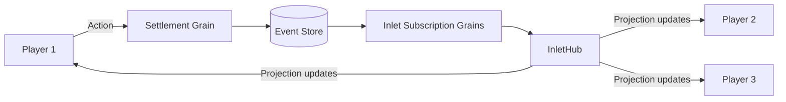
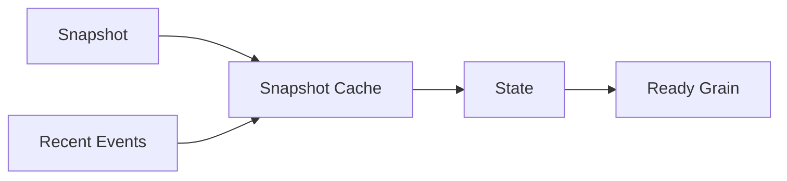

# Mississippi for Game Developers

Real-time updates. Event streams. Orleans-backed game services.

:::caution Early Alpha
Mississippi is in early alpha. APIs may change without notice. Evaluate performance characteristics for your game requirements.
:::

## Overview

Browser-based multiplayer games need real-time synchronisation and reliable state transitions. Mississippi's actor model, event streams, and SignalR integration support these capabilities.

## Game Development Capabilities

### Real-Time Synchronisation

[`InletHub`](https://github.com/Gibbs-Morris/mississippi/blob/main/src/Inlet.Server/InletHub.cs) pushes projection updates via SignalR. Players see shared game boards update without polling:



The [`InletSignalRActionEffect`](https://github.com/Gibbs-Morris/mississippi/blob/main/src/Inlet.Client/ActionEffects/InletSignalRActionEffect.cs) manages subscriptions and dispatches updates into the client store. Players receive updates as events are processed.

### Scalable Actor Model

Each player, settlement, or game entity can be an aggregate backed by an Orleans grain:

```csharp
[BrookName("GAME", "WORLD", "SETTLEMENT")]
[GenerateAggregateEndpoints]
public sealed record SettlementAggregate
{
    [Id(0)] public int Wood { get; init; }
    [Id(1)] public int Stone { get; init; }
    [Id(2)] public int Population { get; init; }
}
```

Orleans grains host aggregate instances and handle command execution via [`GenericAggregateGrain`](https://github.com/Gibbs-Morris/mississippi/blob/main/src/EventSourcing.Aggregates/GenericAggregateGrain.cs).

### Event Streams for Debugging

Event streams capture state transitions:

- Replay battles to investigate complaints
- Debug game logic by stepping through events
- Anti-cheat analysis via event stream inspection

Events are appended to brooks; reducers can rebuild state by applying events ([BrookStorageProvider](https://github.com/Gibbs-Morris/mississippi/blob/main/src/EventSourcing.Brooks.Cosmos/BrookStorageProvider.cs), [`RootReducer`](https://github.com/Gibbs-Morris/mississippi/blob/main/src/EventSourcing.Reducers/RootReducer.cs)).

### Snapshots for Faster State Reads

Snapshots reduce state rebuild cost by caching state:



[`ISnapshotStorageProvider`](https://github.com/Gibbs-Morris/mississippi/blob/main/src/EventSourcing.Snapshots.Abstractions/ISnapshotStorageProvider.cs) stores snapshots used by the runtime when rebuilding state.

### Pluggable Storage for Performance

Choose storage that fits your latency and cost requirements:

| Provider | Use Case |
|----------|----------|
| Cosmos DB | Managed event and snapshot storage via the Cosmos providers ([BrookStorageProvider](https://github.com/Gibbs-Morris/mississippi/blob/main/src/EventSourcing.Brooks.Cosmos/BrookStorageProvider.cs), [SnapshotStorageProvider](https://github.com/Gibbs-Morris/mississippi/blob/main/src/EventSourcing.Snapshots.Cosmos/SnapshotStorageProvider.cs)) |
| Custom | Implement a provider that matches your latency and hosting needs |

Register providers via [`RegisterBrookStorageProvider`](https://github.com/Gibbs-Morris/mississippi/blob/main/src/EventSourcing.Brooks.Abstractions/Storage/BrookStorageProviderExtensions.cs).

## Game Development Benefits

| Requirement | How Mississippi Delivers |
|-------------|--------------------------|
| **Real-time** | SignalR projection push via [`InletHub`](https://github.com/Gibbs-Morris/mississippi/blob/main/src/Inlet.Server/InletHub.cs) |
| **Scale** | Aggregates and projections run as Orleans grains ([GenericAggregateGrain](https://github.com/Gibbs-Morris/mississippi/blob/main/src/EventSourcing.Aggregates/GenericAggregateGrain.cs), [UxProjectionGrain](https://github.com/Gibbs-Morris/mississippi/blob/main/src/EventSourcing.UxProjections/UxProjectionGrain.cs)) |
| **Replay** | Event streams + reducers rebuild state ([BrookStorageProvider](https://github.com/Gibbs-Morris/mississippi/blob/main/src/EventSourcing.Brooks.Cosmos/BrookStorageProvider.cs), [RootReducer](https://github.com/Gibbs-Morris/mississippi/blob/main/src/EventSourcing.Reducers/RootReducer.cs)) |
| **Reconnection** | Snapshots reduce state rebuild time ([ISnapshotStorageProvider](https://github.com/Gibbs-Morris/mississippi/blob/main/src/EventSourcing.Snapshots.Abstractions/ISnapshotStorageProvider.cs)) |
| **Flexibility** | Pluggable storage for different environments ([RegisterBrookStorageProvider](https://github.com/Gibbs-Morris/mississippi/blob/main/src/EventSourcing.Brooks.Abstractions/Storage/BrookStorageProviderExtensions.cs)) |

## Example: Strategy Game Commands

```csharp
[GenerateCommand(Route = "construct")]
[GenerateSerializer]
public sealed record ConstructBuilding
{
    [Id(0)] public string BuildingType { get; init; }
    [Id(1)] public int Quantity { get; init; }
}

[GenerateCommand(Route = "train")]
[GenerateSerializer]
public sealed record TrainTroops
{
    [Id(0)] public string UnitType { get; init; }
    [Id(1)] public int Count { get; init; }
}

[GenerateCommand(Route = "attack")]
[GenerateSerializer]
public sealed record AttackEnemy
{
    [Id(0)] public string TargetSettlementId { get; init; }
    [Id(1)] public string[] UnitIds { get; init; }
}
```

Source generators produce controllers, client actions, and effects for each command ([GenerateCommandAttribute](https://github.com/Gibbs-Morris/mississippi/blob/main/src/Inlet.Generators.Abstractions/GenerateCommandAttribute.cs)). Game designers can simulate battles and resource flows using the test harness offline.

## Test Harness for Game Logic

[`AggregateTestHarness`](https://github.com/Gibbs-Morris/mississippi/blob/main/src/EventSourcing.Testing/Aggregates/AggregateTestHarness.cs) enables offline testing:

```csharp
ForAggregate<SettlementAggregate>()
    .WithHandler<ConstructBuildingHandler>()
    .WithReducer<BuildingConstructedReducer>()
    .CreateScenario()
    .Given(new SettlementFounded { ... })
    .When(new ConstructBuilding { BuildingType = "Barracks", Quantity = 1 })
    .ThenEmits<BuildingConstructed>(e => e.BuildingType.Should().Be("Barracks"));
```

Iterate on game mechanics without running servers.

## Summary

Mississippi provides the infrastructure for browser-based multiplayer games: real-time SignalR updates, Orleans-hosted aggregates, event streams with reducers, and snapshots for faster state reads. Source generators accelerate feature delivery.

## Next Steps

- [How It Works](./how-it-works.md) - Technical architecture
- [For Startups](./for-startups.md) - Rapid development patterns
- [Overview](./index.md) - Return to the main landing page
