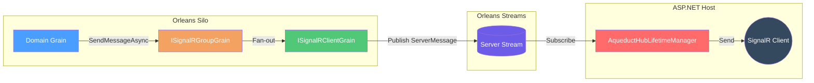

# Aqueduct

## Overview

Aqueduct replaces the default SignalR `HubLifetimeManager<THub>` with `AqueductHubLifetimeManager<THub>`, routing connection, group, and message operations through Orleans grains and Orleans streams for cross-server delivery. ([AqueductHubLifetimeManager](https://github.com/Gibbs-Morris/mississippi/blob/main/src/Aqueduct/AqueductHubLifetimeManager.cs#L21-L50))

Aqueduct uses three grain types to coordinate message delivery:

| Grain | Role |
| --- | --- |
| [`ISignalRClientGrain`](https://github.com/Gibbs-Morris/mississippi/blob/main/src/Aqueduct.Abstractions/Grains/ISignalRClientGrain.cs#L9-L64) | Tracks a single SignalR connection and routes messages to that connection. |
| [`ISignalRGroupGrain`](https://github.com/Gibbs-Morris/mississippi/blob/main/src/Aqueduct.Abstractions/Grains/ISignalRGroupGrain.cs#L9-L63) | Manages group membership and fans out group messages to client grains. |
| [`ISignalRServerDirectoryGrain`](https://github.com/Gibbs-Morris/mississippi/blob/main/src/Aqueduct.Abstractions/Grains/ISignalRServerDirectoryGrain.cs#L10-L65) | Tracks active servers and heartbeat status for failure detection. |

## Architecture

## Message Routing Flow

1. A grain calls `ISignalRGroupGrain.SendMessageAsync`, which fans out to per-connection client grains. ([ISignalRGroupGrain](https://github.com/Gibbs-Morris/mississippi/blob/main/src/Aqueduct.Abstractions/Grains/ISignalRGroupGrain.cs#L9-L63))
2. `SignalRClientGrain` publishes a server-targeted message to the Orleans stream provider configured in `AqueductOptions`. ([SignalRClientGrain](https://github.com/Gibbs-Morris/mississippi/blob/main/src/Aqueduct.Grains/Grains/SignalRClientGrain.cs#L23-L163))
3. `AqueductHubLifetimeManager<THub>` subscribes to server-targeted and all-clients streams and delivers messages to local SignalR connections. ([AqueductHubLifetimeManager](https://github.com/Gibbs-Morris/mississippi/blob/main/src/Aqueduct/AqueductHubLifetimeManager.cs#L21-L208), [StreamSubscriptionManager](https://github.com/Gibbs-Morris/mississippi/blob/main/src/Aqueduct/StreamSubscriptionManager.cs#L18-L138))

## Defaults and Stream Naming

Aqueduct defaults are defined in `AqueductOptions` and `MississippiDefaults`:

| Option | Default | Source |
| --- | --- | --- |
| `StreamProviderName` | `mississippi-streaming` | [`AqueductOptions`](https://github.com/Gibbs-Morris/mississippi/blob/main/src/Aqueduct.Abstractions/AqueductOptions.cs#L6-L49), [`MississippiDefaults.StreamProviderName`](https://github.com/Gibbs-Morris/mississippi/blob/main/src/Common.Abstractions/MississippiDefaults.cs#L31-L35) |
| `ServerStreamNamespace` | `mississippi-server` | [`AqueductOptions`](https://github.com/Gibbs-Morris/mississippi/blob/main/src/Aqueduct.Abstractions/AqueductOptions.cs#L35-L41), [`MississippiDefaults.StreamNamespaces.Server`](https://github.com/Gibbs-Morris/mississippi/blob/main/src/Common.Abstractions/MississippiDefaults.cs#L114-L133) |
| `AllClientsStreamNamespace` | `mississippi-all-clients` | [`AqueductOptions`](https://github.com/Gibbs-Morris/mississippi/blob/main/src/Aqueduct.Abstractions/AqueductOptions.cs#L11-L17), [`MississippiDefaults.StreamNamespaces.AllClients`](https://github.com/Gibbs-Morris/mississippi/blob/main/src/Common.Abstractions/MississippiDefaults.cs#L114-L127) |
| `HeartbeatIntervalMinutes` | `1` | [`AqueductOptions`](https://github.com/Gibbs-Morris/mississippi/blob/main/src/Aqueduct.Abstractions/AqueductOptions.cs#L19-L33) |
| `DeadServerTimeoutMultiplier` | `3` | [`AqueductOptions`](https://github.com/Gibbs-Morris/mississippi/blob/main/src/Aqueduct.Abstractions/AqueductOptions.cs#L19-L25) |

## Key Formats

Aqueduct uses strongly-typed keys for grain identity:

| Key Type | Format |
| --- | --- |
| [`SignalRClientKey`](https://github.com/Gibbs-Morris/mississippi/blob/main/src/Aqueduct.Abstractions/Keys/SignalRClientKey.cs#L8-L115) | `{HubName}:{ConnectionId}` |
| [`SignalRGroupKey`](https://github.com/Gibbs-Morris/mississippi/blob/main/src/Aqueduct.Abstractions/Keys/SignalRGroupKey.cs#L8-L115) | `{HubName}:{GroupName}` |
| [`SignalRServerDirectoryKey`](https://github.com/Gibbs-Morris/mississippi/blob/main/src/Aqueduct.Abstractions/Keys/SignalRServerDirectoryKey.cs#L8-L25) | `default` (singleton) |

## Operational Characteristics

- `SignalRGroupGrain` keeps group membership in memory and deactivates when the group is empty. ([SignalRGroupGrain](https://github.com/Gibbs-Morris/mississippi/blob/main/src/Aqueduct.Grains/Grains/SignalRGroupGrain.cs#L18-L141))
- `SignalRClientGrain` stores connection metadata in memory and deactivates on disconnect. ([SignalRClientGrain](https://github.com/Gibbs-Morris/mississippi/blob/main/src/Aqueduct.Grains/Grains/SignalRClientGrain.cs#L23-L113))
- `SignalRServerDirectoryGrain` maintains an in-memory registry of active servers and heartbeat timestamps. ([SignalRServerDirectoryGrain](https://github.com/Gibbs-Morris/mississippi/blob/main/src/Aqueduct.Grains/Grains/SignalRServerDirectoryGrain.cs#L19-L34))

## Summary

- Aqueduct replaces the default SignalR lifetime manager with `AqueductHubLifetimeManager<THub>` to route operations through Orleans grains and streams. ([AqueductHubLifetimeManager](https://github.com/Gibbs-Morris/mississippi/blob/main/src/Aqueduct/AqueductHubLifetimeManager.cs#L21-L50))
- Client, group, and server-directory grains define the backplane’s core responsibilities. ([ISignalRClientGrain](https://github.com/Gibbs-Morris/mississippi/blob/main/src/Aqueduct.Abstractions/Grains/ISignalRClientGrain.cs#L9-L64), [ISignalRGroupGrain](https://github.com/Gibbs-Morris/mississippi/blob/main/src/Aqueduct.Abstractions/Grains/ISignalRGroupGrain.cs#L9-L63), [ISignalRServerDirectoryGrain](https://github.com/Gibbs-Morris/mississippi/blob/main/src/Aqueduct.Abstractions/Grains/ISignalRServerDirectoryGrain.cs#L10-L65))
- Default stream names and provider settings come from `MississippiDefaults`. ([MississippiDefaults](https://github.com/Gibbs-Morris/mississippi/blob/main/src/Common.Abstractions/MississippiDefaults.cs#L31-L133))

## Next Steps

- [ASP.NET Setup](./aspnet-setup.md) — Configure web servers with Aqueduct.
- [Silo Setup](./silo-setup.md) — Configure Orleans silos and send messages from grains.

