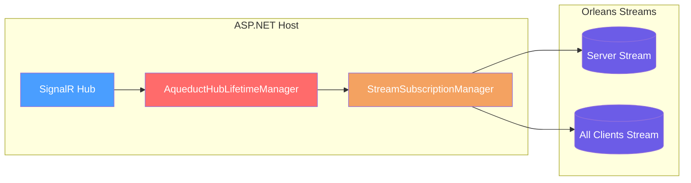

# ASP.NET Setup

## Overview

`AddAqueduct<THub>` registers the Aqueduct backplane for a SignalR hub and requires an Orleans client and stream provider to be available in DI. ([AqueductRegistrations](https://github.com/Gibbs-Morris/mississippi/blob/main/src/Aqueduct/AqueductRegistrations.cs#L17-L83))

## Architecture



## Configuration

Register SignalR and Aqueduct for your hub type:

```csharp
using Mississippi.Aqueduct;

var builder = WebApplication.CreateBuilder(args);

builder.Services.AddSignalR();
builder.Services.AddAqueduct<MyHub>(options =>
{
    options.StreamProviderName = "mississippi-streaming";
});
```

`AddAqueduct<THub>` registers `AqueductHubLifetimeManager<THub>` plus the Aqueduct backplane services. ([AqueductRegistrations](https://github.com/Gibbs-Morris/mississippi/blob/main/src/Aqueduct/AqueductRegistrations.cs#L17-L83))

## Options and Defaults

Aqueduct reads options from `AqueductOptions`:

| Option | Default | Source |
| --- | --- | --- |
| `StreamProviderName` | `mississippi-streaming` | [`AqueductOptions`](https://github.com/Gibbs-Morris/mississippi/blob/main/src/Aqueduct.Abstractions/AqueductOptions.cs#L6-L49), [`MississippiDefaults.StreamProviderName`](https://github.com/Gibbs-Morris/mississippi/blob/main/src/Common.Abstractions/MississippiDefaults.cs#L31-L35) |
| `ServerStreamNamespace` | `mississippi-server` | [`AqueductOptions`](https://github.com/Gibbs-Morris/mississippi/blob/main/src/Aqueduct.Abstractions/AqueductOptions.cs#L35-L41), [`MississippiDefaults.StreamNamespaces.Server`](https://github.com/Gibbs-Morris/mississippi/blob/main/src/Common.Abstractions/MississippiDefaults.cs#L114-L133) |
| `AllClientsStreamNamespace` | `mississippi-all-clients` | [`AqueductOptions`](https://github.com/Gibbs-Morris/mississippi/blob/main/src/Aqueduct.Abstractions/AqueductOptions.cs#L11-L17), [`MississippiDefaults.StreamNamespaces.AllClients`](https://github.com/Gibbs-Morris/mississippi/blob/main/src/Common.Abstractions/MississippiDefaults.cs#L114-L127) |
| `HeartbeatIntervalMinutes` | `1` | [`AqueductOptions`](https://github.com/Gibbs-Morris/mississippi/blob/main/src/Aqueduct.Abstractions/AqueductOptions.cs#L19-L33) |
| `DeadServerTimeoutMultiplier` | `3` | [`AqueductOptions`](https://github.com/Gibbs-Morris/mississippi/blob/main/src/Aqueduct.Abstractions/AqueductOptions.cs#L19-L25) |

## Services Registered by AddAqueduct

`AddAqueduct<THub>` registers these singleton services:

| Service | Lifetime |
| --- | --- |
| `HubLifetimeManager<THub>` | Singleton |
| `IServerIdProvider` | Singleton |
| `IAqueductGrainFactory` | Singleton |
| `IConnectionRegistry` | Singleton |
| `ILocalMessageSender` | Singleton |
| `IHeartbeatManager` | Singleton |
| `IStreamSubscriptionManager` | Singleton |

([AqueductRegistrations](https://github.com/Gibbs-Morris/mississippi/blob/main/src/Aqueduct/AqueductRegistrations.cs#L37-L83))

## Server-Side Notifications

`IAqueductNotifier` is intended for ASP.NET hosts; do not inject it into grains. ([IAqueductNotifier](https://github.com/Gibbs-Morris/mississippi/blob/main/src/Aqueduct.Abstractions/IAqueductNotifier.cs#L10-L79))

Register the notifier in the web host:

```csharp
builder.Services.AddAqueductNotifier();
```

Then send messages by hub name:

```csharp
public sealed class NotificationService
{
    private IAqueductNotifier Notifier { get; }

    public NotificationService(IAqueductNotifier notifier)
    {
        Notifier = notifier;
    }

    public Task SendToGroupAsync(string hubName, string groupName, string method, string message)
    {
        return Notifier.SendToGroupAsync(
            hubName,
            groupName,
            method,
            ImmutableArray.Create<object?>(message));
    }
}
```

`AddAqueductNotifier` registers `IAqueductNotifier` and `IAqueductGrainFactory`. ([AqueductRegistrations](https://github.com/Gibbs-Morris/mississippi/blob/main/src/Aqueduct/AqueductRegistrations.cs#L109-L132))

## Hub Name Consistency

`AqueductHubLifetimeManager<THub>` derives the hub name from the hub type name (`typeof(THub).Name`). Use the same hub name when calling `IAqueductNotifier`. ([AqueductHubLifetimeManager](https://github.com/Gibbs-Morris/mississippi/blob/main/src/Aqueduct/AqueductHubLifetimeManager.cs#L108-L110), [IAqueductNotifier](https://github.com/Gibbs-Morris/mississippi/blob/main/src/Aqueduct.Abstractions/IAqueductNotifier.cs#L26-L28))

## Summary

- `AddAqueduct<THub>` registers the Aqueduct backplane services and replaces the hub lifetime manager. ([AqueductRegistrations](https://github.com/Gibbs-Morris/mississippi/blob/main/src/Aqueduct/AqueductRegistrations.cs#L17-L83))
- `AqueductOptions` defaults come from `MississippiDefaults` and should match the silo configuration. ([AqueductOptions](https://github.com/Gibbs-Morris/mississippi/blob/main/src/Aqueduct.Abstractions/AqueductOptions.cs#L6-L49), [MississippiDefaults](https://github.com/Gibbs-Morris/mississippi/blob/main/src/Common.Abstractions/MississippiDefaults.cs#L31-L133))
- `IAqueductNotifier` is for ASP.NET hosts and routes messages by hub name. ([IAqueductNotifier](https://github.com/Gibbs-Morris/mississippi/blob/main/src/Aqueduct.Abstractions/IAqueductNotifier.cs#L10-L79))

## Next Steps

- [Silo Setup](./silo-setup.md) — Configure Orleans silos and send messages from grains.
- [Aqueduct Overview](./aqueduct.md) — Back to the Aqueduct overview.

