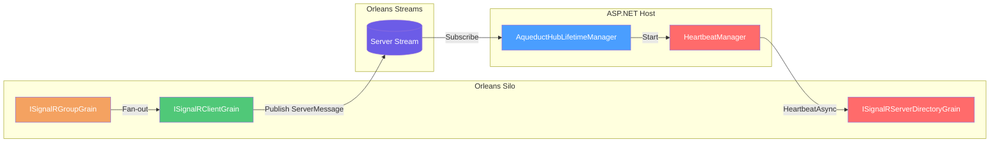

# Silo Setup

## Overview

`UseAqueduct` configures Aqueduct for a silo and registers `IAqueductGrainFactory` for resolving SignalR grains. ([AqueductGrainsRegistrations](https://github.com/Gibbs-Morris/mississippi/blob/main/src/Aqueduct.Grains/AqueductGrainsRegistrations.cs#L19-L72))

## Architecture



## Configuration

Configure Aqueduct on the silo using `UseAqueduct`:

```csharp
using Mississippi.Aqueduct.Grains;

builder.UseOrleans(siloBuilder =>
{
    siloBuilder.UseAqueduct(options =>
    {
        options.UseMemoryStreams();
    });
});
```

`UseMemoryStreams()` configures Orleans memory streams and the PubSub store for local development/testing. ([AqueductSiloOptions](https://github.com/Gibbs-Morris/mississippi/blob/main/src/Aqueduct.Grains/AqueductSiloOptions.cs#L73-L112))

If you use the parameterless `UseAqueduct()` overload, configure the stream provider separately using the default stream provider name. ([AqueductGrainsRegistrations](https://github.com/Gibbs-Morris/mississippi/blob/main/src/Aqueduct.Grains/AqueductGrainsRegistrations.cs#L75-L91))

## Options and Defaults

`AqueductSiloOptions` uses the same defaults as `AqueductOptions`:

| Option | Default | Source |
| --- | --- | --- |
| `StreamProviderName` | `mississippi-streaming` | [`AqueductSiloOptions`](https://github.com/Gibbs-Morris/mississippi/blob/main/src/Aqueduct.Grains/AqueductSiloOptions.cs#L33-L72), [`MississippiDefaults.StreamProviderName`](https://github.com/Gibbs-Morris/mississippi/blob/main/src/Common.Abstractions/MississippiDefaults.cs#L31-L35) |
| `ServerStreamNamespace` | `mississippi-server` | [`AqueductSiloOptions`](https://github.com/Gibbs-Morris/mississippi/blob/main/src/Aqueduct.Grains/AqueductSiloOptions.cs#L57-L64), [`MississippiDefaults.StreamNamespaces.Server`](https://github.com/Gibbs-Morris/mississippi/blob/main/src/Common.Abstractions/MississippiDefaults.cs#L114-L133) |
| `AllClientsStreamNamespace` | `mississippi-all-clients` | [`AqueductSiloOptions`](https://github.com/Gibbs-Morris/mississippi/blob/main/src/Aqueduct.Grains/AqueductSiloOptions.cs#L33-L39), [`MississippiDefaults.StreamNamespaces.AllClients`](https://github.com/Gibbs-Morris/mississippi/blob/main/src/Common.Abstractions/MississippiDefaults.cs#L114-L127) |
| `HeartbeatIntervalMinutes` | `1` | [`AqueductSiloOptions`](https://github.com/Gibbs-Morris/mississippi/blob/main/src/Aqueduct.Grains/AqueductSiloOptions.cs#L41-L55) |
| `DeadServerTimeoutMultiplier` | `3` | [`AqueductSiloOptions`](https://github.com/Gibbs-Morris/mississippi/blob/main/src/Aqueduct.Grains/AqueductSiloOptions.cs#L41-L47) |

## Grain Keys

Aqueduct grain keys are standardized:

| Key Type | Format |
| --- | --- |
| [`SignalRClientKey`](https://github.com/Gibbs-Morris/mississippi/blob/main/src/Aqueduct.Abstractions/Keys/SignalRClientKey.cs#L8-L115) | `{HubName}:{ConnectionId}` |
| [`SignalRGroupKey`](https://github.com/Gibbs-Morris/mississippi/blob/main/src/Aqueduct.Abstractions/Keys/SignalRGroupKey.cs#L8-L115) | `{HubName}:{GroupName}` |
| [`SignalRServerDirectoryKey`](https://github.com/Gibbs-Morris/mississippi/blob/main/src/Aqueduct.Abstractions/Keys/SignalRServerDirectoryKey.cs#L8-L25) | `default` (singleton) |

## Sending Messages from Grains

Use `IAqueductGrainFactory` for type-safe grain access:

```csharp
public sealed class NotificationGrain : Grain
{
    private IAqueductGrainFactory AqueductGrainFactory { get; }

    public NotificationGrain(IAqueductGrainFactory aqueductGrainFactory)
    {
        AqueductGrainFactory = aqueductGrainFactory;
    }

    public Task NotifyGroupAsync(string hubName, string groupName, string method, string message)
    {
        ISignalRGroupGrain groupGrain = AqueductGrainFactory.GetGroupGrain(hubName, groupName);
        return groupGrain.SendMessageAsync(method, ImmutableArray.Create<object?>(message));
    }
}
```

`IAqueductGrainFactory` resolves client, group, and server-directory grains without manual key formatting. ([IAqueductGrainFactory](https://github.com/Gibbs-Morris/mississippi/blob/main/src/Aqueduct.Abstractions/IAqueductGrainFactory.cs#L7-L72))

## Operational Characteristics

- `SignalRClientGrain` publishes server-targeted messages using `StreamProviderName` and `ServerStreamNamespace`. ([SignalRClientGrain](https://github.com/Gibbs-Morris/mississippi/blob/main/src/Aqueduct.Grains/Grains/SignalRClientGrain.cs#L133-L163))
- `SignalRGroupGrain` stores group membership in memory and deactivates when empty. ([SignalRGroupGrain](https://github.com/Gibbs-Morris/mississippi/blob/main/src/Aqueduct.Grains/Grains/SignalRGroupGrain.cs#L18-L141))
- `SignalRServerDirectoryGrain` tracks server registrations and heartbeat timestamps in memory. ([SignalRServerDirectoryGrain](https://github.com/Gibbs-Morris/mississippi/blob/main/src/Aqueduct.Grains/Grains/SignalRServerDirectoryGrain.cs#L19-L34))
- `HeartbeatManager` registers servers and sends periodic heartbeats with connection counts. ([HeartbeatManager](https://github.com/Gibbs-Morris/mississippi/blob/main/src/Aqueduct/HeartbeatManager.cs#L16-L166))

## Summary

- `UseAqueduct` configures Aqueduct on the silo and registers `IAqueductGrainFactory`. ([AqueductGrainsRegistrations](https://github.com/Gibbs-Morris/mississippi/blob/main/src/Aqueduct.Grains/AqueductGrainsRegistrations.cs#L19-L72))
- `UseMemoryStreams()` configures memory streams and PubSub storage for development/testing. ([AqueductSiloOptions](https://github.com/Gibbs-Morris/mississippi/blob/main/src/Aqueduct.Grains/AqueductSiloOptions.cs#L73-L112))
- Grain key formats are standardized through the typed key records. ([SignalRClientKey](https://github.com/Gibbs-Morris/mississippi/blob/main/src/Aqueduct.Abstractions/Keys/SignalRClientKey.cs#L8-L115), [SignalRGroupKey](https://github.com/Gibbs-Morris/mississippi/blob/main/src/Aqueduct.Abstractions/Keys/SignalRGroupKey.cs#L8-L115), [SignalRServerDirectoryKey](https://github.com/Gibbs-Morris/mississippi/blob/main/src/Aqueduct.Abstractions/Keys/SignalRServerDirectoryKey.cs#L8-L25))

## Next Steps

- [ASP.NET Setup](./aspnet-setup.md) — Configure web servers.
- [Aqueduct Overview](./aqueduct.md) — Back to the Aqueduct overview.

