# Mississippi Framework Architecture Review

**Review Date:** January 6, 2026  
**Scope:** All 30 projects in `src/` directory  
**Status:** ✅ Cleanup Complete  
**Objective:** Evaluate project organization, naming, dependencies, single responsibility, and identify actionable improvements

## Executive Summary

The Mississippi framework is a sophisticated event-sourcing solution built on Microsoft Orleans with excellent water-themed branding. Following the architecture review, all critical issues have been resolved:

| Category | Status | Changes Made |
|----------|--------|--------------|
| Empty/Placeholder Projects | ✅ Resolved | Deleted 5 empty projects |
| Naming Inconsistencies | ✅ Resolved | Renamed Core.* → Common.*, Ripples.Server → Ripples.InProcess |
| Dependency Leakage | ✅ Resolved | Created Brooks.Abstractions/Streaming, consumers use abstractions |
| Code Duplication | ✅ Resolved | Removed duplicate IRetryPolicy from Brooks.Cosmos, uses Common.Cosmos |
| Missing Abstractions | ✅ Resolved | Created Common.Cosmos.Abstractions with IRetryPolicy |

**Current State:** 30 src projects, 26 test projects, 0 build warnings

## Project Inventory

### Complete Dependency Graph

```mermaid
flowchart TB
    subgraph Core["Core Layer"]
        CoreAbs["Core.Abstractions<br/>📦 6 files"]
        Core["Core<br/>⚠️ EMPTY"]
        CoreCosmos["Core.Cosmos<br/>📦 3 files"]
    end

    subgraph Serialization["Serialization Layer"]
        SerAbs["EventSourcing.Serialization.Abstractions<br/>📦 6 files"]
        Ser["EventSourcing.Serialization<br/>⚠️ EMPTY"]
        SerJson["EventSourcing.Serialization.Json<br/>📦 2 files"]
    end

    subgraph Reducers["Reducers Layer"]
        RedAbs["EventSourcing.Reducers.Abstractions<br/>📦 3 files"]
        Red["EventSourcing.Reducers<br/>📦 5 files"]
    end

    subgraph Brooks["Brooks Layer (Event Streams)"]
        BrooksAbs["EventSourcing.Brooks.Abstractions<br/>📦 15 files"]
        Brooks["EventSourcing.Brooks<br/>📦 23 files"]
        BrooksCosmos["EventSourcing.Brooks.Cosmos<br/>📦 36 files"]
    end

    subgraph Snapshots["Snapshots Layer"]
        SnapAbs["EventSourcing.Snapshots.Abstractions<br/>📦 12 files"]
        Snap["EventSourcing.Snapshots<br/>📦 8 files"]
        SnapCosmos["EventSourcing.Snapshots.Cosmos<br/>📦 20 files"]
    end

    subgraph Aggregates["Aggregates Layer"]
        AggAbs["EventSourcing.Aggregates.Abstractions<br/>📦 11 files"]
        Agg["EventSourcing.Aggregates<br/>📦 11 files"]
    end

    subgraph UxProjections["UX Projections Layer"]
        UxAbs["EventSourcing.UxProjections.Abstractions<br/>📦 12 files"]
        Ux["EventSourcing.UxProjections<br/>📦 12 files"]
        UxApi["EventSourcing.UxProjections.Api<br/>📦 2 files"]
        UxSignalR["EventSourcing.UxProjections.SignalR<br/>📦 25 files"]
        UxApiGen["EventSourcing.UxProjections.Api.Generators<br/>🔧 Roslyn"]
    end

    subgraph Ripples["Ripples Layer (Blazor State)"]
        RipAbs["Ripples.Abstractions<br/>📦 31 files"]
        Rip["Ripples<br/>📦 5 files"]
        RipBlazor["Ripples.Blazor<br/>📦 2 files"]
        RipOrleans["Ripples.Orleans<br/>📦 5 files"]
        RipOrleansSignalR["Ripples.Orleans.SignalR<br/>📦 4 files"]
        RipServer["Ripples.Server<br/>📦 3 files"]
        RipGen["Ripples.Generators<br/>🔧 Roslyn"]
    end

    subgraph AspNetCore["ASP.NET Core Integration"]
        AspOrleans["AspNetCore.Orleans<br/>⚠️ STUB ONLY"]
        SignalRAbs["AspNetCore.SignalR.Orleans.Abstractions<br/>📦 7 files"]
        SignalR["AspNetCore.SignalR.Orleans<br/>📦 5 files"]
        SignalRGrains["AspNetCore.SignalR.Orleans.Grains<br/>📦 10 files"]
    end

    subgraph Hosting["Hosting Layer"]
        Host["Hosting<br/>⚠️ EMPTY"]
    end

    subgraph Generators["Source Generators"]
        ESGen["EventSourcing.Generators<br/>⚠️ EMPTY"]
    end

    %% Dependencies
    Core --> CoreAbs
    CoreCosmos -.->|"No dep"| CoreAbs
    
    Ser --> SerAbs
    SerJson --> SerAbs
    
    Red --> RedAbs
    
    Brooks --> BrooksAbs
    BrooksCosmos --> BrooksAbs
    BrooksCosmos --> CoreAbs
    
    SnapAbs --> BrooksAbs
    Snap --> SnapAbs
    Snap --> AggAbs
    Snap --> Brooks
    Snap --> RedAbs
    Snap --> SerAbs
    SnapCosmos --> SnapAbs
    SnapCosmos --> CoreAbs
    SnapCosmos --> CoreCosmos

    AggAbs --> BrooksAbs
    Agg --> AggAbs
    Agg --> Brooks
    Agg --> Red
    Agg --> Ser
    Agg --> SnapAbs
    
    UxAbs --> BrooksAbs
    Ux --> UxAbs
    Ux --> Brooks
    Ux --> RedAbs
    Ux --> SnapAbs
    UxApi --> UxAbs
    UxSignalR --> UxAbs
    UxSignalR --> Brooks
    UxSignalR --> Core
    UxSignalR --> SignalR

    RipAbs --> UxAbs
    Rip --> RipAbs
    RipBlazor --> Rip
    RipBlazor --> RipAbs
    RipOrleans --> RipAbs
    RipOrleans --> SignalRAbs
    RipOrleans --> Brooks
    RipOrleansSignalR --> RipOrleans
    RipOrleansSignalR --> SignalR
    RipServer --> RipAbs
    RipServer --> Rip
    RipServer --> RipBlazor
    RipServer --> UxAbs
    RipServer --> UxSignalR

    SignalR --> SignalRAbs
    SignalRGrains --> SignalRAbs

    %% Styling
    classDef empty fill:#ffcdd2,stroke:#c62828,color:#b71c1c
    classDef stub fill:#fff3e0,stroke:#e65100,color:#e65100
    classDef generator fill:#e1bee7,stroke:#7b1fa2,color:#4a148c
    classDef abstractions fill:#e3f2fd,stroke:#1565c0,color:#0d47a1
    classDef impl fill:#e8f5e9,stroke:#2e7d32,color:#1b5e20

    class Core,Ser,Host,ESGen empty
    class AspOrleans stub
    class UxApiGen,RipGen generator
    class CoreAbs,SerAbs,RedAbs,BrooksAbs,SnapAbs,AggAbs,UxAbs,RipAbs,SignalRAbs abstractions
```

### Project Purpose Matrix

| Project | Purpose | Files | Status | Issues |
|---------|---------|-------|--------|--------|
| **Core.Abstractions** | Mapping interfaces (IMapper, IEnumerableMapper) | 6 | ✅ OK | None |
| **Core** | Core implementations (unused) | 0 | 🔴 EMPTY | Delete or implement |
| **Core.Cosmos** | Cosmos retry policy utilities | 3 | ✅ OK | Should depend on Core.Abstractions |
| **Hosting** | Future hosting utilities | 0 | 🔴 EMPTY | Delete or defer |
| **EventSourcing.Serialization.Abstractions** | Serialization contracts | 6 | ✅ OK | None |
| **EventSourcing.Serialization** | Base serialization (unused) | 0 | 🔴 EMPTY | Merge with .Abstractions or delete |
| **EventSourcing.Serialization.Json** | JSON serialization provider | 2 | ✅ OK | None |
| **EventSourcing.Generators** | Source generator (unused) | 0 | 🔴 EMPTY | Delete until needed |
| **EventSourcing.Reducers.Abstractions** | Reducer contracts | 3 | ✅ OK | None |
| **EventSourcing.Reducers** | Reducer implementations | 5 | ✅ OK | None |
| **EventSourcing.Brooks.Abstractions** | Event stream contracts | 15 | ✅ OK | None |
| **EventSourcing.Brooks** | Event stream grains | 23 | ✅ OK | None |
| **EventSourcing.Brooks.Cosmos** | Cosmos event storage | 36 | ✅ OK | None |
| **EventSourcing.Snapshots.Abstractions** | Snapshot contracts | 12 | ✅ OK | None |
| **EventSourcing.Snapshots** | Snapshot grains | 8 | ✅ OK | None |
| **EventSourcing.Snapshots.Cosmos** | Cosmos snapshot storage | 20 | ✅ OK | None |
| **EventSourcing.Aggregates.Abstractions** | Aggregate contracts | 11 | ✅ OK | None |
| **EventSourcing.Aggregates** | Aggregate grain base | 11 | ✅ OK | None |
| **EventSourcing.UxProjections.Abstractions** | UX projection contracts | 12 | ✅ OK | None |
| **EventSourcing.UxProjections** | UX projection grains | 12 | ✅ OK | None |
| **EventSourcing.UxProjections.Api** | ASP.NET controller base | 2 | ✅ OK | None |
| **EventSourcing.UxProjections.Api.Generators** | API controller generator | 2 | ✅ OK | Roslyn generator |
| **EventSourcing.UxProjections.SignalR** | SignalR UX notification | 25 | ✅ OK | None |
| **AspNetCore.Orleans** | ASP.NET/Orleans adapters | 1 | 🟡 STUB | Placeholder only |
| **AspNetCore.SignalR.Orleans.Abstractions** | SignalR Orleans contracts | 7 | ✅ OK | None |
| **AspNetCore.SignalR.Orleans** | SignalR hub lifetime manager | 5 | ✅ OK | None |
| **AspNetCore.SignalR.Orleans.Grains** | SignalR Orleans grains | 10 | ✅ OK | None |
| **Ripples.Abstractions** | Blazor state contracts | 31 | ✅ OK | None |
| **Ripples** | Core Ripples implementation | 5 | ✅ OK | None |
| **Ripples.Blazor** | Blazor component base | 2 | ✅ OK | None |
| **Ripples.Generators** | Ripples code generator | 4 | ✅ OK | Roslyn generator |
| **Ripples.Orleans** | Orleans subscription grains | 5 | ✅ OK | None |
| **Ripples.Orleans.SignalR** | SignalR + Orleans bridge | 4 | ✅ OK | None |
| **Ripples.Server** | Server-side Ripples | 3 | 🟡 Review | Aggregates multiple concerns |

## Critical Issues

### 🔴 Issue 1: Empty Projects (4 Projects)

**Projects:** `Core`, `EventSourcing.Serialization`, `Hosting`, `EventSourcing.Generators`

These projects contain no source code but are included in the solution and have project dependencies pointing to them.

```mermaid
flowchart LR
    subgraph EmptyProjects["⚠️ Empty Projects"]
        Core["Core<br/>0 files"]
        Ser["EventSourcing.Serialization<br/>0 files"]
        Host["Hosting<br/>0 files"]
        ESGen["EventSourcing.Generators<br/>0 files"]
    end

    subgraph References["Referenced By"]
        UxSignalR["UxProjections.SignalR"]
        Agg["Aggregates"]
    end

    UxSignalR --> Core
    Agg --> Ser

    style Core fill:#ffcdd2,stroke:#c62828
    style Ser fill:#ffcdd2,stroke:#c62828
    style Host fill:#ffcdd2,stroke:#c62828
    style ESGen fill:#ffcdd2,stroke:#c62828
```



**Recommendation:**
| Project | Action | Rationale |
|---------|--------|-----------|
| `Core` | **DELETE** | No content, `Core.Abstractions` covers contracts |
| `EventSourcing.Serialization` | **MERGE** into `.Abstractions` or **DELETE** | No implementations exist |
| `Hosting` | **DELETE** | Future work should start fresh when needed |
| `EventSourcing.Generators` | **DELETE** | Unused, can recreate when needed |

### 🟠 Issue 2: Naming Inconsistencies

**Problem:** The framework uses inconsistent naming patterns across project families.

| Pattern | Used By | Issue |
|---------|---------|-------|
| `EventSourcing.{Feature}` | Brooks, Reducers, Snapshots, Aggregates, UxProjections | ✅ Consistent |
| `AspNetCore.{Feature}` | Orleans, SignalR.Orleans | ✅ Consistent |
| `Ripples.{Feature}` | All Ripples projects | ✅ Consistent |
| `Core.{Feature}` | Core, Core.Abstractions, Core.Cosmos | 🟠 Orphaned namespace |

**Analysis:**

```mermaid
flowchart TB
    subgraph NamingFamilies["Project Naming Families"]
        direction LR
        
        subgraph ES["EventSourcing.*"]
            ES1["Brooks"]
            ES2["Reducers"]
            ES3["Snapshots"]
            ES4["Aggregates"]
            ES5["Serialization"]
            ES6["UxProjections"]
            ES7["Generators"]
        end
        
        subgraph ASP["AspNetCore.*"]
            ASP1["Orleans"]
            ASP2["SignalR.Orleans"]
        end
        
        subgraph RIP["Ripples.*"]
            RIP1["Abstractions"]
            RIP2["Blazor"]
            RIP3["Orleans"]
            RIP4["Server"]
            RIP5["Generators"]
        end
        
        subgraph ORPHAN["⚠️ Core.* (Orphaned)"]
            C1["Core"]
            C2["Core.Abstractions"]
            C3["Core.Cosmos"]
        end
    end
    
    style ORPHAN fill:#fff3e0,stroke:#e65100
```



**Recommendations:**

1. **Rename `Core.Abstractions`** → `Mississippi.Abstractions` (framework-wide utilities)
2. **Rename `Core.Cosmos`** → `Mississippi.Cosmos` or `Infrastructure.Cosmos`
3. **Delete `Core`** (empty)
4. Consider if `Hosting` should be `Mississippi.Hosting` when implemented

### 🟠 Issue 3: Dependency Leakage

**Problem:** Some implementation projects reference other implementation projects when they should only reference abstractions.

```mermaid
flowchart LR
    subgraph Good["✅ Correct Pattern"]
        Impl1["Implementation"] --> Abs1["Abstractions"]
    end
    
    subgraph Bad["🔴 Dependency Leakage"]
        Impl2["EventSourcing.UxProjections.SignalR"] --> Impl3["EventSourcing.Brooks"]
        Impl4["Ripples.Orleans"] --> Impl5["EventSourcing.Brooks"]
        Impl6["EventSourcing.Aggregates"] --> Impl7["EventSourcing.Brooks"]
    end
    
    style Bad fill:#ffcdd2,stroke:#c62828
```



**Leakage Instances:**

| Consumer Project | References | Should Reference |
|-----------------|------------|------------------|
| `EventSourcing.UxProjections.SignalR` | `EventSourcing.Brooks` | `EventSourcing.Brooks.Abstractions` |
| `Ripples.Orleans` | `EventSourcing.Brooks` | `EventSourcing.Brooks.Abstractions` |
| `EventSourcing.Aggregates` | `EventSourcing.Brooks` | Already refs `.Abstractions` but also needs full impl for grains |

**Note:** Some leakage may be intentional for Orleans grain factory access. Review each case:

- If only using interfaces/keys → use Abstractions
- If using grain factories or registrations → implementation ref is valid

### 🟡 Issue 4: Single Responsibility Concerns

**Problem:** `Ripples.Server` aggregates multiple concerns.


**Analysis:** This project appears to be a "convenience bundle" that combines:
- In-process notification (could be in `Ripples`)
- DI registration for Server scenarios

**Recommendation:** This is acceptable as a hosting convenience package but should be documented clearly. Consider renaming to `Ripples.Hosting.Server` to clarify purpose.

### 🟡 Issue 5: Missing Abstractions Projects

**Areas lacking proper abstraction separation:**

| Implementation | Has Abstractions | Status |
|----------------|------------------|--------|
| `Core.Cosmos` | ❌ No | Missing `Core.Cosmos.Abstractions` or should use `Core.Abstractions` |
| `AspNetCore.Orleans` | ❌ No | STUB - not applicable yet |

**Recommendation:** `Core.Cosmos` contains `IRetryPolicy` which is a contract. Move interface to `Core.Abstractions`.

## Naming Convention Analysis

### Current Naming Patterns

```mermaid
mindmap
  root((Mississippi))
    EventSourcing
      Brooks
        Abstractions
        Implementation
        Cosmos
      Reducers
        Abstractions
        Implementation
      Snapshots
        Abstractions
        Implementation
        Cosmos
      Aggregates
        Abstractions
        Implementation
      Serialization
        Abstractions
        Implementation ⚠️empty
        Json
      UxProjections
        Abstractions
        Implementation
        Api
        Api.Generators
        SignalR
      Generators ⚠️empty
    AspNetCore
      Orleans ⚠️stub
      SignalR.Orleans
        Abstractions
        Implementation
        Grains
    Ripples
      Abstractions
      Implementation
      Blazor
      Orleans
      Orleans.SignalR
      Server
      Generators
    Core ⚠️orphaned
      Abstractions
      Implementation ⚠️empty
      Cosmos
    Hosting ⚠️empty
```



### Naming Improvement Recommendations

| Current Name | Proposed Name | Rationale |
|--------------|---------------|-----------|
| `Core.Abstractions` | `Mississippi.Common` or `Mississippi.Abstractions` | Not event-sourcing specific, framework-wide |
| `Core.Cosmos` | `Mississippi.Azure.Cosmos` | Matches Azure SDK naming, clarifies scope |
| `AspNetCore.SignalR.Orleans` | Keep | Matches Microsoft naming patterns |
| `Ripples.Orleans.SignalR` | Keep | Clear layering: Ripples → Orleans → SignalR |

## Recommended Actions

### Immediate (Before v1.0)


### Priority 1: Delete Empty Projects

1. **Delete `Core`** - Update any references to use `Core.Abstractions`
2. **Delete `EventSourcing.Serialization`** - Update `EventSourcing.Aggregates` to reference `.Abstractions` directly
3. **Delete `Hosting`** - Remove from solution
4. **Delete `EventSourcing.Generators`** - Remove from solution

### Priority 2: Fix Dependency Leakage

```csharp
// EventSourcing.UxProjections.SignalR.csproj
// BEFORE:
<ProjectReference Include="..\EventSourcing.Brooks\EventSourcing.Brooks.csproj" />

// AFTER (if only using contracts):
<ProjectReference Include="..\EventSourcing.Brooks.Abstractions\EventSourcing.Brooks.Abstractions.csproj" />
```

### Priority 3: Naming Standardization

Phase 1 (Low risk):
- No renames initially - document naming conventions

Phase 2 (Post v1.0):
- Consider further namespace alignment if needed

## Final Project Structure (Proposed)

After cleanup, the solution has **30 projects** (down from 34):


## Appendix: Full Dependency Matrix

| Project | Dependencies (ProjectReference) |
|---------|--------------------------------|
| Core.Abstractions | (none) |
| Core | Core.Abstractions |
| Core.Cosmos | (none) ⚠️ Should ref Core.Abstractions |
| Hosting | (none) |
| EventSourcing.Serialization.Abstractions | (none) |
| EventSourcing.Serialization | EventSourcing.Serialization.Abstractions |
| EventSourcing.Serialization.Json | EventSourcing.Serialization.Abstractions |
| EventSourcing.Reducers.Abstractions | (none) |
| EventSourcing.Reducers | EventSourcing.Reducers.Abstractions |
| EventSourcing.Brooks.Abstractions | (none) |
| EventSourcing.Brooks | EventSourcing.Brooks.Abstractions |
| EventSourcing.Brooks.Cosmos | Core.Abstractions, EventSourcing.Brooks.Abstractions |
| EventSourcing.Snapshots.Abstractions | EventSourcing.Brooks.Abstractions |
| EventSourcing.Snapshots | EventSourcing.Aggregates.Abstractions, EventSourcing.Brooks, EventSourcing.Reducers.Abstractions, EventSourcing.Serialization.Abstractions, EventSourcing.Snapshots.Abstractions |
| EventSourcing.Snapshots.Cosmos | Core.Abstractions, Core.Cosmos, EventSourcing.Snapshots.Abstractions |
| EventSourcing.Aggregates.Abstractions | EventSourcing.Brooks.Abstractions |
| EventSourcing.Aggregates | EventSourcing.Aggregates.Abstractions, EventSourcing.Brooks, EventSourcing.Reducers, EventSourcing.Serialization, EventSourcing.Snapshots.Abstractions |
| EventSourcing.UxProjections.Abstractions | EventSourcing.Brooks.Abstractions |
| EventSourcing.UxProjections | EventSourcing.Brooks, EventSourcing.Reducers.Abstractions, EventSourcing.Snapshots.Abstractions, EventSourcing.UxProjections.Abstractions |
| EventSourcing.UxProjections.Api | EventSourcing.UxProjections.Abstractions |
| EventSourcing.UxProjections.Api.Generators | (none - Roslyn) |
| EventSourcing.UxProjections.SignalR | AspNetCore.SignalR.Orleans, Core, EventSourcing.Brooks, EventSourcing.UxProjections.Abstractions |
| EventSourcing.Generators | (none - Roslyn) |
| AspNetCore.Orleans | (none) |
| AspNetCore.SignalR.Orleans.Abstractions | (none) |
| AspNetCore.SignalR.Orleans | AspNetCore.SignalR.Orleans.Abstractions |
| AspNetCore.SignalR.Orleans.Grains | AspNetCore.SignalR.Orleans.Abstractions |
| Ripples.Abstractions | EventSourcing.UxProjections.Abstractions |
| Ripples | Ripples.Abstractions |
| Ripples.Blazor | Ripples, Ripples.Abstractions |
| Ripples.Generators | (none - Roslyn) |
| Ripples.Orleans | AspNetCore.SignalR.Orleans.Abstractions, EventSourcing.Brooks, Ripples.Abstractions |
| Ripples.Orleans.SignalR | AspNetCore.SignalR.Orleans, Ripples.Orleans |
| Ripples.Server | EventSourcing.UxProjections.Abstractions, EventSourcing.UxProjections.SignalR, Ripples, Ripples.Abstractions, Ripples.Blazor |

## Conclusion

The Mississippi framework has a solid architectural foundation with clear separation between abstractions and implementations. The water-themed naming (Brooks, Ripples) provides a coherent conceptual model.

**Key Improvements Needed:**

1. **Remove 4 empty projects** to reduce confusion
2. **Fix 3 dependency leakage cases** to maintain clean layering
3. **Standardize Core.* naming** to clarify it's framework-wide infrastructure
4. **Document Ripples.Server** as a hosting convenience package

The framework is well-positioned for v1.0 once these issues are addressed.
