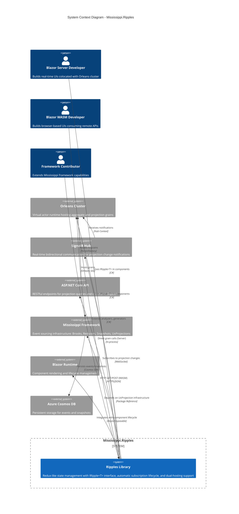
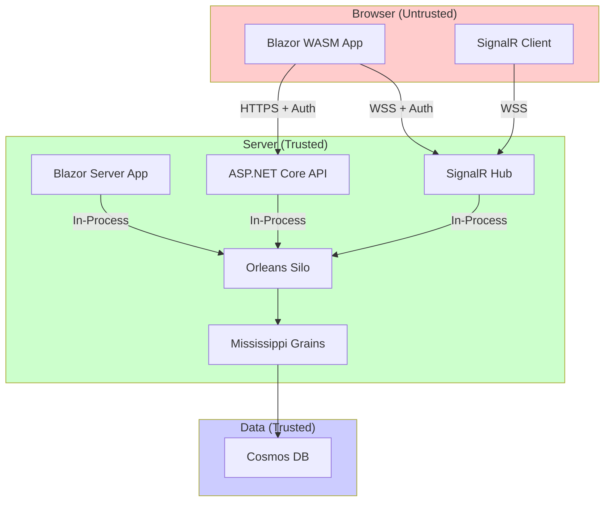

# C1: Ripples System Context

## Overview

**Mississippi.Ripples** is a Redux-inspired state management library that provides reactive access to event-sourced projections with automatic real-time updates. It enables Blazor developers to build UIs with consistent state management patterns across both Server and WebAssembly hosting models.

## Context Diagram

## Actors

### Users

| Actor | Description | Interactions |
|-------|-------------|--------------|
| Blazor Server Developer | Builds real-time UIs running on the server, colocated with Orleans | Uses `IRipple<T>` for projections, `RippleComponent` base class, direct grain access via `ServerRipple<T>` |
| Blazor WASM Developer | Builds browser-based SPAs consuming remote backend | Uses same `IRipple<T>` interface, HTTP + SignalR via `ClientRipple<T>` |
| Framework Contributor | Extends Mississippi with new capabilities | Creates custom analyzers, generators, or Ripple implementations |

### External Systems

| System | Description | Integration |
|--------|-------------|-------------|
| Orleans Cluster | Microsoft Orleans virtual actor runtime | **Server**: Direct `IGrainFactory` calls for zero-latency access. **WASM**: Indirect via HTTP API |
| SignalR Hub | ASP.NET Core real-time communication | Both Server and WASM subscribe to projection change groups. Hub broadcasts version updates |
| ASP.NET Core API | RESTful HTTP endpoints | **WASM only**: Generated controllers expose projections and commands. Uses ETag for caching |
| Mississippi Framework | Event sourcing infrastructure | Ripples builds on `IUxProjectionGrain<T>`, `IReducer<T>`, brooks, and snapshot storage |
| Blazor Runtime | Component rendering engine | `RippleComponent` integrates with `OnInitializedAsync`, `DisposeAsync`, and `StateHasChanged` |
| Azure Cosmos DB | Document database | Persistent storage for event streams and projection snapshots (via Mississippi) |

## Trust Boundaries

## Related ADRs

- [ADR-0001: Dual Hosting Model](../adr/0001-dual-hosting-model.md)
- [ADR-0002: Attribute Placement Strategy](../adr/0002-attribute-placement-strategy.md)
- [ADR-0003: Tiered Subscription Model](../adr/0003-tiered-subscription-model.md)

## Notes

### Security Considerations

- **Authentication**: WASM clients must authenticate before accessing projections or sending commands
- **Authorization**: `[UxProjection]` and `[UxAggregate]` attributes support `Authorize` property for policy-based access
- **Trust Boundary**: Browser is untrusted; all validation occurs server-side in grains

### Performance Expectations

- **Server Latency**: Sub-millisecond (in-process grain calls)
- **WASM Latency**: Network round-trip (~50-200ms typical)
- **Real-time Updates**: Version notifications via SignalR, data via HTTP GET with ETag

### Scalability

- **Orleans**: Horizontal scaling via silo cluster
- **SignalR**: Backplane via Orleans grains (custom implementation, no Redis dependency)
- **Projections**: Read-optimized with snapshot storage

### Compliance

- No PII in projection keys (use opaque IDs)
- Event streams are append-only (audit trail)
- GDPR: Right to erasure requires event stream tombstoning (Mississippi responsibility)
