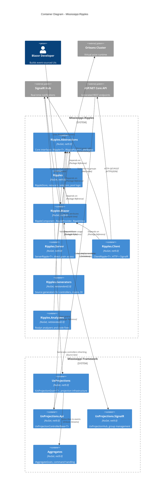
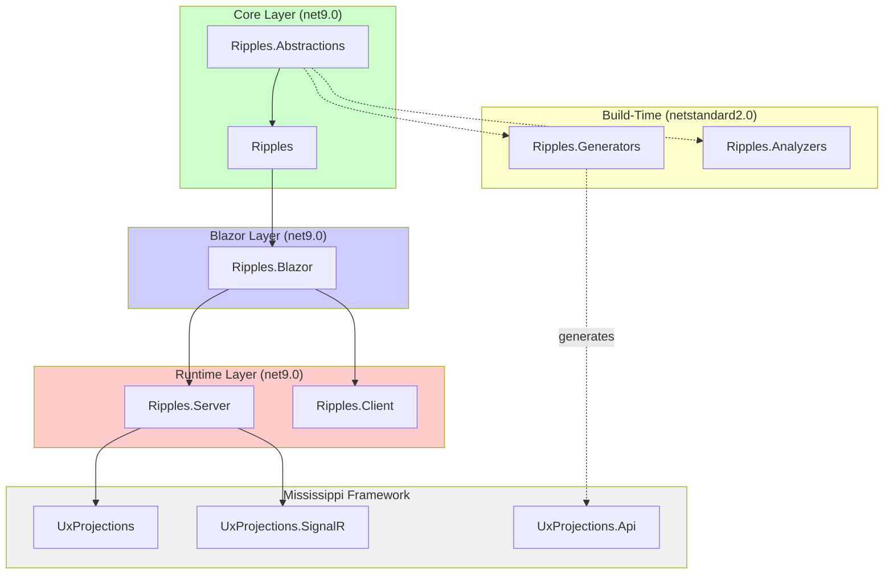

# C2: Ripples Container Architecture

## Overview

This document describes the container architecture for Mississippi.Ripples, showing the NuGet packages, their responsibilities, and how they communicate with each other and external systems.

## Container Diagram



## Containers

### Core Library Layer

#### Ripples.Abstractions

| Attribute | Value |
|-----------|-------|
| Technology | .NET 9, C# 13 |
| Package Type | NuGet (netstandard2.0 compatible consumers) |
| TFM | net9.0 (inherited from Directory.Build.props) |
| State | Stateless |

**Responsibilities:**
- Define `IRipple<T>` interface for reactive projection access
- Define `IRipplePool<T>` interface for tiered subscriptions
- Define `IRippleStore` interface for central state
- Provide `[UxProjection]` and `[UxAggregate]` attributes
- Provide `[CommandRoute]` attribute for method routing
- Define state types: `IProjectionState<T>`, `RipplePoolStats`

**Dependencies:**
- None (minimal package)

**Depended By:**
- Ripples, Ripples.Blazor, Ripples.Server, Ripples.Client
- Ripples.Generators, Ripples.Analyzers

---

#### Ripples (Core)

| Attribute | Value |
|-----------|-------|
| Technology | .NET 9, C# 13 |
| Package Type | NuGet |
| TFM | net9.0 |
| State | Stateful (in-memory store per scope) |

**Responsibilities:**
- Implement `RippleStore` central state container
- Implement `ProjectionReducer` for projection state updates
- Implement `CommandReducer` for command lifecycle
- Provide selector infrastructure for derived state
- Implement `RipplePoolBase<T>` with HOT/WARM/COLD tiering
- Manage cache eviction policies

**Dependencies:**
- Ripples.Abstractions
- Microsoft.Extensions.DependencyInjection.Abstractions

**Depended By:**
- Ripples.Blazor

---

### Blazor Integration Layer

#### Ripples.Blazor

| Attribute | Value |
|-----------|-------|
| Technology | .NET 9, Blazor, C# 13 |
| Package Type | NuGet |
| TFM | net9.0 |
| State | Stateless (delegates to IRipple<T>) |

**Responsibilities:**
- Provide `RippleComponent` base class with lifecycle management
- Provide `UseRipple<T>()` helper for registration
- Provide `RippleProvider.razor` cascading parameter
- Provide `<RippleView>` component for loading/error/content states
- Integrate with Blazor's `StateHasChanged` mechanism
- Handle `IAsyncDisposable` cleanup

**Dependencies:**
- Ripples.Abstractions
- Ripples
- Microsoft.AspNetCore.Components

**Depended By:**
- Ripples.Server, Ripples.Client

---

### Runtime Implementations

#### Ripples.Server

| Attribute | Value |
|-----------|-------|
| Technology | .NET 9, Orleans, SignalR, C# 13 |
| Package Type | NuGet |
| TFM | net9.0 |
| State | Stateless (grains hold state) |
| Scaling | Inherits from Orleans silo scaling |

**Responsibilities:**
- Implement `ServerRipple<T>` with direct `IGrainFactory` calls
- Implement `ServerRipplePool<T>` with parallel grain batch fetch
- Provide `AddRipplesServer()` extension method
- Integrate with `IHubContext<UxProjectionHub>` for notifications
- Zero serialization overhead (in-process)

**Dependencies:**
- Ripples.Blazor
- Mississippi.EventSourcing.UxProjections.Abstractions
- Orleans.Core.Abstractions
- Microsoft.AspNetCore.SignalR

**Depended By:**
- Blazor Server applications

---

#### Ripples.Client

| Attribute | Value |
|-----------|-------|
| Technology | .NET 9, SignalR Client, HttpClient, C# 13 |
| Package Type | NuGet |
| TFM | net9.0 |
| State | Local cache per scope |
| Scaling | N/A (runs in browser) |

**Responsibilities:**
- Implement `ClientRipple<T>` with `HttpClient` + ETag caching
- Implement `ClientRipplePool<T>` with batch HTTP fetch
- Implement `SignalRRippleConnection` for connection lifecycle
- Provide `AddRipplesClient()` extension method with options
- Auto-reconnect with configurable exponential backoff
- Use generated `RouteRegistry` for URL construction

**Dependencies:**
- Ripples.Blazor
- Microsoft.AspNetCore.SignalR.Client
- System.Net.Http.Json

**Depended By:**
- Blazor WebAssembly applications

---

### Build-Time Tools

#### Ripples.Generators

| Attribute | Value |
|-----------|-------|
| Technology | Roslyn Source Generators, C# |
| Package Type | NuGet (analyzer) |
| TFM | netstandard2.0 (Roslyn requirement) |
| State | Stateless (compile-time) |

**Responsibilities:**
- Generate `*ProjectionController` from `[UxProjection]` attributes
- Generate `*AggregateController` from `[UxAggregate]` attributes
- Generate `RouteRegistry` class for WASM URL construction
- Generate `AddGeneratedRipples()` DI registration extension
- Generate `I*CommandDispatcher` interfaces and implementations
- Generate batch endpoints for `IRipplePool<T>` support

**Dependencies:**
- Microsoft.CodeAnalysis.CSharp (compile-time only)
- Ripples.Abstractions (for attribute types)

**Depended By:**
- Any project using `[UxProjection]` or `[UxAggregate]`

---

#### Ripples.Analyzers

| Attribute | Value |
|-----------|-------|
| Technology | Roslyn Analyzers, C# |
| Package Type | NuGet (analyzer) |
| TFM | netstandard2.0 (Roslyn requirement) |
| State | Stateless (compile-time) |

**Responsibilities:**
- Enforce `[UxProjection]` on records (RP2xxx rules)
- Enforce `[UxAggregate]` on interfaces (RP1xxx rules)
- Detect missing `[GenerateSerializer]` (RP2002)
- Detect missing `UseRipple()` calls (RP5xxx rules)
- Detect route conflicts (RP7xxx rules)
- Provide one-click code fixes

**Dependencies:**
- Microsoft.CodeAnalysis.CSharp (compile-time only)
- Ripples.Abstractions (for attribute types)

**Depended By:**
- Any project referencing Ripples packages

---

## Communication Patterns

| From | To | Pattern | Protocol | Notes |
|------|-----|---------|----------|-------|
| RippleComponent | IRipple<T> | Sync | In-memory | Interface injection via DI |
| ServerRipple<T> | UxProjectionGrain | Sync | In-process | Direct `IGrainFactory.GetGrain<T>()` |
| ServerRipple<T> | UxProjectionHub | Async | In-process | `IHubContext<T>.Groups.AddToGroupAsync()` |
| ClientRipple<T> | Generated Controller | Sync | HTTPS/JSON | `HttpClient.GetAsync()` with ETag |
| ClientRipple<T> | UxProjectionHub | Async | WebSocket | `HubConnection.InvokeAsync()` |
| UxProjectionHub | ClientRipple<T> | Push | WebSocket | `OnProjectionChanged(type, id, version)` |
| Generators | Compilation | Compile-time | Roslyn API | Incremental source generation |
| Analyzers | Compilation | Compile-time | Roslyn API | Diagnostic reporting |

## Dependency Graph



## Package Reference Summary

### For Blazor Server Applications

```xml
<PackageReference Include="Mississippi.Ripples.Server" />
<!-- Transitively includes: Ripples.Blazor, Ripples, Ripples.Abstractions -->
<!-- Also includes: Ripples.Generators, Ripples.Analyzers (as analyzers) -->
```

### For Blazor WebAssembly Applications

```xml
<PackageReference Include="Mississippi.Ripples.Client" />
<!-- Transitively includes: Ripples.Blazor, Ripples, Ripples.Abstractions -->
<!-- Also includes: Ripples.Generators, Ripples.Analyzers (as analyzers) -->
```

### For Domain Libraries (defining projections/aggregates)

```xml
<PackageReference Include="Mississippi.Ripples.Abstractions" />
<!-- Just the attributes and interfaces -->
<PackageReference Include="Mississippi.Ripples.Generators" OutputItemType="Analyzer" />
<PackageReference Include="Mississippi.Ripples.Analyzers" OutputItemType="Analyzer" />
```

## Related ADRs

- [ADR-0001: Dual Hosting Model](../adr/0001-dual-hosting-model.md)
- [ADR-0002: Attribute Placement Strategy](../adr/0002-attribute-placement-strategy.md)
- [ADR-0003: Tiered Subscription Model](../adr/0003-tiered-subscription-model.md)
- [ADR-0004: Source Generator Architecture](../adr/0004-source-generator-architecture.md)
- [ADR-0005: Package Dependency Strategy](../adr/0005-package-dependency-strategy.md)

## Deployment Notes

### Development (Aspire)

```csharp
// AppHost orchestrates all services locally
var builder = DistributedApplication.CreateBuilder(args);

var cosmos = builder.AddAzureCosmosDB("cosmos").RunAsEmulator();
var orleans = builder.AddOrleans("cluster").WithClustering(cosmos);
var api = builder.AddProject<Projects.Server>("server").WithReference(orleans);

builder.Build().Run();
```

### Production (Kubernetes)

| Container | Replicas | Notes |
|-----------|----------|-------|
| Orleans Silo | 3+ | Stateful set with stable network IDs |
| API Gateway | 2+ | Stateless, horizontal scaling |
| SignalR | 2+ | Sticky sessions via Orleans backplane |

### Health Checks

- `/health/ready` - Orleans silo membership
- `/health/live` - Basic liveness
- `/health/signalr` - Hub connection status
