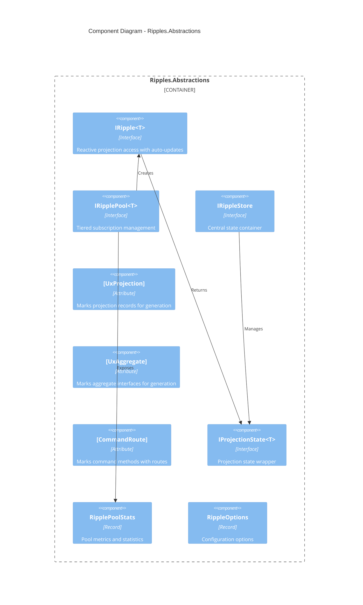
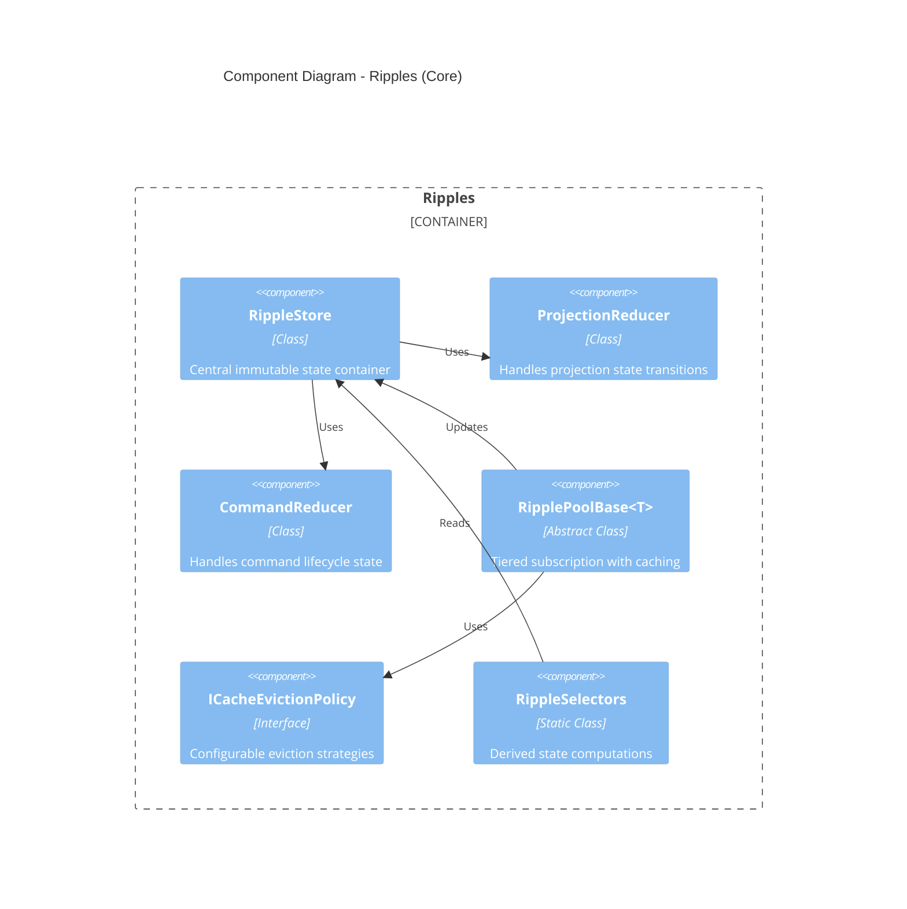
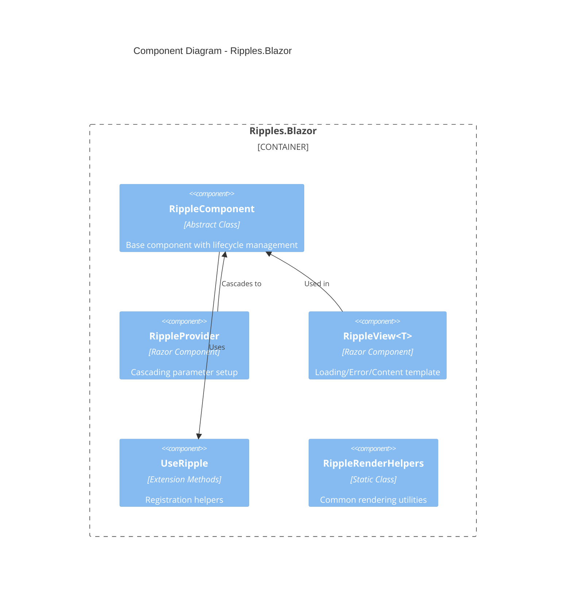
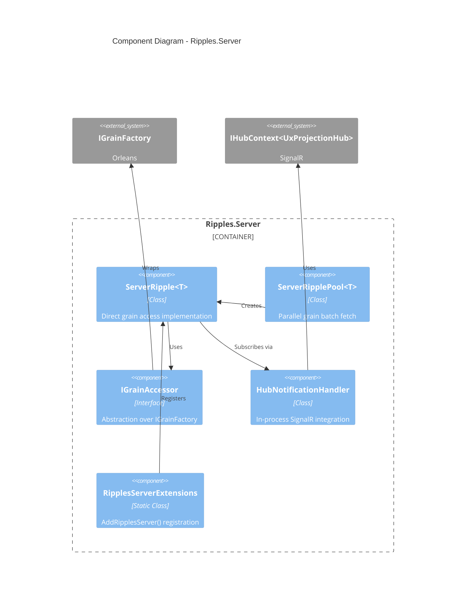
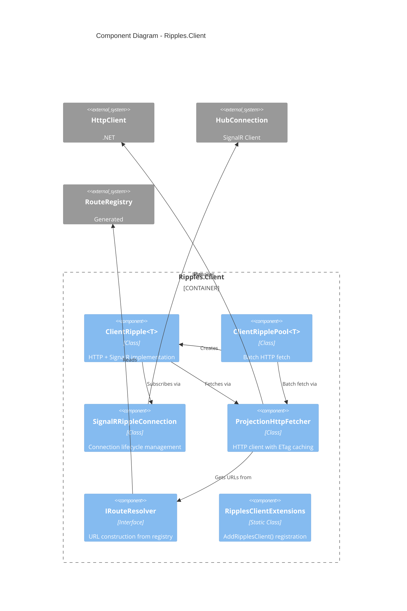
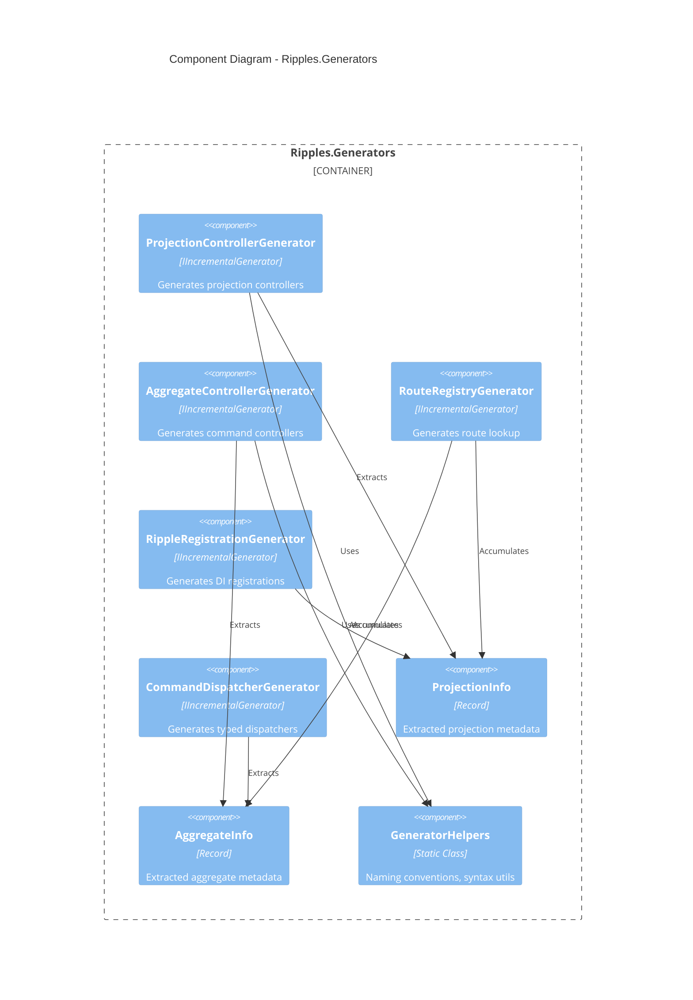
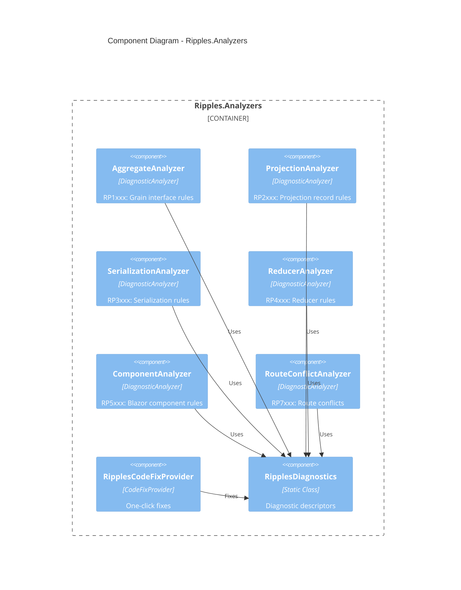
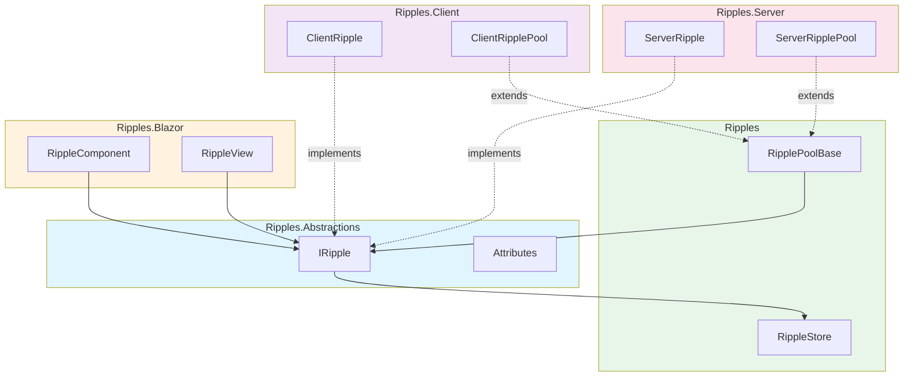

# C3: Ripples Component Architecture

## Overview

This document describes the internal component structure of each Ripples container, showing the major classes, interfaces, and their relationships following DDD and SOLID principles.

---

## Container: Ripples.Abstractions

### Component Diagram



### Components

#### IRipple&lt;T&gt;

**Type:** Interface  
**Responsibility:** Provides reactive access to a single projection entity with automatic real-time updates.

**Key Operations:**
- `SubscribeAsync(entityId)` → Subscribe to projection updates
- `UnsubscribeAsync()` → Stop receiving updates
- `RefreshAsync()` → Force refresh from source
- `DisposeAsync()` → Cleanup resources

**Properties:**
- `Current: T?` - Current projection data
- `Version: long?` - Server version
- `IsLoading: bool` - Fetch in progress
- `IsLoaded: bool` - First load complete
- `IsConnected: bool` - Real-time connected
- `LastError: Exception?` - Most recent error

**Events:**
- `OnChanged: Action?` - Any property changed
- `OnError: Action<Exception>?` - Error occurred

---

#### IRipplePool&lt;T&gt;

**Type:** Interface  
**Responsibility:** Manages a pool of ripples for list-detail patterns with HOT/WARM/COLD tiering.

**Key Operations:**
- `Get(entityId)` → Get or create ripple (may be cached)
- `MarkVisible(entityId)` → Promote to HOT tier
- `MarkHidden(entityId)` → Demote to WARM tier
- `PrefetchAsync(entityIds)` → Batch fetch without subscription
- `DisposeAsync()` → Cleanup all ripples

**Properties:**
- `Stats: RipplePoolStats` - Current tier counts and metrics

---

#### [UxProjection] Attribute

**Type:** Attribute  
**Responsibility:** Marks projection records for source generation.

**Properties:**
- `Route: string?` - API route segment (default: kebab-case of type)
- `BrookName: string?` - Event stream to subscribe to
- `EnableBatch: bool` - Generate batch endpoint (default: true)
- `Authorize: string?` - Authorization policy name
- `Tags: string[]?` - OpenAPI tags

---

#### [UxAggregate] Attribute

**Type:** Attribute  
**Responsibility:** Marks aggregate grain interfaces for source generation.

**Properties:**
- `Route: string?` - API route segment (default: kebab-case of type)
- `Authorize: string?` - Authorization policy name

---

### Project Structure

```
src/Ripples.Abstractions/
├── Ripples.Abstractions.csproj
├── IRipple.cs
├── IRipplePool.cs
├── IRippleStore.cs
├── Attributes/
│   ├── UxProjectionAttribute.cs
│   ├── UxAggregateAttribute.cs
│   └── CommandRouteAttribute.cs
├── State/
│   ├── IProjectionState.cs
│   └── RipplePoolStats.cs
└── Options/
    └── RippleOptions.cs
```

---

## Container: Ripples (Core)

### Component Diagram



### Components

#### RippleStore

**Type:** Class (internal)  
**Responsibility:** Central container for all projection and command state with immutable updates.

**Key Operations:**
- `Dispatch(action)` → Apply action through reducers
- `GetState<T>(entityId)` → Get current projection state
- `Subscribe(listener)` → Register for state changes

**Concurrency:** Thread-safe via immutable snapshots

---

#### ProjectionReducer

**Type:** Class (internal)  
**Responsibility:** Reduces projection-related actions into state changes.

**Handled Actions:**
- `ProjectionLoading<T>` → Set `IsLoading = true`
- `ProjectionLoaded<T>` → Set data, version, clear loading
- `ProjectionError<T>` → Set error, clear loading
- `ProjectionVersionChanged<T>` → Trigger refresh

---

#### CommandReducer

**Type:** Class (internal)  
**Responsibility:** Reduces command lifecycle actions.

**Handled Actions:**
- `CommandSending<T>` → Set pending state
- `CommandSuccess<T>` → Clear pending, set result
- `CommandError<T>` → Clear pending, set error

---

#### RipplePoolBase&lt;T&gt;

**Type:** Abstract Class  
**Responsibility:** Base implementation for tiered subscription pools.

**Tier Logic:**
- **HOT:** Visible, SignalR subscribed, data in memory
- **WARM:** Hidden <30s, unsubscribed, data cached
- **COLD:** Hidden >30s, unsubscribed, data evicted

**Key Operations:**
- `Get(entityId)` → Returns existing or creates new
- `PromoteToHot(entityId)` → Subscribe to real-time
- `DemoteToWarm(entityId)` → Unsubscribe, keep cache
- `EvictCold()` → Remove stale entries

---

#### ICacheEvictionPolicy

**Type:** Interface  
**Responsibility:** Strategy for cache eviction decisions.

**Implementations:**
- `LruEvictionPolicy` - Least recently used
- `TimeBasedEvictionPolicy` - Fixed TTL
- `SizeBasedEvictionPolicy` - Max entry count

---

### Project Structure

```
src/Ripples/
├── Ripples.csproj
├── RippleStore.cs
├── Reducers/
│   ├── ProjectionReducer.cs
│   └── CommandReducer.cs
├── Actions/
│   ├── ProjectionActions.cs
│   └── CommandActions.cs
├── Pools/
│   ├── RipplePoolBase.cs
│   └── PoolTier.cs
├── Caching/
│   ├── ICacheEvictionPolicy.cs
│   ├── LruEvictionPolicy.cs
│   └── TimeBasedEvictionPolicy.cs
└── Selectors/
    └── RippleSelectors.cs
```

---

## Container: Ripples.Blazor

### Component Diagram



### Components

#### RippleComponent

**Type:** Abstract Class  
**Responsibility:** Base Blazor component with automatic ripple lifecycle management.

**Key Operations:**
- `UseRipple<T>(ripple)` → Register for lifecycle management
- `DisposeAsync()` → Cleanup all registered ripples

**Lifecycle Integration:**
- Subscribes to `OnChanged` → calls `StateHasChanged`
- Disposes ripples on component disposal

```csharp
public abstract class RippleComponent : ComponentBase, IAsyncDisposable
{
    private readonly List<IAsyncDisposable> ripples = [];

    protected void UseRipple<T>(IRipple<T> ripple) where T : class
    {
        ripple.OnChanged += StateHasChanged;
        ripples.Add(ripple);
    }

    public async ValueTask DisposeAsync()
    {
        foreach (var ripple in ripples)
            await ripple.DisposeAsync();
        GC.SuppressFinalize(this);
    }
}
```

---

#### RippleView&lt;T&gt;

**Type:** Razor Component  
**Responsibility:** Declarative loading/error/content rendering.

**Render Fragments:**
- `Loading` - Shown while `IsLoading && !IsLoaded`
- `Error` - Shown when `LastError != null`
- `Content` - Shown when `IsLoaded && LastError == null`
- `Empty` - Shown when `Current == null`

```razor
<RippleView Ripple="@Channel">
    <Loading>Loading channel...</Loading>
    <Error Context="ex">Error: @ex.Message</Error>
    <Content Context="channel">
        <h1>@channel.Name</h1>
    </Content>
</RippleView>
```

---

#### RippleProvider

**Type:** Razor Component  
**Responsibility:** Provides cascading parameters for ripple configuration.

**Cascaded Values:**
- `RippleOptions` - Configuration for all child ripples
- `ISignalRConnection` - Shared connection (if applicable)

---

### Project Structure

```
src/Ripples.Blazor/
├── Ripples.Blazor.csproj
├── RippleComponent.cs
├── Components/
│   ├── RippleProvider.razor
│   ├── RippleProvider.razor.cs
│   ├── RippleView.razor
│   └── RippleView.razor.cs
├── Extensions/
│   └── UseRippleExtensions.cs
└── Helpers/
    └── RippleRenderHelpers.cs
```

---

## Container: Ripples.Server

### Component Diagram



### Components

#### ServerRipple&lt;T&gt;

**Type:** Class (internal)  
**Responsibility:** `IRipple<T>` implementation using direct Orleans grain calls.

**Key Operations:**
- `SubscribeAsync` → Get grain, fetch data, join SignalR group
- `RefreshAsync` → Direct grain call, no HTTP
- `HandleVersionChanged` → Refresh on notification

**Performance:**
- Zero serialization (in-process)
- Sub-millisecond latency

```csharp
internal sealed class ServerRipple<T> : IRipple<T> where T : class
{
    private IGrainAccessor GrainAccessor { get; }
    private IHubContext<UxProjectionHub> HubContext { get; }

    public async Task SubscribeAsync(string entityId, CancellationToken ct)
    {
        IsLoading = true;
        OnChanged?.Invoke();

        var grain = GrainAccessor.GetProjectionGrain<T>(entityId);
        var result = await grain.GetAsync();
        
        Current = result.Data;
        Version = result.Version;
        IsLoading = false;
        IsLoaded = true;

        await HubContext.Groups.AddToGroupAsync(ConnectionId, $"projection:{typeof(T).Name}:{entityId}", ct);
        IsConnected = true;
        
        OnChanged?.Invoke();
    }
}
```

---

#### ServerRipplePool&lt;T&gt;

**Type:** Class (internal)  
**Responsibility:** Pool implementation with parallel grain fetching.

**Batch Strategy:**
- `PrefetchAsync` uses `Task.WhenAll` for parallel grain calls
- No HTTP overhead, pure in-process parallelism

---

#### IGrainAccessor

**Type:** Interface  
**Responsibility:** Abstraction over `IGrainFactory` for testability.

**Key Operations:**
- `GetProjectionGrain<T>(entityId)` → Get typed projection grain
- `GetAggregateGrain<T>(entityId)` → Get typed aggregate grain

---

#### HubNotificationHandler

**Type:** Class (internal)  
**Responsibility:** Receives SignalR notifications and routes to ripples.

**Flow:**
1. SignalR hub broadcasts `OnProjectionChanged(type, entityId, version)`
2. Handler finds matching `ServerRipple<T>` instances
3. Triggers refresh if version is newer

---

### Project Structure

```
src/Ripples.Server/
├── Ripples.Server.csproj
├── ServerRipple.cs
├── ServerRipplePool.cs
├── Grains/
│   ├── IGrainAccessor.cs
│   └── GrainAccessor.cs
├── SignalR/
│   └── HubNotificationHandler.cs
└── Extensions/
    └── RipplesServerExtensions.cs
```

---

## Container: Ripples.Client

### Component Diagram



### Components

#### ClientRipple&lt;T&gt;

**Type:** Class (internal)  
**Responsibility:** `IRipple<T>` implementation using HTTP and SignalR.

**Subscribe Flow:**
1. Get route from `RouteRegistry`
2. HTTP GET with ETag header
3. SignalR subscribe to projection group
4. On version change → conditional GET (If-None-Match)

```csharp
internal sealed class ClientRipple<T> : IRipple<T> where T : class
{
    private ProjectionHttpFetcher Fetcher { get; }
    private SignalRRippleConnection SignalR { get; }
    private string? currentETag;

    public async Task SubscribeAsync(string entityId, CancellationToken ct)
    {
        IsLoading = true;
        OnChanged?.Invoke();

        var (data, etag, version) = await Fetcher.FetchAsync<T>(entityId, currentETag, ct);
        
        if (data is not null)
        {
            Current = data;
            currentETag = etag;
            Version = version;
        }

        IsLoading = false;
        IsLoaded = true;

        await SignalR.SubscribeAsync(typeof(T).Name, entityId, ct);
        IsConnected = true;

        OnChanged?.Invoke();
    }
}
```

---

#### SignalRRippleConnection

**Type:** Class  
**Responsibility:** Manages SignalR connection lifecycle with auto-reconnect.

**Features:**
- Configurable reconnect policy (exponential backoff)
- Connection state tracking
- Subscription restoration on reconnect

**Key Operations:**
- `EnsureConnectedAsync()` → Connect if not connected
- `SubscribeAsync(type, entityId)` → Join group
- `UnsubscribeAsync(type, entityId)` → Leave group

---

#### ProjectionHttpFetcher

**Type:** Class (internal)  
**Responsibility:** HTTP operations with ETag caching.

**Key Operations:**
- `FetchAsync<T>(entityId, etag)` → GET with conditional headers
- `FetchBatchAsync<T>(entityIds)` → POST to batch endpoint

**Response Handling:**
- `200 OK` → Parse JSON, extract ETag
- `304 Not Modified` → Return null (use cached)
- `4xx/5xx` → Throw appropriate exception

---

#### IRouteResolver

**Type:** Interface  
**Responsibility:** Maps projection types to API routes.

**Implementation:** Uses generated `RouteRegistry` class.

```csharp
public interface IRouteResolver
{
    string GetProjectionRoute<T>(string entityId);
    string GetProjectionBatchRoute<T>();
    string GetCommandRoute<TGrain>(string entityId, string command);
}
```

---

### Project Structure

```
src/Ripples.Client/
├── Ripples.Client.csproj
├── ClientRipple.cs
├── ClientRipplePool.cs
├── Http/
│   ├── ProjectionHttpFetcher.cs
│   ├── IRouteResolver.cs
│   └── GeneratedRouteResolver.cs
├── SignalR/
│   ├── SignalRRippleConnection.cs
│   └── ReconnectPolicy.cs
├── Options/
│   └── RippleClientOptions.cs
└── Extensions/
    └── RipplesClientExtensions.cs
```

---

## Container: Ripples.Generators

### Component Diagram



### Components

#### ProjectionControllerGenerator

**Type:** IIncrementalGenerator  
**Trigger:** `[UxProjection]` attribute on record/class

**Output:**
- `{TypeName}Controller.g.cs` - REST controller
- GET endpoint for single entity
- POST endpoint for batch (if enabled)

---

#### AggregateControllerGenerator

**Type:** IIncrementalGenerator  
**Trigger:** `[UxAggregate]` attribute on interface

**Output:**
- `{TypeName}Controller.g.cs` - Command controller
- POST endpoint per `[CommandRoute]` method

---

#### RouteRegistryGenerator

**Type:** IIncrementalGenerator  
**Trigger:** All `[UxProjection]` and `[UxAggregate]` attributes

**Output:**
- `RouteRegistry.g.cs` - Static route lookup methods

```csharp
public static partial class RouteRegistry
{
    public static class Projections
    {
        public static string ChannelProjection(string entityId) 
            => $"api/projections/channels/{entityId}";
    }
    
    public static class Commands
    {
        public static string ChannelAggregate_Create(string entityId) 
            => $"api/commands/channels/{entityId}/create";
    }
}
```

---

#### RippleRegistrationGenerator

**Type:** IIncrementalGenerator  
**Trigger:** All `[UxProjection]` attributes

**Output:**
- `RippleServiceRegistrations.g.cs` - DI extension method

---

#### CommandDispatcherGenerator

**Type:** IIncrementalGenerator  
**Trigger:** `[UxAggregate]` attributes

**Output:**
- `I{Name}CommandDispatcher.g.cs` - Interface
- `Server{Name}CommandDispatcher.g.cs` - Direct grain
- `Client{Name}CommandDispatcher.g.cs` - HTTP client

---

### Project Structure

```
src/Ripples.Generators/
├── Ripples.Generators.csproj
├── Generators/
│   ├── ProjectionControllerGenerator.cs
│   ├── AggregateControllerGenerator.cs
│   ├── RouteRegistryGenerator.cs
│   ├── RippleRegistrationGenerator.cs
│   └── CommandDispatcherGenerator.cs
├── Models/
│   ├── ProjectionInfo.cs
│   ├── AggregateInfo.cs
│   └── CommandInfo.cs
└── Helpers/
    ├── GeneratorHelpers.cs
    ├── NamingConventions.cs
    └── RoslynExtensions.cs
```

---

## Container: Ripples.Analyzers

### Component Diagram



### Components

#### Analyzers by Category

| Analyzer | Diagnostics | Severity |
|----------|-------------|----------|
| `AggregateAnalyzer` | RP1001-RP1003 | Error/Warning |
| `ProjectionAnalyzer` | RP2001-RP2006 | Error/Warning |
| `SerializationAnalyzer` | RP3001-RP3003 | Error |
| `ReducerAnalyzer` | RP4001-RP4004 | Warning/Info |
| `ComponentAnalyzer` | RP5001-RP5007 | Warning/Info |
| `RouteConflictAnalyzer` | RP7001-RP7003 | Error/Warning |

---

#### Key Diagnostics

| Code | Message | Fix |
|------|---------|-----|
| RP2001 | `[UxProjection]` must be on record/class | Move attribute |
| RP2002 | Missing `[GenerateSerializer]` | Add attribute |
| RP4001 | Missing reducer for projection | Generate skeleton |
| RP5001 | Missing `UseRipple()` call | Add call |
| RP7001 | Route conflict detected | Manual |

---

#### RipplesCodeFixProvider

**Type:** CodeFixProvider  
**Responsibility:** Provides one-click fixes for applicable diagnostics.

**Supported Fixes:**
- Add missing attributes (`[GenerateSerializer]`, `[Id(n)]`)
- Add missing method calls (`UseRipple()`)
- Generate reducer skeleton
- Fix route naming

---

### Project Structure

```
src/Ripples.Analyzers/
├── Ripples.Analyzers.csproj
├── Analyzers/
│   ├── AggregateAnalyzer.cs
│   ├── ProjectionAnalyzer.cs
│   ├── SerializationAnalyzer.cs
│   ├── ReducerAnalyzer.cs
│   ├── ComponentAnalyzer.cs
│   └── RouteConflictAnalyzer.cs
├── CodeFixes/
│   ├── AddAttributeCodeFix.cs
│   ├── AddUseRippleCodeFix.cs
│   └── GenerateReducerCodeFix.cs
├── Diagnostics/
│   └── RipplesDiagnostics.cs
└── Helpers/
    └── SyntaxHelpers.cs
```

---

## Cross-Container Dependencies



---

## Related ADRs

- [ADR-0001: Dual Hosting Model](../adr/0001-dual-hosting-model.md)
- [ADR-0002: Attribute Placement Strategy](../adr/0002-attribute-placement-strategy.md)
- [ADR-0003: Tiered Subscription Model](../adr/0003-tiered-subscription-model.md)
- [ADR-0004: Source Generator Architecture](../adr/0004-source-generator-architecture.md)
- [ADR-0005: Package Dependency Strategy](../adr/0005-package-dependency-strategy.md)

## Validation Checklist

- [x] All containers have component diagrams
- [x] Components have clear responsibilities
- [x] Interfaces identified for extensibility
- [x] Project structures mapped to vertical slices
- [x] Cross-container dependencies documented
- [x] No circular dependencies
