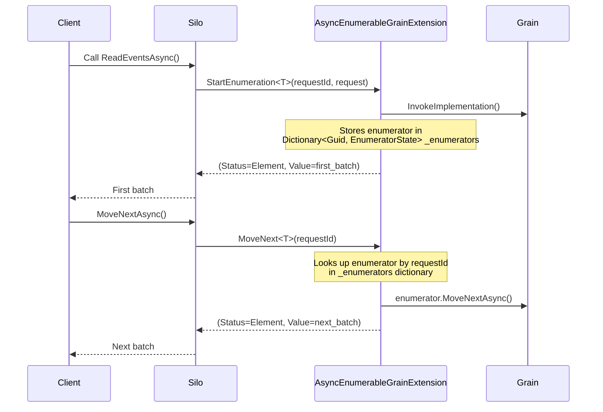
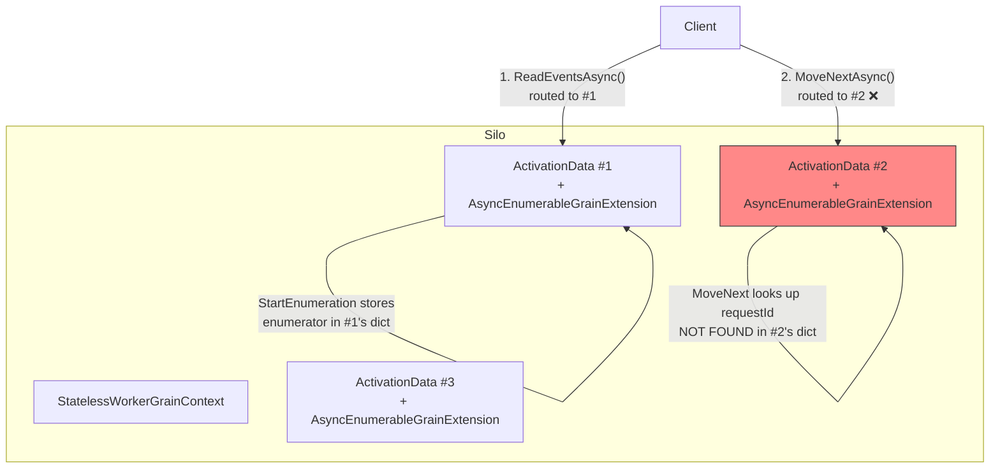
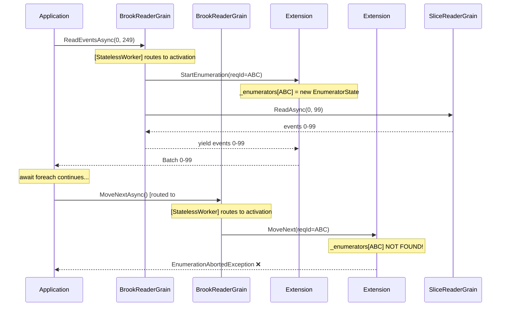
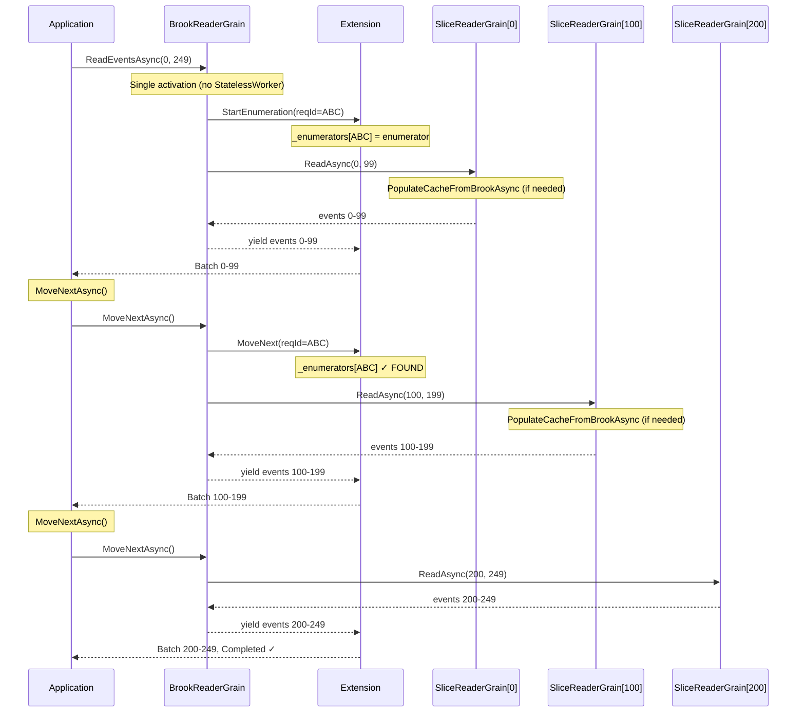
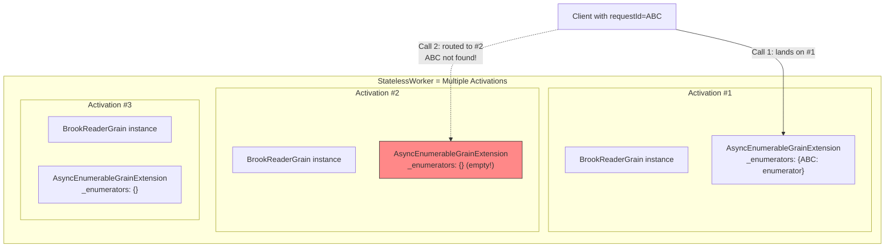
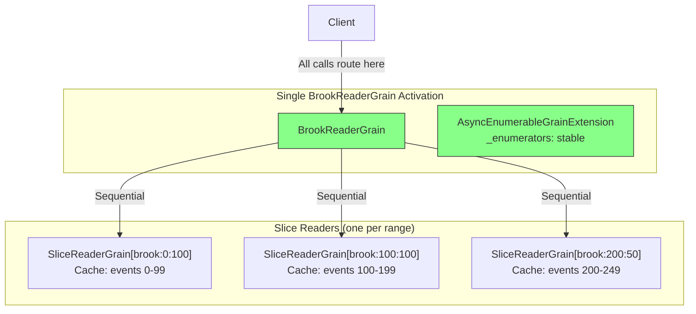
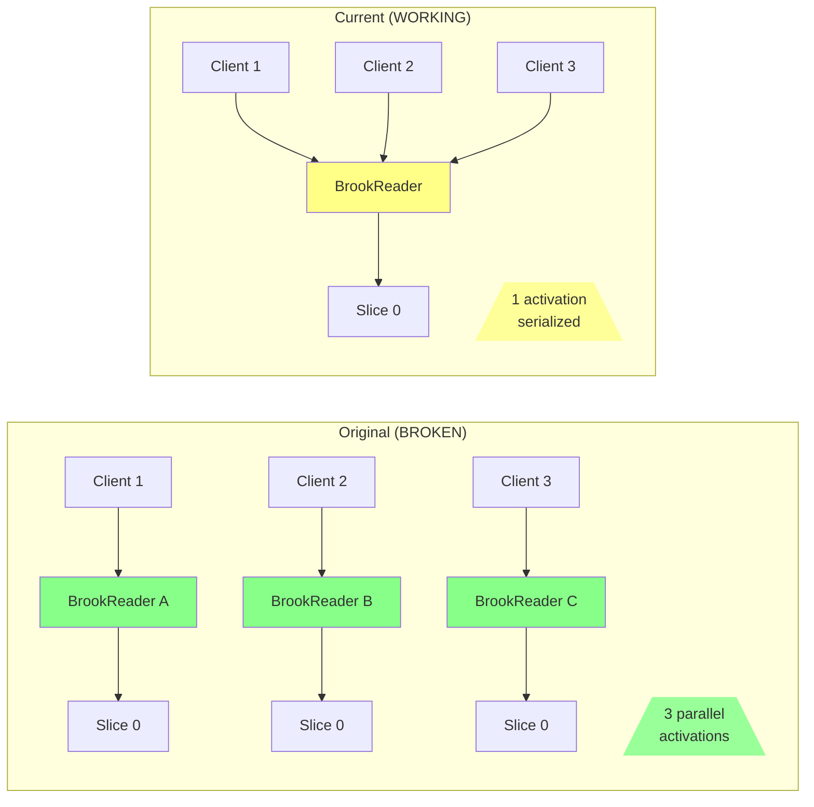
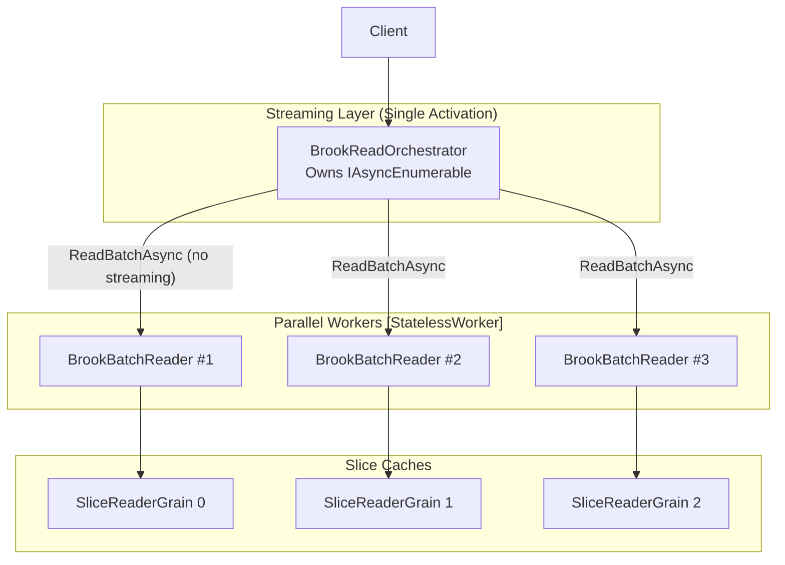

# Brook Reader Performance Analysis

> Deep analysis of the `[StatelessWorker]` and `[ReadOnly]` removal from brook reader grains,
> understanding what was happening under the hood, and proposing designs to restore parallel performance.

## Table of Contents

1. [Executive Summary](#executive-summary)
2. [The Original Design (Before Fix)](#the-original-design-before-fix)
3. [What Broke: IAsyncEnumerable + StatelessWorker](#what-broke-iasyncenumerable--statelessworker)
4. [Call-by-Call Flow Diagrams](#call-by-call-flow-diagrams)
5. [What Was "Shared" That Caused the Problem](#what-was-shared-that-caused-the-problem)
6. [Current Architecture (After Fix)](#current-architecture-after-fix)
7. [Performance Impact Analysis](#performance-impact-analysis)
8. [Proposed Designs to Restore Parallelism](#proposed-designs-to-restore-parallelism)
9. [Recommendation](#recommendation)

---

## Executive Summary

The `EnumerationAbortedException` was caused by a fundamental incompatibility between Orleans'
`[StatelessWorker]` attribute and `IAsyncEnumerable` grain method returns. The issue was **not**
the grain's business-logic state (cache, etc.), but the **enumerator state** that Orleans creates
via `AsyncEnumerableGrainExtension` to manage streaming across network calls.

### Key Findings

| Aspect | Original Design | Current Design |
| ------ | --------------- | -------------- |
| `BrookReaderGrain` | `[StatelessWorker]` - multiple activations | Single activation per key |
| `BrookSliceReaderGrain.ReadAsync` | `[ReadOnly]` - interleaved calls | Serialized (no `[ReadOnly]`) |
| Slice iteration | Sequential `foreach` | Sequential `foreach` |
| Enumerator state | Stored in random activation | Stored in owning activation |
| Streaming | **BROKEN** - `EnumerationAbortedException` | **WORKS** |

---

## The Original Design (Before Fix)

### Original `BrookReaderGrain` Behavior

```csharp
[StatelessWorker]  // <-- REMOVED
internal class BrookReaderGrain : IBrookReaderGrain, IGrainBase
{
    public async IAsyncEnumerable<BrookEvent> ReadEventsAsync(...)
    {
        // Orleans creates AsyncEnumerableGrainExtension to hold enumerator
        foreach (var slice in slices)
        {
            await foreach (var ev in sliceGrain.ReadAsync(...))
            {
                yield return ev;  // Each yield is a network round-trip
            }
        }
    }
}
```

### Original `BrookSliceReaderGrain` Behavior

```csharp
internal class BrookSliceReaderGrain : IBrookSliceReaderGrain, IGrainBase
{
    private ImmutableArray<BrookEvent> Cache { get; set; } = ImmutableArray<BrookEvent>.Empty;

    [ReadOnly]  // <-- REMOVED because Cache mutation
    public async IAsyncEnumerable<BrookEvent> ReadAsync(...)
    {
        if (cacheStale)
        {
            Cache = await LoadFromStorage();  // MUTATION! Violates [ReadOnly]
        }
        foreach (var ev in Cache)
        {
            yield return ev;
        }
    }
}
```

---

## What Broke: IAsyncEnumerable + StatelessWorker

### Orleans IAsyncEnumerable Architecture

When a grain method returns `IAsyncEnumerable<T>`, Orleans does NOT stream the entire result
in one network message. Instead:



**Critical insight**: The `AsyncEnumerableGrainExtension` is attached to a **specific grain activation**.
It holds the `IAsyncEnumerator` in a `Dictionary<Guid, EnumeratorState>` keyed by request ID.

### The StatelessWorker Problem

With `[StatelessWorker]`, Orleans creates multiple activations of the same grain:



**Result**: `EnumerationAbortedException` with message:
> "Enumerator not found. This likely indicates that the remote grain was deactivated since
> enumeration begun or that the enumerator was idle for longer than the expiration period."

---

## Call-by-Call Flow Diagrams

### Scenario: Read 250 events from position 0-249 (slice size = 100)

#### Original Architecture (BROKEN)



#### Current Architecture (WORKING but serialized)



---

## What Was "Shared" That Caused the Problem

### NOT the issue: BrookSliceReaderGrain.Cache

While the `Cache` property mutation disqualified `[ReadOnly]` on `ReadAsync`, it wasn't
causing the streaming failure. Each slice grain is keyed by its range, so there's no
cross-activation confusion.

### THE issue: AsyncEnumerableGrainExtension._enumerators

```csharp
// From Orleans source: Orleans.Core/Runtime/AsyncEnumerableGrainExtension.cs
internal sealed partial class AsyncEnumerableGrainExtension
{
    // THIS is the "shared" state that broke with StatelessWorker
    private readonly Dictionary<Guid, EnumeratorState> _enumerators = [];

    public ValueTask<(EnumerationResult, object)> MoveNext<T>(Guid requestId, ...)
    {
        ref var entry = ref CollectionsMarshal.GetValueRefOrNullRef(_enumerators, requestId);
        if (Unsafe.IsNullRef(ref entry))
        {
            // This happens when StatelessWorker routes to wrong activation!
            return new((EnumerationResult.MissingEnumeratorError, default));
        }
        // ...
    }
}
```

Each grain activation gets its **own** `AsyncEnumerableGrainExtension` instance. With
`[StatelessWorker]`, there can be N activations, each with their own `_enumerators` dictionary.
When `MoveNextAsync()` routes to a different activation, the enumerator isn't found.

### State Ownership Diagram



---

## Current Architecture (After Fix)

### Changes Made

| Component | Change | Reason |
| --------- | ------ | ------ |
| `BrookReaderGrain` | Removed `[StatelessWorker]` | IAsyncEnumerable requires stable activation |
| `IBrookSliceReaderGrain.ReadAsync` | Removed `[ReadOnly]` | Method mutates `Cache` property |
| `IBrookSliceReaderGrain.ReadBatchAsync` | Removed `[ReadOnly]` | Method mutates `Cache` property |
| `IBrookCursorGrain.GetLatestPositionConfirmedAsync` | Removed `[ReadOnly]` | Method updates `TrackedCursorPosition` |
| `IUxProjectionVersionedCacheGrain.GetAsync` | Removed `[ReadOnly]` | Method updates `cachedProjection` |

### Current Flow



---

## Performance Impact Analysis

### What We Lost

#### 1. StatelessWorker on BrookReaderGrain

**Before**: Multiple concurrent readers could exist per silo, each processing different read requests.

**After**: Single activation per brook key. All concurrent reads to the same brook serialize.

**Impact Severity**: **MEDIUM-HIGH** for high-throughput read scenarios

```text
Before: 10 concurrent readers → 10x parallel throughput
After:  10 concurrent readers → serialized, 1x throughput
```

#### 2. [ReadOnly] on BrookSliceReaderGrain.ReadAsync

**Before**: Multiple concurrent `ReadAsync` calls could interleave on the same slice grain.

**After**: Calls serialize (one-at-a-time) on each slice grain.

**Impact Severity**: **LOW-MEDIUM**

Why "low": Each slice grain is keyed by its range, so different ranges already parallelize.
The serialization only affects multiple readers targeting the **same** slice simultaneously.

### Bottleneck Comparison



---

## Proposed Designs to Restore Parallelism

### Option 1: Batch-Only API + Parallel Slice Fan-out

**Concept**: Keep `IAsyncEnumerable` for external API but use batch calls internally with parallel fan-out.

```csharp
public async IAsyncEnumerable<BrookEvent> ReadEventsAsync(
    BrookPosition? readFrom = null,
    BrookPosition? readTo = null,
    [EnumeratorCancellation] CancellationToken cancellationToken = default)
{
    var slices = GetSliceReads(start.Value, end.Value, sliceSize);

    // Fan-out: kick off ALL slice reads in parallel
    var tasks = slices.Select(s =>
        BrookGrainFactory.GetBrookSliceReaderGrain(key)
            .ReadBatchAsync(s.First, s.Last, cancellationToken)
    ).ToList();

    // Process in order as they complete (or wait for each in sequence)
    foreach (var (slice, task) in slices.Zip(tasks))
    {
        var batch = await task;
        foreach (var ev in batch)
        {
            yield return ev;
        }
    }
}
```

**Pros**:

- Slice reads happen in parallel
- No need for `[StatelessWorker]` on reader grain
- Streaming still works (enumerator stays in one activation)

**Cons**:

- Batches must fit in memory
- Ordering must be maintained (slices complete in any order)

**Estimated Speedup**: 3-10x depending on slice count and I/O overlap

---

### Option 2: Separate Streaming Orchestrator from Parallelizable Workers

**Concept**: Split responsibilities - one grain owns the streaming, another handles parallel work.



**Pros**:

- Clear separation of concerns
- Workers can use `[StatelessWorker]` safely (batch API only)
- Streaming grain stays single-activation

**Cons**:

- Additional grain type
- More complex architecture

---

### Option 3: Pre-Populated Cache with [ReadOnly] Restored

**Concept**: Ensure cache is populated **before** the streaming grain is called, so `ReadAsync` never mutates.

```csharp
// New grain for cache warming
public interface IBrookSliceCacheWarmerGrain : IGrainWithStringKey
{
    Task WarmAsync(BrookRangeKey key);  // NOT [ReadOnly] - does the mutation
}

// Modified slice reader - now truly [ReadOnly]
public interface IBrookSliceReaderGrain : IGrainWithStringKey
{
    [ReadOnly]  // Safe! PopulateCache never called
    IAsyncEnumerable<BrookEvent> ReadAsync(BrookPosition min, BrookPosition max, ...);
}

// Orchestrator flow:
// 1. Warm all slice caches in parallel
// 2. Then stream from [ReadOnly] slices
```

**Pros**:

- Restores `[ReadOnly]` interleaving on slice reads
- Cache warming can be parallel

**Cons**:

- Two-phase read (warm then read)
- Complexity in cache validity tracking

---

### Option 4: Queue-Based Producer/Consumer

**Concept**: Streaming grain produces items to a channel; workers populate in parallel.

```csharp
public async IAsyncEnumerable<BrookEvent> ReadEventsAsync(...)
{
    var channel = Channel.CreateBounded<BrookEvent>(1000);

    // Producer task: parallel slice reads write to channel
    var producerTask = Task.Run(async () =>
    {
        var sliceTasks = slices.Select(async slice =>
        {
            await foreach (var ev in sliceGrain.ReadAsync(...))
            {
                await channel.Writer.WriteAsync(ev);
            }
        });
        await Task.WhenAll(sliceTasks);
        channel.Writer.Complete();
    });

    // Consumer: yield from channel in order
    await foreach (var ev in channel.Reader.ReadAllAsync())
    {
        yield return ev;
    }

    await producerTask;
}
```

**Pros**:

- True streaming with parallel fetch
- Backpressure via bounded channel

**Cons**:

- Ordering is lost (events arrive out of slice order)
- Complex error handling

---

## Recommendation

### Short Term: Option 1 (Batch + Parallel Fan-out)

Implement parallel fan-out using `ReadBatchAsync` internally:

```csharp
// BrookReaderGrain.cs
public async IAsyncEnumerable<BrookEvent> ReadEventsAsync(...)
{
    var slices = GetSliceReads(start.Value, end.Value, sliceSize);

    // Fan-out all batch requests in parallel
    var tasks = slices.Select(s =>
        BrookGrainFactory.GetBrookSliceReaderGrain(key)
            .ReadBatchAsync(s.First, s.Last, cancellationToken)
    ).ToArray();

    // Yield in order
    for (int i = 0; i < tasks.Length; i++)
    {
        var batch = await tasks[i];
        foreach (var ev in batch)
        {
            yield return ev;
        }
    }
}
```

**Why**:

- Minimal code change
- Immediate performance gain
- No new grain types needed
- Memory-bounded by slice size (already configurable)

### Medium Term: Consider Option 2

If read throughput becomes critical:

1. Introduce `BrookBatchReaderGrain` with `[StatelessWorker]` for parallel batch reads
2. Keep `BrookReaderGrain` as streaming orchestrator
3. Slice grains focus purely on caching

---

## Summary

| Issue | Root Cause | Fix | Performance Impact |
| ----- | ---------- | --- | ------------------ |
| `EnumerationAbortedException` | Orleans stores `IAsyncEnumerator` in activation-specific extension; `[StatelessWorker]` routes `MoveNext` to wrong activation | Removed `[StatelessWorker]` | Fixed streaming, serialized readers |
| Incorrect `[ReadOnly]` | `Cache` mutation in `ReadAsync` violates contract | Removed `[ReadOnly]` | Serialized slice reads |
| Lost parallelism | Single activation + serialized methods | Use batch API with parallel fan-out | Restore parallel performance |

The core insight: **IAsyncEnumerable in Orleans requires stable activation because the enumerator
is stored in an activation-scoped grain extension, not in the grain's business state**.
