# Data Flow: Browser Component to Cosmos Database

This document visualizes the complete data flow in Mississippi from Blazor/browser components to Cosmos DB storage, including how grain keys route data through the system.

## Grain Key Reference

All grain keys follow the **standard ordering principle**: `{BrookName}|{EntityId}|{Version}|{Context}`


### Grain Key Summary

| Grain | Key Type | Format | Stateless | ReadOnly | Example |
|-------|----------|--------|:---------:|:--------:|---------|
| `IBrookWriterGrain` | `BrookKey` | `{BrookName}\|{EntityId}` | | | `CRESCENT.CHAT\|order-123` |
| `IBrookReaderGrain` | `BrookKey` | `{BrookName}\|{EntityId}` | ⚡ | 📖 | `CRESCENT.CHAT\|order-123` |
| `IBrookCursorGrain` | `BrookKey` | `{BrookName}\|{EntityId}` | | 📖 | `CRESCENT.CHAT\|order-123` |
| `IUxProjectionGrain<T>` | `string` | `{EntityId}` | ⚡ | 📖 | `order-123` |
| `IUxProjectionCursorGrain` | `UxProjectionCursorKey` | `{BrookName}\|{EntityId}` | | 📖 | `CRESCENT.CHAT\|order-123` |
| `IUxProjectionVersionedCacheGrain<T>` | `UxProjectionVersionedCacheKey` | `{BrookName}\|{EntityId}\|{Version}` | ⚡ | 📖 | `CRESCENT.CHAT\|order-123\|42` |
| `ISnapshotCacheGrain<T>` | `SnapshotKey` | `{BrookName}\|{EntityId}\|{Version}\|{StorageName}\|{Hash}` | | 📖 | `CRESCENT.CHAT\|order-123\|42\|ChatProj\|ab12` |
| `IUxProjectionSubscriptionGrain` | `string` | `{ConnectionId}` | | 📖 | `conn-xyz-789` |
| `IUxGroupGrain` | `string` | `{HubName}:{GroupName}` | | | `ChatHub:room-42` |

> ⚡ = `[StatelessWorker]` — Multiple activations for parallel load distribution  
> 📖 = `[ReadOnly]` — Calls can interleave without acquiring grain lock

## Overview Flowchart

```mermaid
flowchart TB
    subgraph Browser["🌐 Browser / Blazor Client"]
        RC["RippleComponent‹T›<br/>Blazor base component"]
        CR["ClientRipple‹T›<br/>Reactive projection state"]
        SRC["SignalRRippleConnection<br/>Hub connection manager"]
    end

    subgraph ASPNet["🖥️ ASP.NET Core Server"]
        Controller["UxProjectionControllerBase<br/>HTTP GET endpoints"]
        Hub["UxProjectionHub<br/>SignalR hub"]
    end

    subgraph Orleans["⚙️ Orleans Grains"]
        subgraph Projection["Projection Layer"]
            ProjGrain["⚡📖 IUxProjectionGrain‹T›<br/>Key: EntityId"]
            CursorGrain["📖 IUxProjectionCursorGrain<br/>Key: BrookName｜EntityId"]
            VersionedCache["⚡📖 IUxProjectionVersionedCacheGrain‹T›<br/>Key: BrookName｜EntityId｜Version"]
        end

        subgraph Snapshot["Snapshot Layer"]
            SnapCache["📖 ISnapshotCacheGrain‹T›<br/>Key: BrookName｜EntityId｜Version｜Storage｜Hash"]
            SnapPersist["ISnapshotPersisterGrain‹T›<br/>Same key as SnapshotCache"]
            Reducer["IRootReducer‹T›<br/>Event → State"]
        end

        subgraph Brook["Brook Layer - Event Streams"]
            BrookWriter["IBrookWriterGrain<br/>Key: BrookName｜EntityId"]
            BrookReader["⚡📖 IBrookReaderGrain<br/>Key: BrookName｜EntityId"]
            BrookCursor["📖 IBrookCursorGrain<br/>Key: BrookName｜EntityId"]
        end

        subgraph SignalRGrains["SignalR Grains"]
            SubGrain["📖 IUxProjectionSubscriptionGrain<br/>Key: ConnectionId"]
            GroupGrain["IUxGroupGrain<br/>Key: HubName：GroupName"]
        end

        Stream[("Orleans Stream<br/>BrookCursorMovedEvent")]
    end

    subgraph Cosmos["🗄️ Cosmos DB"]
        EventStore[("Events Container<br/>EventDocument, CursorDocument")]
        SnapStore[("Snapshots Container<br/>SnapshotDocument")]
    end

    %% READ PATH
    RC -->|"1. Subscribe to IRipple"| CR
    CR -->|"2. HTTP GET /projection/{id}"| Controller
    Controller -->|"3. GetAsync(entityId)"| ProjGrain
    ProjGrain -->|"4. GetPositionAsync()"| CursorGrain
    ProjGrain -->|"5. GetAtVersionAsync(v)"| VersionedCache
    VersionedCache -->|"6. GetStateAsync()"| SnapCache
    SnapCache -->|"7a. ReadAsync()"| SnapStore
    SnapCache -->|"7b. If miss: ReadEventsAsync()"| BrookReader
    BrookReader -->|"8. Query events"| EventStore
    SnapCache -->|"9. Reduce events"| Reducer

    %% SIGNALR SUBSCRIPTION
    CR -->|"Subscribe(type, id)"| SRC
    SRC -->|"SignalR invoke"| Hub
    Hub -->|"SubscribeAsync()"| SubGrain
    SubGrain -->|"Join group"| GroupGrain

    %% NOTIFICATION PATH (dotted for updates)
    BrookWriter -.->|"Publish"| Stream
    Stream -.->|"Notify"| CursorGrain
    CursorGrain -.->|"Version changed"| SubGrain
    SubGrain -.->|"SendAllAsync()"| GroupGrain
    GroupGrain -.->|"ProjectionUpdated"| Hub
    Hub -.->|"SignalR push"| SRC
    SRC -.->|"OnVersionUpdated"| CR
    CR -.->|"Re-fetch + StateChanged"| RC

    %% WRITE PATH
    BrookWriter -->|"AppendEventsAsync()"| EventStore
    SnapPersist -->|"WriteAsync()"| SnapStore

    %% Styling
    classDef browser fill:#e1f5fe,stroke:#01579b
    classDef aspnet fill:#fff3e0,stroke:#e65100
    classDef orleans fill:#f3e5f5,stroke:#7b1fa2
    classDef cosmos fill:#e8f5e9,stroke:#2e7d32
    classDef stream fill:#fce4ec,stroke:#c2185b

    class RC,CR,SRC browser
    class Controller,Hub aspnet
    class ProjGrain,CursorGrain,VersionedCache,SnapCache,SnapPersist,Reducer,BrookWriter,BrookReader,BrookCursor,SubGrain,GroupGrain orleans
    class EventStore,SnapStore cosmos
    class Stream stream
```



## Read Path with Grain Keys

> **Scaling Legend:** ⚡ = `[StatelessWorker]` (multiple activations) | 📖 = `[ReadOnly]` (no grain lock)


## Write Path with Grain Keys


## Real-time Notification Flow


## Key Components Summary

| Layer | Component | Key Format | Responsibility |
|-------|-----------|------------|----------------|
| **Browser** | `RippleComponent<T>` | N/A | Blazor base component with auto-subscription lifecycle |
| **Browser** | `ClientRipple<T>` | N/A | Manages HTTP fetch + SignalR subscription |
| **Browser** | `SignalRRippleConnection` | N/A | Hub connection with auto-reconnect |
| **ASP.NET** | `UxProjectionControllerBase` | Route: `{entityId}` | HTTP endpoints for projection queries |
| **ASP.NET** | `UxProjectionHub` | N/A | SignalR hub for real-time updates |
| **Orleans** | `IUxProjectionGrain<T>` | `{EntityId}` | Stateless entry point for projection reads |
| **Orleans** | `IUxProjectionCursorGrain` | `{BrookName}\|{EntityId}` | Tracks latest projection version |
| **Orleans** | `IUxProjectionVersionedCacheGrain<T>` | `{BrookName}\|{EntityId}\|{Version}` | Caches specific version state |
| **Orleans** | `ISnapshotCacheGrain<T>` | `{BrookName}\|{EntityId}\|{Version}\|{Storage}\|{Hash}` | Loads/rebuilds state from snapshots + events |
| **Orleans** | `IBrookWriterGrain` | `{BrookName}\|{EntityId}` | Appends events + publishes stream notifications |
| **Orleans** | `IBrookReaderGrain` | `{BrookName}\|{EntityId}` | Reads event batches from storage |
| **Orleans** | `IUxProjectionSubscriptionGrain` | `{ConnectionId}` | Per-connection subscription tracking |
| **Orleans** | `IUxGroupGrain` | `{HubName}:{GroupName}` | SignalR group membership |
| **Cosmos** | Events Container | PartitionKey: `{BrookName}\|{EntityId}` | Stores `EventDocument` and `CursorDocument` |
| **Cosmos** | Snapshots Container | PartitionKey: varies | Stores `SnapshotDocument` for fast reads |

## Grain Key Derivation Flow


## Partition Key Strategy


All events for a single entity are co-located in the same partition, enabling transactional batch writes and efficient queries. The partition key format matches the `BrookKey` format used by Orleans grains.

## Orleans Stream Details

| Property | Value |
|----------|-------|
| Stream Name | `BrookCursorUpdates` |
| Stream ID | Derived from `BrookKey`: `{BrookName}\|{EntityId}` |
| Event Type | `BrookCursorMovedEvent` |
| Publisher | `BrookWriterGrain` (after successful append) |
| Subscriber | `UxProjectionCursorGrain` (updates position cache) |
| Purpose | Propagates write notifications to projection layer |

## Key Type Definitions

```csharp
// Brook layer - event stream identity
public readonly record struct BrookKey(string BrookName, string EntityId)
{
    public static implicit operator string(BrookKey key) => $"{key.BrookName}|{key.EntityId}";
}

// Projection layer - cursor tracking
public readonly record struct UxProjectionCursorKey(string BrookName, string EntityId)
{
    public static implicit operator string(UxProjectionCursorKey key) => $"{key.BrookName}|{key.EntityId}";
}

// Projection layer - version-specific cache
public readonly record struct UxProjectionVersionedCacheKey(string BrookName, string EntityId, BrookPosition Version)
{
    public static implicit operator string(UxProjectionVersionedCacheKey key) 
        => $"{key.BrookName}|{key.EntityId}|{key.Version.Value}";
}

// Snapshot layer - full state identity
public readonly record struct SnapshotKey(
    string BrookName, 
    string EntityId, 
    BrookPosition Version, 
    string SnapshotStorageName, 
    string ReducersHash)
{
    public static implicit operator string(SnapshotKey key) 
        => $"{key.BrookName}|{key.EntityId}|{key.Version.Value}|{key.SnapshotStorageName}|{key.ReducersHash}";
}
```

## See Also

- [grain-key-formats.md](grain-key-formats.md) - Complete grain key reference
- [grain-dependencies.md](grain-dependencies.md) - Grain dependency diagram
- [grain-read-write-paths.md](grain-read-write-paths.md) - Detailed read/write flows
