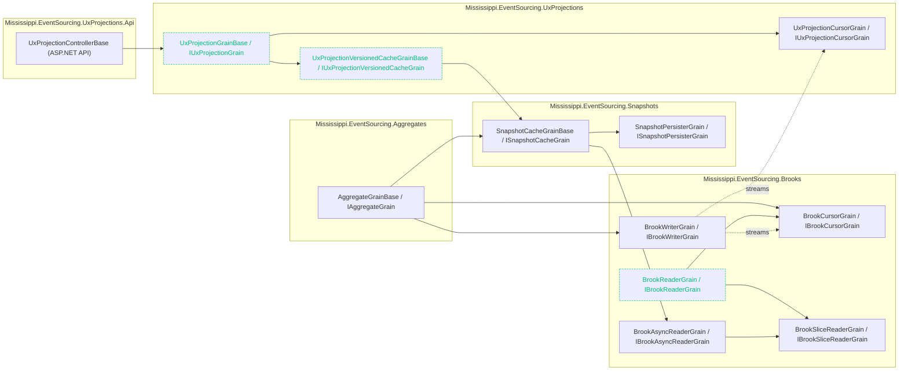

# Grain Dependencies

The diagram combines each grain with its interface (they are 1:1) and shows how grains call or observe each other.

## Notes

- Snapshot cache grains can call other snapshot cache grains to reuse base snapshots when rebuilding state.
- Dashed edges represent stream-driven notifications rather than direct method calls.
- Nodes with dashed teal borders are marked `[StatelessWorker]` in code.
- `BrookReaderGrain` is a `[StatelessWorker]` batch reader; streaming uses `BrookAsyncReaderGrain` with unique keys to keep `IAsyncEnumerable` enumerators stable.
- The API layer calls into UX projection grains via `IUxProjectionGrainFactory`.
