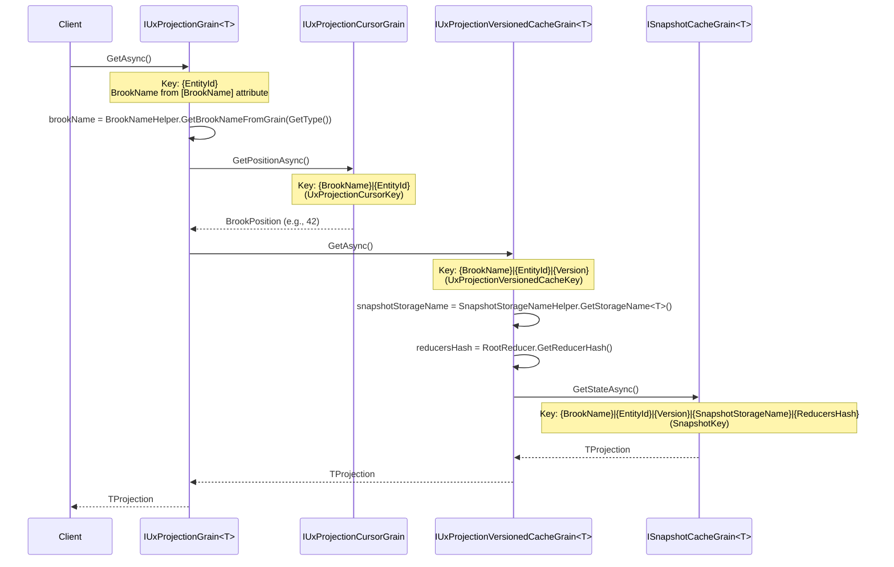

# Grain Key Formats

This document maps every Orleans grain in the Mississippi solution together with its key type, string format, and how the key is constructed. The goal is to highlight the current state so we can decide on a consistent evolution plan.

> **Status**: Breaking changes are acceptable as the framework is not yet released.

## Standard Key Component Order

All composite keys follow a **consistent ordering principle**:

1. **BrookName** – Always first (identifies the event stream)
2. **EntityId** – Second (identifies the instance within the brook)
3. **Version** – Third, if applicable (identifies the point-in-time)
4. **Additional context** – Last (storage name, hash, instance ID, etc.)

This order ensures:

- Keys can be prefix-matched for routing and partitioning
- The most significant identifier (brook) comes first
- Version-specific keys extend non-versioned keys naturally

## Summary Table

| Grain Interface | Key Type | Current Key Format (in code) | Example (current) | Agreed Format |
| ----------------- | ---------- | ------------------------------ | ------------------- | --------------- |
| `IBrookWriterGrain` | `BrookKey` | `{Type}\|{Id}` | `CRESCENT.CHAT\|abc123` | `{BrookName}\|{EntityId}` |
| `IBrookCursorGrain` | `BrookKey` | `{Type}\|{Id}` | `CRESCENT.CHAT\|abc123` | `{BrookName}\|{EntityId}` |
| `IBrookReaderGrain` | `BrookKey` | `{Type}\|{Id}` | `CRESCENT.CHAT\|abc123` | `{BrookName}\|{EntityId}` |
| `IBrookAsyncReaderGrain` | `BrookAsyncReaderKey` | `{Type}\|{Id}\|{InstanceId}` | `CRESCENT.CHAT\|abc123\|a1b2...` | `{BrookName}\|{EntityId}\|{InstanceId}` |
| `IBrookSliceReaderGrain` | `BrookRangeKey` | `{Type}\|{Id}\|{Start}\|{Count}` | `CRESCENT.CHAT\|abc123\|0\|1000` | `{BrookName}\|{EntityId}\|{Start}\|{Count}` |
| `IAggregateGrain` | *(simple string)* | `{Type}\|{Id}` | `CRESCENT.CHAT\|abc123` | `{EntityId}` (brook from `[BrookName]`) |
| `ISnapshotCacheGrain<T>` | `SnapshotKey` | `{brookName}\|{entityId}\|{version}\|{snapshotStorageName}\|{reducersHash}` | `CRESCENT.CHAT\|abc123\|42\|ChatProj\|ab12` | `{BrookName}\|{EntityId}\|{Version}\|{SnapshotStorageName}\|{ReducersHash}` |
| `ISnapshotPersisterGrain` | `SnapshotKey` | `{brookName}\|{entityId}\|{version}\|{snapshotStorageName}\|{reducersHash}` | `CRESCENT.CHAT\|abc123\|42\|ChatProj\|ab12` | `{BrookName}\|{EntityId}\|{Version}\|{SnapshotStorageName}\|{ReducersHash}` |
| `IUxProjectionGrain<T>` | *(simple string)* | `{ProjectionTypeName}\|{BrookKey.Type}\|{BrookKey.Id}` | `ChatProj\|CRESCENT.CHAT\|abc123` | `{EntityId}` (brook from `[BrookName]`) |
| `IUxProjectionCursorGrain` | `UxProjectionCursorKey` *(new)* | `{ProjectionTypeName}\|{BrookKey.Type}\|{BrookKey.Id}` | `ChatProj\|CRESCENT.CHAT\|abc123` | `{BrookName}\|{EntityId}` |
| `IUxProjectionVersionedCacheGrain<T>` | `UxProjectionVersionedCacheKey` *(new)* | `{ProjectionTypeName}\|{BrookKey.Type}\|{BrookKey.Id}\|{Version}` | `ChatProj\|CRESCENT.CHAT\|abc123\|42` | `{BrookName}\|{EntityId}\|{Version}` |
| `IUxProjectionSubscriptionGrain` | `string` | `{connectionId}` | `conn-xyz-789` | `{ConnectionId}` |
| `IUxClientGrain` | `string` | `{hubName}:{connectionId}` | `ChatHub:conn-xyz-789` | `{HubName}:{ConnectionId}` |
| `IUxGroupGrain` | `string` | `{hubName}:{groupName}` | `ChatHub:room-42` | `{HubName}:{GroupName}` |
| `IUxServerDirectoryGrain` | `string` | `{constant}` | `default` | `{Constant}` |

---

## Property Rename Plan

The following properties will be renamed for consistency:

| Type | Current Property | New Property | Notes |
| ------ | ------------------ | -------------- | ------- |
| `BrookKey` | `Type` | `BrookName` | ✅ Agreed |
| `BrookKey` | `Id` | `EntityId` | ✅ Agreed |
| `SnapshotStreamKey` | `ProjectionType` | `SnapshotStorageName` | ✅ Agreed |
| `SnapshotStreamKey` | `ProjectionId` | `EntityId` | ✅ Agreed |
| `UxProjectionKey` | `ProjectionTypeName` | *(dropped)* | Redundant with `TProjection` |
| `UxProjectionKey` | `BrookKey.Type` | `BrookName` | Via `BrookKey` rename |
| `UxProjectionKey` | `BrookKey.Id` | `EntityId` | Via `BrookKey` rename |

---

## New Key Types

### `UxProjectionCursorKey` (new)

Replaces `UxProjectionKey` for `IUxProjectionCursorGrain`.

```csharp
public readonly record struct UxProjectionCursorKey(string BrookName, string EntityId)
{
    public static implicit operator string(UxProjectionCursorKey key) => $"{key.BrookName}|{key.EntityId}";
}
```

- **Format**: `{BrookName}|{EntityId}`
- **Used by**: `IUxProjectionCursorGrain`
- **Rationale**: The cursor only needs brook + entity to subscribe to cursor events. Projection type is irrelevant.

### `UxProjectionVersionedCacheKey` (new)

Replaces `UxProjectionVersionedKey` for `IUxProjectionVersionedCacheGrain<T>`.

```csharp
public readonly record struct UxProjectionVersionedCacheKey(string BrookName, string EntityId, BrookPosition Version)
{
    public static implicit operator string(UxProjectionVersionedCacheKey key) 
        => $"{key.BrookName}|{key.EntityId}|{key.Version.Value}";
}
```

- **Format**: `{BrookName}|{EntityId}|{Version}`
- **Used by**: `IUxProjectionVersionedCacheGrain<T>`
- **Rationale**: The versioned cache needs brook + entity + version. Projection type comes from `TProjection`.

---

## Detailed Grain Key Breakdown

### 1. Brook Grains (EventSourcing.Brooks)

#### 1.1 `IBrookWriterGrain`

- **Key Type**: `BrookKey`
- **Current Format**: `{Type}|{Id}`
- **Components (current)**:
  - `Type` – The brook type/name (e.g., `CRESCENT.NEWMODEL.CHAT`).
  - `Id` – The entity identifier within the brook (e.g., `chat-abc123`).
- **Proposed Format**: `{BrookName}|{EntityId}` (rename `Type` → `BrookName`, `Id` → `EntityId`).
- **Construction**: `BrookKey.ForGrain<TGrain>(entityId)` or `new BrookKey(type, id)`.
- **Factory Method**: `IBrookGrainFactory.GetBrookWriterGrain(BrookKey)`.

#### 1.2 `IBrookCursorGrain`

- **Key Type**: `BrookKey`
- **Current Format**: `{Type}|{Id}`
- **Components**: Same as `IBrookWriterGrain`.
- **Proposed Format**: `{BrookName}|{EntityId}` (rename only).
- **Construction**: Same as the writer grain.
- **Factory Method**: `IBrookGrainFactory.GetBrookCursorGrain(BrookKey)`.

#### 1.3 `IBrookReaderGrain`

- **Key Type**: `BrookKey`
- **Current Format**: `{Type}|{Id}`
- **Components**: Same as `IBrookWriterGrain`.
- **Proposed Format**: `{BrookName}|{EntityId}` (rename only).
- **Note**: `[StatelessWorker]` grain that distributes batch reads across activations.
- **Construction**: Same as the writer grain.
- **Factory Method**: `IBrookGrainFactory.GetBrookReaderGrain(BrookKey)`.

#### 1.4 `IBrookAsyncReaderGrain`

- **Key Type**: `BrookAsyncReaderKey`
- **Current Format**: `{BrookKey.Type}|{BrookKey.Id}|{InstanceId}`
- **Components (current)**:
  - `BrookKey.Type` – The embedded brook type/name.
  - `BrookKey.Id` – The embedded entity identifier.
  - `InstanceId` – A freshly generated `Guid` to keep each streaming read tied to a single grain.
- **Proposed Format**: `{BrookName}|{EntityId}|{InstanceId}` (rename `Type` → `BrookName`, `Id` → `EntityId`).
- **Note**: Not `[StatelessWorker]`; each streaming call gets a unique grain to preserve `IAsyncEnumerable` enumerator state.
- **Construction**: `BrookAsyncReaderKey.Create(BrookKey)`.
- **Factory Method**: `IBrookGrainFactory.GetBrookAsyncReaderGrain(BrookKey)`.

#### 1.5 `IBrookSliceReaderGrain`

- **Key Type**: `BrookRangeKey`
- **Current Format**: `{Type}|{Id}|{Start}|{Count}`
- **Components (current)**:
  - `Type` – The brook type/name.
  - `Id` – The entity identifier.
  - `Start` – Inclusive start position of the slice.
  - `Count` – Number of events returned in the slice.
- **Proposed Format**: `{BrookName}|{EntityId}|{Start}|{Count}` (rename `Type` → `BrookName`, `Id` → `EntityId`).
- **Construction**: `BrookRangeKey.FromBrookCompositeKey(BrookKey, start, count)`.
- **Factory Method**: `IBrookGrainFactory.GetBrookSliceReaderGrain(BrookRangeKey)`.

---

### 2. Aggregate Grains (EventSourcing.Aggregates)

#### 2.1 `IAggregateGrain`

- **Key Type**: `BrookKey`
- **Current Format**: `{Type}|{Id}`
- **Components (current)**:
  - `Type` – Derived from the `[BrookName]` attribute on the aggregate class.
  - `Id` – The identity of the aggregate instance.
- **Proposed Format**: `{EntityId}` only, with brook name inferred from the `[BrookName]` attribute.
- **Construction**: `BrookKey.ForGrain<TGrain>(entityId)` builds the key today using the attribute-provided brook name plus the supplied `entityId`; a future helper would accept only `entityId`.
- **Factory Method**: `IAggregateGrainFactory.GetAggregate<TGrain>(BrookKey)`.

---

### 3. Snapshot Grains (EventSourcing.Snapshots)

#### 3.1 `ISnapshotCacheGrain<TSnapshot>`

- **Key Type**: `SnapshotKey`
- **Current Format**: `{brookName}|{projectionType}|{projectionId}|{reducersHash}|{version}`
- **Agreed Format**: `{BrookName}|{EntityId}|{Version}|{SnapshotStorageName}|{ReducersHash}`
- **Components (agreed)**:
  - `BrookName` – The brook name (position 1).
  - `EntityId` – The entity identifier (position 2).
  - `Version` – The snapshot version (position 3).
  - `SnapshotStorageName` – The snapshot storage name, from `SnapshotStorageNameHelper.GetStorageName<T>()` (position 4).
  - `ReducersHash` – Hash of the reducer set (position 5).
- **Property Renames**:
  - `SnapshotStreamKey.ProjectionType` → `SnapshotStorageName`
  - `SnapshotStreamKey.ProjectionId` → `EntityId`
- **Behavior**: Immutable cache grain storing snapshots for a specific version.
- **Construction**: `new SnapshotKey(new SnapshotStreamKey(brookName, snapshotStorageName, entityId, reducersHash), version)`.
- **Factory Method**: `ISnapshotGrainFactory.GetSnapshotCacheGrain<TSnapshot>(SnapshotKey)`.

#### 3.2 `ISnapshotPersisterGrain`

- **Key Type**: `SnapshotKey`
- **Current Format**: Same as the cache grain.
- **Agreed Format**: `{BrookName}|{EntityId}|{Version}|{SnapshotStorageName}|{ReducersHash}`
- **Components (agreed)**: Same as `ISnapshotCacheGrain<TSnapshot>`.
- **Behavior**: One-way persistence grain tied to the same key as the cache.
- **Construction**: Same `SnapshotKey` as the cache grain.
- **Factory Method**: `ISnapshotGrainFactory.GetSnapshotPersisterGrain(SnapshotKey)`.

---

### 4. UX Projection Grains (EventSourcing.UxProjections)

> **Call Flow Analysis**: The UX projection grain family operates as follows:
>
> 1. **`IUxProjectionGrain<TProjection>`** (entry point) receives a request via `GetAsync()`.
> 2. It reads `BrookName` from its `[BrookName]` attribute and `EntityId` from its primary key.
> 3. It calls **`IUxProjectionCursorGrain`** using `UxProjectionCursorKey(brookName, entityId)` to get the current brook position.
> 4. It then calls **`IUxProjectionVersionedCacheGrain<TProjection>`** with `UxProjectionVersionedCacheKey(brookName, entityId, version)`.
> 5. The versioned cache grain calls **`ISnapshotCacheGrain<TProjection>`** to load the snapshot.

#### 4.1 `IUxProjectionGrain<TProjection>`

- **Key Type**: Simple string (no composite key type)
- **Current Format**: `{ProjectionTypeName}|{BrookKey.Type}|{BrookKey.Id}`
- **Agreed Format**: `{EntityId}`
- **How it works**:
  - The grain is keyed by `EntityId` only.
  - On activation, the grain reads `BrookName` from its `[BrookName]` attribute via `BrookNameHelper.GetBrookNameFromGrain(GetType())`.
  - The grain constructs `UxProjectionCursorKey` and `UxProjectionVersionedCacheKey` from the attribute + primary key.
- **Behavior**: Stateless entry point for projection reads that routes through cursor and cache grains.
- **Construction**: `grainFactory.GetGrain<IUxProjectionGrain<T>>(entityId)`.
- **Factory Method**: `IUxProjectionGrainFactory.GetUxProjectionGrain<TProjection>(entityId)`.

#### 4.2 `IUxProjectionCursorGrain`

- **Key Type**: `UxProjectionCursorKey` *(new)*
- **Current Format**: `{ProjectionTypeName}|{BrookKey.Type}|{BrookKey.Id}`
- **Agreed Format**: `{BrookName}|{EntityId}`
- **Components**:
  - `BrookName` – The brook name.
  - `EntityId` – The entity identifier.
- **Rationale**: The cursor subscribes to brook cursor events. It only needs `BrookKey` to subscribe to the correct stream. The `ProjectionTypeName` component was never used after activation.
- **Behavior**: Tracks the latest brook position for a specific brook + entity.
- **Construction**: `new UxProjectionCursorKey(brookName, entityId)`.
- **Factory Method**: `IUxProjectionGrainFactory.GetUxProjectionCursorGrain(UxProjectionCursorKey)`.

#### 4.3 `IUxProjectionVersionedCacheGrain<TProjection>`

- **Key Type**: `UxProjectionVersionedCacheKey` *(new)*
- **Current Format**: `{ProjectionTypeName}|{BrookKey.Type}|{BrookKey.Id}|{Version}`
- **Agreed Format**: `{BrookName}|{EntityId}|{Version}`
- **Components**:
  - `BrookName` – The brook name.
  - `EntityId` – The entity identifier.
  - `Version` – The projection version.
- **Rationale**: On activation, the grain calls `ISnapshotCacheGrain<TProjection>` which requires:
  - `BrookName` – extracted from key.
  - `EntityId` – extracted from key.
  - `SnapshotStorageName` – derived from `SnapshotStorageNameHelper.GetStorageName<TProjection>()`.
  - `ReducersHash` – computed from `IRootReducer<TProjection>.GetReducerHash()`.
  - `Version` – extracted from key.
  
  The `ProjectionTypeName` is **not needed** because the grain type `IUxProjectionVersionedCacheGrain<TProjection>` already provides the projection type identity.
- **Behavior**: Stateless worker caching the projection at the specified version for reuse.
- **Construction**: `new UxProjectionVersionedCacheKey(brookName, entityId, version)`.
- **Factory Method**: `IUxProjectionGrainFactory.GetUxProjectionVersionedCacheGrain<TProjection>(UxProjectionVersionedCacheKey)`.

#### 4.4 `IUxProjectionSubscriptionGrain`

- **Key Type**: `string` (raw)
- **Format**: `{connectionId}`
- **Components**: SignalR `ConnectionId`.
- **Behavior**: Manages all projection subscriptions for the connection.
- **Construction**: Direct `ConnectionId` string.
- **Factory Method**: `GrainFactory.GetGrain<IUxProjectionSubscriptionGrain>(connectionId)`.

---

### 5. SignalR Grains (EventSourcing.UxProjections.SignalR)

#### 5.1 `IUxClientGrain`

- **Key Type**: `string` (raw)
- **Format**: `{hubName}:{connectionId}`
- **Components**:
  - `hubName` – SignalR hub name.
  - `connectionId` – SignalR connection identifier.
- **Separator**: `:` (colon)
- **Behavior**: Tracks a single SignalR connection for recovery and messaging.
- **Construction**: Concatenate `hubName` and `connectionId` with a colon.

#### 5.2 `IUxGroupGrain`

- **Key Type**: `string` (raw)
- **Format**: `{hubName}:{groupName}`
- **Components**:
  - `hubName` – SignalR hub name.
  - `groupName` – SignalR group identifier.
- **Separator**: `:` (colon)
- **Behavior**: Maintains membership lists for a SignalR group.
- **Construction**: `{hubName}:{groupName}` string.

#### 5.3 `IUxServerDirectoryGrain`

- **Key Type**: `string` (raw)
- **Format**: `{constant}` (typically `"default"`)
- **Components**: Constant placeholder identifying the singleton grain.
- **Behavior**: Tracks active SignalR servers for failure detection.
- **Construction**: Constant string value.

---

## Key Type Hierarchy

```text
BrookKey (BrookName|EntityId)
├── Used by: IBrookWriterGrain, IBrookCursorGrain, IBrookReaderGrain
├── Extended by: BrookAsyncReaderKey (adds InstanceId)
│   └── Used by: IBrookAsyncReaderGrain
└── Extended by: BrookRangeKey (adds Start|Count)
    └── Used by: IBrookSliceReaderGrain

SnapshotStreamKey (BrookName|EntityId|SnapshotStorageName|ReducersHash)
└── Extended by: SnapshotKey (adds Version → position 3)
    └── Format: BrookName|EntityId|Version|SnapshotStorageName|ReducersHash
    └── Used by: ISnapshotCacheGrain<T>, ISnapshotPersisterGrain

UxProjectionCursorKey (BrookName|EntityId) [NEW]
└── Used by: IUxProjectionCursorGrain

UxProjectionVersionedCacheKey (BrookName|EntityId|Version) [NEW]
└── Used by: IUxProjectionVersionedCacheGrain<T>

Simple string keys
├── {EntityId} → IAggregateGrain, IUxProjectionGrain<T>
├── {ConnectionId} → IUxProjectionSubscriptionGrain
├── {HubName}:{ConnectionId} → IUxClientGrain
├── {HubName}:{GroupName} → IUxGroupGrain
└── {Constant} → IUxServerDirectoryGrain
```

---

## UX Projection Key Analysis

### Call Flow Diagram (Agreed)



### Key Requirements Analysis (Agreed)

| Grain | BrookName | EntityId | Version | SnapshotStorageName | ReducersHash | Key Format |
| ------- | ----------- | ---------- | --------- | --------------------- | -------------- | ------------ |
| `IUxProjectionGrain<T>` | from `[BrookName]` | ✅ key | - | - | - | `{EntityId}` |
| `IUxProjectionCursorGrain` | ✅ key | ✅ key | - | - | - | `{BrookName}\|{EntityId}` |
| `IUxProjectionVersionedCacheGrain<T>` | ✅ key | ✅ key | ✅ key | from `TProjection` | computed | `{BrookName}\|{EntityId}\|{Version}` |
| `ISnapshotCacheGrain<T>` | ✅ key | ✅ key | ✅ key | ✅ key | ✅ key | `{BrookName}\|{EntityId}\|{Version}\|{SnapshotStorageName}\|{ReducersHash}` |

### Analysis Summary (Agreed)

1. **`ProjectionTypeName` is dropped** from UX projection keys because:
   - The grain type `IUxProjectionGrain<TProjection>` already includes `TProjection` as a type parameter
   - Orleans grain types are fully qualified, so `IUxProjectionVersionedCacheGrain<OrderSummary>` and `IUxProjectionVersionedCacheGrain<OrderDetails>` are different grain types
   - The snapshot storage name is derived from `TProjection` via `SnapshotStorageNameHelper.GetStorageName<TProjection>()`

2. **`BrookName` is REQUIRED** in cursor and versioned cache keys because:
   - The cursor grain needs it to subscribe to brook cursor events
   - The versioned cache grain needs it to call the snapshot grain
   - It cannot be inferred from `TProjection` since multiple projections can consume the same brook

3. **Agreed key formats**:
   - `IUxProjectionGrain<T>`: `{EntityId}` (brook from `[BrookName]` attribute on grain class)
   - `IUxProjectionCursorGrain`: `{BrookName}|{EntityId}` (new `UxProjectionCursorKey` type)
   - `IUxProjectionVersionedCacheGrain<T>`: `{BrookName}|{EntityId}|{Version}` (new `UxProjectionVersionedCacheKey` type)

4. **Standard key order**: `BrookName` → `EntityId` → `Version` → Additional context

---

## Identified Inconsistencies and Issues

### 1. Separator Inconsistency

- **Framework grains** (Brook, snapshot, UX) use `|`.
- **SignalR grains** use `:`.
- Any shared helper must respect each separator to avoid collisions.

### 2. Key Component Naming ✅ RESOLVED

Property renames agreed:

- `BrookKey.Type` → `BrookName`
- `BrookKey.Id` → `EntityId`
- `SnapshotStreamKey.ProjectionType` → `SnapshotStorageName`
- `SnapshotStreamKey.ProjectionId` → `EntityId`

### 3. SnapshotKey vs UxProjectionKey Ordering ✅ RESOLVED

Standard order established: `BrookName` → `EntityId` → `Version` → Additional context.

### 4. Raw String Keys for SignalR Grains

- Client/group/server grains rely on raw strings with no validation or type safety.
- They also use a different separator from the rest of the system.
- Introducing lightweight value types for these keys could improve discoverability and correctness.

---

## Decisions Log

| # | Decision | Status |
| --- | ---------- | -------- |
| 1 | Rename `BrookKey.Type` → `BrookName`, `BrookKey.Id` → `EntityId` | ✅ Agreed |
| 2 | Rename `SnapshotStreamKey.ProjectionType` → `SnapshotStorageName` | ✅ Agreed |
| 3 | Rename `SnapshotStreamKey.ProjectionId` → `EntityId` | ✅ Agreed |
| 4 | Drop `ProjectionTypeName` from UX projection keys | ✅ Agreed |
| 5 | Create `UxProjectionCursorKey` for `IUxProjectionCursorGrain` | ✅ Agreed |
| 6 | Create `UxProjectionVersionedCacheKey` for `IUxProjectionVersionedCacheGrain<T>` | ✅ Agreed |
| 7 | `IUxProjectionGrain<T>` keyed by `{EntityId}` only, brook from `[BrookName]` | ✅ Agreed |
| 8 | `IAggregateGrain` keyed by `{EntityId}` only, brook from `[BrookName]` | ✅ Agreed |
| 9 | Standard key order: `BrookName` → `EntityId` → `Version` → Additional context | ✅ Agreed |
| 10 | Breaking changes acceptable (not yet released) | ✅ Agreed |

---

## Implementation Tasks

The following code changes are required to implement the agreed key formats:

### Phase 1: Property Renames ✅ COMPLETED

- [x] Rename `BrookKey.Type` → `BrookName` in `BrookKey.cs`
- [x] Rename `BrookKey.Id` → `EntityId` in `BrookKey.cs`
- [x] Update all usages of `BrookKey.Type` and `BrookKey.Id`
- [x] Rename `SnapshotStreamKey.ProjectionType` → `SnapshotStorageName`
- [x] Rename `SnapshotStreamKey.ProjectionId` → `EntityId`
- [x] Update all usages of `SnapshotStreamKey` properties

### Phase 2: New Key Types ✅ COMPLETED

- [x] Create `UxProjectionCursorKey` record struct in `EventSourcing.UxProjections.Abstractions`
- [x] Create `UxProjectionVersionedCacheKey` record struct in `EventSourcing.UxProjections.Abstractions`
- [x] Update `IUxProjectionCursorGrain` to use `UxProjectionCursorKey`
- [x] Update `IUxProjectionVersionedCacheGrain<T>` to use `UxProjectionVersionedCacheKey`
- [x] Remove or deprecate `UxProjectionKey` and `UxProjectionVersionedKey`

### Phase 3: Grain Key Simplification ✅ COMPLETED

- [x] Update `IUxProjectionGrain<T>` to be keyed by `{EntityId}` only
- [x] Update `UxProjectionGrainBase` to read brook name from `[BrookName]` attribute
- [x] Update `UxProjectionGrainBase` to construct `UxProjectionCursorKey` and `UxProjectionVersionedCacheKey`
- [x] Update `IAggregateGrain` to be keyed by `{EntityId}` only (if not already)
- [x] Update factories to use new key types

### Phase 4: Snapshot Key Reorder ✅ COMPLETED

- [x] Update `SnapshotKey` to use new order: `{BrookName}|{EntityId}|{Version}|{SnapshotStorageName}|{ReducersHash}`
- [x] Update parsing logic in `FromString` method
- [x] Update all snapshot key tests

---

## File References

- [BrookKey.cs](../src/EventSourcing.Brooks.Abstractions/BrookKey.cs)
- [BrookRangeKey.cs](../src/EventSourcing.Brooks.Abstractions/BrookRangeKey.cs)
- [BrookAsyncReaderKey.cs](../src/EventSourcing.Brooks.Abstractions/BrookAsyncReaderKey.cs)
- [SnapshotKey.cs](../src/EventSourcing.Snapshots.Abstractions/SnapshotKey.cs)
- [SnapshotStreamKey.cs](../src/EventSourcing.Snapshots.Abstractions/SnapshotStreamKey.cs)
- [UxProjectionKey.cs](../src/EventSourcing.UxProjections.Abstractions/UxProjectionKey.cs) *(deprecated)*
- [UxProjectionVersionedKey.cs](../src/EventSourcing.UxProjections.Abstractions/UxProjectionVersionedKey.cs) *(deprecated)*
- [UxProjectionCursorKey.cs](../src/EventSourcing.UxProjections.Abstractions/UxProjectionCursorKey.cs) *(new)*
- [UxProjectionVersionedCacheKey.cs](../src/EventSourcing.UxProjections.Abstractions/UxProjectionVersionedCacheKey.cs) *(new)*
- [BrookGrainFactory.cs](../src/EventSourcing.Brooks/Factory/BrookGrainFactory.cs)
- [AggregateGrainFactory.cs](../src/EventSourcing.Aggregates/AggregateGrainFactory.cs)
- [SnapshotGrainFactory.cs](../src/EventSourcing.Snapshots/SnapshotGrainFactory.cs)
- [UxProjectionGrainFactory.cs](../src/EventSourcing.UxProjections/UxProjectionGrainFactory.cs)
