# Grain Read/Write Paths and Reentrancy Analysis

This document visualizes the read and write paths through the grain architecture, highlighting which methods use `[ReadOnly]` for reentrancy and which create potential serialization bottlenecks.

## Understanding the Diagram

### Legend

| Style | Meaning |
| ----- | ------- |
| **Green solid arrow** | `[ReadOnly]` method call – allows interleaving with other `[ReadOnly]` calls |
| **Red solid arrow** | Non-`[ReadOnly]` method call – serialized, potential bottleneck |
| **Orange dashed arrow** | Mutates local grain state (cache population, etc.) |
| **Purple dashed arrow** | Stream notification (fire-and-forget) |
| **Green node border** | All read methods are `[ReadOnly]` – no bottleneck |
| **Red node border** | Contains non-`[ReadOnly]` methods – potential bottleneck |
| **Dashed teal border** | `[StatelessWorker]` grain – multiple activations allowed |

### Reentrancy Quick Reference

- **`[ReadOnly]`**: Method can interleave with other `[ReadOnly]` methods on the same grain activation. Safe for concurrent reads. Does NOT allow interleaving with non-`[ReadOnly]` methods.
- **No attribute**: Method is serialized. All calls queue behind each other. This is where bottlenecks occur under high read concurrency.
- **`[StatelessWorker]`**: Multiple grain activations can exist. Distributes load but incompatible with `IAsyncEnumerable` streaming (see `BrookReaderGrain` vs `BrookAsyncReaderGrain` split).

## Architecture Diagram

```mermaid
flowchart LR
  subgraph API["API Layer"]
    UxApi["UxProjectionControllerBase"]
  end

  subgraph UX["UX Projections"]
    UxProjection["UxProjectionGrainBase<br/>━━━━━━━━━━━━━━━<br/>✅ GetAsync [ReadOnly]<br/>✅ GetAtVersionAsync [ReadOnly]<br/>✅ GetLatestVersionAsync [ReadOnly]"]
    UxCursor["UxProjectionCursorGrain<br/>━━━━━━━━━━━━━━━<br/>✅ GetPositionAsync [ReadOnly]<br/>⚪ DeactivateAsync"]
    UxCache["UxProjectionVersionedCacheGrainBase<br/>━━━━━━━━━━━━━━━<br/>⚠️ GetAsync (mutates cache)"]
  end

  subgraph Snapshots["Snapshot Layer"]
    SnapshotCache["SnapshotCacheGrainBase<br/>━━━━━━━━━━━━━━━<br/>✅ GetStateAsync [ReadOnly]"]
    SnapshotPersister["SnapshotPersisterGrain<br/>━━━━━━━━━━━━━━━<br/>🔥 PersistAsync [OneWay]"]
  end

  subgraph Brooks["Brook Layer"]
    BrookWriter["BrookWriterGrain<br/>━━━━━━━━━━━━━━━<br/>🔴 AppendEventsAsync"]
    BrookCursor["BrookCursorGrain<br/>━━━━━━━━━━━━━━━<br/>✅ GetLatestPositionAsync [ReadOnly]<br/>⚠️ GetLatestPositionConfirmedAsync"]
    BrookReader["BrookReaderGrain<br/>━━━━━━━━━━━━━━━<br/>✅ ReadEventsBatchAsync [ReadOnly]<br/>⚡ [StatelessWorker]"]
    BrookAsyncReader["BrookAsyncReaderGrain<br/>━━━━━━━━━━━━━━━<br/>✅ ReadEventsAsync [ReadOnly]<br/>🔑 Unique key per call"]
    BrookSlice["BrookSliceReaderGrain<br/>━━━━━━━━━━━━━━━<br/>⚠️ ReadAsync (mutates cache)<br/>⚠️ ReadBatchAsync (mutates cache)"]
  end

  subgraph Aggregates["Command Layer"]
    Aggregate["AggregateGrainBase<br/>━━━━━━━━━━━━━━━<br/>🔴 Command methods"]
  end

  %% API to UX
  UxApi -->|"GetAsync"| UxProjection

  %% UX internal reads
  UxProjection -->|"GetPositionAsync ✅"| UxCursor
  UxProjection -->|"GetAsync ⚠️"| UxCache
  UxCache -->|"GetStateAsync ✅"| SnapshotCache

  %% Snapshot to Brook reads
  SnapshotCache -->|"ReadEventsAsync ✅"| BrookAsyncReader
  SnapshotCache -.->|"PersistAsync 🔥"| SnapshotPersister

  %% Brook reader chain (batch path via StatelessWorker)
  BrookReader -->|"ReadAsync ⚠️"| BrookSlice

  %% Brook async reader chain (streaming path via unique keys)
  BrookAsyncReader -->|"GetLatestPositionAsync ✅"| BrookCursor
  BrookAsyncReader -->|"ReadAsync ⚠️"| BrookSlice

  %% Write path
  Aggregate -->|"GetLatestPositionAsync ✅"| BrookCursor
  Aggregate -->|"AppendEventsAsync 🔴"| BrookWriter
  Aggregate -->|"GetStateAsync ✅"| SnapshotCache

  %% Stream notifications
  BrookWriter -.->|"streams 📡"| BrookCursor
  BrookWriter -.->|"streams 📡"| UxCursor

  %% Styling
  class UxProjection,UxCache stateless
  class BrookReader stateless
  class UxProjection,UxCursor,SnapshotCache,BrookReader,BrookAsyncReader readonly
  class BrookSlice,UxCache,BrookCursor bottleneck
  class BrookWriter,Aggregate write

  classDef stateless stroke-dasharray: 4 2, stroke:#0b7, color:#0b7;
  classDef readonly stroke:#2a2, stroke-width:2px;
  classDef bottleneck stroke:#f80, stroke-width:3px;
  classDef write stroke:#c00, stroke-width:2px;
```



## Bottleneck Analysis

### Identified Bottlenecks (No `[ReadOnly]`)

| Grain | Method | Impact | Why Not ReadOnly |
| ----- | ------ | ------ | ---------------- |
| **BrookSliceReaderGrain** | `ReadAsync`, `ReadBatchAsync` | 🔴 High | Mutates `Cache` property on first read |
| **UxProjectionVersionedCacheGrain** | `GetAsync` | 🔴 High | Mutates `cachedProjection` and `isLoaded` |
| **BrookCursorGrain** | `GetLatestPositionConfirmedAsync` | 🟡 Medium | Updates `TrackedCursorPosition` from storage |

### Safe ReadOnly Paths (No Bottleneck)

| Grain | Method | Notes |
| ----- | ------ | ----- |
| **UxProjectionGrain** | All 3 methods | Delegates to other grains, no local state |
| **UxProjectionCursorGrain** | `GetPositionAsync` | Returns cached value only |
| **SnapshotCacheGrain** | `GetStateAsync` | State hydrated on activation, getter is pure |
| **BrookReaderGrain** | `ReadEventsBatchAsync` | `[StatelessWorker]` + delegates to slice readers, parallel fan-out |
| **BrookAsyncReaderGrain** | `ReadEventsAsync` | Unique key per call, delegates to slice readers |
| **BrookCursorGrain** | `GetLatestPositionAsync` | Returns cached value only |

## Read Path Flow Analysis

### Hot Read Path (API → Projection)

```text
UxApi
  │
  ▼ GetAsync [delegates]
UxProjectionGrain ────────────────────────── ✅ [ReadOnly] + [StatelessWorker]
  │                                              Multiple activations, interleavable
  ├──▶ UxCursor.GetPositionAsync ─────────── ✅ [ReadOnly]
  │                                              Returns cached position
  │
  ▼ GetAsync [to versioned cache]
UxProjectionVersionedCacheGrain ──────────── ⚠️ NOT [ReadOnly] - BOTTLENECK
  │                                              First call mutates cache
  │                                              Subsequent calls queue behind first
  │
  ▼ GetStateAsync
SnapshotCacheGrain ───────────────────────── ✅ [ReadOnly]
  │                                              State already hydrated
  │
  ▼ (on cache miss during activation)
BrookAsyncReaderGrain ────────────────────── ✅ [ReadOnly] + unique key
  │                                              Each call gets fresh activation
  │                                              (via BrookAsyncReaderKey with GUID)
  │
  ▼ ReadAsync
BrookSliceReaderGrain ────────────────────── ⚠️ NOT [ReadOnly] - BOTTLENECK
                                                 Populates cache on first read
```

### Write Path Flow

```text
Command (external)
  │
  ▼
AggregateGrain ───────────────────────────── 🔴 Serialized (by design)
  │                                              Commands must be sequential
  │
  ├──▶ SnapshotCache.GetStateAsync ────────── ✅ [ReadOnly]
  ├──▶ BrookCursor.GetLatestPositionAsync ─── ✅ [ReadOnly]
  │
  ▼ AppendEventsAsync
BrookWriterGrain ─────────────────────────── 🔴 Serialized (by design)
  │                                              Writes must be sequential
  │
  ├ ─ ─▶ BrookCursor (stream notification)
  └ ─ ─▶ UxCursor (stream notification)
```

## Mitigation Strategies

### Option 1: Accept Current Design

The bottlenecks occur on **first access only**:

- `BrookSliceReaderGrain`: Cache populated once, then all reads are fast
- `UxProjectionVersionedCacheGrain`: Projection loaded once, then cached

For workloads where the same version is read multiple times, the initial serialization is acceptable.

### Option 2: Eager Cache Population

Move cache population to `OnActivateAsync`:

- Grain activates → populates cache → all methods become pure reads
- Then `[ReadOnly]` can be safely added
- Trade-off: Slower activation, but faster subsequent reads

### Option 3: Load-Through Pattern with Locks

Use a lightweight async lock pattern:

```csharp
private readonly SemaphoreSlim cacheLock = new(1, 1);
private TProjection? cachedProjection;

[ReadOnly] // Now safe because we handle concurrency explicitly
public async ValueTask<TProjection?> GetAsync(...)
{
    if (cachedProjection is not null) return cachedProjection;
    
    await cacheLock.WaitAsync(cancellationToken);
    try
    {
        // Double-check after acquiring lock
        if (cachedProjection is not null) return cachedProjection;
        cachedProjection = await LoadFromSnapshot(...);
        return cachedProjection;
    }
    finally
    {
        cacheLock.Release();
    }
}
```

### Option 4: Separate Read/Write Interfaces

Split grains into read-only and write-capable versions:

- `IBrookSliceReaderGrain` → read-only, `[ReadOnly]` safe
- `IBrookSliceCacheGrain` → handles cache population separately

### Option 5: `[StatelessWorker]` Where Compatible

For grains that don't use `IAsyncEnumerable`:

- `UxProjectionVersionedCacheGrain` could potentially use `[StatelessWorker]`
- Multiple activations would naturally distribute load
- Each activation maintains its own cache (memory trade-off)

## Performance Impact Summary

| Scenario | Current Behavior | Potential Issue |
| -------- | ---------------- | --------------- |
| First read of a version | Serialized cache population | High latency spike |
| Subsequent reads of same version | Fast cached reads | None |
| Many concurrent first reads | Queue behind each other | Latency amplification |
| Mixed read/write workload | Reads queue behind writes | Head-of-line blocking |

## Recommendations

1. **Monitor** activation times and cache miss rates to quantify actual impact
2. **Consider Option 2** (eager activation) for high-traffic grains
3. **Consider Option 5** (`[StatelessWorker]`) for `UxProjectionVersionedCacheGrain` if memory permits
4. **Use `BrookReaderGrain`** for batch reads (parallel via `[StatelessWorker]`)
5. **Use `BrookAsyncReaderGrain`** for streaming reads (unique key per call avoids enumeration issues)

## Related Documentation

- [grain-dependencies.md](grain-dependencies.md) – Overall grain topology
- [brook-reader-performance-analysis.md](brook-reader-performance-analysis.md) – Deep analysis of StatelessWorker + IAsyncEnumerable incompatibility
- [Orleans Reentrancy](https://learn.microsoft.com/en-us/dotnet/orleans/grains/reentrancy) – Microsoft docs on `[ReadOnly]` and `[Reentrant]`

## Resolution: BrookReaderGrain + BrookAsyncReaderGrain Split

The original conflict between `[StatelessWorker]` and `IAsyncEnumerable` has been resolved by splitting
the reader grain into two specialized grains:

### BrookReaderGrain (Batch Reads)

- **`[StatelessWorker]`**: Multiple activations for parallel distribution
- **`ReadEventsBatchAsync`**: Returns `ImmutableArray<BrookEvent>` (no streaming)
- Uses `Task.WhenAll` for parallel fan-out across slice readers
- Ideal for loading snapshots or bulk data retrieval

### BrookAsyncReaderGrain (Streaming Reads)

- **NOT a StatelessWorker**: Each activation is sticky to preserve enumerator state
- **`ReadEventsAsync`**: Returns `IAsyncEnumerable<BrookEvent>` for streaming
- Uses `BrookAsyncReaderKey` with random GUID suffix for unique instances per call
- Grain deactivates via Orleans' idle timeout after enumeration completes
- Factory method `IBrookGrainFactory.GetBrookAsyncReaderGrain(brookKey)` generates unique keys automatically

### Why This Works

- **Batch path**: `[StatelessWorker]` distributes load, no enumerator state needed
- **Streaming path**: Unique keys ensure each `IAsyncEnumerable` gets its own dedicated activation
- **No `EnumerationAbortedException`**: Enumerator state stays on the same activation throughout iteration

See [brook-reader-performance-analysis.md](brook-reader-performance-analysis.md) for the full analysis
that led to this design.
