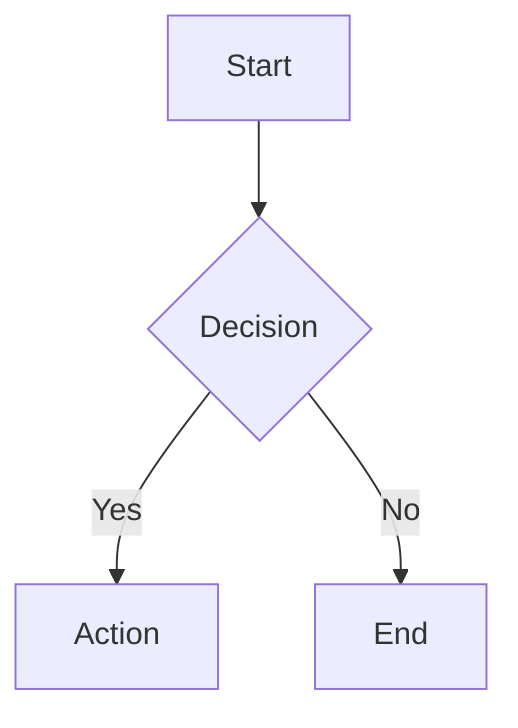
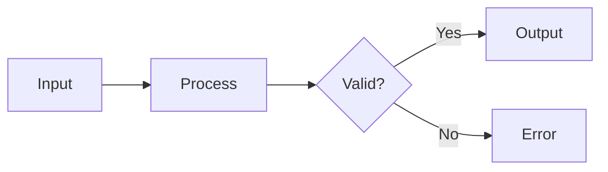
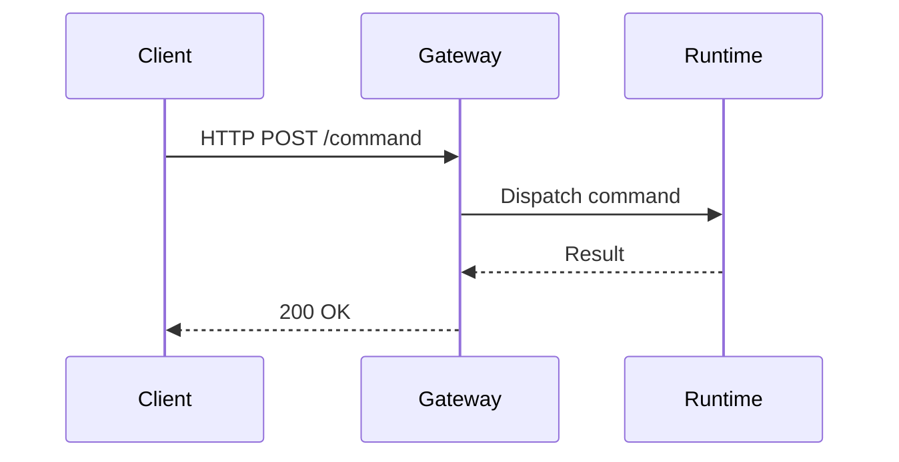
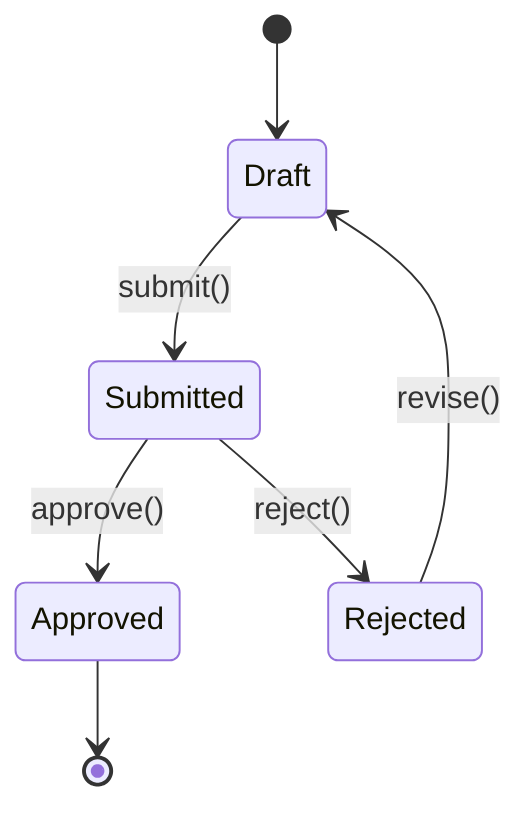
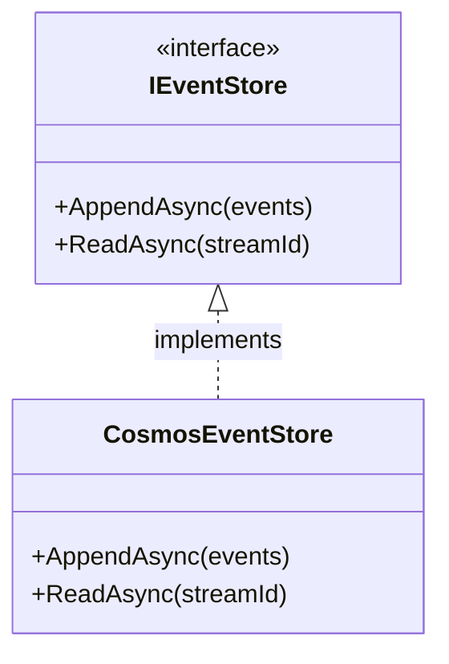
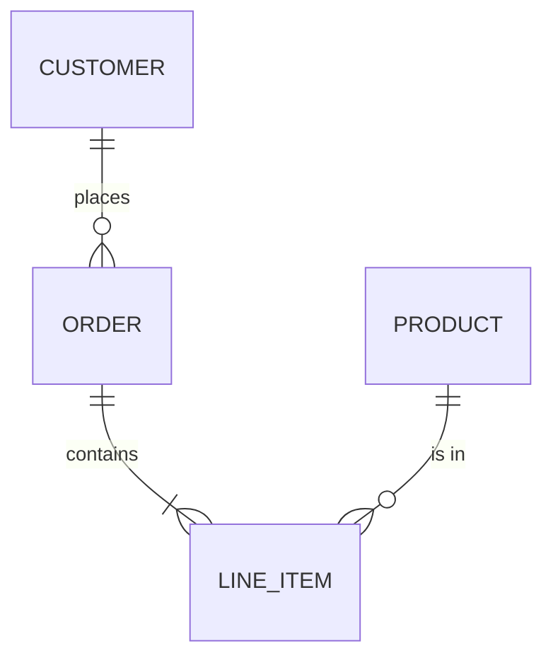
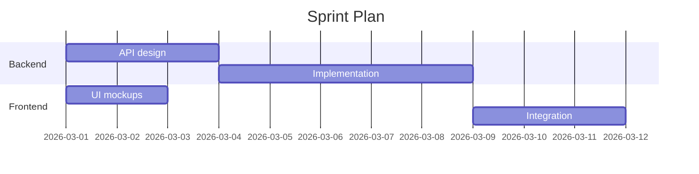

# Mermaid: Diagrams as Code

Teams need diagrams — flowcharts, sequence diagrams, state machines,
architecture views — but maintaining them in binary image editors creates files
that cannot be diffed, reviewed in pull requests, or updated by agents. Mermaid
solves this by defining diagrams in plain text inside Markdown, rendering them
automatically wherever Markdown is displayed.

**This document is written in Minto Pyramid format.**

---

## Governing Thought

Mermaid is a JavaScript-based diagramming and charting framework that renders
diagrams from plain-text definitions embedded directly in Markdown. It
eliminates the need for external drawing tools, keeps diagrams version-
controlled and diffable, and is natively supported by GitHub, GitLab, Azure
DevOps, Docusaurus, and VS Code.

---

## Situation

Software documentation frequently requires visual representations: data flows,
sequence interactions, state transitions, entity relationships, deployment
architectures, and Gantt charts. These diagrams clarify complex systems far more
effectively than prose alone.

## Complication

Traditional diagramming tools (Visio, draw.io, Lucidchart) produce binary or
XML-based files that cannot be meaningfully diffed in version control. Diagrams
fall out of date because updating them requires opening a separate application,
and reviewers cannot see diagram changes in pull request diffs. AI agents cannot
create or modify binary diagram files at all.

## Question

How can teams create and maintain diagrams that live inside Markdown files, are
version-controlled, diffable, reviewable in PRs, and producible by both humans
and agents?

---

## Key-Line 1: What Mermaid Is

### Origin and Authorship

Mermaid was created by **Knut Sveidqvist** and is maintained as an open-source
project under the MIT licence.

- Repository: <https://github.com/mermaid-js/mermaid>
- Documentation: <https://mermaid.js.org/>
- Live editor: <https://mermaid.live/>

> "Mermaid lets you create diagrams and visualizations using text and code."
>
> — Mermaid documentation, <https://mermaid.js.org/intro/>

### How It Works

Mermaid diagrams are defined in fenced code blocks with the language identifier
`mermaid`. The Mermaid JavaScript library parses the text definition and renders
an SVG diagram at display time. The source remains human-readable plain text.

````markdown

````

### Platform Support

| Platform | Support Level |
|---|---|
| **GitHub** | Native rendering in Markdown files, issues, PRs, and comments since February 2022. |
| **GitLab** | Native rendering in Markdown since GitLab 14.0. |
| **Azure DevOps** | Native rendering in wiki and Markdown files. |
| **Docusaurus** | Supported via `@docusaurus/theme-mermaid` plugin. |
| **VS Code** | Rendered in Markdown preview via built-in support and extensions. |
| **Confluence** | Supported via marketplace apps. |
| **Notion** | Native code block support. |

> "GitHub now supports Mermaid natively. Include a Mermaid diagram anywhere
> Markdown is supported."
>
> — GitHub Blog, *Include diagrams in your Markdown files with Mermaid*
> (14 February 2022), <https://github.blog/developer-skills/github/include-diagrams-in-your-markdown-files-with-mermaid/>

---

## Key-Line 2: Supported Diagram Types

Mermaid supports a comprehensive set of diagram types. The following are the
most commonly used in software engineering documentation.

### Flowcharts

General-purpose directed graphs for processes, decision trees, and workflows.

````markdown

````

Direction keywords: `TB` (top-bottom), `BT` (bottom-top), `LR`
(left-right), `RL` (right-left).

Node shapes:

| Syntax | Shape |
|---|---|
| `A[Text]` | Rectangle |
| `A(Text)` | Rounded rectangle |
| `A{Text}` | Diamond (decision) |
| `A([Text])` | Stadium / pill |
| `A[[Text]]` | Subroutine |
| `A[(Text)]` | Cylinder (database) |
| `A((Text))` | Circle |
| `A>Text]` | Asymmetric / flag |

Arrow types:

| Syntax | Meaning |
|---|---|
| `-->` | Solid arrow |
| `---` | Solid line (no arrow) |
| `-.->` | Dotted arrow |
| `==>` | Thick arrow |
| `-- text -->` | Arrow with label |

### Sequence Diagrams

Show interactions between participants over time. Essential for documenting API
flows, message passing, and protocol exchanges.

````markdown

````

Key syntax elements:

| Syntax | Meaning |
|---|---|
| `->>` | Solid arrow (synchronous) |
| `-->>` | Dashed arrow (response / async) |
| `-x` | Solid arrow with cross (lost message) |
| `Note over A,B: text` | Note spanning participants |
| `loop Label` ... `end` | Loop block |
| `alt Label` ... `else` ... `end` | Alternative paths |
| `opt Label` ... `end` | Optional block |
| `par Label` ... `and` ... `end` | Parallel block |

### State Diagrams

Model state machines with transitions, useful for documenting aggregate
lifecycles, workflow states, and protocol states.

````markdown

````

### Class Diagrams

Document object models, interfaces, and relationships.

````markdown

````

### Entity Relationship Diagrams

Model data schemas and relationships.

````markdown

````

Relationship syntax:

| Syntax | Meaning |
|---|---|
| `\|\|--\|\|` | One-to-one |
| `\|\|--o{` | One-to-many |
| `o{--o{` | Many-to-many |
| `\|\|--\|{` | One-to-one-or-more |

### Gantt Charts

Visualise project timelines and task dependencies.

````markdown

````

### Other Supported Diagrams

| Type | Use Case |
|---|---|
| **Pie chart** | Proportional data visualisation |
| **Git graph** | Branch / merge history |
| **C4 diagram** | Architecture context, container, and component views |
| **Mindmap** | Hierarchical idea mapping |
| **Timeline** | Chronological event sequences |
| **Quadrant chart** | Two-axis categorisation (e.g., priority / effort) |
| **Sankey diagram** | Flow quantity visualisation |
| **XY chart** | Line and bar charts |
| **Block diagram** | Nested block architectures |
| **Packet diagram** | Network packet structure |
| **Kanban** | Board-style task visualisation |
| **Architecture** | Icon-based architecture diagrams |

Full catalogue: <https://mermaid.js.org/intro/getting-started.html>

---

## Key-Line 3: Syntax Fundamentals

### Indentation and Whitespace

Mermaid is generally whitespace-tolerant but some diagram types require
consistent indentation (notably Gantt and mindmap). Use spaces, not tabs.

### Comments

Lines starting with `%%` are comments and are not rendered:

```text
%% This is a comment
graph TD
    A --> B
```

### Styling

Nodes and edges can be styled inline or via CSS classes:

```text
graph TD
    A[Start]:::highlight --> B[End]
    classDef highlight fill:#f9f,stroke:#333,stroke-width:2px
```

### Subgraphs

Group related nodes within flowcharts:

```text
graph TD
    subgraph Backend
        A[API] --> B[Service]
    end
    subgraph Frontend
        C[UI] --> D[State]
    end
    C --> A
```

### Links and Interaction

Mermaid supports click events and hyperlinks on nodes (when rendered in
interactive contexts):

```text
graph TD
    A[Documentation]
    click A "https://mermaid.js.org/" "Open Mermaid docs"
```

---

## Key-Line 4: Mermaid in GitHub and Pull Requests

Since February 2022, GitHub renders Mermaid diagrams natively in:

- README and documentation files
- Issue and PR descriptions
- Comments on issues and PRs
- Wiki pages

This means diagrams defined in Mermaid are fully diffable in pull requests.
Reviewers see the text diff of the diagram source, and the rendered preview
shows the visual change. This is a fundamental advantage over binary image files.

### Embedding in GitHub Markdown

Simply use a fenced code block with the `mermaid` language identifier:

````markdown

````

No plugins, extensions, or build steps are required.

### Limitations on GitHub

- Very large or deeply nested diagrams may not render (GitHub imposes a size
  limit on Mermaid blocks).
- Interactive features (click events, tooltips) are disabled for security.
- Rendering is server-side; the exact Mermaid version may lag behind the latest
  release.

---

## Key-Line 5: Mermaid in VS Code

VS Code provides Mermaid support through:

1. **Built-in Markdown preview** — Mermaid diagrams render in the Markdown
   preview pane.
2. **Extensions** — `bierner.markdown-mermaid` adds enhanced Mermaid rendering.
3. **Copilot agents** — The `renderMermaidDiagram` tool available in this
   repository allows agents to produce Mermaid diagrams programmatically.

### Preview Workflow

1. Open a Markdown file containing a Mermaid code block.
2. Open the Markdown preview (`Ctrl+Shift+V` or side-by-side preview).
3. The diagram renders inline within the preview.

---

## Key-Line 6: Best Practices

| Practice | Rationale |
|---|---|
| Keep diagrams small and focused. | Large diagrams are hard to read and may hit rendering limits. |
| One diagram per concept. | Combining unrelated concepts in one diagram confuses readers. |
| Use meaningful node labels. | `A[Order Service]` is better than `A`. |
| Specify direction explicitly. | `graph LR` or `graph TD` — do not rely on defaults. |
| Add comments for complex logic. | `%%` comments help future maintainers. |
| Place diagram source near the prose it illustrates. | Readers should not scroll to find the visual for what they just read. |
| Use subgraphs to reduce visual clutter. | Group related nodes. |
| Test in the live editor before committing. | <https://mermaid.live/> catches syntax errors quickly. |
| Prefer sequence diagrams for interactions, flowcharts for processes, state diagrams for lifecycles. | Choose the right diagram type for the concept. |

---

## Authoritative Sources

| Source | Reference |
|---|---|
| **Mermaid project** | Sveidqvist, K. et al. *Mermaid — Diagramming and charting tool*. <https://mermaid.js.org/> |
| **Mermaid repository** | <https://github.com/mermaid-js/mermaid> (MIT licence) |
| **Mermaid live editor** | <https://mermaid.live/> |
| **GitHub announcement** | GitHub Blog. *Include diagrams in your Markdown files with Mermaid*. 14 February 2022. <https://github.blog/developer-skills/github/include-diagrams-in-your-markdown-files-with-mermaid/> |
| **Docusaurus plugin** | <https://docusaurus.io/docs/markdown-features/diagrams> |
| **CommonMark (base spec)** | <https://spec.commonmark.org/> |

---

## Summary

Mermaid is a text-based diagramming framework that renders inside Markdown
fenced code blocks. It supports flowcharts, sequence diagrams, state diagrams,
class diagrams, ER diagrams, Gantt charts, and many more. It is natively
supported by GitHub, GitLab, Azure DevOps, Docusaurus, and VS Code. Diagrams
defined in Mermaid are version-controlled, diffable in PRs, and producible by
both humans and AI agents — making them the preferred diagramming approach for
any Markdown-first documentation workflow.
