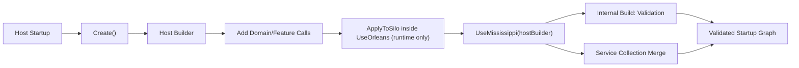

# Builder Pattern Architecture Plan (Proposed)

## Executive summary
Design and implement a unified builder model across Mississippi host surfaces and domain features to reduce DI complexity and improve developer experience. The model keeps existing registration primitives and generator outputs as internal composition mechanisms while exposing a clearer contract-first API:

- Root builder: `IMississippiBuilder` (wraps host DI/silo internals behind a clean contract)
- Host builders: `IClientBuilder`, `IGatewayBuilder`, `IRuntimeBuilder`
- Feature builders: `IAggregateBuilder`, `ISagaBuilder`, `IUxProjectionBuilder`, `IFeatureStateBuilder`

Key architectural decisions (from persona review synthesis):

- **Wrapper-based v1**: Builders hold an internal `IServiceCollection`/`ISiloBuilder` reference and delegate immediately during fluent calls. No intermediate intent representation. This aligns with the existing `InletBlazorSignalRBuilder` precedent and simplifies debugging.
- **`UseMississippi()` is the terminal method**: Users never call `Build()` directly — it is an internal implementation detail called by `UseMississippi(hostBuilder)`. This eliminates a common error class (forgetting to call `Build()`).
- **Gateway requires authorization**: `UseMississippi()` for gateway throws if `ConfigureAuthorization()` hasn't been called. `AllowAnonymousExplicitly()` is available for development scenarios.
- **Factory naming**: `{Area}Builder.Create(...)` everywhere (not `CreateBuilder`).

The design is additive in v1: legacy `AddXyz(...)` registrations remain supported, builder paths become preferred.

## Current state (repo-grounded)
- Composition is extension-method driven (`IServiceCollection` + targeted `ISiloBuilder` methods).
- Existing localized builder precedent: `InletBlazorSignalRBuilder`.
- Domain composition already generated per host (`DomainFeatureRegistrations`, `DomainServerRegistrations`, `DomainSiloRegistrations`).
- Reservoir has explicit state/reducer/effect composition APIs suitable for a feature-state builder.

## Target state
- Area-specific abstractions define stable builder contracts.
- Implementation projects provide concrete builders that orchestrate current registrations.
- Host entrypoints expose fluent + lambda usage and options overloads on every major registration method.
- Generated domain-specific extension methods (for example `AddSpring(...)`) auto-wire full host requirements by default.
- Explicit feature sections are available as advanced override path.
- Runtime builder supports both DI and Orleans silo configuration via hybrid terminal/apply model.
- Builders internally hold an `IServiceCollection` (or equivalent) created at `Create()` time; registrations delegate immediately during fluent calls.
- `UseMississippi(hostBuilder)` is the terminal method that merges the builder's service collection into the host and runs validation. Users never call `Build()` directly.
- Runtime builders additionally require `ApplyToSilo(siloBuilder)` called inside the host's `UseOrleans()` callback.
- Gateway builders enforce authorization configuration — `UseMississippi()` throws if `ConfigureAuthorization()` or `AllowAnonymousExplicitly()` hasn't been called.
- Proposed docs live under `docs/Docusaurus/docs/proposed-patterns/`, explicitly marked non-live.

## Architectural decisions (from review synthesis)

### AD1. Wrapper-based model (not intent-based) for v1
- **Decision**: Builders hold an internal `IServiceCollection`/`ISiloBuilder` reference and delegate immediately during fluent calls. `UseMississippi()` performs validation and merges services. No intermediate intent representation.
- **Rationale**: Intent-based models require a separate materialization pass, making debugging harder and introducing allocation overhead. The existing `InletBlazorSignalRBuilder` already uses the wrapper model. Wrapper-based is simpler for v1; intent-based can be considered for v2 if lazy evaluation proves necessary.
- **Risk**: Cannot defer registration decisions. Mitigated by validation at `UseMississippi()` time.

### AD2. `UseMississippi()` as sole terminal method
- **Decision**: `Build()` is internal. `UseMississippi(hostBuilder)` calls it automatically after merging services.
- **Rationale**: Eliminates the "forgot to call `Build()`" error class. Reduces the public API surface. Users have one clear terminal action. `Use*` prefix aligns with `UseOrleans()` and `UseAqueduct()` patterns — activating a major subsystem on a host builder, not just adding services.
- **Lifecycle**: `Create()` → configure via chaining → `hostBuilder.UseOrleans(silo => builder.ApplyToSilo(silo))` (runtime only) → `hostBuilder.UseMississippi(builder)`.
- **Double-call behavior**: Second `UseMississippi()` throws `InvalidOperationException` with clear message.

### AD3. Gateway authorization is required
- **Decision**: `UseMississippi()` for gateway throws if `ConfigureAuthorization()` hasn't been called.
- **Rationale**: Security review identified that opt-in auth creates unauthenticated gateways by accident. Gateway is a public-facing surface.
- **Escape hatch**: `AllowAnonymousExplicitly()` for development/testing scenarios.

### AD4. Builder interface placement
- **Decision**: Split builder contracts by host surface to enforce interface segregation and prevent contract seepage:
  - `Common.Builders.Abstractions` (minimal shared root contracts)
  - `Common.Builders.Client.Abstractions` (`IClientBuilder` + client-only contracts)
  - `Common.Builders.Gateway.Abstractions` (`IGatewayBuilder` + gateway-only contracts)
  - `Common.Builders.Runtime.Abstractions` (`IRuntimeBuilder` + runtime-only contracts including Orleans-facing builder contracts)
- **Rationale**: SOLID/ISP boundary enforcement is more important than package count. Gateway/client consumers must not see runtime-only contracts by default. Host-specific abstractions make misuse harder at compile-time.
- **Implementation ownership (non-extension methods)**:
  - `IMississippiBuilder` and cross-surface shared contracts live in `Common.Builders.Abstractions`.
  - `IClientBuilder` contracts live in `Common.Builders.Client.Abstractions`.
  - `IGatewayBuilder` contracts live in `Common.Builders.Gateway.Abstractions`.
  - `IRuntimeBuilder` and runtime typed sub-builder contracts live in `Common.Builders.Runtime.Abstractions`.
  - Concrete root builders live in non-SDK implementation projects by host surface: `Common.Builders.Client` (`ClientBuilder`), `Common.Builders.Gateway` (`GatewayBuilder`), `Common.Builders.Runtime` (`RuntimeBuilder`).
  - SDK projects (`Sdk.Client`, `Sdk.Gateway`, `Sdk.Runtime`) are packaging-only aggregators and MUST remain code-empty (no builder implementations, no extension methods, no registration logic).
  - Area-specific extension methods remain in area abstractions projects (for example `Brooks.Abstractions`, `Inlet.Gateway.Abstractions`), not in SDK projects.
  - `Inlet.Client.Abstractions` remains vertical and capability-specific; it is not the host-wide builder contract home.

### AD5. Builder layer positioning
- **Decision**: Builders are Layer 0 (cross-cutting), alongside shared base abstractions.
- **Rationale**: Builders orchestrate across all three layers (Brooks → Tributary → DomainModeling). They must be positioned upstream of all area packages.

## Canonical API decisions

### Entry points (naming)
- `ClientBuilder.Create(...)`
- `GatewayBuilder.Create(...)`
- `RuntimeBuilder.Create(...)`
- `UseMississippi(...)` host extensions for `WebApplicationBuilder`, `HostApplicationBuilder`, and silo host setup surfaces

### Naming conventions (polished)
- Domain method naming: `Add{Domain}(...)` (example: `AddSpring(...)`).
- Registration methods: `Add{Capability}(...)` for additive behavior.
- Configuration methods: `Configure{Capability}(...)` when setting behavior/options without direct registration side effects.
- Builder factories: `{Area}Builder.Create(...)` for root host builders, `{Feature}Builder.Create<TState>(...)` for sub-builders.
- Terminal methods: `UseMississippi(hostBuilder)` for host attachment and finalization (calls internal `Build()`); runtime additionally uses `ApplyToSilo(siloBuilder)` inside `UseOrleans()` callback.
- Options overloads: every significant `Add*`/`Configure*` method should offer an `Action<TOptions>` overload where options exist today.

### Hierarchical builder extension rules (aligned with service registration rules)
- Builder extensions follow the same hierarchy model as service registrations:
  - Public entrypoints at product/feature boundaries.
  - Child registration/build steps nested under parent extension methods.
  - Internal helper extensions for sub-features where public surface is not required.
- Domain-level naming pattern:
  - `Add{Domain}(...)` as public domain entrypoint.
  - `Add{Aggregate}Aggregate(...)` for aggregate modules.
  - `Add{Projection}Projection(...)` for UX projection modules.
  - `Add{Saga}Saga(...)` (or `Add{Saga}Orchestration(...)`) for saga modules.
- Parent extension methods must orchestrate all required child registrations so consuming code stays concise and understandable.
- Registration/build extension methods remain synchronous; any async bootstrap is deferred to hosted services or Orleans lifecycle participants.

### Aggregate-folder module example pattern
```csharp
public static class BankAccountAggregateBuilderExtensions
{
  public static IRuntimeBuilder AddBankAccountAggregate(
    this IRuntimeBuilder builder,
    Action<BankAccountAggregateOptions>? configure = null)
  {
    if (configure is not null)
    {
      builder.ConfigureOptions(configure);
    }

    return builder
      .AddEventType<BankAccountOpened>()
      .AddEventType<FundsDeposited>()
      .AddCommandHandler<OpenAccountCommand, BankAccountSnapshot, OpenAccountCommandHandler>()
      .AddCommandHandler<DepositFundsCommand, BankAccountSnapshot, DepositFundsCommandHandler>()
      .AddReducer<BankAccountOpened, BankAccountSnapshot, BankAccountOpenedReducer>()
      .AddReducer<FundsDeposited, BankAccountSnapshot, FundsDepositedReducer>();
  }
}
```

### Builder naming and package map
| Area | Primary consumer package area | Builder surface |
|---|---|---|
| Client host composition | `Inlet.Client` + `Reservoir.*` + `Refraction.Client*` | `IClientBuilder` |
| Gateway host composition | `Inlet.Gateway` + `Aqueduct.Gateway` + `DomainModeling.Gateway` | `IGatewayBuilder` |
| Runtime host composition | `Inlet.Runtime` + `DomainModeling.Runtime` + `Tributary.Runtime` + `Brooks.Runtime` + `Aqueduct.Runtime` | `IRuntimeBuilder` |
| Domain feature composition | `DomainModeling.*`, `Tributary.*`, generated registrations | `IAggregateBuilder`, `ISagaBuilder`, `IUxProjectionBuilder`, `IFeatureStateBuilder` |

### Builder ownership map (excluding extension methods)
| Builder surface | Contract project | Concrete implementation project | Notes |
|---|---|---|---|
| `IMississippiBuilder` | `Common.Builders.Abstractions` | `Common.Builders.Client` / `Common.Builders.Gateway` / `Common.Builders.Runtime` | Shared root contract only; no host-type dependencies in abstractions |
| `IClientBuilder` | `Common.Builders.Client.Abstractions` | `Common.Builders.Client` | Client host orchestration |
| `IGatewayBuilder` | `Common.Builders.Gateway.Abstractions` | `Common.Builders.Gateway` | Gateway host orchestration + auth requirements |
| `IRuntimeBuilder` | `Common.Builders.Runtime.Abstractions` | `Common.Builders.Runtime` | Runtime host orchestration + Orleans `ApplyToSilo` |
| Typed feature builders (`IAggregateBuilder<T>`, `ISagaBuilder<T>`, `IUxProjectionBuilder<T>`, `IFeatureStateBuilder<T>`) | `Common.Builders.Runtime.Abstractions` | `Common.Builders.Runtime` (composition entry) | Runtime-scoped contracts; not referenced by client/gateway abstractions |

### Standard builder inventory and scope policy
- Root host builders in scope for v1: `IClientBuilder`, `IGatewayBuilder`, `IRuntimeBuilder` (and shared `IMississippiBuilder`).
- Feature builders in scope for v1: `IAggregateBuilder<T>`, `ISagaBuilder<T>`, `IUxProjectionBuilder<T>`, `IFeatureStateBuilder<T>`.
- Supporting sub-builders in scope where needed: `IOrleansStreamBuilder`, client/gateway projection support builders.
- **Out of scope for v1**: separate vertical root builders like `IInletClientBuilder`, `IInletGatewayBuilder`, `IInletRuntimeBuilder`.
- Standard approach: vertical capabilities (Inlet, Aqueduct, Reservoir, Brooks, Tributary, DomainModeling) are added via extension methods on the three root host builders, not by creating additional top-level root builder families.

### Finalization / apply contract
| Builder | Core scope | Terminal behavior | Validation failure mode |
|---|---|---|---|
| `IClientBuilder` | Client registration + host attachment | `UseMississippi(hostBuilder)` merges services and validates | Throws `BuilderValidationException` with `BuilderDiagnostic[]` |
| `IGatewayBuilder` | Gateway registration + host attachment | `UseMississippi(hostBuilder)` merges services, validates, requires auth configured | Throws `BuilderValidationException` with `BuilderDiagnostic[]` |
| `IRuntimeBuilder` | Runtime registration + Orleans configuration | `ApplyToSilo(siloBuilder)` inside `UseOrleans()`; then `UseMississippi(hostBuilder)` merges services and validates | Throws `BuilderValidationException` with `BuilderDiagnostic[]` |

### Lifecycle ordering (must be followed)
```
Create()  →  configure via chaining  →  [ApplyToSilo inside UseOrleans]  →  UseMississippi(hostBuilder)
```

1. `{Area}Builder.Create(...)` — creates builder with internal `IServiceCollection`.
2. Fluent chaining — `Add*()` / `Configure*()` methods delegate to internal service collection immediately.
3. (Runtime only) `hostBuilder.UseOrleans(silo => runtimeBuilder.ApplyToSilo(silo))` — applies silo-specific registrations.
4. `hostBuilder.UseMississippi(builder)` — terminal method: runs validation, merges services into host.
5. Double `UseMississippi()` throws `InvalidOperationException`.
6. `UseMississippi()` without prior `ConfigureAuthorization()` on gateway throws `BuilderValidationException`.

### Framework alignment checks (Orleans + ASP.NET)
- `UseMississippi(...)` follows the established subsystem activation pattern (`Use*`) used by `UseOrleans()` and `UseAqueduct()`.
- Runtime-specific Orleans wiring is explicit and confined to `hostBuilder.UseOrleans(silo => runtimeBuilder.ApplyToSilo(silo))`.
- Host-surface adapter methods are provided for both `HostApplicationBuilder` and `WebApplicationBuilder` with equivalent behavior.
- No builder abstractions depend on ASP.NET or Orleans implementation assemblies; framework-specific concerns stay in adapter/implementation layers.
- Validation and diagnostics execute at terminal attachment time (`UseMississippi(...)`) to mirror framework startup validation timing.

### `BuilderDiagnostic` type (structured validation)
```csharp
public sealed record BuilderDiagnostic(
    string ErrorCode,
    string Category,
    string Message,
    string RemediationHint,
    IReadOnlyDictionary<string, string>? Context = null);
```
`BuilderValidationException` carries `IReadOnlyList<BuilderDiagnostic>` for programmatic inspection.

### Domain + feature behavior
- Default path: generated domain-specific methods (for example `AddSpring(...)`) wire complete host requirements.
- Advanced path: explicit feature sections configure/override aggregate/saga/projection/feature-state behaviors.
- Override semantics must be deterministic and documented (append/replace/fail rules).

### Override precedence matrix (must be explicit)
| Baseline mode | Additional composition | `append` | `replace` | `fail` |
|---|---|---|---|---|
| Generated baseline | Manual override | Additive registration; preserve generated defaults | Manual registration replaces generated mapping for same contract | Throw with remediation hint |
| Manual baseline | Generated add-on | Add generated-only missing contracts | Generated mapping replaces manual registration for declared contract | Throw with remediation hint |
| Generated baseline | Generated baseline (duplicate) | Ignore duplicate | Last writer wins only when explicitly requested | Throw by default |

## Public contract map (proposed)

### Central builder abstractions placement (dependency-safe)
- Builder interfaces must live in one central abstractions location that is upstream of all area packages.
- Selected placement for v1: host-segregated builder abstractions in `Common.Builders.*.Abstractions` (`Common.Builders.Abstractions`, `Common.Builders.Client.Abstractions`, `Common.Builders.Gateway.Abstractions`, `Common.Builders.Runtime.Abstractions`).
- Builder abstraction projects contain only contracts/DTOs/options contracts for their surface and MUST NOT reference runtime/client/gateway implementations.
- All area abstractions (`Brooks.Abstractions`, `Aqueduct.Abstractions`, `DomainModeling.Abstractions`, etc.) may reference only the host-specific builder abstraction(s) they extend, never concrete builder implementations.

### Extensibility model (extension methods by area)
- Extensibility is extension-method first: each area adds builder extensions in its own abstractions project.
- Example: Brooks-specific builder extensions live with Brooks abstractions so consumers can opt in without pulling Brooks runtime implementation packages.
- Extension methods register services on the builder's internal service collection directly, not via string-keyed capability bags.
- Validation of cross-cutting concerns (stream topology, storage coherence) happens at `UseMississippi()` time.

### Dependency direction rules (must hold)

| Package Name | Allowed Upstream Dependencies | Forbidden Dependencies |
| --- | --- | --- |
| `Common.Builders.Abstractions` | None (Root package) | All other Builder/Sdk packages |
| `Common.Builders.Client.Abstractions` | `Common.Builders.Abstractions` | Gateway/Runtime abstractions, any `Sdk.*` |
| `Common.Builders.Gateway.Abstractions` | `Common.Builders.Abstractions` | Client/Runtime abstractions, any `Sdk.*` |
| `Common.Builders.Runtime.Abstractions` | `Common.Builders.Abstractions` | Client/Gateway abstractions, any `Sdk.*` |
| `Common.Builders.Client` | `Common.Builders.Client.Abstractions`, `Common.Builders.Abstractions` | Gateway/Runtime implementation projects |
| `Common.Builders.Gateway` | `Common.Builders.Gateway.Abstractions`, `Common.Builders.Abstractions` | Client/Runtime implementation projects |
| `Common.Builders.Runtime` | `Common.Builders.Runtime.Abstractions`, `Common.Builders.Abstractions` | Client/Gateway implementation projects |
| `Sdk.Client` | `Common.Builders.Client`, host/client area packages | Direct source code files; Gateway/Runtime SDKs |
| `Sdk.Gateway` | `Common.Builders.Gateway`, host/gateway area packages | Direct source code files; Client/Runtime SDKs |
| `Sdk.Runtime` | `Common.Builders.Runtime`, host/runtime area packages | Direct source code files; Client/Gateway SDKs |

  - `*.Abstractions` area packages -> may depend on shared abstractions plus only the specific builder abstractions they extend.
  - Client/gateway abstraction packages MUST NOT reference `Common.Builders.Runtime.Abstractions`.
  - `Sdk.*` projects MUST remain packaging-only aggregation points (project/package references and metadata only); no production C# code may live in SDK projects.
  - No builder contract type may depend on `WebApplicationBuilder` or concrete runtime packages.
  - Builder interfaces expose `IServiceCollection Services { get }` for extension methods to register directly (wrapper model).
  - Host attachment extensions (`UseMississippi(...)`) are adapter-layer methods and must not leak implementation dependencies into abstractions.

### Extension-method example (Brooks storage)
```csharp
public static class BrooksBuilderExtensions
{
  public static IRuntimeBuilder AddBrooksStorage(
    this IRuntimeBuilder builder,
    Action<BrookStorageOptions> configure)
  {
    builder.ConfigureOptions(configure);
    builder.Services.AddCosmosBrookStorageProvider(configure);
    return builder;
  }
}
```

```csharp
var runtime = RuntimeBuilder.Create()
  .AddSpring()
  .AddBrooksStorage(options =>
  {
    options.DatabaseName = "mississippi";
  });

hostBuilder.UseMississippi(runtime);
```

### Host contracts
- `IMississippiBuilder`
  - Wraps an internal `IServiceCollection` behind a clean contract.
  - Exposes `IServiceCollection Services { get; }` for extension methods to register directly.
  - Supports host attachment model (`UseMississippi(...)` as terminal method).
  - Supports options-driven configuration for all major feature areas.

- `IClientBuilder`
  - `IClientBuilder AddAqueduct(Action<AqueductOptions> configure)`
  - `IClientBuilder AddFeatureState(string featureName, Action<IFeatureStateBuilder> configure)`
  - `IClientBuilder AddProjectionSupport(Action<IClientProjectionBuilder> configure)`
  - (No public `Build()` — called internally by `UseMississippi()`)

- `IGatewayBuilder`
  - `IGatewayBuilder AddAqueduct(Action<AqueductOptions> configure)`
  - `IGatewayBuilder AddProjectionSupport(Action<IGatewayProjectionBuilder> configure)`
  - `IGatewayBuilder ConfigureAuthorization(...)` **(required — `UseMississippi()` throws without it)**
  - `IGatewayBuilder AllowAnonymousExplicitly()` (development/testing escape hatch)
  - (No public `Build()` — called internally by `UseMississippi()`)

- `IRuntimeBuilder`
  - `IRuntimeBuilder AddAqueduct(Action<AqueductSiloOptions> configure)`
  - `IRuntimeBuilder AddEventSourcing(Action<BrookProviderOptions> configure)`
  - `IRuntimeBuilder AddSnapshots(Action<SnapshotProviderOptions> configure)`
  - `IRuntimeBuilder ConfigureSnapshotRetention(Action<SnapshotRetentionOptions> configure)`
  - `IRuntimeBuilder ConfigureSilo(Action<ISiloBuilder> configure)`
  - `void ApplyToSilo(ISiloBuilder siloBuilder)` **(must be called inside `UseOrleans()` callback)**
  - (No public `Build()` — called internally by `UseMississippi()`)

### Generated domain API shape (per host)
- Source generators should emit domain-specific extension methods on builder surfaces:
  - `IClientBuilder Add{Domain}(this IClientBuilder builder, Action<I{Domain}ClientBuilder>? configure = null)`
  - `IGatewayBuilder Add{Domain}(this IGatewayBuilder builder, Action<I{Domain}GatewayBuilder>? configure = null)`
  - `IRuntimeBuilder Add{Domain}(this IRuntimeBuilder builder, Action<I{Domain}RuntimeBuilder>? configure = null)`
- Example concrete form for Spring: `AddSpring(...)`.
- Generated methods are wrapper conveniences over the same underlying manual calls a developer can write directly.

### Feature contracts
- `IAggregateBuilder`: aggregate support, event registration/scanning, handlers, reducers, effects, snapshot state converters.
- `IAggregateBuilder<TSnapshot>`: typed aggregate builder that enables generic type inference for reducers/handlers/effects. Includes `AddSnapshotStateConverter<TConverter>()` for snapshot version migration.
- `ISagaBuilder`: saga orchestration + saga registration pipeline.
- `ISagaBuilder<TSagaState>`: typed saga builder that infers saga state for step/reducer/effect registration.
- `IUxProjectionBuilder`: projection registration/scanning + path/brook mapping.
- `IUxProjectionBuilder<TProjection>`: typed projection builder that infers projection type across registration calls.
- `IFeatureStateBuilder`: Reservoir feature state/reducers/effects/root composition.
- `IFeatureStateBuilder<TState>`: typed feature-state builder that infers feature state type across reducers/effects.

### Generic-inference UX contract (important)
- Typed builders should infer aggregate/saga/projection/feature-state type from `Create<TState>()` so users do not repeat it on every call.
- Canonical concise aggregate signatures:
  - `AddReducer<TEvent, TReducer>()` where `TReducer : IActionReducer<TEvent, TSnapshot>`
  - `AddCommandHandler<TCommand, THandler>()` where `THandler : ICommandHandler<TCommand, TSnapshot>`
  - `AddEventEffect<TEffect>()` where `TEffect : IEventEffect<TSnapshot>`
  - `AddSnapshotStateConverter<TConverter>()` where `TConverter : ISnapshotStateConverter<TSnapshot>`
- Canonical concise feature-state signatures:
  - `AddReducer<TAction, TReducer>()` where `TReducer : IActionReducer<TAction, TState>`
  - `AddActionEffect<TEffect>()` where `TEffect : IActionEffect<TState>`
- Canonical concise saga signatures:
  - `AddStartCommand<TCommand, THandler>()` where `THandler : ICommandHandler<TCommand, TSagaState>`
  - `AddStep<TStep>()`, `AddCompensation<TCompensation>()`
- Canonical concise projection signatures:
  - `AddEventType<TEvent>()`
  - `AddReducer<TEvent, TReducer>()` where `TReducer : IProjectionReducer<TEvent, TProjection>`
- Verbose overloads that repeat state type remain available for advanced/ambiguous cases but are not preferred for docs.

## Source project integration matrix (required additions)

### Client-surface integrations (`IClientBuilder`)
- `Inlet.Client`
  - `AddInletClient(...)`
  - `AddInletBlazorSignalR(...)` / `InletBlazorSignalRBuilder`
  - `AddProjectionPath<T>(...)`
- `Inlet.Client.SignalRConnection`
  - `AddSignalRConnectionFeature(...)`
- `Reservoir.Core`
  - `AddReservoir(...)`, `AddFeatureState(...)`, `AddReducer(...)`, `AddActionEffect(...)`
- `Reservoir.Client`
  - `AddReservoirBlazorBuiltIns(...)`, `AddReservoirDevTools(...)`
  - built-ins: navigation + lifecycle feature registrations
- `Refraction.Client`
  - `AddRefraction(...)`
- `Refraction.Client.StateManagement`
  - `AddRefractionPages(...)`

### Gateway-surface integrations (`IGatewayBuilder`)
- `Inlet.Gateway`
  - `AddInletServer(...)`
  - `AddInletSignalRGrainObserver(...)`
  - endpoint mapping: `MapInletHub(...)`
- `Inlet.Gateway.Abstractions`
  - `AddInletInProcess(...)` (Blazor Server/in-process projection notifier path)
- `Aqueduct.Gateway`
  - `AddAqueduct<THub>(...)`
  - `AddAqueductGrainFactory(...)`
  - `AddAqueductNotifier(...)`
- `DomainModeling.Gateway` + generated server registrations
  - generated mapping composition (`DomainServerRegistrations` and generated mapper registrations)
- `Common.Abstractions.Mapping`
  - enumerable/async-enumerable mapper registrations where required by generated mapping flows

### Runtime-surface integrations (`IRuntimeBuilder`)
- `Inlet.Runtime`
  - `AddInletSilo(...)`
  - `ScanProjectionAssemblies(...)`
- `DomainModeling.Runtime`
  - `AddAggregateSupport(...)`, `AddCommandHandler(...)`, `AddEventType(...)`, `AddEventEffect(...)`
  - `AddFireAndForgetEventEffect(...)`
  - `AddSagaOrchestration(...)`
  - `AddUxProjections(...)`
- `Tributary.Runtime`
  - `AddReducer(...)`, `AddRootReducer(...)`
  - `AddSnapshotCaching(...)`, `AddSnapshotStateConverter(...)`
- `Brooks.Runtime`
  - service-side: `AddEventSourcingByService(...)`
  - silo-side: `AddEventSourcing(ISiloBuilder, ...)`
- `Aqueduct.Runtime`
  - `UseAqueduct(ISiloBuilder, ...)`
- generated runtime registrations
  - aggregate/projection/saga/domain runtime generated registration classes

### Storage/serialization integrations (cross-cutting builder hooks)
- `Brooks.Runtime.Storage.Cosmos`
  - `AddCosmosBrookStorageProvider(...)` overload family
- `Tributary.Runtime.Storage.Cosmos`
  - `AddCosmosSnapshotStorageProvider(...)` overload family
- `Brooks.Runtime.Storage.Abstractions`
  - `RegisterBrookStorageProvider<...>(...)`
- `Tributary.Runtime.Storage.Abstractions`
  - `RegisterSnapshotStorageProvider<...>(...)`
- `Brooks.Serialization.Json`
  - `AddJsonSerialization(...)`
- `Brooks.Serialization.Abstractions`
  - `RegisterSerializationStorageProvider<...>(...)`

### Package-only/bundle projects
- `Sdk.Client`, `Sdk.Gateway`, `Sdk.Runtime` currently provide package composition (project references/analyzers) and no direct extension methods.
- Builder plan must keep SDK projects permanently code-empty and treat them as NuGet aggregation bundles only, not independent registration surfaces.

## Registration and options coverage audit (repo-grounded)

### Coverage objective
Ensure every current Mississippi registration style is representable in the builder model without capability loss:
- service registrations (`IServiceCollection` `Add*`)
- silo registrations (`ISiloBuilder` `Add*`/`Use*`)
- host convenience registrations (`HostApplicationBuilder` / web host wiring)
- endpoint mapping (`Map*`)
- options configuration (`Action<TOptions>` and `AddOptions<TOptions>()` patterns)

### Evidence highlights from current code
- Client composition surfaces:
  - `Inlet.Client/InletClientRegistrations.cs` (`AddInletClient`, `AddProjectionPath<T>`)
  - `Reservoir.Core/ReservoirRegistrations.cs` (`AddReservoir`, `AddFeatureState`, `AddReducer`, `AddActionEffect`)
  - `Inlet.Client/SignalRConnection/SignalRConnectionRegistrations.cs` (`AddSignalRConnectionFeature`)
- Gateway composition surfaces:
  - `Inlet.Gateway/InletServerRegistrations.cs` (`AddInletServer(Action<InletServerOptions>?)`, `AddInletSignalRGrainObserver`, `MapInletHub`)
  - `Aqueduct.Gateway/AqueductRegistrations.cs` (`AddAqueduct<THub>`, overload with `Action<AqueductOptions>`, `AddAqueductGrainFactory`, `AddAqueductNotifier`)
- Runtime/silo composition surfaces:
  - `DomainModeling.Runtime/AggregateRegistrations.cs` (`AddAggregateSupport`, `AddCommandHandler`, `AddEventType`, `AddEventEffect`, `AddFireAndForgetEventEffect`)
  - `DomainModeling.Runtime/SagaRegistrations.cs` (`AddSagaOrchestration<TSaga, TInput>`)
  - `DomainModeling.Runtime/UxProjectionRegistrations.cs` (`AddUxProjections`)
  - `Brooks.Runtime/BrooksRuntimeRegistrations.cs` (`ISiloBuilder AddEventSourcing`, `HostApplicationBuilder AddEventSourcing`, `IServiceCollection AddEventSourcingByService`)
  - `Aqueduct.Runtime/AqueductGrainsRegistrations.cs` (`UseAqueduct(ISiloBuilder, ...)`)
- Storage/serialization options and registrations:
  - `Brooks.Runtime.Storage.Cosmos/BrookStorageProviderRegistrations.cs` (`AddCosmosBrookStorageProvider` overload family)
  - `Tributary.Runtime.Storage.Cosmos/SnapshotStorageProviderRegistrations.cs` (`AddCosmosSnapshotStorageProvider` overload family)
  - `Brooks.Serialization.Json/ServiceRegistration.cs` (`AddJsonSerialization`)

### Options models confirmed in active use
- `InletServerOptions`, `GeneratedApiAuthorizationOptions`
- `AqueductOptions`, `AqueductSiloOptions`
- `BrookProviderOptions`, `BrookReaderOptions`, `BrookStorageOptions`
- `SnapshotStorageOptions`, `SnapshotRetentionOptions`
- `InletOptions`, `InletSignalRActionEffectOptions`
- `AggregateEffectOptions`, `ReservoirDevToolsOptions`

### Required mapping pattern (must hold for all registrations)
For every existing registration primitive, builder design must provide one of these mappings:
1. Direct fluent wrapper with same option surface (preferred).
2. Fluent wrapper + advanced callback for unsupported edge overloads.
3. Escape hatch preserving raw registration access for parity (`ConfigureServices` / `ConfigureSilo` / `ConfigureEndpoints`).

### Extensibility mapping pattern (must hold for all area packages)
- Every area package with registration APIs should expose matching builder extensions in its abstractions package when optional consumption is expected.
- Extension methods should be capability-scoped and area-prefixed where needed (for example `AddBrooksStorage`, `AddAqueductBackplane`, `AddTributarySnapshots`).
- Options signatures should mirror existing options types to keep migration mechanical and dependency-safe.

### Registration mapping contract
- Any existing `AddXyz(...)` with options must map to `builder.AddXyz(options => ...)`.
- Any existing parameterless `AddXyz()` must map to `builder.AddXyz()`.
- Any existing silo `UseXyz(...)`/`AddXyz(ISiloBuilder, ...)` must map to runtime builder + `ApplyToSilo` pipeline (inside `UseOrleans()` callback).
- Any existing endpoint `MapXyz(...)` must map to gateway endpoint phase (`UseMississippi()` materialization + endpoint attach stage).
- Existing overload parity must be documented in a matrix: `existing signature -> builder signature -> underlying call path`.

### Coverage acceptance additions
- [ ] Coverage matrix includes all current registration families (Inlet, Reservoir, Refraction, DomainModeling, Brooks, Tributary, Aqueduct, serialization/storage).
- [ ] Every options-bearing registration has an options-bearing builder method (client/gateway/runtime).
- [ ] Endpoint mapping registrations (`Map*`) are represented in gateway builder apply/materialization stage.
- [ ] Silo-only registrations are representable without forcing direct host-service access.

## Orleans streams and backplane topology (must be first-class in builders)

### Why this must be explicit
- Runtime and gateway components rely on consistent Orleans stream provider naming and namespaces.
- `Aqueduct` and `Brooks` both depend on stream provider configuration, and mismatches create runtime failures.

### Current stream-sensitive components
- `Brooks.Runtime.AddEventSourcing(...)` uses `BrookProviderOptions.OrleansStreamProviderName`.
- `Aqueduct.Runtime.UseAqueduct(...)` configures stream provider usage on silo side.
- `Aqueduct.Gateway` runtime components (`StreamSubscriptionManager`, `AqueductNotifier`) read `AqueductOptions.StreamProviderName`.
- `Inlet` runtime subscription flows depend on stream provider configuration via Brooks/Aqueduct pathways.

### Builder requirements for streams
- `IRuntimeBuilder` must expose explicit stream topology configuration (provider name + namespaces) and validate coherence.
- `IGatewayBuilder` must expose Aqueduct stream settings and ensure gateway-side provider name matches runtime-side provider.
- Validation must fail fast when stream provider names are unset or inconsistent across runtime/gateway contexts.

### Proposed stream-oriented builder hooks
- `IRuntimeBuilder ConfigureOrleansStreams(Action<IOrleansStreamBuilder> configure)`
  - set provider name(s)
  - configure Brooks stream provider mapping
  - configure Aqueduct runtime stream settings
- `IGatewayBuilder ConfigureAqueductStreams(...)`
  - set/override `AqueductOptions` stream provider + namespaces
  - optional alignment helper against runtime stream contract

### Stream acceptance criteria additions
- [ ] Runtime builder can configure stream provider name for Brooks + Aqueduct runtime flows.
- [ ] Gateway builder can configure Aqueduct gateway stream provider settings.
- [ ] Cross-surface validation catches runtime/gateway stream mismatches before startup completes.
- [ ] Sample migration demonstrates single-source stream topology configuration.

## Generated code integration strategy
- Keep generated `Domain*Registrations` as composition inputs.
- Builder implementations call generated registrations on the internal service collection during fluent calls.
- Publish a mapping matrix from builder methods to generated/legacy registrations.
- Preserve direct generated registration methods as supported fallback in v1.
- Require generated output to include builder-aware domain extension methods (`Add{Domain}`) for client/gateway/runtime.
- Source-generated and non-source-generated paths must execute the same internal call graph and validations.
- Source generators must conditionally emit builder extensions based on builder interface availability (incremental generator design).

## Source generation builder strategy (new)

### Goal
Make source-generation-first onboarding effortless while keeping a first-class manual path for teams that do not use source generation.

### Core design rule
- Every host builder must provide two explicit composition modes:
  - Generated mode: consume domain-specific generated builder extension methods and generated domain registrations.
  - Manual mode: compose explicit `AddXyz(...)` registrations without source generation.
- Both modes must use identical user-facing APIs; source generation only writes convenience wrappers over the manual primitives.

### Proposed host-level shape
- `IClientBuilder`
  - `Add{Domain}(...)` (generated extension)
  - `AddAqueduct(Action<AqueductOptions> configure)`
  - `AddFeatureState(...)`
  - `AddProjectionSupport(...)`
- `IGatewayBuilder`
  - `Add{Domain}(...)` (generated extension)
  - `AddAqueduct(Action<AqueductOptions> configure)`
  - `AddProjectionSupport(...)`
  - `ConfigureAuthorization(...)` **(required)**
  - `AllowAnonymousExplicitly()` (development escape hatch)
- `IRuntimeBuilder`
  - `Add{Domain}(...)` (generated extension)
  - `AddAqueduct(Action<AqueductSiloOptions> configure)`
  - `AddEventSourcing(Action<BrookProviderOptions> configure)`
  - `AddProjectionSupport(...)`
  - `ConfigureOrleansStreams(...)`

### Generated mode mapping by host
- Client generated inputs
  - attributes: `GenerateAggregateEndpoints`, `GenerateCommand`, `GenerateSagaEndpoints`, `GenerateProjectionEndpoints`
  - generated registrations: aggregate feature registrations, saga feature registrations, `DomainFeatureRegistrations`
- Gateway generated inputs
  - attributes: `GenerateAggregateEndpoints`, `GenerateCommand`, `GenerateSagaEndpoints`, `GenerateProjectionEndpoints`
  - generated outputs: aggregate controllers/mappers/projection endpoints + `DomainServerRegistrations`
  - namespace derivation must be target-root based (no hardcoded `.Server` naming assumptions)
- Runtime generated inputs
  - attributes: `GenerateAggregateEndpoints`, `GenerateSagaEndpoints`, `GenerateProjectionEndpoints`
  - generated registrations: aggregate/saga/projection runtime registrations + `DomainSiloRegistrations`

### Manual mode requirements by host
- Client manual composition must allow explicit control of:
  - Inlet client core registrations
  - Reservoir feature state/reducer/effect registration
  - projection/SignalR feature wiring
- Gateway manual composition must allow explicit control of:
  - Inlet server/hub wiring
  - Aqueduct backplane wiring
  - projection notifier mode (`InProcess` vs SignalR)
  - generated authorization options or manual auth policy setup
- Runtime manual composition must allow explicit control of:
  - aggregate/saga/projection registration primitives
  - Brooks/Tributary/Aqueduct runtime registrations
  - stream provider and silo-bridge configuration

### Mixed-mode support (important)
- Builders must support mixed composition safely:
  - generated domain baseline + targeted manual overrides
  - manual baseline + selected generated features
- Override semantics must remain deterministic (`append`/`replace`/`fail`) and validated at terminal/apply step.
- Mixed mode should feel like normal chaining (`AddSpring().AddFeatureState(...).AddProjectionSupport(...)`) without separate "manual mode" entry methods.

### Pending source-generator backlog integration
- Types marked with `PendingSourceGenerator` must remain valid for manual mode and test baselines.
- Builder docs should clarify that pending-generator areas default to manual composition until generator support is complete.
- Pending-generator areas require manual-path conformance tests until generated-path support ships.

### Naming-assumption guardrail from latest sample rename
- Builder generated-mode integration must not assume host role names in emitted namespaces (`Server`/`Silo`/etc.).
- Any generated gateway/runtime wiring consumed by builders must derive namespace roots from compiler/analyzer config inputs.

### Project-level generator awareness
- `Inlet.Client.Generators`, `Inlet.Gateway.Generators`, and `Inlet.Runtime.Generators` are primary generated-surface producers.
- `Inlet.Generators.Abstractions` defines attribute contracts that builders must document and validate against.
- `Sdk.Client`, `Sdk.Gateway`, `Sdk.Runtime` may package analyzers/generators transitively but must not contain generated/runtime builder code; convenience entrypoints belong in `Common.Builders.*` or area abstractions.

### UX contract for generated vs manual paths
- Generated path should be shortest-path DX:
  - one generated domain method call (for example `AddSpring(...)`) + optional host options.
- Manual path should be explicit but guided:
  - structured manual builder sub-APIs grouped by feature area.
- Options should be first-class in all host builders (client/gateway/runtime) for domain, streams, aqueduct, and storage configuration.
- Diagnostics must clearly state whether a failure occurred in generated mode or manual mode.

## Developer experience API examples (proposed)

### What developers need to consider first
- Composition mode per host: `generated`, `manual`, or `mixed`.
- Generated domain extension availability for generated mode (`Add{Domain}(...)`).
- Stream topology alignment between gateway and runtime.
- Authorization posture on gateway (**required** — no implicit relaxation, must call `ConfigureAuthorization()` or `AllowAnonymousExplicitly()`).
- Storage/serialization provider choices and compatibility.
- Host attachment: call `UseMississippi(builder)` on host builder as the terminal step.
- Lifecycle ordering: `Create()` → configure → `ApplyToSilo()` inside `UseOrleans()` (runtime only) → `UseMississippi()`.

### Progressive disclosure (learning path)

**Tier 1 — Generated happy path** (5 minutes to first working host):
```csharp
var builder = WebApplication.CreateBuilder(args);
var gateway = GatewayBuilder.Create()
  .AddSpring()
  .ConfigureAuthorization(auth => auth.RequireAuthenticatedUserByDefault());
builder.UseMississippi(gateway);
```

**Tier 2 — Manual composition** (full control, no generators):
```csharp
var runtime = RuntimeBuilder.Create()
  .AddEventSourcing(options => { options.OrleansStreamProviderName = "mississippi-streaming"; })
  .AddAggregate(AggregateBuilder.Create<BankAccountSnapshot>()
    .AddReducer<BankAccountOpened, BankAccountOpenedReducer>()
    .AddCommandHandler<OpenAccountCommand, OpenAccountCommandHandler>());
hostBuilder.UseOrleans(silo => runtime.ApplyToSilo(silo));
hostBuilder.UseMississippi(runtime);
```

**Tier 3 — Advanced customization** (mixed mode, custom storage, escape hatches):
```csharp
var runtime = RuntimeBuilder.Create()
  .AddSpring()                    // generated baseline
  .AddBrooksStorage(options => { options.DatabaseName = "custom-db"; })  // storage override
  .ConfigureSilo(silo => { /* raw silo access */ });
hostBuilder.UseOrleans(silo => runtime.ApplyToSilo(silo));
hostBuilder.UseMississippi(runtime);
```

### Client — generated-first shortest path
```csharp
var mississippi = ClientBuilder.Create();
mississippi
  .AddSpring(options =>
  {
    options.RoutePrefix = "/api";
  });

hostBuilder.UseMississippi(mississippi);
```

### Client — manual composition path (same API family)
```csharp
var mississippi = ClientBuilder.Create();
mississippi
  .AddAqueduct(options =>
  {
    options.StreamProviderName = "mississippi-streaming";
  })
  .AddFeatureState("banking", feature =>
  {
    feature.AddReducer<BankAccountReducer>();
    feature.AddActionEffect<RefreshAccountEffect>();
  })
  .AddProjectionSupport(projections =>
  {
    projections.AddProjectionPath<BankAccountBalanceProjection>("/api/projections/bank-account-balance");
  });

hostBuilder.UseMississippi(mississippi);
```

### Gateway — generated mode with explicit auth + options
```csharp
var webBuilder = WebApplication.CreateBuilder(args);
var mississippi = GatewayBuilder.Create()
  .AddSpring(options =>
  {
    options.EnableProjectionEndpoints = true;
  })
  .ConfigureAuthorization(auth => auth.RequireAuthenticatedUserByDefault())
  .ConfigureAqueductStreams(streams =>
  {
    streams.WithProviderName("mississippi-streaming");
    streams.WithNamespace("spring-notifications");
  });

webBuilder.UseMississippi(mississippi);
```

### Gateway — mixed mode (generated baseline + explicit feature calls)
```csharp
var webBuilder = WebApplication.CreateBuilder(args);
var mississippi = GatewayBuilder.Create()
  .AddSpring()
  .AddAqueduct(options =>
  {
    options.StreamProviderName = "mississippi-streaming";
  })
  .AddProjectionSupport(projections =>
  {
    projections.Replace<LegacyBalanceProjectionMapper, BalanceProjectionMapperV2>();
  })
  .ConfigureAuthorization(auth => auth.RequireAuthenticatedUserByDefault());

webBuilder.UseMississippi(mississippi);
```

### Runtime — generated mode + silo apply bridge
```csharp
var hostBuilder = Host.CreateApplicationBuilder(args);
IRuntimeBuilder runtimeBuilder = RuntimeBuilder.Create()
  .AddSpring()
  .ConfigureOrleansStreams(streams =>
  {
    streams.WithProviderName("mississippi-streaming");
    streams.WithBrooksNamespace("brooks-events");
    streams.WithAqueductNamespace("spring-notifications");
  });

hostBuilder.UseOrleans(silo => runtimeBuilder.ApplyToSilo(silo));
hostBuilder.UseMississippi(runtimeBuilder);
```

### Runtime — manual composition path (same chaining model)
```csharp
var hostBuilder = Host.CreateApplicationBuilder(args);
IRuntimeBuilder runtimeBuilder = RuntimeBuilder.Create()
  .AddAqueduct(options =>
  {
    options.StreamProviderName = "mississippi-streaming";
  })
  .AddEventSourcing(options =>
  {
    options.OrleansStreamProviderName = "mississippi-streaming";
  })
  .AddProjectionSupport(projections =>
  {
    projections.AddUxProjection<BankAccountBalanceProjection>();
  })
  .AddJsonSerialization();

hostBuilder.UseOrleans(silo => runtimeBuilder.ApplyToSilo(silo));
hostBuilder.UseMississippi(runtimeBuilder);
```

### Sub-builder style examples (feature state / aggregate / saga / UX projection)

#### Feature state builder example
```csharp
var featureStateBuilder = FeatureStateBuilder.Create<BankAccountFeatureState>("bank-account");
featureStateBuilder
  .AddReducer<DepositFundsAction, DepositFundsReducer>()
  .AddReducer<WithdrawFundsAction, WithdrawFundsReducer>()
  .AddActionEffect<RefreshAccountEffect>()
  .Build();
```

#### Aggregate builder example
```csharp
var bankAccountAggregate = AggregateBuilder.Create<BankAccountSnapshot>();
bankAccountAggregate
  .AddReducer<BankAccountOpened, BankAccountOpenedReducer>()
  .AddReducer<FundsDeposited, FundsDepositedReducer>()
  .AddCommandHandler<OpenAccountCommand, OpenAccountCommandHandler>()
  .AddCommandHandler<DepositFundsCommand, DepositFundsCommandHandler>()
  .AddEventEffect<BankAccountProjectionEffect>()
  .AddSnapshotStateConverter<BankAccountSnapshotV1ToV2Converter>()
  .Build();
```

#### Aggregate helper extension example (optional ergonomics)
```csharp
public static class BankAccountAggregateErgonomicsExtensions
{
  public static IAggregateBuilder<BankAccountSnapshot> AddBankAccountCore(
    this IAggregateBuilder<BankAccountSnapshot> builder)
  {
    return builder
      .AddReducer<BankAccountOpened, BankAccountOpenedReducer>()
      .AddReducer<FundsDeposited, FundsDepositedReducer>()
      .AddCommandHandler<OpenAccountCommand, OpenAccountCommandHandler>()
      .AddCommandHandler<DepositFundsCommand, DepositFundsCommandHandler>()
      .AddEventEffect<BankAccountProjectionEffect>()
      .AddSnapshotStateConverter<BankAccountSnapshotV1ToV2Converter>();
  }
}
```

```csharp
var bankAccountAggregate = AggregateBuilder.Create<BankAccountSnapshot>()
  .AddBankAccountCore()
  .Build();
```

#### Saga builder example
```csharp
var transferSaga = SagaBuilder.Create<MoneyTransferSagaState>();
transferSaga
  .AddStartCommand<StartMoneyTransferCommand, StartMoneyTransferSagaCommandHandler>()
  .AddStep<ValidateSourceAccountStep>()
  .AddStep<ReserveFundsStep>()
  .AddStep<CreditDestinationStep>()
  .AddCompensation<ReleaseFundsCompensation>()
  .Build();
```

#### Saga helper extension example (optional ergonomics)
```csharp
public static class MoneyTransferSagaErgonomicsExtensions
{
  public static ISagaBuilder<MoneyTransferSagaState> AddMoneyTransferSaga(
    this ISagaBuilder<MoneyTransferSagaState> builder)
  {
    return builder
      .AddStartCommand<StartMoneyTransferCommand, StartMoneyTransferSagaCommandHandler>()
      .AddStep<ValidateSourceAccountStep>()
      .AddStep<ReserveFundsStep>()
      .AddStep<CreditDestinationStep>()
      .AddCompensation<ReleaseFundsCompensation>();
  }
}
```

#### UX projection builder example
```csharp
var balanceProjection = UxProjectionBuilder.Create<BankAccountBalanceProjection>();
balanceProjection
  .AddEventType<BankAccountOpened>()
  .AddEventType<FundsDeposited>()
  .AddEventType<FundsWithdrawn>()
  .AddReducer<FundsDeposited, BankAccountBalanceProjectionReducer>()
  .WithProjectionPath("/api/projections/bank-account-balance")
  .Build();
```

#### UX projection helper extension example (optional ergonomics)
```csharp
public static class BankAccountBalanceProjectionErgonomicsExtensions
{
  public static IUxProjectionBuilder<BankAccountBalanceProjection> AddBankAccountBalanceProjection(
    this IUxProjectionBuilder<BankAccountBalanceProjection> builder)
  {
    return builder
      .AddEventType<BankAccountOpened>()
      .AddEventType<FundsDeposited>()
      .AddEventType<FundsWithdrawn>()
      .AddReducer<FundsDeposited, BankAccountBalanceProjectionReducer>()
      .WithProjectionPath("/api/projections/bank-account-balance");
  }
}
```

#### Composing sub-builders into runtime builder
```csharp
var runtime = RuntimeBuilder.Create();

runtime
  .AddAggregate(bankAccountAggregate)
  .AddSaga(transferSaga)
  .AddUxProjection(balanceProjection)
  .AddFeatureState(featureStateBuilder);

hostBuilder.UseOrleans(silo => runtime.ApplyToSilo(silo));
hostBuilder.UseMississippi(runtime);
```

> Source-generation parity rule: generated methods like `AddSpring(...)` should emit equivalent calls to these same sub-builder APIs, not a separate runtime path.

### Typical startup failure examples (diagnostic intent)
```text
BuilderValidationError[Gateway.StreamTopologyMismatch]
- Expected stream provider: mississippi-streaming
- Gateway stream provider: gateway-streams
- Runtime stream provider: mississippi-streaming
- Remediation: ConfigureAqueductStreams(...).WithProviderName("mississippi-streaming")
```

```text
BuilderValidationError[Client.GeneratedRegistrationMissing]
- Missing generated method: AddSpring(...)
- Missing generated registration: DomainFeatureRegistrations
- Remediation: enable source generation for the domain assembly or use equivalent explicit calls (`AddAqueduct(...)`, `AddFeatureState(...)`, `AddProjectionSupport(...)`)
```

## Architecture flow


## Work breakdown phases

## Execution protocol (strict order, no random start points)

Implementation must follow this sequence in order:

1. **Lock contracts and naming first**: finalize builder contract signatures across `Common.Builders.*.Abstractions`, including naming parity across `IClientBuilder` / `IGatewayBuilder` / `IRuntimeBuilder`.
2. **Update instruction guardrails second**: add/update `*.instructions.md` rules to enforce that `Sdk.*` projects remain code-empty NuGet aggregation packages.
3. **Implement client path first**: `Common.Builders.Client` concrete builder + client host adapters + client tests.
4. **Implement gateway path second**: `Common.Builders.Gateway` concrete builder + gateway auth enforcement + gateway tests.
5. **Implement runtime path third**: `Common.Builders.Runtime` concrete builder + `ApplyToSilo(...)` path + runtime tests.
6. **Implement shared terminal adapters**: `UseMississippi(...)` overloads and shared validation/diagnostics.
7. **Add feature builder composition**: aggregate/saga/projection/feature-state typed builders and extension points.
8. **Migrate generated + legacy registration paths**: wire generated domain methods to builder APIs and add `[Obsolete]` to replaced legacy registration APIs.
9. **Finalize docs and migration matrix**: publish before/after guidance and deprecation map.
10. **Migrate samples as final implementation step**: update all sample startup paths to builder-first APIs and remove obsolete usage.
11. **Run final full validation gates**: build, cleanup, tests, mutation tests per repository quality rules.

### Commit protocol (mandatory for every commit)
- Every commit MUST be a small, single-purpose slice (one surface or one concern only).
- Before each commit, run and pass:
  - `pwsh ./eng/src/agent-scripts/build-mississippi-solution.ps1`
  - `pwsh ./eng/src/agent-scripts/clean-up-mississippi-solution.ps1`
  - `pwsh ./eng/src/agent-scripts/unit-test-mississippi-solution.ps1`
  - `pwsh ./eng/src/agent-scripts/build-sample-solution.ps1`
  - `pwsh ./eng/src/agent-scripts/clean-up-sample-solution.ps1`
  - `pwsh ./eng/src/agent-scripts/unit-test-sample-solution.ps1`
- If any gate fails, do not commit; fix within current slice or re-scope the slice smaller.
- Commit message format SHOULD include slice id, for example: `Builder C03: add IClientBuilder concrete wrapper + tests`.

### Commit-level execution plan (small logical slices)
| Commit | Scope | Required checks before commit |
|---|---|---|
| C01 | Contracts only: finalize interfaces in `Common.Builders.*.Abstractions` + XML docs | Build + cleanup + unit tests (Mississippi + Samples) |
| C02 | Instruction guardrails: update `*.instructions.md` to enforce SDK code-empty aggregator rule | Build + cleanup + unit tests (Mississippi + Samples) |
| C03 | Client concrete builder skeleton in `Common.Builders.Client` | Build + cleanup + unit tests |
| C04 | Client methods + options overloads + L0 tests | Build + cleanup + unit tests |
| C05 | Gateway concrete builder skeleton in `Common.Builders.Gateway` | Build + cleanup + unit tests |
| C06 | Gateway auth enforcement + diagnostics + L0 tests | Build + cleanup + unit tests |
| C07 | Runtime concrete builder skeleton in `Common.Builders.Runtime` | Build + cleanup + unit tests |
| C08 | Runtime `ApplyToSilo(...)` + host adapter integration + L0 tests | Build + cleanup + unit tests |
| C09 | Shared `UseMississippi(...)` terminal adapters + validation exception wiring | Build + cleanup + unit tests |
| C10 | Typed feature builders (`IAggregateBuilder<T>`, `ISagaBuilder<T>`, `IUxProjectionBuilder<T>`, `IFeatureStateBuilder<T>`) + tests | Build + cleanup + unit tests |
| C11 | Generator updates + `[Obsolete]` migration mapping for legacy registrations + tests | Build + cleanup + unit tests |
| C12 | Docs/migration matrix updates (proposed patterns docs + mapping table) | Build + cleanup + unit tests |
| C13 | **Final step**: migrate all sample apps (`Spring`, `LightSpeed`, `Crescent`) to builder startup pattern + remove obsolete calls | Build + cleanup + unit tests |
| C14 | Final hardening pass: full quality gates including mutation tests and any remaining cleanup fixes | Full gates including mutation |

### Blocker protocol (mandatory re-plan loop)
- If implementation hits a blocker (missing dependency direction path, inconsistent naming, framework lifecycle conflict, generator constraint), stop the current phase.
- Record blocker details in the plan audit and update this plan before continuing implementation.
- Re-plan with smallest scope change that restores progress while preserving design consistency.
- **Non-negotiable constraint**: naming and behavioral alignment across all root builders takes priority over feature velocity. Do not ship a builder API shape that diverges across client/gateway/runtime without explicit plan update and rationale.

### Phase 1 — Contract and package placement
- Finalize root and typed builder interfaces in `Common.Builders.*.Abstractions`; keep area-specific extension methods in area abstractions.
- Finalize canonical host entrypoint names and overloads.
- Produce dependency-direction diagram for contracts vs implementations.
- Freeze cross-builder naming matrix (method names, overload patterns, options conventions) and treat it as a gate for subsequent phases.
- Add/update instruction policies in `.github/instructions/*.instructions.md` to codify: `Sdk.*` projects are packaging-only aggregation points and MUST remain code-empty.

### Phase 2 — Host builder implementation model
- Implement host builders as thin wrappers over internal `IServiceCollection`.
- Implement `UseMississippi()` as terminal method that runs validation and merges services.
- Implement `ApplyToSilo()` for runtime builder (must be called inside `UseOrleans()`).
- Implement root concrete builders in `Common.Builders.Client`/`Common.Builders.Gateway`/`Common.Builders.Runtime` (not in `Sdk.*`).
- Add host convenience overloads (`HostApplicationBuilder`, `WebApplicationBuilder`) as thin adapters.
- Implement unified host APIs where generated methods are wrappers over explicit calls.
- Migrate `InletBlazorSignalRBuilder` to become internal, consumed by `IClientBuilder.AddInletBlazorSignalR(...)`.
- Implement gateway authorization requirement (`ConfigureAuthorization()` / `AllowAnonymousExplicitly()`).
- Add `[Obsolete("Use {BuilderType}.{Method}() instead. This API will be removed in a future major version.")]` to all hand-authored registration classes whose functionality is replaced by host builders in this phase (e.g., `BrooksRuntimeRegistrations`, `AqueductGrainsRegistrations`, `MappingRegistrations`).
- Update source generators to emit `[Obsolete]` on generated domain-level registration classes (`DomainSiloRegistrations`, `DomainServerRegistrations`, `DomainFeatureRegistrations`) conditioned on builder interface availability.
- **Tests (Phase 2)**: Full L0 coverage for every host builder method — null guards, fluent chaining, service descriptor verification, options configuration, defaults, idempotency. Follow `AqueductGrainsRegistrationsTests` pattern. All validation rules tested with dedicated `BuilderDiagnostic` assertions. Deprecated API tests use scoped `#pragma warning disable CS0618`.

### Phase 3 — Feature builder model
- Implement aggregate/saga/projection/feature-state builders.
- Implement `AddSnapshotStateConverter<T>()` on `IAggregateBuilder<TSnapshot>`.
- Implement deterministic override behavior when explicit feature sections are used.
- Implement duplicate handler detection (same event type within same aggregate throws).
- Ensure sync-only registration behavior and options-compliant APIs.
- Define mixed-mode composition rules (generated baseline + manual overrides and vice versa).
- Service lifetime guarantees: handlers/reducers/effects registered as `Transient`, validated during materialization.
- Add Roslyn analyzer for missing `UseMississippi()` call detection.
- Add `[Obsolete]` to all remaining hand-authored registration classes whose functionality is replaced by feature builders in this phase (e.g., `AggregateRegistrations`, `SagaRegistrations`, `UxProjectionRegistrations`, `ReducerRegistrations`, `SnapshotRegistrations`, `InletSiloRegistrations`, `InletServerRegistrations`, `InletClientRegistrations`, `InletBlazorRegistrations`, `ReservoirRegistrations`, storage provider registrations).
- Update source generators to emit `[Obsolete]` on generated per-feature registration classes (`{Aggregate}AggregateRegistrations`, `{Saga}SagaRegistrations`, `{Projection}ProjectionRegistrations`, `ProjectionsFeatureRegistration`) conditioned on builder interface availability.
- **Tests (Phase 3)**: Full L0 coverage for every sub-builder method and typed builder. Overload equivalence tests for concise vs verbose APIs. Composition equivalence tests (sub-builder vs flat registration). Mixed-mode composition tests. Duplicate handler detection tests. LoggerExtensions tests for builder lifecycle events. Verify `[Obsolete]` attributes emit `CS0618` warnings when legacy APIs are called.

### Phase 4 — Prototype proof (temporary)
- Build prototype implementation + targeted tests proving parity with current startup patterns.
- Validate client/gateway/runtime behavior and `ApplyToSilo` ordering within `UseOrleans()`.
- Add benchmark measurements for builder overhead (allocation, startup time).
- **Tests (Phase 4)**: L2 host startup parity tests comparing builder-based Spring startup to current direct-registration paths. Multi-surface coherence tests (runtime + gateway + client). Run mutation testing and achieve >=80% score.
- Capture proof results.
- Delete all prototype code/tests after proof capture.

### Phase 5 — Documentation (proposed patterns)
- Add top-level `proposed-patterns/` section.
- Publish split pages:
  - Public API / DX usage and migration guidance.
  - Internal implementation and generator migration design.
- Include explicit “non-live / future design” framing.

### Phase 6 — Sample migration (final implementation step)
- Migrate sample `Program.cs` startup paths to builder-first APIs only after all contracts/builders/generators/docs are complete.
- Cover all current samples: `Spring`, `LightSpeed`, `Crescent`.
- Remove obsolete API usage from sample code.
- Add/adjust sample-focused tests to ensure startup parity and no regression.
- Run complete quality gates after sample migration before final handoff.

## Testing strategy

Full L0 test coverage is a hard requirement for every builder type, registration extension, and validation path introduced by this feature. The builder pattern is foundational infrastructure — any gap in test coverage is a regression risk for every downstream consumer.

### Test project placement
- **L0 tests** (pure unit, no IO): one test class per builder type / registration extension, placed in the corresponding `*.L0Tests` project following the existing `<Feature>.L0Tests` convention.
- **L1 tests** (light infra): builder composition scenarios requiring `ServiceProvider` resolution to verify end-to-end wiring.
- **L2 tests** (functional): host startup parity tests validating that builder-based registration produces identical runtime behavior to current direct-registration startup in samples (Spring, LightSpeed, Crescent).

### Required L0 test categories per builder/extension

Every builder type (`IRuntimeBuilder`, `IGatewayBuilder`, `IClientBuilder`) and every public registration extension method must have the following test categories, modeled after the existing `AqueductGrainsRegistrationsTests` patterns:

1. **Null guard tests**: Every public method throws `ArgumentNullException` with correct `paramName` for each nullable parameter (builder, options delegate, sub-builder).
2. **Fluent chaining tests**: Every method returns the same builder instance (`Assert.Same`) to verify chaining.
3. **Service descriptor verification**: After calling the method, assert that `IServiceCollection` contains the expected `ServiceDescriptor`(s) with correct `ServiceType`, `ImplementationType`, and `ServiceLifetime` (e.g., `Transient` for handlers/reducers/effects, `Singleton` for factories).
4. **Options configuration tests**: When a method accepts an options delegate, verify that configured values are resolvable via `IOptions<T>` from a built `ServiceProvider`.
5. **Default value tests**: When a method has a parameterless overload or optional configuration, verify that defaults match `MississippiDefaults` or documented expected values.
6. **TryAdd / idempotency tests**: When a registration is called twice, verify TryAdd semantics (single registration) or explicit duplicate detection (throws with diagnostic).
7. **Overload equivalence tests**: Canonical (verbose) and convenience (inferred-generic) overloads produce the same `ServiceDescriptor` set.

### Required validation tests

Every validation rule in the builder must have dedicated tests:

1. **Gateway authorization enforcement**: `UseMississippi()` on gateway builder without `ConfigureAuthorization()` or `AllowAnonymousExplicitly()` throws `BuilderValidationException` with `ErrorCode = "Gateway.AuthorizationNotConfigured"`.
2. **Duplicate terminal call**: Second `UseMississippi()` call throws `InvalidOperationException`.
3. **Duplicate handler registration**: Same event type registered twice within same aggregate builder throws with diagnostic.
4. **Stream topology mismatch**: Runtime and gateway builders with mismatched stream provider names produces `BuilderDiagnostic` with correct error code and remediation hint.
5. **Missing required configuration**: Each required configuration path (e.g., stream provider for runtime) produces specific `BuilderDiagnostic` items with `ErrorCode`, `Category`, `Message`, `RemediationHint`, and `Context`.
6. **Input validation at declaration time**: Invalid characters in string configuration values (route prefixes, feature names, stream provider names) throw `ArgumentException` at the call site, not deferred to validation.
7. **`BuilderValidationException` structure**: Exception carries `IReadOnlyList<BuilderDiagnostic>` with all accumulated diagnostics, not just the first.

### Required sub-builder tests

Every typed sub-builder (`IAggregateBuilder<T>`, `ISagaBuilder<T>`, `IUxProjectionBuilder<T>`, `IFeatureStateBuilder<T>`) must have:

1. **Registration correctness**: Each `Add*` method registers expected services with correct lifetimes.
2. **Composition equivalence**: Sub-builder composed into parent produces identical service graph to flat registration on the parent.
3. **Override behavior**: When explicit feature configuration follows generated registration, verify documented override semantics (append/replace/fail per feature type).
4. **`AddSnapshotStateConverter<T>`**: Registers converter with correct type mapping on `IAggregateBuilder<TSnapshot>`.
5. **Mixed-mode composition**: Generated + manual registrations in the same builder produce deterministic, documented behavior.

### Required lifecycle and integration tests

1. **`ApplyToSilo()` ordering**: When called inside `UseOrleans()` callback, silo-level services are registered before `UseMississippi()` merges host services.
2. **`ApplyToSilo()` context requirement**: Calling `ApplyToSilo()` outside `UseOrleans()` callback produces clear error.
3. **Host startup parity (L2)**: For at least Spring sample, builder-based startup produces functionally equivalent service graph to current direct-registration startup. Compare service descriptor counts and key service types.
4. **Multi-surface coherence**: Runtime + gateway + client builders configured consistently produce a complete service graph with no missing cross-references.
5. **`ConfigureSilo()` escape hatch**: Verify silo-level configuration is applied and documented warning about security sensitivity.

### Required LoggerExtensions tests

Every `[LoggerMessage]`-based log method in builder LoggerExtensions must have:

1. **Message format verification**: Log output contains expected structured parameters.
2. **Log level verification**: Each method logs at the documented level (Debug/Trace/Information/Warning).
3. **No-throw on null logger**: Methods do not throw when logger is disabled for the target level.

### Test evidence template (L0 test structure)

Follow the established `AqueductGrainsRegistrationsTests` pattern:

```csharp
public sealed class RuntimeBuilderRegistrationsTests
{
    // Category 1: Null guards
    [Fact]
    public void UseMississippiThrowsWhenHostBuilderIsNull() { ... }

    // Category 2: Fluent chaining
    [Fact]
    public void AddAggregateReturnsSameBuilder() { ... }

    // Category 3: Service descriptor verification
    [Fact]
    public void AddAggregateRegistersHandlerAsTransient() { ... }

    // Category 4: Options configuration
    [Fact]
    public void ConfigureOrleansStreamsConfiguresAllOptions() { ... }

    // Category 5: Default values
    [Fact]
    public void CreateWithDefaultOptionsUsesMississippiDefaults() { ... }

    // Category 6: Idempotency / duplicate detection
    [Fact]
    public void AddSameAggregateHandlerTwiceThrowsWithDiagnostic() { ... }

    // Category 7: Overload equivalence
    [Fact]
    public void ConciseAndVerboseOverloadsProduceSameServiceGraph() { ... }
}
```

### Coverage and mutation gates

- All builder code must achieve **100% line and branch coverage** in L0 tests.
- Mississippi mutation score must **maintain or raise** the current baseline (>=80%).
- Every public method and every validation path must have at least one dedicated test — no implicit coverage through integration paths alone.
- Tests must be deterministic: no sleeps, no shared mutable state, `FakeTimeProvider` for any time-dependent behavior.
- Test projects must follow Central Package Management (no `Version` attributes).

## Observability and operability
- Validation errors throw `BuilderValidationException` carrying `IReadOnlyList<BuilderDiagnostic>`:
  - `ErrorCode` (stable string identifier, e.g., `"Gateway.AuthorizationNotConfigured"`)
  - `Category` (e.g., `"Security"`, `"StreamTopology"`, `"Registration"`)
  - `Message` (human-readable)
  - `RemediationHint` (actionable fix)
  - `Context` (safe key-value pairs, no secrets)
- Validation categories are explicit and stable:
  - missing generated domain method/generated registration
  - generated/manual mode mismatch
  - stream topology mismatch
  - duplicate terminal/apply usage
  - incompatible storage-provider combination
  - gateway authorization not configured
  - duplicate handler registration for same event type within aggregate
- Immediate input validation at declaration time for string configuration values (route prefixes, feature names, stream provider names) — invalid characters throw `ArgumentException` at call site.
- Correlation identifiers include stream/storage misconfiguration classes for incident triage.
- Debug-level startup summary includes selected mode (`generated`/`manual`/`mixed`) and effective stream provider names.
- Troubleshooting docs include expected failure signatures and resolution playbook.

### LoggerExtensions for builder lifecycle
Builder implementations must use `[LoggerMessage]`-based LoggerExtensions for:
- `BuilderCreated` (Debug): builder type, composition mode
- `BuilderServiceRegistered` (Trace): service type, lifetime, builder method
- `BuilderValidationStarted` (Debug): builder type
- `BuilderValidationPassed` (Information): builder type, registration count, elapsed time
- `BuilderValidationFailed` (Warning): builder type, diagnostic count, first error code
- `BuilderAppliedToHost` (Information): builder type, host type
- `BuilderAppliedToSilo` (Debug): silo configuration count
- `BuilderDoubleApplyAttempted` (Warning): builder type

## Security, data integrity, and invariants
- **Gateway authorization is required by default**: `UseMississippi()` for gateway throws `BuilderValidationException` unless `ConfigureAuthorization()` or `AllowAnonymousExplicitly()` has been called.
- Builder defaults must not weaken gateway authorization behavior.
- Convenience APIs are deny-by-default and must not introduce implicit allow-all authorization.
- Convenience overloads must preserve security parity with canonical paths.
- `ConfigureSilo()` escape hatch must be documented as security-sensitive (can disable security features).
- Storage identity invariants remain non-negotiable:
  - storage/event/snapshot names are immutable once persisted
  - builder abstractions must not hide or mutate storage-name contracts
  - migration guidance must explicitly forbid storage-name mutation via convenience APIs

## Migration plan
- v1: additive builders + legacy APIs supported.
- Mark legacy direct registrations as “supported, not preferred”.
- Provide migration matrix and before/after startup snippets.
- Migrate at least one sample path per host surface to builder-first style.
- Publish phased communication: v1 additive guidance, vNext preference via docs/analyzers only (no hidden breaking behavior).
### Before/after migration example (Spring runtime)

**Before** (current direct registration):
```csharp
var hostBuilder = Host.CreateApplicationBuilder(args);
hostBuilder.UseOrleans(silo =>
{
    silo.AddEventSourcing(options =>
    {
        options.OrleansStreamProviderName = "mississippi-streaming";
    });
    silo.UseAqueduct(options =>
    {
        options.StreamProviderName = "mississippi-streaming";
    });
    // ... many more registration calls
});
hostBuilder.Services.AddAggregateSupport();
hostBuilder.Services.AddSpringDomainSiloRegistrations();
// ... many more service registrations
```

**After** (builder pattern):
```csharp
var hostBuilder = Host.CreateApplicationBuilder(args);
var runtime = RuntimeBuilder.Create()
    .AddSpring()
    .ConfigureOrleansStreams(streams =>
    {
        streams.WithProviderName("mississippi-streaming");
    });
hostBuilder.UseOrleans(silo => runtime.ApplyToSilo(silo));
hostBuilder.UseMississippi(runtime);
```
## Integration checklist (host startup)
- Create builder via `{Area}Builder.Create(...)` factory.
- Configure via fluent chaining.
- (Runtime only) Call `ApplyToSilo()` inside `UseOrleans()` callback.
- Call `UseMississippi(builder)` as terminal step.
- Validate that all required configuration is set (gateway: authorization; runtime: stream topology).
- Choose and declare composition mode (`generated`, `manual`, or `mixed`) per host.
- Align runtime/gateway stream provider names before startup completes.
- Validate auth parity is preserved when using convenience overloads.
- Confirm idempotent startup (double `UseMississippi()` throws `InvalidOperationException`).

## Acceptance criteria
- [ ] Canonical host entrypoint names finalized and documented (`Create()`, not `CreateBuilder()`).
- [ ] `UseMississippi()` is the sole public terminal method; `Build()` is internal.
- [ ] `ApplyToSilo()` is documented and tested as requiring `UseOrleans()` callback context.
- [ ] Gateway builder enforces `ConfigureAuthorization()` or `AllowAnonymousExplicitly()` before `UseMississippi()`.
- [ ] `BuilderDiagnostic` type and `BuilderValidationException` are implemented.
- [ ] Builder-to-generated registration mapping matrix documented.
- [ ] Override semantics (append/replace/fail) finalized and tested.
- [ ] Security/data integrity invariants documented and validated.
- [ ] Proposed-pattern docs section added with split focus pages.
- [ ] Legacy compatibility matrix published.
- [ ] All hand-authored legacy registration classes have `[Obsolete]` with builder replacement named in the message.
- [ ] Source generators emit `[Obsolete]` on generated registration classes when builder interfaces are available.
- [ ] `[Obsolete]` messages follow format: `"Use {BuilderType}.{Method}() instead. This API will be removed in a future major version."`
- [ ] Sample `Program.cs` files use builder APIs with zero `CS0618` warnings.
- [ ] Existing tests for deprecated APIs compile with scoped `#pragma warning disable CS0618` (no project-wide suppression).
- [ ] Builder interfaces are split across `Common.Builders.Abstractions` + host-specific abstractions (`.Client`, `.Gateway`, `.Runtime`) with strict dependency boundaries.
- [ ] Concrete root builder implementations are placed in `Common.Builders.Client` / `Common.Builders.Gateway` / `Common.Builders.Runtime`.
- [ ] `Sdk.Client` / `Sdk.Gateway` / `Sdk.Runtime` remain code-empty aggregation packages (single-purpose NuGet entrypoints only).
- [ ] `.github/instructions/*.instructions.md` explicitly enforce the SDK code-empty aggregation rule.
- [ ] Area-specific builder extensions are defined in corresponding `*.Abstractions` packages (not runtime/gateway/client implementations).
- [ ] Dependency direction validation confirms no downstream references from builder abstractions to implementation projects.
- [ ] Client/Gateway/Runtime expose one unified chaining API where generated methods are wrappers over explicit calls.
- [ ] `UseMississippi(...)` host extensions are implemented for web/host/silo startup surfaces.
- [ ] Options overloads are available and validated across client/gateway/runtime builder methods.
- [ ] Source generators emit `Add{Domain}(...)` builder extension methods for client, gateway, and runtime.
- [ ] Source generators conditionally emit builder extensions based on builder interface availability.
- [ ] Hierarchical builder extension pattern is implemented: parent entrypoints orchestrate child module registrations.
- [ ] Aggregate/projection/saga module naming follows convention (`Add{Aggregate}Aggregate`, `Add{Projection}Projection`, `Add{Saga}Saga`/`Add{Saga}Orchestration`).
- [ ] Internal helper extensions remain non-public unless they are feature/product boundaries.
- [ ] Typed builder inference APIs are implemented to avoid repeating state type parameters in common feature-state/aggregate/saga/projection calls.
- [ ] `AddSnapshotStateConverter<T>()` is implemented on `IAggregateBuilder<TSnapshot>`.
- [ ] `ConfigureSnapshotRetention()` is implemented on `IRuntimeBuilder`.
- [ ] Concise and verbose overloads are behaviorally equivalent (validated by tests).
- [ ] Mixed-mode composition behavior is deterministic and covered by tests.
- [ ] Duplicate handler registration for same event type within same aggregate throws.
- [ ] Service lifetime for handlers/reducers/effects is `Transient`, validated during materialization.
- [ ] Pending-source-generator scenarios are documented with manual fallback guidance.
- [ ] Override precedence matrix (append/replace/fail) is documented with host examples.
- [ ] Idempotency: double `UseMississippi()` throws `InvalidOperationException`.
- [ ] Diagnostics taxonomy covers generated/manual/stream/storage/security failure classes.
- [ ] LoggerExtensions for builder lifecycle are implemented using `[LoggerMessage]`.
- [ ] All builder interfaces and public methods have XML doc-comments.
- [ ] Input validation on string configuration values (route prefixes, feature names, stream provider names) at declaration time.
- [ ] `InletBlazorSignalRBuilder` is migrated to internal, consumed by `IClientBuilder.AddInletBlazorSignalR(...)`.
- [ ] Pending-generator features have manual-path conformance tests.
- [ ] Generated integration tests verify no host-role hardcoding in namespace derivation.
- [ ] Naming conventions are applied consistently across root builders, sub-builders, generated methods, and diagnostics.
- [ ] Cross-builder method-shape parity is enforced across `IClientBuilder`, `IGatewayBuilder`, and `IRuntimeBuilder` where capabilities are equivalent.
- [ ] Execution protocol order is followed (contracts → root builders → host adapters → feature builders → migration → samples → quality gates → docs).
- [ ] Commit-level plan is followed with small, single-purpose commits (C01+), not large mixed-scope commits.
- [ ] Every commit passes build + cleanup + unit tests for Mississippi and Samples before commit.
- [ ] Blocker protocol is applied whenever blockers are encountered, with plan update before implementation continues.
- [ ] Orleans/ASP.NET framework alignment checks pass (`Use*` terminal semantics, `UseOrleans` callback requirements, host-adapter parity).
- [ ] Builder inventory is complete and standardized for v1 (no additional vertical root builder families introduced).
- [ ] Sample migration (`Spring`, `LightSpeed`, `Crescent`) is completed as the final implementation step after contracts/builders/generators/docs are done.
- [ ] Before/after migration snippets for at least one sample (Spring) are documented.
- [ ] Progressive disclosure learning path (3 tiers) is documented.
- [ ] `ConfigureSilo()` escape hatch is documented as security-sensitive.
- [ ] **L0 tests achieve 100% line and branch coverage** on all builder types, registration extensions, and validation paths.
- [ ] **Every public method** has null guard, fluent chaining, service descriptor, and default value tests.
- [ ] **Every validation rule** has a dedicated test asserting correct `BuilderDiagnostic` error codes and remediation hints.
- [ ] **Overload equivalence tests** confirm concise and verbose overloads produce identical service graphs.
- [ ] **Sub-builder composition tests** verify parent-child equivalence with flat registration.
- [ ] **LoggerExtensions tests** verify message format, log level, and no-throw behavior.
- [ ] **L2 host startup parity test** confirms builder-based Spring startup produces equivalent service graph to current direct registration.
- [ ] **Mutation testing score** is maintained or raised (>=80%) across all builder code.

## CoV summary
- Non-trivial claims triangulated from source files, generator code, sample host wiring, and instruction policies.
- All major design decisions are user-confirmed or explicitly derived from repository evidence.
- 12-persona review completed (5 enterprise + 7 specialist), producing 10 must-fix, 12 should-improve, 10 deferrable, and 4 rejected findings.
- Synthesis applied: wrapper-based model, `UseMississippi()` as terminal (with `Use*` prefix aligned to `UseOrleans()`/`UseAqueduct()` patterns), gateway auth required, `Create()` naming, `BuilderDiagnostic` typed diagnostics, LoggerExtensions, progressive disclosure, comprehensive L0 test coverage with builder-specific test patterns modeled after `AqueductGrainsRegistrationsTests`, `AddSnapshotStateConverter<T>()`, snapshot retention, duplicate handler detection, service lifetime documentation.
- Builder ownership finalized and repo-grounded: contracts in `Common.Builders.*.Abstractions`; concrete root builders in `Common.Builders.Client`/`Common.Builders.Gateway`/`Common.Builders.Runtime`; SDK projects remain packaging-only; area extensions remain in area abstractions.
- Interface segregation enforced by package boundaries: client/gateway abstractions do not reference runtime abstractions, preventing runtime builder seepage into non-runtime surfaces.
- Execution protocol is explicitly ordered with mandatory blocker re-plan loop and cross-builder naming parity gate.
- Full test coverage is a hard requirement: every public method and validation rule must have dedicated L0 tests, overload equivalence tests, and composition tests. L2 parity tests confirm builder-based startup matches current direct-registration paths.
- Confidence: High.

## Mandatory final step for flow Builder
- In the final implementation commit, delete:
  - `/plan/2026-03-01/builder-pattern-design/`
- **Documentation Migration**: This plan executes code only. A separate subsequent run by CoV Mississippi Docs should be initiated to add the full [Obsolete] migration instructions into docs/Docusaurus.
- **Mandatory Final Step for flow Builder**: Delete the plan/2026-03-01/builder-pattern-design/ folder entirely in the final commit so these design documents do not land on main.
