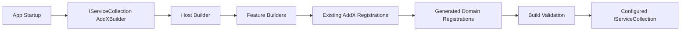

# 04 Draft Plan

## Executive summary
Introduce a unified builder model that wraps existing registration primitives and generated composition points behind repo-consistent, .NET-style entrypoints. The design will provide host builders (`IClientBuilder`, `IGatewayBuilder`, `IRuntimeBuilder`) and feature builders (`IAggregateBuilder`, `ISagaBuilder`, `IUxProjectionBuilder`, `IFeatureStateBuilder`) with fluent + lambda configuration, minimal runtime guardrails, and area-aligned abstractions.

## Current state (repo-grounded)
- Startup composition is primarily `IServiceCollection` extension methods (`AddInletClient`, `AddInletServer`, `AddInletSilo`, `AddAggregateSupport`, `AddSagaOrchestration`, `AddUxProjections`, Reservoir registration methods).
- One local fluent builder exists: `InletBlazorSignalRBuilder`, invoked via `AddInletBlazorSignalR(Action<Builder>)`.
- Generators already emit domain-wide composition methods for client/server/runtime (`DomainFeatureRegistrations`, `DomainServerRegistrations`, `DomainSiloRegistrations`).
- Reservoir has explicit feature state / reducer / effect registration APIs that can be orchestrated by a higher-level builder.

## Target state
- New public builder contracts in area-appropriate `*.Abstractions` packages.
- Concrete builders in implementation projects that orchestrate existing registrations and generated composition.
- .NET-style entrypoints on `IServiceCollection` returning builder interfaces plus optional lambda overloads.
- Typed marker assembly binding (`AddDomain<TDomainMarker>()`) as the primary domain composition model.
- Runtime builder composes both DI and Orleans silo configuration via explicit bridge methods.
- Host-level convenience overloads (`HostApplicationBuilder`, `WebApplicationBuilder`) are included in v1 as thin adapters.
- Host `AddDomain<TDomainMarker>()` composition adds complete required host surface while delegating internally through feature builders and generated registration mapping.
- Clear docs under top-level `docs/Docusaurus/docs/proposed-patterns/`, explicitly marked as non-live design guidance.

## Key design decisions
- D1: Support fluent + lambda host-builder APIs.
- D2: Place interfaces in area-specific abstractions.
- D3: Use minimal runtime validation at `Build()`.
- D4: Design full host + feature builder model in v1 plan.
- D5: Keep `IServiceCollection` chainability and extension-first ergonomics.
- D15: Validation errors throw at terminal/apply step with actionable messages.
- D16: Proposed docs split into DX-focused and internals-focused pages.

## Public contracts / APIs (proposed shapes)

### Host builders
- `IClientBuilder`
  - `IServiceCollection Services { get; }`
  - `IClientBuilder AddDomain<TDomainMarker>()`
  - `IClientBuilder ConfigureProjections(...)`
  - `IClientBuilder AddFeatureState(Action<IFeatureStateBuilder> configure)`
  - `IServiceCollection Build()`

- `IGatewayBuilder`
  - `IServiceCollection Services { get; }`
  - `IGatewayBuilder AddDomain<TDomainMarker>()`
  - `IGatewayBuilder ConfigureAuthorization(...)`
  - `IServiceCollection Build()`

- `IRuntimeBuilder`
  - `IServiceCollection Services { get; }`
  - `IRuntimeBuilder AddDomain<TDomainMarker>()`
  - `IRuntimeBuilder ConfigureSilo(Action<ISiloBuilder> configure)`
  - `IRuntimeBuilder ConfigureProjectionScanning(...)`
  - `void ApplyToSilo(ISiloBuilder siloBuilder)` (or equivalent bridge)

### Feature builders
- `IAggregateBuilder`
  - compose aggregate support, event type registration/scanning, command handlers, reducers, effects.
- `ISagaBuilder`
  - compose saga orchestration registration and saga-specific generated composition.
- `IUxProjectionBuilder`
  - compose projection registration and projection discovery/mapping.
- `IFeatureStateBuilder`
  - compose `AddFeatureState`, `AddReducer`, `AddActionEffect`, `AddRootReducer`, `AddRootActionEffect`, and optional `AddReservoir` integration.

> Naming normalization is fixed (`IAggregateBuilder`, `IUxProjectionBuilder`, `IRuntimeBuilder`); some terminal signature details remain open.

## Architecture & flow

## Work breakdown

### Phase 1 — Contract design + placement
- Define interface locations, naming conventions, and entrypoint signatures.
- Map each builder method to existing registration primitives.
- Outcome: stable contract spec and dependency map.

### Phase 2 — Host builder orchestration model
- Define orchestration for client/gateway/runtime to consume generated domain registrations.
- Define hybrid finalization semantics (`Build()` for client/gateway, runtime silo bridge for Orleans hooks).
- Enforce `AddDomain<T>()` auto-wiring defaults with explicit feature-builder override path.
- Outcome: host flow and validation behavior spec.

### Phase 3 — Feature builder model
- Define aggregate/saga/ux-projection/feature-state builder method sets.
- Ensure no async registration behavior.
- Outcome: composable feature builder matrix.

### Phase 4 — Prototype + proof strategy
- Create PoC implementation and tests to prove feasibility.
- Validate against existing sample startup patterns.
- Delete all prototype code/tests after proof capture.
- Outcome: evidence-backed confidence for docs and rollout.

### Phase 5 — Documentation (proposed/future section)
- Add future-facing docs section under `docs/Docusaurus/docs/proposed-patterns/`.
- Publish split pages for:
  - Public API / DX usage guidance.
  - Internal implementation architecture and generator migration path.
- Include architecture, examples, migration guidance, and explicit non-live status.
- Outcome: discoverable proposal for team review.

## Testing strategy
- Contract tests for builder method behavior and guardrails.
- Integration tests verifying builder output matches legacy `AddXyz(...)` behavior.
- Sample-level smoke tests for client/gateway/runtime startup paths.
- Reservoir-focused tests for `IFeatureStateBuilder` composition.

## Observability / operability
- Builder validation errors should throw explicit actionable exceptions (missing required registrations, invalid configuration combinations).
- Logging additions (if any) must use LoggerExtensions and avoid noisy startup logs.
- Diagnostics docs should describe how to verify resolved registrations in startup troubleshooting.

## Rollout and migration plan
- Step 1: introduce builders as additive API.
- Step 2: document builder path as preferred while preserving legacy `AddXyz(...)` as supported.
- Step 3: migrate samples to demonstrate recommended usage.
- Step 4: decide deprecation posture for direct registration overloads after adoption proof.

## Acceptance criteria checklist
- [ ] Contract placement and naming finalized.
- [ ] Host and feature builder API shapes finalized.
- [ ] Mapping to existing registrations is complete and deterministic.
- [ ] Runtime validation behavior is specified and tested.
- [ ] Proposed/future docs section added with non-live framing.
- [ ] Migration examples provided for at least one client/gateway/runtime path.

## Mandatory final step for flow Builder
- In the **final implementation commit**, delete the entire planning folder:
  - `/plan/2026-03-01/builder-pattern-design/`

## CoV
- Claim: wrapping existing registration and generated composition is lowest-risk, repo-consistent path.
  - Evidence: current registration-heavy architecture + generator-composed domain registrations.
  - Triangulation: multiple runtime/client/gateway registration files + generator files.
  - Confidence: High.
  - Impact: avoid parallel registration ecosystems.

- Claim: core architecture decisions are now sufficiently resolved for persona review and synthesis.
  - Evidence: unresolved items in `03-decisions.md`.
  - Triangulation: user answers across multiple batches, including explicit resolution of AddDomain default behavior.
  - Confidence: High.
  - Impact: proceed to mandatory 12-persona review loop.